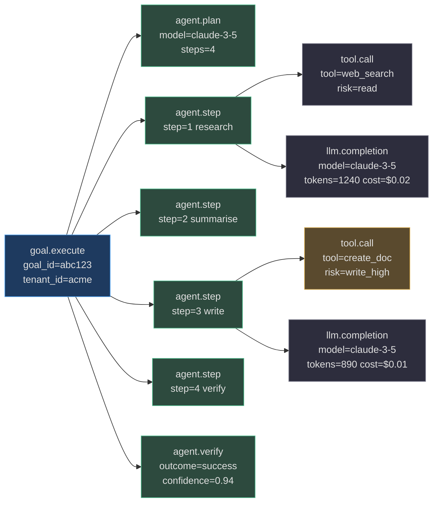
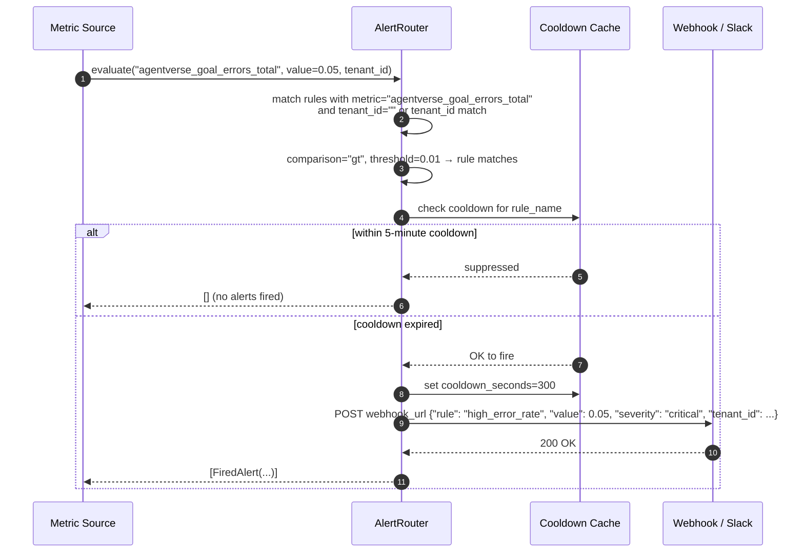
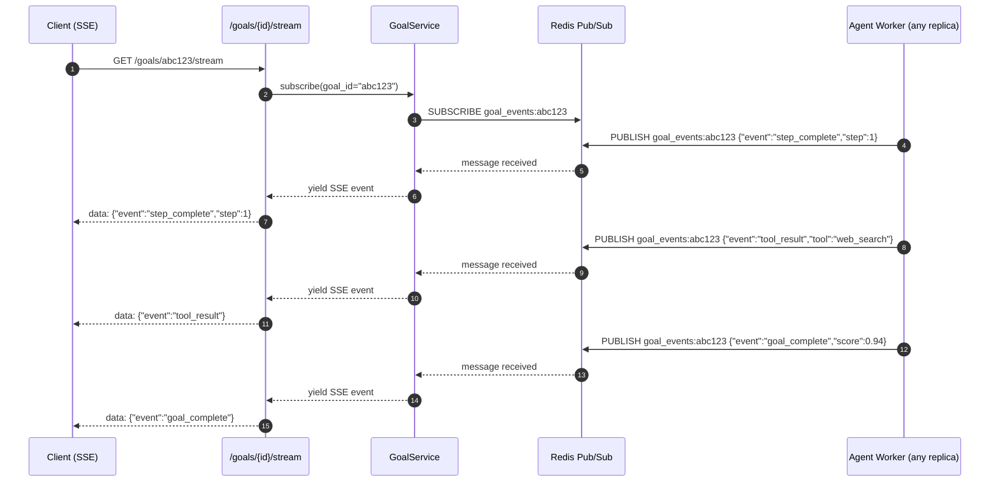

# Observability

AgentVerse emits a complete observability signal: every goal execution produces structured JSON logs, Prometheus metrics, OpenTelemetry spans, goal-event SSE streams, and per-step decision traces. This page documents every layer of the observability stack and how the signals compose.

## Observability Stack

```mermaid
graph TB
    GE["Goal Execution"]
    LOG["Structured JSON Logging<br><code>app/observability/logging.py</code><br>get_logger() · PII sanitized"]
    MET["Prometheus Metrics<br><code>app/observability/metrics.py</code><br>counters · histograms · gauges"]
    TRC["OTel Distributed Tracing<br><code>app/observability/tracing.py</code><br>OTLP exporter · W3C trace context"]
    DT["Decision Trace<br><code>app/observability/runtime_decision_trace.py</code><br>model · tool · confidence per step"]
    RT["RAG Trace<br><code>app/observability/rag_trace.py</code><br>chunks · scores · strategy"]
    CT["Cost Breakdown<br><code>app/observability/cost_breakdown.py</code><br>per-role cost: planner/executor/verifier"]
    MT["Model Trace<br><code>app/observability/model_trace.py</code><br>model · tokens · cost · latency"]
    AR["Alert Router<br><code>app/observability/alert_router.py</code><br>threshold rules · 5-min cooldown · webhook"]
    SLO["SLO Tracker<br><code>app/observability/slo_tracker.py</code><br>burn_rate · error_budget · minutes_to_exhaustion"]
    HC["Health Checks<br><code>app/observability/health.py</code><br>/health · /ready"]
    SSE["SSE Event Stream<br>goal_started · step_complete · tool_result"]
    OLP["OTLP Collector<br>(Jaeger / Grafana Tempo)"]
    PROM["Prometheus Scrape<br>/metrics endpoint"]
    SLACK["Webhook / Slack"]

    GE --> LOG
    GE --> MET
    GE --> TRC
    GE --> DT
    GE --> RT
    GE --> CT
    GE --> MT
    GE --> SSE
    MET --> AR
    MET --> SLO
    MET --> PROM
    TRC --> OLP
    AR --> SLACK
    HC --> PROM

    style GE fill:#1e3a5f,stroke:#4a9eed,color:#e0e0e0
    style LOG fill:#2d4a3e,stroke:#4aba8a,color:#e0e0e0
    style MET fill:#2d4a3e,stroke:#4aba8a,color:#e0e0e0
    style TRC fill:#2d4a3e,stroke:#4aba8a,color:#e0e0e0
    style DT fill:#2d2d3d,stroke:#7a7a8a,color:#e0e0e0
    style RT fill:#2d2d3d,stroke:#7a7a8a,color:#e0e0e0
    style CT fill:#2d2d3d,stroke:#7a7a8a,color:#e0e0e0
    style MT fill:#2d2d3d,stroke:#7a7a8a,color:#e0e0e0
    style AR fill:#5a4a2e,stroke:#d4a84b,color:#e0e0e0
    style SLO fill:#5a4a2e,stroke:#d4a84b,color:#e0e0e0
    style HC fill:#2d4a3e,stroke:#4aba8a,color:#e0e0e0
    style SSE fill:#1e3a5f,stroke:#4a9eed,color:#e0e0e0
    style OLP fill:#2d2d3d,stroke:#7a7a8a,color:#e0e0e0
    style PROM fill:#2d2d3d,stroke:#7a7a8a,color:#e0e0e0
    style SLACK fill:#4a2e2e,stroke:#d45b5b,color:#e0e0e0
```



<!-- Sources: app/observability/logging.py, app/observability/metrics.py, app/observability/tracing.py, app/observability/runtime_decision_trace.py, app/observability/rag_trace.py, app/observability/cost_breakdown.py, app/observability/model_trace.py, app/observability/alert_router.py, app/observability/slo_tracker.py, app/observability/health.py -->

---

## Structured Logging

[`app/observability/logging.py`](https://github.com/harsh786/agent-verse/blob/main/agent-verse-backend/app/observability/logging.py) exports `get_logger(name)` which returns a standard Python logger configured for **structured JSON output** in production (`ENVIRONMENT=production`) and human-readable format in development.

### Standard Fields

Every log entry includes:

| Field | Description |
|---|---|
| `timestamp` | ISO 8601 UTC timestamp |
| `level` | `DEBUG`, `INFO`, `WARN`, `ERROR` |
| `service` | `agentverse-backend` |
| `logger` | Module path (e.g., `app.agent.loop`) |
| `message` | Human-readable message |
| `tenant_id` | Injected from `TenantContext` where available |
| `goal_id` | Present during goal execution |
| `request_id` | Correlation ID from `X-Request-ID` header |

### PII Sanitization in Logs

Before emitting any log at WARN or above, the logging layer pipes values through `redact_sensitive_text()` from [`app/agent/sanitization.py`](https://github.com/harsh786/agent-verse/blob/main/agent-verse-backend/app/agent/sanitization.py). API keys, tokens, passwords, and `Authorization` headers are replaced with `[REDACTED]`. This ensures compliance logs are safe to forward to external SIEM systems.

---

## Prometheus Metrics

[`app/observability/metrics.py`](https://github.com/harsh786/agent-verse/blob/main/agent-verse-backend/app/observability/metrics.py) defines all platform metrics against a **dedicated `CollectorRegistry`** to keep test isolation clean.

### Golden Signals Reference

| Signal | Metric Name | Type | Labels | Threshold |
|---|---|---|---|---|
| **Latency** | `agentverse_goal_duration_seconds` | Histogram | `tenant_id`, `status` | p99 < 30s |
| **Latency** | `agentverse_llm_duration_seconds` | Histogram | `provider`, `model` | p99 < 10s |
| **Traffic** | `agentverse_goals_total` | Counter | `tenant_id`, `status` | — |
| **Traffic** | `agentverse_llm_requests_total` | Counter | `provider`, `model` | — |
| **Errors** | `agentverse_goal_errors_total` | Counter | `tenant_id`, `error_type` | Rate < 1% |
| **Errors** | `agentverse_guardrail_violations_total` | Counter | `tenant_id`, `category` | — |
| **Saturation** | `agentverse_active_goals` | Gauge | `tenant_id` | < bulkhead cap |
| **Saturation** | `agentverse_queue_depth` | Gauge | `queue_name` | < 1000 |
| **Cost** | `agentverse_cost_usd_total` | Counter | `tenant_id`, `scope` | Budget-driven |
| **Tokens** | `agentverse_tokens_total` | Counter | `provider`, `model`, `type` | — |

All latency metrics use **histograms** (never averages) tracking p50, p95, p99 percentiles. Source: [`app/observability/metrics.py:25-80`](https://github.com/harsh786/agent-verse/blob/main/agent-verse-backend/app/observability/metrics.py#L25-L80)

### Label Normalization

The metrics module normalizes provider and model labels to a fixed set (`_PROVIDER_LABELS`, `_MODEL_HINTS`) to prevent cardinality explosion. Unknown values are mapped to `unknown`. Label aliases like `azure` → `azure_openai`, `ollama` → `local` keep dashboards clean across environments.

---

## OpenTelemetry Distributed Tracing

[`app/observability/tracing.py`](https://github.com/harsh786/agent-verse/blob/main/agent-verse-backend/app/observability/tracing.py) configures the OpenTelemetry SDK with the OTLP exporter. The endpoint is read from `OTEL_EXPORTER_OTLP_ENDPOINT` at startup.

### Span Hierarchy for a Single Goal



<!-- Sources: app/observability/tracing.py, app/observability/model_trace.py, app/observability/runtime_decision_trace.py -->

### W3C Trace Context in A2A Dispatch

[`app/civilization/a2a_dispatch.py`](https://github.com/harsh786/agent-verse/blob/main/agent-verse-backend/app/civilization/a2a_dispatch.py) uses `opentelemetry.propagate.inject()` to inject the current trace context into agent-to-agent (A2A) HTTP headers. This means a goal that spans multiple agents produces a **single connected trace** in Jaeger / Grafana Tempo, regardless of which replica each agent runs on.

---

## Per-Step Decision Traces

[`app/observability/runtime_decision_trace.py`](https://github.com/harsh786/agent-verse/blob/main/agent-verse-backend/app/observability/runtime_decision_trace.py) records, for each step:

| Field | Description |
|---|---|
| `step_id` | Unique step identifier |
| `model_used` | Which LLM was selected by `ModelRouter` |
| `tool_called` | Tool name and arguments (redacted) |
| `confidence` | Verifier confidence score (0.0–1.0) |
| `policy_result` | `allow` / `deny` / `require_approval` |
| `rag_strategy` | Which retrieval strategy was used |
| `reasoning` | Verifier's textual reasoning |

This trace is stored per-goal and surfaced in the Observability UI as the "Decision Trail" panel, allowing operators to replay exactly what the agent decided at each step.

### RAG Trace

[`app/observability/rag_trace.py`](https://github.com/harsh786/agent-verse/blob/main/agent-verse-backend/app/observability/rag_trace.py) records per-retrieval:

- Which chunks were retrieved and from which knowledge source
- Similarity scores for each chunk
- The retrieval strategy (`semantic` / `hybrid` / `keyword`)
- Whether the semantic cache was hit

### Model Trace

[`app/observability/model_trace.py`](https://github.com/harsh786/agent-verse/blob/main/agent-verse-backend/app/observability/model_trace.py) captures per-LLM-call: model name, prompt tokens, completion tokens, cached tokens, total cost USD, and wall-clock latency. Cost is then attributed by role (planner / executor / verifier) in [`app/observability/cost_breakdown.py`](https://github.com/harsh786/agent-verse/blob/main/agent-verse-backend/app/observability/cost_breakdown.py).

---

## SLO Burn Rate

[`app/observability/slo_tracker.py`](https://github.com/harsh786/agent-verse/blob/main/agent-verse-backend/app/observability/slo_tracker.py) implements error budget tracking per tenant:

### Burn Rate Formula

Given an `SLODefinition(target=0.999, window_hours=24)`:

$$\text{error budget} = 1 - \text{target} = 0.001$$

$$\text{burn rate} = \frac{1 - \text{current success rate}}{1 - \text{target}}$$

A burn rate of **1.0** means the error budget is depleting at exactly the allowed pace. A burn rate of **2.0** means it will be exhausted in half the window.

$$\text{minutes to exhaustion} = \frac{\text{error budget remaining} \times \text{window hours} \times 60}{\text{burn rate}}$$

The `SLOStatus.is_breaching` property returns `True` when `burn_rate_multiple > 1.0` **or** `current_success_rate < target`. Source: [`app/observability/slo_tracker.py:53-57`](https://github.com/harsh786/agent-verse/blob/main/agent-verse-backend/app/observability/slo_tracker.py#L53-L57)

The in-memory implementation uses time-stamped `(timestamp, success_bool)` tuples with a rolling prune at the SLO window boundary. For production, replace the in-memory list with Redis sorted sets keyed by timestamp score.

---

## Alert Routing



<!-- Sources: app/observability/alert_router.py:1-80 -->

[`app/observability/alert_router.py`](https://github.com/harsh786/agent-verse/blob/main/agent-verse-backend/app/observability/alert_router.py) manages:

| Configuration | Value |
|---|---|
| Cooldown period | `300` seconds (5 minutes) — prevents alert storms |
| Comparisons | `gt` (>), `lt` (<), `eq` (==) |
| Scope | Global rules (empty `tenant_id`) or per-tenant rules |
| Webhook format | Slack-compatible JSON + generic JSON payloads |
| Rule management | `register_rule()`, `list_rules()`, `remove_rule()` |

Rules are held in-memory and reseeded from config at startup. Multiple rules can match the same metric — all matching rules (subject to cooldown) fire independently.

---

## Goal Event Stream (SSE + Redis Pub/Sub)



<!-- Sources: app/services/goal_service.py, app/observability/logging.py -->

### SSE Event Types

| Event | Payload Fields | When Emitted |
|---|---|---|
| `goal_started` | `goal_id`, `tenant_id`, `planned_steps` | Agent loop begins |
| `plan_created` | `goal_id`, `steps[]` | Planner returns step list |
| `step_started` | `goal_id`, `step_id`, `description` | Before executor runs |
| `tool_called` | `goal_id`, `step_id`, `tool_name`, `risk_level` | Before tool execution |
| `tool_result` | `goal_id`, `step_id`, `tool_name`, `result_summary` | After tool returns |
| `step_complete` | `goal_id`, `step_id`, `outcome` | After verifier confirms |
| `hitl_required` | `goal_id`, `request_id`, `action`, `risk_level` | HITL gate triggered |
| `goal_complete` | `goal_id`, `outcome`, `score`, `cost_usd` | Final state |
| `goal_failed` | `goal_id`, `reason`, `last_step` | Unrecoverable failure |

---

## Health Checks

[`app/observability/health.py`](https://github.com/harsh786/agent-verse/blob/main/agent-verse-backend/app/observability/health.py) exposes two endpoints:

| Endpoint | Purpose | Dependency Checks |
|---|---|---|
| `GET /health` | **Liveness** — is the process running? | None — always 200 if process is alive |
| `GET /ready` | **Readiness** — are dependencies available? | PostgreSQL (query), Redis (PING), Celery broker |

The `/ready` endpoint must respond within 1 second. It returns structured JSON:

```json
{
  "status": "healthy",
  "checks": {
    "db": "ok",
    "redis": "ok",
    "queue": "ok"
  }
}
```

Health checks are exempt from `TenantMiddleware` authentication via the `_BYPASS_PREFIXES` list in [`app/tenancy/middleware.py`](https://github.com/harsh786/agent-verse/blob/main/agent-verse-backend/app/tenancy/middleware.py#L67).

---

## Pattern and Cost Traces

- **Pattern Trace** ([`app/observability/pattern_trace.py`](https://github.com/harsh786/agent-verse/blob/main/agent-verse-backend/app/observability/pattern_trace.py)): records which multi-agent pattern executed (supervisor, debate, single-agent), how many iterations, and the final outcome.
- **Cost Breakdown** ([`app/observability/cost_breakdown.py`](https://github.com/harsh786/agent-verse/blob/main/agent-verse-backend/app/observability/cost_breakdown.py)): attributes LLM spend by role — planner, executor, verifier — enabling cost optimization that targets the most expensive role.

---

## Related Pages

| Page | Why it's related |
|---|---|
| [Governance & Security](./governance-and-security.md) | Audit events and SIEM forwarding sit on the same async pipeline |
| [Guardrails](./guardrails.md) | Guardrail violations are metriced as `agentverse_guardrail_violations_total` |
| [Evals & Improvement](./evals-and-improvement.md) | SLO burn rate drives the SelfImprovementEngine threshold decisions |
| [Agent Loop](../architecture/agent-loop.md) | Decision trace and model trace are written during the execute phase |
