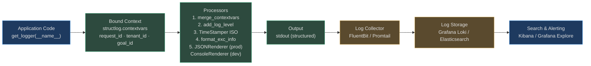
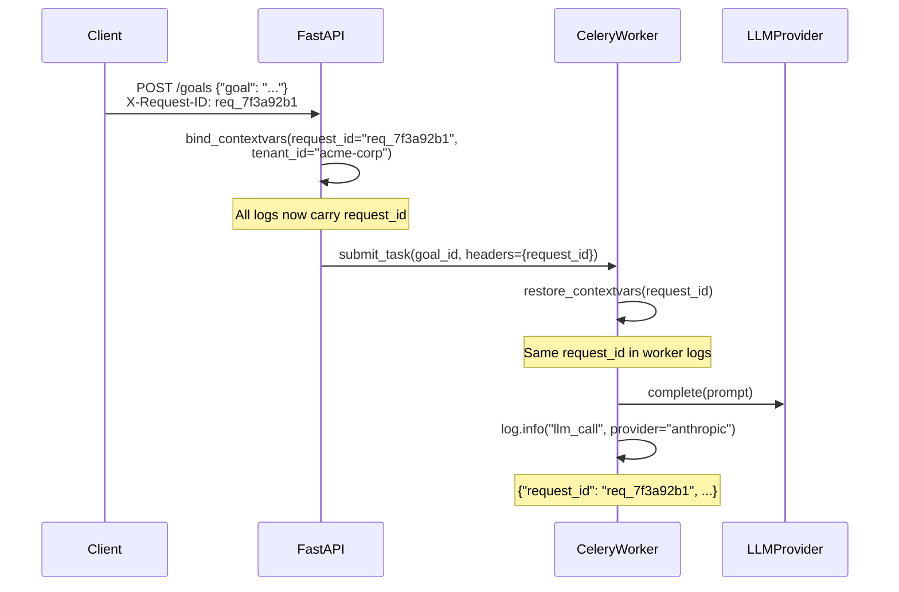

# Structured Logging

Every event in an agent's lifecycle produces a structured JSON log entry. Structured logs are machine-parseable by ELK/Loki from day one, searchable by `goal_id` in seconds, and automatically redacted so PII never reaches a storage backend.

The logging layer is implemented in `app/observability/logging.py` using [`structlog`](https://www.structlog.org/) — a Python library that binds context to a logger so every subsequent call carries that context without explicit passing.

## Log Pipeline



## Standard Log Fields

Every single log entry in every service carries these fields:

| Field | Example | Description |
|---|---|---|
| `timestamp` | `"2026-08-14T14:32:01.452Z"` | ISO 8601 UTC, from `TimeStamper(fmt="iso")` |
| `level` | `"info"` | Lowercase: `debug`, `info`, `warning`, `error`, `critical` |
| `event` | `"tool_called"` | Snake-case event name (machine-parseable) |
| `service` | `"agentverse-backend"` | Set in `Resource.create({"service.name": ...})` |
| `logger` | `"app.agent.loop"` | Python module path |
| `request_id` | `"req_7f3a92b1"` | HTTP request correlation ID (from middleware) |
| `tenant_id` | `"acme-corp"` | Always present; bound by `TenantMiddleware` |
| `goal_id` | `"goal_01JX8K2NQ4PX"` | Present for all goal-lifecycle events |
| `agent_id` | `"agent_01JX8KPQ"` | Present when a specific agent handles the goal |
| `step` | `2` | Step index within the current goal execution |
| `message` | `"Jira search returned 5 results"` | Human-readable description |

### Usage Pattern

```python
from app.observability.logging import get_logger
import structlog

log = get_logger(__name__)

# Bind goal context once; all subsequent calls carry it
structlog.contextvars.bind_contextvars(
    goal_id=goal_id,
    tenant_id=tenant_id,
    request_id=request_id,
)

log.info("tool_called", tool="jira_search", step=2, query="Q4 revenue")
# Emits: {"timestamp": "...", "level": "info", "event": "tool_called",
#          "tool": "jira_search", "step": 2, "goal_id": "...", "tenant_id": "..."}
```

## Log Levels

| Level | When to Use | Volume |
|---|---|---|
| `DEBUG` | Internal state, model selection reasoning, RAG scoring | Dev only; off in prod |
| `INFO` | Business events: goal submitted, plan generated, tool called, goal completed | ~15–20 per goal |
| `WARNING` | Recoverable issues: tool retry, fallback model used, cache miss on hot path | 0–3 per goal |
| `ERROR` | Non-recoverable failures: goal failed, tool unreachable after retries, budget exceeded | 0–1 per failed goal |
| `CRITICAL` | Security events: injection detected, HITL rejection, credential leak | Rare; triggers PagerDuty |

## Key Log Events

These events form the observable lifecycle of a goal:

```
goal_submitted     → goal_planning_started → plan_generated
  → step_executing → tool_called → tool_returned
  → step_verifying → step_complete
  → [repeat for each step]
  → goal_completed
  OR
  → step_failed → replanning → plan_generated → ...
  OR
  → goal_failed (max iterations exceeded)
```

| Event | Level | Key Extra Fields |
|---|---|---|
| `goal_submitted` | INFO | `goal_id`, `tenant_id`, `complexity` |
| `plan_generated` | INFO | `step_count`, `planner_model`, `latency_ms` |
| `tool_called` | INFO | `tool`, `step`, `connector` |
| `tool_returned` | INFO | `tool`, `success`, `latency_ms`, `result_size` |
| `step_verified` | INFO | `step`, `verdict`, `verifier_model` |
| `goal_completed` | INFO | `total_steps`, `total_cost_usd`, `duration_s` |
| `goal_failed` | ERROR | `reason`, `step`, `last_error` |
| `injection_detected` | CRITICAL | `attack_type`, `layer`, `content_preview` (truncated) |
| `hitl_required` | WARNING | `action`, `risk_level`, `request_id` |
| `budget_exceeded` | ERROR | `tenant_id`, `spent_usd`, `limit_usd` |
| `tool_retry` | WARNING | `tool`, `attempt`, `error` |

## Correlation ID Propagation

A single `request_id` flows from the HTTP request through Celery workers to every log line:



The header propagation means you can search for `request_id:"req_7f3a92b1"` in Kibana and instantly see every log line — across the API, Celery worker, and any sub-task — for that single request.

## PII Redaction

Logs must never contain PII. The structlog processor pipeline does not perform automatic redaction — that responsibility sits with the code that emits log events. The conventions:

| What | How to Log |
|---|---|
| Customer email | Never log. Log `user_id` or `tenant_id` instead. |
| Model prompt/response | Never log full content. Log `content_length`, `tokens`. |
| Tool arguments | Log tool name and step number. Never log argument values containing customer data. |
| API keys | Never log. The `output_anomaly.py` credential scanner detects them in outputs. |
| SSN / credit card | Pattern `\d{3}-\d{2}-\d{4}` never enters logs. PII is blocked at guardrail layer before it can appear. |

### Example — What NOT to Log

```python
# ❌ WRONG: logs raw tool result which may contain PII
log.info("tool_result", result=tool_output)

# ✅ RIGHT: logs metadata only
log.info("tool_returned", tool="jira_search", result_size=len(str(tool_output)),
         truncated=len(str(tool_output)) > 1000)
```

## Real-World Example: Debugging a Midnight Failure

**Scenario:** A customer reports "my goal failed at 2:47 AM but I don't know why."

**Step 1 — Find the goal:**
```
# Kibana / Grafana Loki query
{tenant_id="acme-corp"} | json | level="error" | timestamp >= "2026-08-14T02:40:00Z"
```

**Step 2 — Pull the full timeline:**
```
{goal_id="goal_01JX8K2NQ4PX"} | json | sort by timestamp asc
```

Result: 23 log lines, all for this goal, across FastAPI + 2 Celery workers. The sequence shows:
- `tool_called` (jira_search) → success  
- `tool_called` (confluence_read) → `tool_returned` with `success=false`  
- `tool_retry` (attempt=2) → `tool_returned` `success=false`  
- `tool_retry` (attempt=3) → `tool_returned` `success=false`  
- `goal_failed` with `reason="max_tool_retries_exceeded"`, `tool="confluence_read"`

**Diagnosis in 90 seconds.** Without `goal_id` correlation, this would require parsing 47K log lines.

## Log Volume at Scale

At 1 million goals/day:

| Calculation | Value |
|---|---|
| Average log events per goal | ~18 |
| Raw events/day | ~18M |
| Average log entry size | ~500 bytes |
| Raw volume/day | ~9 GB |

### Volume Management Strategies

**1. Sampling** — DEBUG events sampled at 1% in production:
```python
# configure_logging(level="DEBUG") only for specific tenants flagged for debugging
# All others: configure_logging(level="INFO")
```

**2. Log Levels by Environment:**
- `ENVIRONMENT=development` → ConsoleRenderer, DEBUG
- `ENVIRONMENT=production` → JSONRenderer, INFO

**3. Retention Policy:**
- Hot tier (Elasticsearch/Loki): 7 days (recent incidents)
- Warm tier (S3/GCS): 30 days (audit requirements)
- Cold tier (Glacier/Archive): 90 days (compliance requirements)
- Delete: after 90 days (except for HIPAA tenants: 6 years)

**4. Index Strategy:**
- Primary index: `goal_id` (most queries)
- Secondary: `tenant_id + timestamp` (tenant-scoped queries)
- Error index: level=error only (fast incident lookup)

## Security Considerations

- Logs flow over TLS from application to collector
- Log storage requires separate auth from application — compromised app ≠ compromised logs
- `structlog` context variables are thread-local; they cannot leak between requests in async FastAPI
- Secret detection in `output_anomaly.py` runs on LLM outputs — if a key appears in output and somehow reaches logs, the anomaly scanner fires first and blocks the output

<!-- Sources: app/observability/logging.py, app/observability/tracing.py, app/observability/runtime_decision_trace.py -->

---

## Worker Events

Celery workers process agent goals asynchronously. Every step of the task lifecycle emits a structured log event, enabling real-time worker health monitoring and post-incident debugging.

### Worker Lifecycle Events

Six structured events cover the full Celery task lifecycle:

| Event | `event` field | When emitted |
|---|---|---|
| Task received | `celery.task_received` | Worker pulled task from queue, not yet started |
| Task started | `celery.task_started` | Worker acquired a slot and began execution |
| Task succeeded | `celery.task_succeeded` | Task returned successfully |
| Task failed | `celery.task_failed` | Task raised an unhandled exception |
| Task retried | `celery.task_retried` | Task failed and was re-queued with backoff |
| ETA exceeded | `celery.eta_exceeded` | Task sat in queue longer than its `eta` deadline |

### Structured Log Format

Each worker event carries the same correlation fields used throughout the platform:

```json
{
  "timestamp": "2026-08-14T14:35:12.001Z",
  "level": "info",
  "event": "celery.task_succeeded",
  "service": "agentverse-worker",
  "queue_name": "goals.professional",
  "task_id": "d4e5f6a7-b8c9-d0e1-f2a3-b4c5d6e7f8a9",
  "task_name": "app.scaling.tasks.run_goal_task",
  "goal_id": "goal_01JX8K2NQ4PX",
  "tenant_id": "tenant_acme",
  "latency_seconds": 4.72,
  "retries": 0
}
```

For `celery.task_failed`, `exc_type` and `exc_message` fields are added. For `celery.task_retried`, `retry_eta` and `countdown_seconds` are added.

### Worker Metrics

Worker health is tracked through four Prometheus counters and one histogram:

```
# HELP celery_tasks_received_total Tasks received from queue
celery_tasks_received_total{queue="goals.professional",task="run_goal_task"} 48210

# HELP celery_tasks_succeeded_total Tasks completed successfully
celery_tasks_succeeded_total{queue="goals.professional",task="run_goal_task"} 47985

# HELP celery_tasks_failed_total Tasks that raised an exception
celery_tasks_failed_total{queue="goals.professional",task="run_goal_task"} 121

# HELP celery_tasks_retried_total Tasks re-queued after failure
celery_tasks_retried_total{queue="goals.professional",task="run_goal_task"} 104

# HELP celery_task_runtime_seconds Task wall-clock duration
celery_task_runtime_seconds_bucket{queue="goals.professional",le="5"} 41200
celery_task_runtime_seconds_bucket{queue="goals.professional",le="30"} 47800
```

### Queue Depth: The Primary Worker Health Signal

`queue_depth` (current pending tasks in a queue) is the most important worker health metric. It is a leading indicator: a rising queue depth means workers cannot keep pace with incoming goals.

```python
# app/observability/worker_metrics.py (conceptual)
queue_depth.labels(queue="goals.professional").set(
    redis_client.llen("celery:goals.professional")
)
```

**Alert rule**: `queue_depth{queue="goals.professional"} > 500` for 5 minutes → page on-call.

### Real-World: Queue Backup Detection

**Scenario**: A large enterprise tenant submits 1,200 goals in 10 minutes from a batch data pipeline trigger.

**Signals in order:**
1. `celery_tasks_received_total` spikes: +1,200 in 10 minutes
2. `celery_tasks_succeeded_total` rises slower: +850 in same window
3. `queue_depth{queue="goals.enterprise"}` climbs: 50 → 350 in 8 minutes
4. P95 `celery_task_runtime_seconds` rises from 4.2 s to 11.8 s (worker contention)
5. Alert fires: `queue_depth > 500`

**Response**: Auto-scaler (Kubernetes HPA on the `queue_depth` metric) adds 4 worker replicas. Within 3 minutes the queue drains to < 20 tasks. `tasks_received_total` and `tasks_succeeded_total` re-converge.

Without structured worker events, the first sign of trouble would have been user complaints about slow goals — 15 minutes later. With structured events, the signal appears within 60 seconds of the batch submission.

<!-- Sources: app/scaling/tasks.py, app/scaling/celery_app.py, app/observability/logging.py -->
