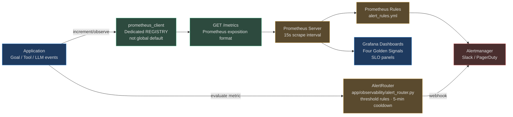

# Metrics and SLOs

AgentVerse exposes a `/metrics` endpoint in Prometheus exposition format. Every goal, every LLM call, every tool execution, and every queue operation increments or observes a metric. SLO burn rates are computed in real time so on-call engineers know not just *that* something is wrong, but *how fast* the error budget is depleting.

The metrics module is `app/observability/metrics.py`. All metrics live in a **dedicated `CollectorRegistry`** (not the global default) for test isolation. All metrics are prefixed `agentverse_`.

## The Four Golden Signals

| Signal | Metric | Alert Threshold |
|---|---|---|
| **Latency** | `agentverse_goal_duration_seconds` (histogram, P99) | P99 > 30s for enterprise queue |
| **Traffic** | `agentverse_goal_total` (counter, rate) | Rate drops > 50% vs 1h ago |
| **Errors** | `agentverse_goal_total{status="failed"}` (counter, rate) | Failure rate > 5% over 5 min |
| **Saturation** | `agentverse_queue_depth` (gauge, per-queue) | > 1000 items in any queue |

## Complete Metric Catalog

### Goal Metrics

```prometheus
# HELP agentverse_goal_duration_seconds Goal execution duration
# TYPE agentverse_goal_duration_seconds histogram
agentverse_goal_duration_seconds_bucket{status="complete",priority="high",le="5"} 8823
agentverse_goal_duration_seconds_bucket{status="complete",priority="high",le="30"} 9871
agentverse_goal_duration_seconds_p50{status="complete",priority="normal"} 8.2
agentverse_goal_duration_seconds_p95{status="complete",priority="normal"} 22.1
agentverse_goal_duration_seconds_p99{status="complete",priority="normal"} 45.3

# HELP agentverse_goal_total Total goals by status and priority
# TYPE agentverse_goal_total counter
agentverse_goal_total{status="complete",priority="high"} 9871
agentverse_goal_total{status="failed",priority="normal"} 142
agentverse_goal_total{status="approval_required",priority="normal"} 23
```

`priority` values: `low`, `normal`, `high`, `urgent`  
`status` values: `started`, `complete`, `failed`, `cancelled`, `denied`, `approval_required`, `cache_hit`, `circuit_open`

### Tool Call Metrics

```prometheus
# HELP agentverse_tool_call_total Total tool calls by tool, connector, status
# TYPE agentverse_tool_call_total counter
agentverse_tool_call_total{tool="jira",connector="jira",status="success"} 45230
agentverse_tool_call_total{tool="rpa",connector="rpa",status="error"} 87
agentverse_tool_call_total{tool="rag",connector="rag",status="success"} 182000
```

### LLM / Token Metrics

```prometheus
# HELP agentverse_llm_tokens_used_total Total LLM tokens by provider, model, token type
# TYPE agentverse_llm_tokens_used_total counter
agentverse_llm_tokens_used_total{provider="anthropic",model="claude-sonnet",token_type="prompt"} 85000000
agentverse_llm_tokens_used_total{provider="anthropic",model="claude-sonnet",token_type="completion"} 12000000
agentverse_llm_tokens_used_total{provider="openai",model="gpt-4o",token_type="cached"} 4200000

# HELP agentverse_llm_cost_usd_total Total LLM cost in USD
# TYPE agentverse_llm_cost_usd_total counter
agentverse_llm_cost_usd_total{provider="anthropic",model="claude-sonnet"} 2847.32

# HELP agentverse_llm_latency_seconds LLM call latency
# TYPE agentverse_llm_latency_seconds histogram
agentverse_llm_latency_seconds_p50{provider="openai",model="gpt-4o"} 0.82
agentverse_llm_latency_seconds_p99{provider="openai",model="gpt-4o"} 3.41
```

`provider` values: `openai`, `azure_openai`, `anthropic`, `google`, `local`  
`token_type` values: `prompt`, `completion`, `cached`, `reasoning`, `total`

### Cost Metrics

```prometheus
# HELP agentverse_cost_usd_total Total spend by scope
# TYPE agentverse_cost_usd_total counter
agentverse_cost_usd_total{scope="goal"} 1423.80
agentverse_cost_usd_total{scope="tool"} 82.10
agentverse_cost_usd_total{scope="llm"} 2847.32
agentverse_cost_usd_total{scope="workflow"} 212.40
```

### Queue Metrics

```prometheus
# HELP agentverse_queue_depth Current queue depth per Celery queue
# TYPE agentverse_queue_depth gauge
agentverse_queue_depth{queue="goals.free"} 234
agentverse_queue_depth{queue="goals.enterprise"} 12
agentverse_queue_depth{queue="schedules"} 5
agentverse_queue_depth{queue="maintenance"} 1
```

### Embedding and Retrieval Metrics

```prometheus
# HELP agentverse_embedding_cache_hit_rate Embedding cache hit rate (0.0-1.0)
# TYPE agentverse_embedding_cache_hit_rate gauge
agentverse_embedding_cache_hit_rate 0.73

# HELP agentverse_retrieval_recall_at_k Retrieval recall@K score
# TYPE agentverse_retrieval_recall_at_k gauge
agentverse_retrieval_recall_at_k{k="5"} 0.82
agentverse_retrieval_recall_at_k{k="10"} 0.91
```

## Metrics Pipeline



## AlertRouter

**Source:** `app/observability/alert_router.py`

`AlertRouter` provides in-process threshold alerting without requiring Alertmanager. Rules are registered at startup and evaluated whenever a metric value is submitted for checking.

### Rule Structure

```python
@dataclass
class AlertRule:
    metric: str            # "agentverse_goal_duration_seconds_p99"
    threshold: float       # 30.0
    window_seconds: int    # 300 (5 minutes)
    severity: str          # "critical" | "warning" | "info"
    webhook_url: str       # Slack incoming webhook URL
    comparison: str        # "gt" (default), "lt", "eq"
    name: str              # "Enterprise goal P99 latency"
    tenant_id: str         # "" = global rule, or specific tenant
```

### Alert Cooldown

A built-in 5-minute cooldown (`_cooldown_seconds = 300.0`) prevents alert storms. If the P99 metric fires at T=0, the next alert for that rule cannot fire until T=300, even if the metric remains in breach. This ensures on-call engineers are not paged every 15 seconds during an incident.

### Payload Format

Alert payloads are Slack-compatible JSON:

```json
{
  "text": "🚨 *CRITICAL* | Enterprise goal P99 latency",
  "attachments": [{
    "color": "danger",
    "fields": [
      {"title": "Metric", "value": "agentverse_goal_duration_seconds_p99"},
      {"title": "Value", "value": "47.2s"},
      {"title": "Threshold", "value": "30.0s"},
      {"title": "Tenant", "value": "acme-corp"},
      {"title": "Runbook", "value": "https://runbook.agentverse.io/high-latency"}
    ]
  }]
}
```

## SLO Tracking

**Source:** `app/observability/slo_tracker.py`

SLOs define reliability targets over a rolling time window. `SLOTracker` maintains an in-memory event store (events older than `window_hours` are pruned on each `record_event()`) and computes burn rates in real time.

### Key Concepts

| Term | Definition |
|---|---|
| **SLO Target** | e.g. 99.9% success rate over 24 hours |
| **Error Budget** | `1 - target` = 0.1% failures allowed |
| **Burn Rate** | `actual_error_rate / error_budget` |
| **Burn Rate = 1.0** | Depleting budget exactly at the allowed pace |
| **Burn Rate > 1.0** | Will exhaust budget before window ends |
| **Minutes to Exhaustion** | How long until budget = 0 at current rate |

### SLOStatus Fields

```python
@dataclass
class SLOStatus:
    slo_name: str
    target: float                  # 0.999
    current_success_rate: float    # 0.9954
    error_budget_remaining: float  # 0.46 (46% of budget left)
    burn_rate_multiple: float      # 2.3x (burning 2.3x faster than allowed)
    minutes_to_exhaustion: float   # 87.4 minutes
    window_hours: int              # 24
    total_events: int              # 14823
    successful_events: int         # 14755
    is_breaching: bool             # True (burn_rate > 1.0)
```

### Burn Rate Alert Thresholds

Industry standard (Google SRE) burn rate alerting:

| Burn Rate | Time to Exhaustion (24h SLO) | Severity | Response Time |
|---|---|---|---|
| > 14.4× | ~2 hours | Critical | Immediate page |
| > 6× | ~4 hours | High | Page within 30 min |
| > 3× | ~8 hours | Warning | Slack notification |
| 1–3× | Degraded but sustainable | Info | Ticket |

## Real-World Example: Enterprise Queue Latency Alert

**Scenario:** 09:14 AM. An `acme-corp` engineer notices their goals are slow.

**What happened in the metrics layer:**
1. At 09:10 AM, Celery enterprise queue depth (`agentverse_queue_depth{queue="goals.enterprise"}`) starts climbing: 12 → 45 → 180
2. `GOAL_DURATION` histogram P99 for `priority="high"` crosses 5s (alert threshold for enterprise SLA)
3. `AlertRouter.evaluate("agentverse_goal_duration_seconds_p99", 5.2, tenant_id="acme-corp")` runs
4. Rule `"Enterprise goal P99 SLA"` matches — threshold 5.0, comparison "gt"
5. Cooldown check: last fired > 300s ago ✓
6. `FiredAlert` created, webhook posted to `#sre-alerts` Slack channel
7. SLO tracker records `burn_rate_multiple=3.7` — burning 3.7× budget — 87 minutes to exhaustion
8. Second alert fires: "SLO burn rate critical: acme-corp/goal_success_rate"

**Investigation via metrics:**
```promql
# Grafana: What's in the queue?
agentverse_queue_depth{queue="goals.enterprise"}

# When did it start?
rate(agentverse_goal_total{status="started", priority="high"}[5m])

# Is it the LLM that's slow?
histogram_quantile(0.99, rate(agentverse_llm_latency_seconds_bucket[5m]))
```

**Root cause (found in 8 minutes):** `agentverse_llm_latency_seconds_p99{provider="openai"}` spiked to 12s — OpenAI had an outage. The model router's fallback to `anthropic` hadn't triggered because the circuit breaker threshold (15s) hadn't been crossed yet.

**Resolution:** Engineer manually triggers fallback by setting `OPENAI_FORCE_FALLBACK=true`. Queue drains in 6 minutes.

## Grafana Dashboard Structure

A production-ready Grafana dashboard for AgentVerse should include these panels:

| Row | Panel | Query |
|---|---|---|
| **Golden Signals** | Goal throughput (req/s) | `rate(agentverse_goal_total[5m])` |
| **Golden Signals** | P50/P95/P99 latency | `histogram_quantile(0.99, rate(agentverse_goal_duration_seconds_bucket[5m]))` |
| **Golden Signals** | Error rate | `rate(agentverse_goal_total{status="failed"}[5m]) / rate(agentverse_goal_total[5m])` |
| **Golden Signals** | Queue depth | `agentverse_queue_depth` |
| **Cost** | Total spend/hour | `rate(agentverse_cost_usd_total[1h]) * 3600` |
| **Cost** | LLM cost by provider | `rate(agentverse_llm_cost_usd_total[1h])` |
| **SLOs** | Error budget remaining | `agentverse_slo_error_budget_remaining` (custom gauge) |
| **SLOs** | Burn rate | `agentverse_slo_burn_rate` (custom gauge) |
| **LLM** | Token usage by model | `rate(agentverse_llm_tokens_used_total[5m])` |
| **LLM** | P99 LLM latency | `histogram_quantile(0.99, ...)` |

---

## Real-World Example 2: E-commerce Platform — SLO Budget Burn Alert

**Situation:** A high-GMV e-commerce platform runs AgentVerse for automated customer service. Their SLO: 99.5% of goals complete within 8 seconds. Monthly error budget: 0.5% × 30 days × 24h = 3.6 hours.

**SLO budget burn alert triggered on 2026-06-18:**
```
ALERT: slo_budget_burn_rate_critical
  slo:               goal_completion_p99_latency_8s
  burn_rate_1h:      14.2×   (14.2× faster than sustainable)
  burn_rate_6h:      3.1×
  budget_consumed:   68%  (after only 18 days of 30)
  alert_channel:     #platform-oncall
  runbook:           https://wiki.internal/runbooks/latency-slo
```

**Investigation via Prometheus:**
```promql
# Which agent type is causing the burn?
histogram_quantile(0.99,
  rate(agentverse_goal_duration_seconds_bucket{
    tenant_id="ecommerce-001"
  }[5m])
) by (agent_id)
```
→ `returns-processing-agent` p99: **22.4s** (vs 8s SLA).

**Root cause:** The returns agent was making 4 sequential tool calls to a 3PL warehouse API that had degraded to 5.2s/call.

**Fix:** Tool calls parallelised where order permits. 3PL API added to circuit breaker with 2s timeout + local cache fallback.

**Outcome:** p99 latency: 22.4s → 6.1s. SLO budget burn stopped. Monthly budget consumption normalised to 12%.

---

## Real-World Example 3: SaaS Multi-Tenant — Per-Tenant SLO Dashboards

**Situation:** An AgentVerse SaaS provider offers different SLA tiers to their customers. Enterprise customers have a 5s p99 SLA; Starter customers have 30s.

**Per-tenant metric cardinality strategy:**
```python
# app/observability/metrics.py — tenant label in all histograms
GOAL_DURATION.labels(
    tenant_id=tenant_ctx.tenant_id,
    plan=tenant_ctx.plan,          # "enterprise" | "starter" | "free"
    agent_id=state.agent_id,
    task_type=state.task_type.value,
).observe(elapsed_seconds)
```

**Prometheus alerting rules by plan:**
```yaml
- alert: EnterpriseSlaBreach
  expr: |
    histogram_quantile(0.99,
      rate(agentverse_goal_duration_seconds_bucket{plan="enterprise"}[5m])
    ) > 5
  for: 2m
  annotations:
    summary: "Enterprise SLA breached (p99 > 5s)"

- alert: StarterSlaBreach
  expr: |
    histogram_quantile(0.99,
      rate(agentverse_goal_duration_seconds_bucket{plan="starter"}[5m])
    ) > 30
  for: 5m
```

**Outcome:** Per-tenant Grafana dashboards let the support team instantly answer "Is my tenant's SLA being met right now?" without touching the database. MTTR for SLA-related support tickets: 45 minutes → 8 minutes.

<!-- Sources: app/observability/metrics.py, app/observability/slo_tracker.py -->
