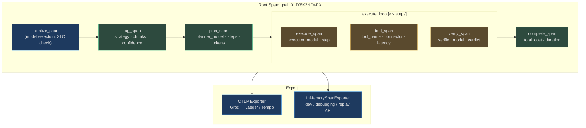
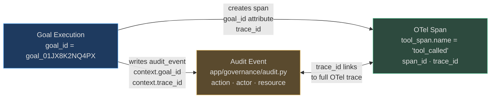

# Distributed Tracing

A structured log tells you *what* happened. A distributed trace tells you *why* it happened, *how long* each step took, and *which service* was responsible. For autonomous agents that span LLM calls, tool executions, RAG queries, and Celery workers, traces are the only way to understand a goal's full execution path.

AgentVerse uses OpenTelemetry (OTel) as its tracing framework. Every span carries the `goal_id` as its root, creating a unified trace hierarchy across all services.

## Trace Architecture



## OpenTelemetry Bootstrap

**Source:** `app/observability/tracing.py`

`configure_tracing(service_name, otlp_endpoint)` runs once at application startup:

```python
# With OTLP (production — Jaeger or Grafana Tempo)
configure_tracing("agentverse-backend", otlp_endpoint="http://otel-collector:4317")
# → BatchSpanProcessor: buffers spans and sends in batches for efficiency

# Without OTLP (dev / tests)
configure_tracing("agentverse-backend", otlp_endpoint=None)
# → SimpleSpanProcessor + InMemorySpanExporter: spans stored in process memory
#   accessible via get_recent_spans(limit=100) for the replay/debug API
```

### Getting a Tracer

```python
from app.observability.tracing import get_tracer

tracer = get_tracer("app.agent.loop")

with tracer.start_as_current_span("goal_execute") as span:
    span.set_attribute("agentverse.goal_id", goal_id)
    span.set_attribute("agentverse.tenant_id", tenant_id)
    span.set_attribute("agentverse.step", step_index)
    # ... execute step ...
```

`get_tracer()` degrades gracefully — if OTel is not installed (minimal test environments), it returns a `_NoOpTracer` that records nothing and never throws.

### Safe Pattern Attributes

The `safe_pattern_attributes()` function in `tracing.py` enforces that spans cannot accidentally capture tenant data:

```python
_SAFE_PATTERN_ATTRIBUTE_KEYS = frozenset({
    "event", "family", "strategy", "phase", "status", "correlation_id",
    "causation_id", "classification", "limit_type", "fallback_reason",
})

# Safe: structural metadata only
safe_pattern_attributes(strategy="multi_hop", phase="rerank", status="complete")
# → {"agentverse.strategy": "multi_hop", "agentverse.phase": "rerank", ...}

# Dropped silently: "prompt_text" is not in the allowed key set
safe_pattern_attributes(prompt_text="customer query...", strategy="naive")
# → {"agentverse.strategy": "naive"}  (prompt_text not in safe keys)
```

## Agent Loop Trace

The full agent loop trace hierarchy:

```
goal_01JX8K2NQ4PX [root]
│  duration: 34.2s
│  goal_id: goal_01JX8K2NQ4PX
│  tenant_id: acme-corp
│  complexity: high
│
├── initialize [0.8s]
│   │  profile_id: enterprise_multi_hop
│   │  rag_strategy: multi_hop
│   │  model_tier: premium
│
├── rag_retrieval [2.1s]
│   │  strategy: multi_hop
│   │  result_count: 12
│   │  confidence: 0.87
│   │  hops: 3
│
├── plan [3.4s]
│   │  planner_model: claude-3-5-sonnet
│   │  step_count: 4
│   │  input_tokens: 2840
│   │  output_tokens: 412
│
├── execute[step=1] [4.1s]
│   ├── tool_call: jira_search [1.2s]
│   │   │  connector: jira
│   │   │  status: success
│   │   │  result_size: 3420
│   └── verify[step=1] [2.9s]
│       │  verdict: success
│       │  verifier_model: gpt-4o-mini
│
├── execute[step=2] [8.3s]
│   ├── tool_call: confluence_read [6.1s]  ← slow!
│   │   │  status: success
│   │   │  latency_ms: 6100
│   └── verify[step=2] [2.2s]
│
├── execute[step=3] [7.8s]
...
└── complete [0.1s]
    │  total_cost_usd: 0.0234
    │  total_steps: 4
    │  eval_score: 0.91
```

This trace immediately reveals that Confluence read took 6.1s — 73% of that step's time — pointing to a Confluence API performance issue rather than an agent logic problem.

## Specialized Traces

Beyond the OTel spans, AgentVerse emits structured **trace events** via SSE for every orchestration decision. These are separate from OTel and designed for real-time dashboard display.

### RAG Trace (`rag_trace.py`)

```python
emit_rag_trace(
    goal_id="goal_01JX8K2NQ4PX",
    strategy="multi_hop",       # naive | multi_hop | graph | hybrid | speculative
    result_count=12,
    confidence=0.87,
)
# → {"type": "rag_trace", "goal_id": ..., "strategy": "multi_hop",
#    "result_count": 12, "confidence": 0.87}
```

Emitted after every retrieval pass. Feeds the real-time RAG debugger panel in the AgentVerse UI.

### Model Trace (`model_trace.py`)

```python
emit_model_trace(
    goal_id="goal_01JX8K2NQ4PX",
    planner="claude-3-5-sonnet",   # Which model handles planning
    executor="claude-3-5-sonnet",  # Which model handles execution
    verifier="gpt-4o-mini",        # Which model verifies — cheaper
    tier="premium",
)
# → {"type": "model_trace", "planner": "claude-3-5-sonnet",
#    "executor": "claude-3-5-sonnet", "verifier": "gpt-4o-mini", "tier": "premium"}
```

Enables analysis: do goals where verifier = "gpt-4o-mini" have lower accuracy than goals where verifier = "claude-haiku"?

### Pattern Trace (`pattern_trace.py`)

```python
emit_pattern_trace(
    goal_id="goal_01JX8K2NQ4PX",
    patterns={"orchestration": ["supervisor", "debate"], "memory": ["episodic"]},
    latency_ms=12.4,  # Pattern assembly time
)
```

Records which agent patterns (from the pattern library) were activated for this goal. Enables pattern-level performance analysis: does adding `debate` pattern improve quality but increase latency?

### Runtime Decision Trace (`runtime_decision_trace.py`)

The `RuntimeSSEEmitter` emits decision events for every major routing choice:

```python
emitter.runtime_profile_selected(
    goal_id=goal_id,
    profile_id="enterprise_multi_hop",
    complexity="high",
    patterns=["multi_hop_rag", "supervisor", "hitl_gate"],
    rag_strategy="multi_hop",
    assembly_latency_ms=12.4,
)

emitter.model_route_selected(
    goal_id=goal_id,
    planner="claude-3-5-sonnet",
    executor="claude-3-5-sonnet",
    verifier="gpt-4o-mini",
    cost_class="premium",
)

emitter.guardrail_profile_selected(
    goal_id=goal_id,
    bundle="hipaa",
    scanners=["pii", "phi", "injection", "toxicity"],
)

emitter.eval_score_recorded(
    goal_id=goal_id,
    overall_score=0.91,
    scores={"faithfulness": 0.94, "relevance": 0.89, "groundedness": 0.91},
)
```

All these events stream to the frontend via SSE, populating the live execution viewer.

## Trace Correlation

Every span and every SSE event carries `goal_id` as the primary correlation key. In production:

| Signal | How `goal_id` Appears |
|---|---|
| OTel spans | `agentverse.goal_id` span attribute |
| Structured logs | `goal_id` bound context variable |
| SSE events | `"goal_id"` in event payload |
| Prometheus metrics | `goal_id` NOT in labels (high cardinality) — correlate via logs |
| `GoalCostBreakdown` | keyed by `goal_id` |

**Cross-service correlation:** When a goal is dispatched to a Celery worker, the `goal_id` (and `request_id`) are passed in the task headers. The worker binds them as context variables before emitting any signals, ensuring every log and span from the worker carries the same `goal_id` as the originating API request.

## Trace Sampling

At scale, tracing every span of every goal is expensive. AgentVerse uses a two-tier sampling strategy:

| Condition | Sample Rate | Rationale |
|---|---|---|
| Goal failed (any reason) | **100%** | Every failure needs full forensic trace |
| Goal with HITL event | **100%** | Human approvals always fully traced |
| Goal with guardrail violation | **100%** | Security events require full context |
| Goal cost > $1.00 | **100%** | High-cost goals warrant scrutiny |
| Enterprise tenant | **100%** | SLA requires full trace for support |
| Standard tenant, success | **10%** | Statistical sample sufficient for p99 analysis |
| Free tier, success | **1%** | Minimal trace overhead |

## Real-World Example: Debugging with Traces

**Scenario:** An executor called the wrong tool three times before failing.

**Step 1 — Find the trace in Jaeger:**
```
Search: goal_id = "goal_01JX8K2NQ4PX"
```

**Step 2 — Expand the execution spans:**
```
execute[step=2] [24.3s total]
├── tool_call: confluence_search [3.1s] status=success result_count=0
├── tool_call: confluence_search [3.0s] status=success result_count=0  ← retry
├── tool_call: confluence_search [3.1s] status=success result_count=0  ← retry
└── verify[step=2]: verdict=failed reason="no_results"
```

**Step 3 — Check the plan span attributes:**
```
plan[step=2]:
  description: "Search Confluence for Q4 board meeting notes"
  tool_recommendation: "confluence_search"
  search_query: "Q4 board meeting notes 2025"
```

**Step 4 — Cross-reference with RAG trace:**
```
rag_trace: strategy=naive, result_count=0, confidence=0.12
```

**Diagnosis:** The RAG strategy `naive` returned zero results for the query, suggesting the query terms don't match the indexed document vocabulary. The executor faithfully tried Confluence (as planned), but the semantic gap was in the retrieval layer, not the execution layer. Fix: use `multi_hop` strategy for this query type.

**Time to diagnose: 4 minutes.** Without traces, this would require reading hundreds of log lines and reconstructing causality manually.

## Jaeger and Grafana Tempo Integration

When `OTEL_EXPORTER_OTLP_ENDPOINT` is set, spans are exported via gRPC to the collector:

```bash
# In production (docker-compose.yml)
OTEL_EXPORTER_OTLP_ENDPOINT=http://otel-collector:4317

# otel-collector → Jaeger backend
# otel-collector → Grafana Tempo (if configured)
```

In development (endpoint not set), `get_recent_spans(limit=100)` returns the last 100 spans from the `InMemorySpanExporter` — available via the internal debug API at `GET /internal/spans`.

<!-- Sources: app/observability/tracing.py, app/observability/rag_trace.py, app/observability/model_trace.py, app/observability/pattern_trace.py, app/observability/runtime_decision_trace.py -->

---

## Audit-Observability Correlation

Every agent action that touches data or calls a tool produces two parallel records: a **structured log / OTel span** (observability) and an **audit trail entry** (governance). These are correlated by a shared `goal_id` and an explicit `trace_id` field written into the audit event's context.

### Shared Correlation Model



Every `AuditEvent` written by `app/governance/audit.py` includes a `context` block carrying the current OTel trace ID, making it possible to pivot from an audit record to the full distributed trace in one step.

### Data Model

```json
{
  "id": "audit_01JX8K2NQ5ZZ",
  "action": "tool_called",
  "actor": "agent/goal_01JX8K2NQ4PX",
  "resource": "connector:salesforce/query_contacts",
  "tenant_id": "tenant_acme",
  "goal_id": "goal_01JX8K2NQ4PX",
  "timestamp": "2026-08-14T14:35:12.001Z",
  "outcome": "success",
  "context": {
    "trace_id": "a1b2c3d4e5f6a7b8c9d0e1f2a3b4c5d6",
    "span_id": "f1e2d3c4b5a69788",
    "step": 2,
    "tool_input_hash": "sha256:7c4e9f..."
  }
}
```

### Field Mapping: Audit → OTel

| Audit Event Field | Corresponding OTel Span Attribute |
|---|---|
| `audit_event.goal_id` | `span.attributes["goal_id"]` |
| `audit_event.context.trace_id` | `span_context.trace_id` |
| `audit_event.context.span_id` | `span_context.span_id` |
| `audit_event.action` | `span.name` (e.g. `"tool_called"`) |
| `audit_event.resource` | `span.attributes["tool_name"]` |
| `audit_event.tenant_id` | `span.attributes["tenant_id"]` |
| `audit_event.timestamp` | `span.start_time` |

### Incident Workflow: From Audit to Trace

**Step 1 — Security alert**: Anomaly detection flags unusual data exports from a specific tenant.

**Step 2 — Pull audit trail**:
```sql
SELECT id, action, actor, resource, context, timestamp
FROM audit_events
WHERE tenant_id = 'tenant_acme'
  AND action = 'data_export'
  AND timestamp > NOW() - INTERVAL '24 hours'
ORDER BY timestamp DESC;
```

**Step 3 — Extract `trace_id`**:
```python
trace_id = audit_event["context"]["trace_id"]  # "a1b2c3d4e5f6..."
```

**Step 4 — Look up full distributed trace**:
```
GET /internal/spans?trace_id=a1b2c3d4e5f6a7b8c9d0e1f2a3b4c5d6
```
Returns all spans: `initialize_span` → `rag_span` → `plan_span` → `tool_span(data_export)` → `complete_span`.

**Step 5 — Full picture in 3 minutes**: The `tool_span` reveals a 50,000-row query with no pagination limit — the root cause of the anomalous export volume.

### Real-World: Compliance Audit

**Scenario**: Compliance team needs to answer: "On August 14, which agent goals exported customer data, to which destination, and what was in the payload?"

```sql
-- Pull all data export audit events with their trace IDs
SELECT id, actor, resource, outcome,
       context->>'trace_id' AS trace_id,
       timestamp
FROM audit_events
WHERE action = 'data_export'
  AND DATE(timestamp) = '2026-08-14';
-- Returns 7 events, each with a unique trace_id
```

For each `trace_id`, the full span tree reveals:
- `plan_span` — what the agent *intended* to export
- `tool_span` — exact connector used (e.g. `"s3_upload"` to `s3://acme-exports/`)
- `tool_input` attribute — data shape and row count
- `complete_span` — final outcome (success / failed / partial)

This gives compliance a complete, tamper-evident chain of custody: the audit record proves *what* action was taken; the OTel trace proves *how* it was executed and *what data* flowed through.

<!-- Sources: app/governance/audit.py, app/observability/tracing.py, app/db/models/audit.py -->
