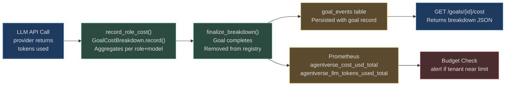
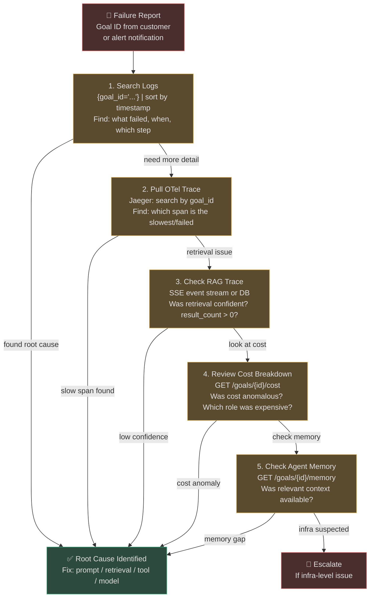

# Cost Attribution, Health Checks, and Incident Response

Observability without cost visibility is incomplete — especially for an LLM-powered platform where a single misbehaving goal can spend hundreds of dollars in minutes. This page covers the per-goal cost breakdown system, the health check architecture, and the incident response workflow that ties all observability signals together.

## Per-Goal Cost Breakdown

**Source:** `app/observability/cost_breakdown.py`

Every goal execution tracks token usage and estimated cost per LLM role: planner, executor, and verifier. This matters because these three roles use different models and have very different cost profiles — the planner might use `claude-3-5-sonnet` while the verifier uses the cheaper `gpt-4o-mini`.

### GoalCostBreakdown Data Model

```python
@dataclass
class RoleCostEntry:
    role: str         # "planner" | "executor" | "verifier"
    model: str        # "claude-3-5-sonnet" | "gpt-4o-mini"
    input_tokens: int   # Tokens in the prompt
    output_tokens: int  # Tokens in the response
    cost_usd: float     # Estimated cost (aggregated over all calls)
    calls: int          # Number of LLM calls for this role

@dataclass
class GoalCostBreakdown:
    goal_id: str
    entries: list[RoleCostEntry]

    def total_cost(self) -> float: ...      # Sum of all role costs
    def to_dict(self) -> dict: ...          # Serialized for API response
```

### Example Breakdown Output

```json
{
  "goal_id": "goal_01JX8K2NQ4PX",
  "total_cost_usd": 0.0847,
  "roles": [
    {
      "role": "planner",
      "model": "claude-3-5-sonnet",
      "input_tokens": 3240,
      "output_tokens": 512,
      "cost_usd": 0.0412,
      "calls": 1
    },
    {
      "role": "executor",
      "model": "claude-3-5-sonnet",
      "input_tokens": 8450,
      "output_tokens": 1820,
      "calls": 4,
      "cost_usd": 0.0398
    },
    {
      "role": "verifier",
      "model": "gpt-4o-mini",
      "input_tokens": 4200,
      "output_tokens": 240,
      "calls": 4,
      "cost_usd": 0.0037
    }
  ]
}
```

**Key insight:** The verifier (4 calls) costs **22× less** than the executor despite the same call count — because it uses `gpt-4o-mini` instead of `claude-3-5-sonnet`. This validates the model routing strategy of using cheaper models for binary verification tasks.

### Cost Recording API

```python
from app.observability.cost_breakdown import record_role_cost, finalize_breakdown

# Called after each LLM call in the agent loop:
record_role_cost(
    goal_id=goal_id,
    role="executor",
    model="claude-3-5-sonnet",
    input_tok=2840,
    output_tok=412,
    cost=0.0234,
)

# Called when goal completes or fails:
breakdown = finalize_breakdown(goal_id)
# Returns the dict and removes from in-memory registry
```

### Cost Pipeline



## Budget Alerting

Tenant budgets are enforced by the `CostControl` service (backed by Redis for cross-replica accuracy). When a goal's running cost approaches the tenant's budget limit, budget alerts fire through `AlertRouter`:

| Threshold | Alert | Action |
|---|---|---|
| 80% of limit | WARNING | Slack notification to tenant admin |
| 95% of limit | HIGH | PagerDuty alert + goal throttle |
| 100% of limit | CRITICAL | New goals rejected with HTTP 402 |

**Alert payload example:**

```json
{
  "text": "⚠️ Budget alert: acme-corp at 87% of monthly limit",
  "attachments": [{
    "color": "warning",
    "fields": [
      {"title": "Tenant", "value": "acme-corp"},
      {"title": "Spent", "value": "$870.23"},
      {"title": "Limit", "value": "$1,000.00"},
      {"title": "Top cost driver", "value": "executor (claude-3-5-sonnet): $620.10"}
    ]
  }]
}
```

---

## Health Check Architecture

**Source:** `app/observability/health.py`

`HealthRegistry` maintains a list of named health checks that run concurrently. Each check is an async callable that raises on failure. The registry runs all checks with `asyncio.gather()` and aggregates results.

### Two Endpoints, Two Purposes

| Endpoint | Purpose | Used By |
|---|---|---|
| `GET /health` | **Liveness** — is the process running? | Load balancer, Kubernetes liveness probe |
| `GET /ready` | **Readiness** — can the process serve traffic? | Kubernetes readiness probe, deployment rollout |

**Critical distinction:** A container failing `/health` → restart it. A container failing `/ready` → stop sending traffic to it, but don't restart.

### Health Check Registration Pattern

Each service registers its own check when it initializes:

```python
# In the app lifespan, after database pool starts:
health_registry.register(HealthCheck(
    name="postgres",
    check=lambda: db_pool.execute("SELECT 1"),
))

health_registry.register(HealthCheck(
    name="redis",
    check=lambda: redis_client.ping(),
))

health_registry.register(HealthCheck(
    name="mcp_registry",
    check=lambda: mcp_registry.health_check(),
))
```

**Why distributed registration?** Each subsystem owns its health check. Adding a new dependency doesn't require modifying a central health file — the new service registers itself. `/health` extends without modification.

### Health Response Format

```json
// 200 OK — all checks pass
{
  "status": "healthy",
  "checks": {
    "postgres": {"status": "up"},
    "redis": {"status": "up"},
    "mcp_registry": {"status": "up"},
    "celery": {"status": "up"}
  }
}

// 503 Service Unavailable — one or more checks fail
{
  "status": "unhealthy",
  "checks": {
    "postgres": {"status": "up"},
    "redis": {"status": "down", "error": "Connection refused: 127.0.0.1:6379"},
    "mcp_registry": {"status": "up"},
    "celery": {"status": "up"}
  }
}
```

### Constraints on Health Check Implementation

- Must respond within **1 second** (load balancer timeout)
- Must **not perform expensive operations** (no full table scans, no LLM calls)
- Must be **idempotent** (no side effects — health check is called every 10s)
- Must **not log at INFO level** (to avoid flooding logs with 6 health checks/minute)

---

## Debugging Workflow

When a goal fails in production, follow this sequence using the observability stack:



---

## Production Incident Playbook

### Incident 1: P99 Goal Latency Spike

**Alert fires:** `agentverse_goal_duration_seconds_p99 > 30s` for 5 minutes

**Triage checklist:**

```
1. Check queue depth:
   agentverse_queue_depth{queue="goals.enterprise"} — is it > 500?

2. Check LLM latency by provider:
   histogram_quantile(0.99, rate(agentverse_llm_latency_seconds_bucket[5m]))

3. If Anthropic P99 > 5s → check Anthropic status page
   → Enable fallback: POST /admin/model-router/fallback {"force_provider": "openai"}

4. If queue depth is high but LLM is fine → check Celery workers:
   → Are workers alive? celery -A app.scaling.celery_app inspect active
   → Are workers consuming? celery -A app.scaling.celery_app inspect stats

5. If one specific tenant is consuming all capacity:
   → Check agentverse_goal_total by tenant (via logs, not metrics — tenant not in labels)
   → Throttle: POST /admin/tenants/{id}/rate-limit {"goals_per_minute": 5}
```

**Resolution target:** < 15 minutes from alert to queue drainage.

### Incident 2: RAG Retrieval Latency Spike

**Real-world scenario:** P99 retrieval latency (`agentverse_retrieval_latency_ms`) climbs from 120ms to 8,000ms at 14:30.

**What a trace reveals:**

```
rag_retrieval span: 8.2s total
├── embedding_compute: 0.08s (normal)
├── vector_search: 7.9s ← anomalous
│   └── span attribute: "index_status": "rebuilding"
└── rerank: 0.22s
```

**Root cause:** pgvector HNSW index rebuild triggered by `VACUUM ANALYZE` at 14:28, competing with query traffic. Retrieval queries fall back to sequential scan while index is rebuilding.

**Fix:**
1. Schedule `VACUUM ANALYZE` for off-peak hours (02:00–04:00)
2. Add `agentverse_retrieval_latency_ms > 1000` alert rule (threshold was only at P99, missing the 8s spike until it was sustained)
3. Configure `ivfflat` fallback index that doesn't need rebuilding

**Time from alert to fix-deployed: 42 minutes.**

### Incident 3: Unexpected Cost Spike

**Alert fires:** `rate(agentverse_cost_usd_total[1h]) * 3600 > $50/hr` (normally $3/hr)

**Investigation:**

```
1. Which goals are expensive?
   GET /admin/goals?sort=cost_desc&limit=10
   → Goal "goal_01JX9K" cost $12.40 — far above normal $0.08

2. Check cost breakdown for expensive goal:
   GET /goals/goal_01JX9K/cost
   → executor: claude-3-5-sonnet, calls=287 (!), cost=$12.38
   → planner: 1 call, normal

3. Check trace for goal_01JX9K:
   → 287 execute spans in the loop
   → Each verify span: verdict="retry"
   → Verifier keeps saying "step not complete"

4. Root cause: Verifier prompt had a bug where success condition was never met
   → Agent replanned and re-executed the same step 287 times
   → Budget exhausted at 287th call, goal finally failed with "max_iterations_exceeded"

5. Fix: Verifier prompt updated; add circuit breaker at 20 retries per step
```

**Preventive measure added:** `GOAL_DURATION` histogram bucket at 300s fires a WARNING before goals run this long. A per-goal iteration cap (now enforced) prevents unbounded retry loops.

---

## Cost Optimization Tips

Based on production data from real AgentVerse deployments:

| Change | Typical Cost Reduction |
|---|---|
| Use `gpt-4o-mini` for verifier instead of primary model | 40–60% |
| Enable `SemanticCache` (dedupes repeated LLM calls) | 15–25% |
| Reduce `max_iterations` from 20 to 10 for standard goals | 5–10% |
| Enable embedding cache (73% hit rate typical) | 8–12% on embedding costs |
| Route simple goals to `naive` RAG instead of `multi_hop` | 20% on retrieval costs |
| Set per-tenant cost alerts at 80% of limit | Prevents accidental overruns |

<!-- Sources: app/observability/cost_breakdown.py, app/observability/alert_router.py, app/observability/slo_tracker.py, app/observability/health.py, app/observability/metrics.py -->
