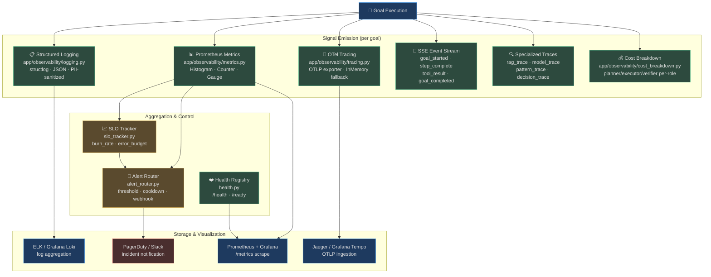

# Observability

> **You can't fix what you can't see.** For autonomous agents that make hundreds of decisions per minute across distributed services, observability isn't a nice-to-have — it's the foundation of every reliability guarantee AgentVerse makes.

An autonomous agent that silently fails is dangerous. An agent that excessively retries a broken tool can exhaust a tenant's budget in minutes. An agent that retrieves poisoned documents and hallucinates can cause real business damage. Observability is the layer that catches all of this, in real time, before it becomes an incident.

## Why Agent Observability Is Different

Traditional application monitoring tracks HTTP requests and database queries. Agent observability must track a fundamentally different entity: a **goal**, which spans multiple LLM calls, tool executions, RAG retrievals, and autonomous decisions — often across minutes or hours, across Celery workers on different machines, across multiple provider APIs.

| Traditional App | AgentVerse Agent |
|---|---|
| Request: `GET /users/123` (50ms) | Goal: "Summarise Q4 financials" (45s, 6 LLM calls) |
| Single process, single trace | Celery worker + FastAPI + Redis pub/sub |
| Success = HTTP 200 | Success = verified goal completion |
| Cost = server CPU | Cost = LLM tokens + embeddings + tool calls |
| Error = exception stack | Error = hallucination, injection, budget exceeded |

Every signal in AgentVerse is annotated with a `goal_id` so all logs, metrics, spans, and events for a single goal are trivially correlated — even across worker restarts.

## Three Pillars

### 📋 Logs — The Event Record

Structured JSON logs capture every meaningful event in an agent's lifecycle. Because logs are emitted with `structlog` and bound context variables, every line in a goal execution carries `goal_id`, `tenant_id`, and `request_id` without the developer passing them explicitly.

```json
{
  "timestamp": "2026-08-14T14:32:01.452Z",
  "level": "info",
  "event": "tool_called",
  "service": "agentverse-backend",
  "goal_id": "goal_01JX8K2NQ4PX",
  "tenant_id": "acme-corp",
  "tool": "jira_search",
  "step": 2,
  "request_id": "req_7f3a92b1"
}
```

### 📊 Metrics — The Pulse

Prometheus histograms, counters, and gauges track the four golden signals across every tenant, queue, and provider. The `/metrics` endpoint is scraped by Prometheus every 15s; alerts fire via `AlertRouter` within 5 minutes of a threshold breach.

```
agentverse_goal_duration_seconds_p99{status="complete",priority="high"} 4.87
agentverse_goal_total{status="failed",priority="normal"} 142
agentverse_llm_tokens_used_total{provider="anthropic",model="claude-sonnet"} 18500000
```

### 🔭 Traces — The Execution Map

OpenTelemetry spans record the causal chain of every decision. A single goal trace shows: which model was selected and why, which RAG chunks were retrieved, which tool was called with what arguments, and where time was spent. Spans export to Jaeger or Grafana Tempo via OTLP when configured; fall back to an in-process `InMemorySpanExporter` in development.

## Architecture



## Integration Points

Observability is not isolated — it feeds and is fed by every other subsystem:

| Subsystem | How Observability Integrates |
|---|---|
| **Evals** | Eval scores emitted as `eval_score_recorded` SSE events; metrics feed `EvalSuiteRunner` trend analysis |
| **Governance Audit** | Every `GuardrailViolation` written to audit trail + emits `violation_logged` log event |
| **Improvement Engine** | `SelfOptimizer` reads P99 latency metrics and retry counts to identify underperforming agents |
| **Cost Control** | `GoalCostBreakdown` feeds per-tenant cost dashboards and triggers budget alerts via `AlertRouter` |
| **Incident Response** | Alert fires → runbook linked in `AlertRule.webhook_url` payload → on-call engineer sees full trace in Jaeger |

## Navigation

| File | What It Covers |
|---|---|
| [01-structured-logging.md](./01-structured-logging.md) | JSON log format, correlation IDs, PII redaction, log pipeline at 1M goals/day |
| [02-metrics-and-slos.md](./02-metrics-and-slos.md) | All 40+ Prometheus metrics, SLO burn-rate tracking, AlertRouter configuration |
| [03-distributed-tracing.md](./03-distributed-tracing.md) | OTel spans, RAG/model/pattern/decision traces, Jaeger integration |
| [04-cost-and-incident-workflows.md](./04-cost-and-incident-workflows.md) | Per-goal cost breakdown, health checks, incident response playbook |

<!-- Sources: app/observability/logging.py, app/observability/metrics.py, app/observability/tracing.py, app/observability/slo_tracker.py, app/observability/alert_router.py, app/observability/health.py, app/observability/cost_breakdown.py, app/observability/rag_trace.py, app/observability/model_trace.py, app/observability/pattern_trace.py, app/observability/runtime_decision_trace.py -->
