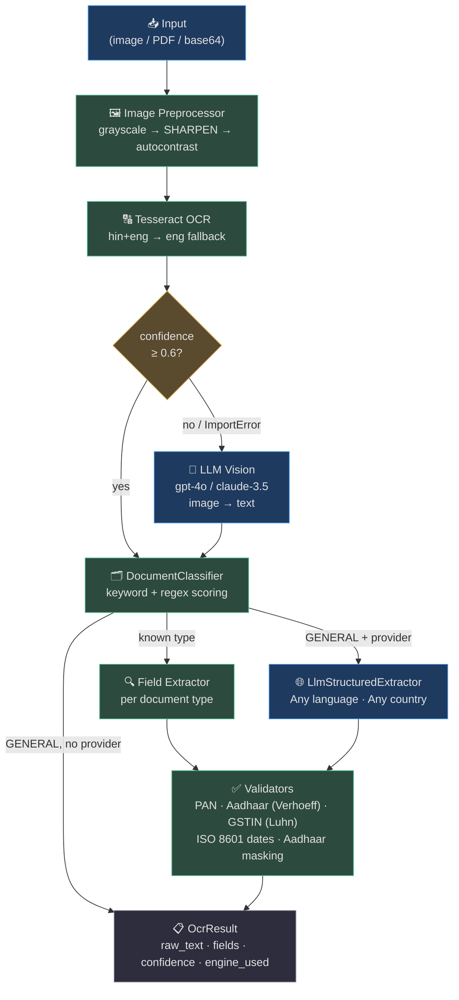

# OCR Engine

AgentVerse's OCR engine converts any image or PDF into **structured, validated, agent-ready data**. It combines Tesseract (offline, zero-cost) with an LLM vision fallback, classifies 13 document types automatically, applies checksum validation and legal masking, and falls back to an LLM-structured extractor for any document that doesn't match a known type — covering every country and language in a single pipeline.

This page covers:
- The **end-to-end pipeline** — from raw bytes to `OcrResult`
- All **13 document types** and their structured fields
- The **DocumentClassifier** — keyword/regex heuristic scoring
- The **LlmStructuredExtractor** — global document support via LLM
- **Validation & compliance** — PAN, Aadhaar (Verhoeff + masking), GSTIN (Luhn), ISO 8601 dates
- The **REST API** and **agent tool** interfaces
- **Batch processing** and **PII-safe audit logging**

---

## 1. Architecture Overview


<!-- Sources: app/ocr/engine.py, app/ocr/classifier.py, app/ocr/extractors/ -->

---

## 2. Package Layout

```
agent-verse-backend/app/ocr/
  __init__.py
  models.py            # OcrResult, DocumentType, ExtractedField
  engine.py            # OcrEngine — main pipeline orchestrator
  classifier.py        # DocumentClassifier — keyword/regex scoring
  validators.py        # validate_pan, validate_aadhaar, mask_aadhaar,
                       #   validate_gstin, normalize_date
  extractors/
    __init__.py        # get_extractor() factory
    id_docs.py         # PAN, Aadhaar, Passport, DL, Voter ID, Cheque
    financial.py       # Invoice, Bank Statement, Receipt, GSTIN,
                       #   Salary Slip, Address Proof
    general.py         # GeneralExtractor + LlmStructuredExtractor

app/tools/ocr_tool.py  # Agent-callable tool: "extract_document"
app/api/ocr.py         # POST /ocr/extract · POST /ocr/batch
```

---

## 3. Document Types

The engine supports **13 document types** across two categories:

### Identity Documents

| Type | Key Fields Extracted |
|---|---|
| `pan_card` | `pan_number` (validated), `name`, `dob`, `father_name` |
| `aadhaar` | `aadhaar_number` (Verhoeff + **masked**), `name`, `dob`, `address` |
| `passport` | `passport_number`, `name`, `nationality`, `dob`, `expiry_date` |
| `driving_license` | `dl_number`, `name`, `dob`, `expiry_date` |
| `voter_id` | `epic_number`, `name`, `father_name`, `dob` |
| `bank_cheque` | `cheque_number`, `payee_name`, `amount`, `micr_code` |

### Financial Documents

| Type | Key Fields Extracted |
|---|---|
| `invoice` | `invoice_number`, `invoice_date`, `vendor_name`, `gstin`, `total_amount` |
| `bank_statement` | `account_number`, `account_holder`, `ifsc_code`, `opening_balance`, `closing_balance` |
| `receipt` | `receipt_number`, `date`, `merchant_name`, `total_amount` |
| `gstin_certificate` | `gstin` (Luhn-validated), `legal_name`, `registration_date`, `status` |
| `salary_slip` | `employee_name`, `employee_id`, `pay_period`, `gross_salary`, `net_pay` |
| `address_proof` | `name`, `address`, `pincode`, `document_ref` |

### Global (Any Document)

| Type | Extraction Method |
|---|---|
| `general` | **LlmStructuredExtractor** — sends raw text to LLM; returns any key-value fields it identifies, any language, any country |

---

## 4. Validation & Compliance

### Aadhaar Legal Masking (Aadhaar Act, Section 29)

Every Aadhaar number is **masked** before leaving the OCR engine. Only the last 4 digits are visible:

```
Raw:    1234 5678 9012
Stored: XXXX XXXX 9012   ← masked_value field
```

The API response returns `masked_value` as `value` and the original as `raw_value`. Agent tools **never expose** the full 12-digit number.

### PAN Checksum

Format validated against the regex `[A-Z]{5}[0-9]{4}[A-Z]` (10 characters). Invalid PANs set `is_valid=False`.

### Aadhaar Verhoeff Checksum

The full 12-digit number is validated using the **Verhoeff algorithm** before masking. A structurally valid-looking number that fails checksum is flagged `is_valid=False`.

### GSTIN Luhn-Style Checksum

The 15-character GST Identification Number includes a checksum digit validated after format checks (`[0-9]{2}[A-Z]{5}[0-9]{4}[A-Z]{1}[1-9A-Z]{1}Z[0-9A-Z]{1}`).

### Date Normalization

All date fields are normalized to **ISO 8601 (`YYYY-MM-DD`)** regardless of input format:

| Input Format | Example In | Example Out |
|---|---|---|
| `DD/MM/YYYY` | `15/08/2026` | `2026-08-15` |
| `DD-MM-YYYY` | `15-08-2026` | `2026-08-15` |
| `YYYY-MM-DD` | already ISO | unchanged |
| `DD MMM YYYY` | `15 Aug 2026` | `2026-08-15` |
| `D MMM YYYY` | `5 Aug 2026` | `2026-08-26` |

---

## 5. REST API

### `POST /ocr/extract`

Extract a single document. Accepts JSON body or multipart file upload.

**JSON body:**
```json
{
  "image_base64": "<base64-encoded image>",
  "document_type": "pan_card"   // optional — auto-classified if omitted
}
```

**Response:**
```json
{
  "raw_text": "INCOME TAX DEPARTMENT\nPERMANENT ACCOUNT NUMBER...",
  "document_type": "pan_card",
  "fields": {
    "pan_number": {
      "value": "ABCDE1234F",
      "confidence": 0.95,
      "is_valid": true
    },
    "name": {
      "value": "RAHUL SHARMA",
      "confidence": 0.88,
      "is_valid": true
    }
  },
  "engine_used": "tesseract",
  "overall_confidence": 0.91,
  "page_count": 1
}
```

### `POST /ocr/batch`

Process up to **10 documents concurrently** via `asyncio.gather`. Returns a list of `OcrResult` objects in the same order as input. Individual failures do not abort the batch.

---

## 6. Agent Tool

The `extract_document` tool (registered in `app/tools/ocr_tool.py`) is callable from any agent goal:

```python
# Agent usage via tool call
await agent.use_tool("extract_document", {
    "file_path": "/uploads/invoice.pdf"
})
```

**Accepts:** `file_path`, `image_base64`, or `pdf_base64` (exactly one required).  
**Security:** 10 MB size limit enforced; path traversal blocked.  
**Output:** Same structure as the REST API, with `value` always set to the masked/safe representation for sensitive fields.

---

## 7. Real-World Example: KYC Onboarding Flow

**Situation:** A merchant onboarding agent collects PAN + Aadhaar + Bank Cheque to verify identity and bank account.

```
Goal: "Verify identity and bank account for merchant ID M-4891"
  Step 1: extract_document(pan_card.jpg)  → pan_number=ABCDE1234F ✅
  Step 2: extract_document(aadhaar.jpg)   → aadhaar_number=XXXX XXXX 9012 (masked) ✅
  Step 3: extract_document(cheque.jpg)    → micr_code=400002006, account=9876543210 ✅
  Step 4: cross_verify(pan_name=aadhaar_name) → MATCH ✅
  Step 5: update_merchant_status(M-4891, verified=True)
```

The Aadhaar masking ensures the agent never stores or logs the full UID, complying with the Aadhaar (Targeted Delivery) Act.

---

## 8. Real-World Example: Global Invoice Processing

**Situation:** A French e-commerce company uploads supplier invoices in French, Japanese, and Arabic.

```
Goal: "Extract key data from Q3 supplier invoices folder"
  → Tesseract extracts raw text (mixed scripts)
  → classifier → GENERAL (no French/Japanese/Arabic-specific type)
  → LlmStructuredExtractor sends raw text to LLM
  → LLM returns:
     { "invoice_number": "FAC-2026-0891",
       "amount": "€14,280",
       "vendor": "Société Générale Fournitures",
       "date": "15/08/2026" }
  → normalize_date("15/08/2026") → "2026-08-15"
  → OcrResult returned to agent
```

Any language. Any script. Zero configuration required.

---

## Deep-Dive Documentation

For complete architectural detail, see the [OCR Engine deep-dive folder](ocr/README.md):

| File | Topic |
|---|---|
| [01-architecture-and-pipeline.md](ocr/01-architecture-and-pipeline.md) | Full pipeline, image preprocessing, Tesseract config, LLM vision fallback |
| [02-document-classification.md](ocr/02-document-classification.md) | Keyword scoring, regex boosters, classification thresholds, adding new types |
| [03-field-extractors.md](ocr/03-field-extractors.md) | All 12 structured extractors — regex patterns, field-by-field breakdown |
| [04-validation-and-compliance.md](ocr/04-validation-and-compliance.md) | Verhoeff algorithm, Luhn checksum, Aadhaar masking law, date normalizer |
| [05-api-and-tool-integration.md](ocr/05-api-and-tool-integration.md) | REST endpoints, batch processing, PII audit log, agent tool wiring |
| [06-global-documents-and-llm-extraction.md](ocr/06-global-documents-and-llm-extraction.md) | LlmStructuredExtractor design, prompt engineering, JSON parsing, any-doc support |
