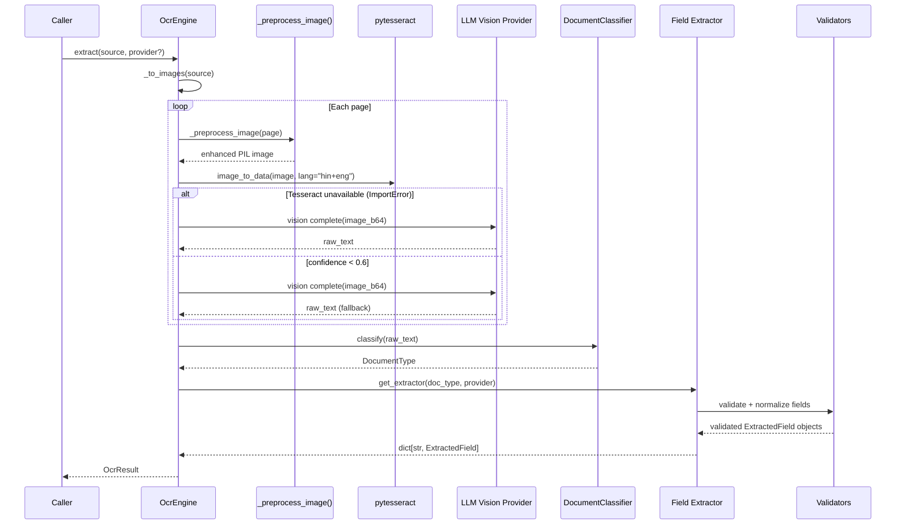

# OCR Architecture & Pipeline

The `OcrEngine` (`app/ocr/engine.py`) is the single entry point for all document extraction. It orchestrates image preprocessing, Tesseract OCR, confidence-based fallback to LLM vision, classification, and extraction in a single async-friendly pipeline.

---

## Pipeline Stages


<!-- Source: app/ocr/engine.py -->

---

## Input Handling: `_to_images()`

The engine accepts three input forms, all handled by `_to_images()`:

| Input | How Processed |
|---|---|
| `PIL.Image.Image` | Used directly as a single-page list |
| Raw bytes (image) | Opened via `PIL.Image.open(io.BytesIO(data))` |
| PDF bytes | Rendered to images via `pdf2image.convert_from_bytes()` at 200 DPI per page |

**PDF rendering** requires `poppler-utils` in the runtime environment. The Dockerfile installs it as `poppler-utils` (apt). When `pdf2image` is not installed, PDFs are not supported and raise a clear `ImportError` message.

---

## Image Preprocessing: `_preprocess_image()`

Raw scanned images are often low-contrast or blurry. Three processing steps maximize Tesseract's character recognition accuracy:

```python
def _preprocess_image(self, image: PILImage) -> PILImage:
    image = image.convert("L")          # 1. Grayscale — remove color noise
    image = image.filter(SHARPEN)       # 2. Sharpen — enhance character edges
    image = ImageOps.autocontrast(image) # 3. Autocontrast — normalize brightness
    return image
```

| Step | Purpose | Effect on OCR |
|---|---|---|
| Grayscale | Remove color channels | Reduces confusion between similar-colored characters |
| SHARPEN | PIL `ImageFilter.SHARPEN` | Makes letter strokes crisper; reduces blur |
| Autocontrast | Stretch contrast to full 0–255 range | Fixes underexposed scans, makes text pop from background |

**Performance:** preprocessing runs in < 5 ms per page on a 2 MP image using Pillow's C extensions.

---

## Tesseract OCR: `_ocr_page()`

```python
data = pytesseract.image_to_data(
    image,
    lang="hin+eng",
    output_type=pytesseract.Output.DICT,
)
```

### Language Selection

`hin+eng` is the default: **Hindi + English**. Tesseract tries both scripts simultaneously. This covers:
- English-only documents (Latin script)
- Hindi documents (Devanagari script)
- Mixed-language Indian documents (most government IDs include both)

If `hin+eng` raises a `TesseractError` (language pack not installed), the engine retries with `eng` only.

### Confidence Scoring

`image_to_data` returns a per-word confidence score (0–100). The engine aggregates these:

```python
confidences = [
    int(c) for c in data["conf"]
    if str(c).lstrip("-").isdigit() and int(c) >= 0
]
overall_confidence = sum(confidences) / len(confidences) / 100.0
# Result: 0.0 to 1.0
```

Negative confidence values (-1) are excluded — Tesseract uses -1 for block-level rows.

### LLM Vision Fallback Threshold

```python
_CONFIDENCE_THRESHOLD = 0.6
```

If `overall_confidence < 0.6` (or if `pytesseract` is not installed at all), the engine calls the LLM vision API with the base64-encoded image and requests a text transcription. This covers:
- Very low-resolution scans
- Handwritten documents
- Unusual fonts (stylized IDs, embossed text)
- Documents where Tesseract is not installed (serverless environments)

---

## Multi-Page Documents

For PDFs with multiple pages, `_ocr_page()` is called once per page. The raw texts are joined with `\n\n---\n\n` as a page separator. The returned `OcrResult.page_count` reflects the actual number of pages processed.

```python
page_texts = []
for page_image in images:
    raw_text, confidence = self._ocr_page(page_image, provider)
    page_texts.append(raw_text)

raw_text = "\n\n---\n\n".join(page_texts)
```

Classification and extraction operate on the **combined text** from all pages.

---

## Data Models

```python
# app/ocr/models.py

class DocumentType(StrEnum):
    PAN_CARD = "pan_card"
    AADHAAR = "aadhaar"
    PASSPORT = "passport"
    DRIVING_LICENSE = "driving_license"
    INVOICE = "invoice"
    BANK_STATEMENT = "bank_statement"
    RECEIPT = "receipt"
    GENERAL = "general"
    VOTER_ID = "voter_id"
    GSTIN_CERTIFICATE = "gstin_certificate"
    BANK_CHEQUE = "bank_cheque"
    SALARY_SLIP = "salary_slip"
    ADDRESS_PROOF = "address_proof"

@dataclass
class ExtractedField:
    name: str
    value: str
    confidence: float        # 0.0 – 1.0
    is_valid: bool = True    # False if checksum/format validation failed
    masked_value: str | None = None   # Set for Aadhaar: "XXXX XXXX 9012"

@dataclass
class OcrResult:
    raw_text: str
    document_type: DocumentType
    fields: dict[str, ExtractedField] = field(default_factory=dict)
    engine_used: Literal["tesseract", "llm_vision"] = "tesseract"
    overall_confidence: float = 0.0
    page_count: int = 1
```

---

## Optional Dependencies

The entire OCR stack is **optional**. If the packages are not installed, the engine raises informative errors rather than silently failing:

```toml
# pyproject.toml
[project.optional-dependencies]
ocr = [
    "pytesseract>=0.3.13",
    "Pillow>=10.0.0",
    "pdf2image>=1.17.0",
]
```

Install with: `uv sync --extra ocr`

System packages required (in Dockerfile):
```dockerfile
RUN apt-get install -y tesseract-ocr tesseract-ocr-hin poppler-utils
```

---

## Real-World Example: Low-Quality Scan Recovery

**Situation:** A field agent photographs a PAN card with poor lighting using a mobile phone.

```
Input: 1.2 MB JPEG, underexposed, slight blur
  → _preprocess_image():
       - Grayscale removes yellow tint from poor lighting
       - SHARPEN recovers character edges
       - Autocontrast stretches 40–200 range → 0–255
  → Tesseract: confidence = 0.52 (below 0.6 threshold)
  → LLM Vision fallback: extracts "ABCDE1234F" with full context
  → Classifier: keywords "INCOME TAX" + PAN regex → pan_card
  → IdDocExtractor: pan_number=ABCDE1234F, name=RAHUL SHARMA
  → validate_pan("ABCDE1234F") → is_valid=True
```

The agent receives a valid, structured result even from a photograph taken in adverse conditions.
