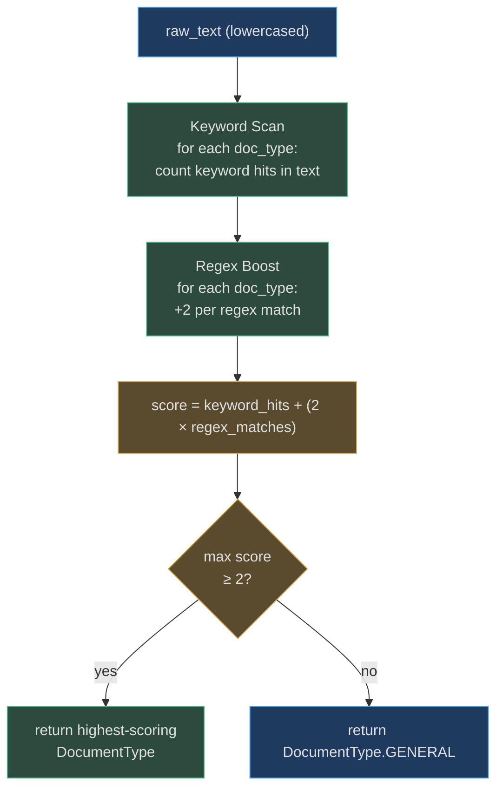

# Document Classification

The `DocumentClassifier` (`app/ocr/classifier.py`) determines the document type from raw OCR text in **< 1 ms** using pure keyword matching and regex boosting. No LLM call is required for classification — only for extraction when the type is `GENERAL`.

---

## Design Philosophy

Classification needs to be:
- **Fast** — called synchronously before extraction on every page
- **Offline** — works without any API keys or network access
- **Deterministic** — same input always produces the same result
- **Conservative** — better to classify as `GENERAL` than to guess wrong

The solution is a **scoring system**: count keyword hits per document type, boost the score for strong regex matches, and pick the type with the highest score above a minimum threshold.

---

## Scoring Algorithm


<!-- Source: app/ocr/classifier.py -->

**`_MIN_SCORE = 2`**: A document type must accumulate at least 2 points to be considered. This threshold prevents single-word false positives (e.g., a bank statement that mentions the word "tax" once shouldn't be classified as a PAN card).

---

## Keyword & Regex Configuration

### Identity Documents

| Type | Keywords | Regex Patterns |
|---|---|---|
| `pan_card` | `"income tax"`, `"permanent account number"`, `"pan"` | `r'[A-Z]{5}[0-9]{4}[A-Z]'` — valid PAN format |
| `aadhaar` | `"aadhaar"`, `"aadhar"`, `"uid"`, `"unique identification"` | `r'\d{4}\s\d{4}\s\d{4}'` — 12-digit UID pattern |
| `passport` | `"passport"`, `"republic of india"`, `"nationality"`, `"place of birth"` | `r'[A-Z][0-9]{7}'` — passport number format |
| `driving_license` | `"driving licence"`, `"driving license"`, `"motor vehicle"`, `"dl no"` | — |
| `voter_id` | `"election commission"`, `"voter"`, `"epic"`, `"electors photo identity"` | — |
| `bank_cheque` | `"cheque"`, `"micr"`, `"pay"`, `"bank"`, `"a/c payee"` | `r'\d{9}'` — MICR code pattern |

### Financial Documents

| Type | Keywords | Regex Patterns |
|---|---|---|
| `invoice` | `"invoice"`, `"bill to"`, `"gst"`, `"total amount"`, `"tax invoice"` | — |
| `bank_statement` | `"statement of account"`, `"account number"`, `"ifsc"`, `"balance"`, `"transaction"` | — |
| `receipt` | `"receipt"`, `"cash memo"`, `"amount paid"` | — |
| `gstin_certificate` | `"goods and services tax"`, `"gstin"`, `"registration certificate"` | `r'[0-9]{2}[A-Z]{5}[0-9]{4}[A-Z]{1}[1-9A-Z]{1}Z[0-9A-Z]{1}'` — full GSTIN |
| `salary_slip` | `"salary slip"`, `"payslip"`, `"employee id"`, `"basic salary"`, `"net pay"` | — |
| `address_proof` | `"address proof"`, `"residence"`, `"utility bill"`, `"electricity bill"`, `"gas bill"` | — |

### Why Regex Boost = +2?

Keywords score +1 each. A regex match scores +2 because it represents a **structurally valid pattern** specific to that document type — finding `[A-Z]{5}[0-9]{4}[A-Z]` in a document is much stronger evidence than finding the word "pan". The +2 ensures that a single strong regex match outweighs any single keyword match.

---

## Classification Examples

### Example 1: PAN Card
```
Text: "INCOME TAX DEPARTMENT\nGOVT. OF INDIA\nPERMANENT ACCOUNT NUMBER\nABCDE1234F\n..."

pan_card score:
  Keywords: "income tax"(+1) + "permanent account number"(+1) = 2
  Regex:    ABCDE1234F matches [A-Z]{5}[0-9]{4}[A-Z] → +2
  Total:    4

→ DocumentType.PAN_CARD  ✅
```

### Example 2: Ambiguous Receipt (False Positive Prevention)
```
Text: "THANK YOU FOR YOUR PURCHASE\nTOTAL: ₹250\nINVOICE NO: 001"

invoice score: "invoice"(+1) = 1
receipt score: "receipt"... not found, "amount paid"... not found = 0
Both below _MIN_SCORE=2

→ DocumentType.GENERAL  ✅ (conservative fallback)
```

### Example 3: Bank Statement
```
Text: "STATE BANK OF INDIA\nSTATEMENT OF ACCOUNT\nA/C NO: 1234567890\nIFSC: SBIN0001234\n..."

bank_statement score:
  Keywords: "statement of account"(+1) + "account number"... "a/c no" not exact but
            "ifsc"(+1) + "balance" appears later(+1) = 3

→ DocumentType.BANK_STATEMENT  ✅
```

---

## Conflict Resolution

When multiple types score above `_MIN_SCORE`, the type with the **highest score** wins. In practice, document types have sufficiently distinct vocabulary that ties are rare. If two types tie, the first one in definition order wins (deterministic behavior).

---

## Adding a New Document Type

To add a new type (e.g., `birth_certificate`):

1. Add the enum value to `DocumentType` in `app/ocr/models.py`:
   ```python
   BIRTH_CERTIFICATE = "birth_certificate"
   ```

2. Add keyword and regex config in `app/ocr/classifier.py` `_TYPE_CONFIG`:
   ```python
   DocumentType.BIRTH_CERTIFICATE: {
       "keywords": ["birth certificate", "date of birth", "registrar", "municipality"],
       "patterns": [r'REG\d{6,}'],   # Registration number pattern
   },
   ```

3. Add an extractor in `app/ocr/extractors/` (or reuse `IdDocExtractor` if field structure matches).

4. Register it in `get_extractor()` in `app/ocr/extractors/__init__.py`.

5. Add tests in `tests/ocr/test_classifier.py` and `tests/ocr/test_extractors.py`.

---

## Performance

- **Keyword scan:** O(n × k) where n = text length, k = total keywords (~50). Typically < 0.1 ms for a single-page document.
- **Regex scan:** each pattern compiled once at module load; matching < 0.5 ms per pattern.
- **Total classification time:** < 1 ms for any document.

This makes classification essentially free compared to OCR itself (Tesseract: 200–800 ms) or LLM calls (100–2000 ms).
