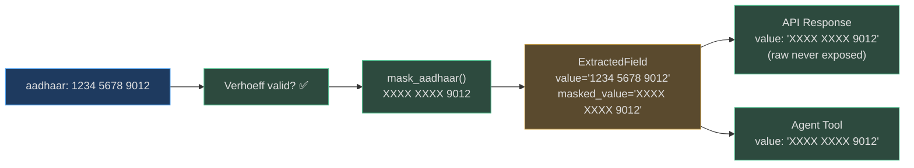

# Validation & Compliance

The `app/ocr/validators.py` module applies field-specific validation and normalization after extraction. Validation serves two purposes: **data quality** (marking fields with `is_valid=False` when they fail checksum) and **legal compliance** (masking Aadhaar numbers before they leave the extraction layer).

---

## Validators Overview

| Function | What It Does | Raises on Error? |
|---|---|---|
| `validate_pan(value)` | Checks format `[A-Z]{5}[0-9]{4}[A-Z]` | Returns `(bool, str)` — never raises |
| `validate_aadhaar(value)` | Strips spaces, verifies 12 digits, runs Verhoeff checksum | Returns `(bool, str)` |
| `mask_aadhaar(value)` | Returns `"XXXX XXXX {last4}"` | Returns `str` — never raises |
| `validate_gstin(value)` | Checks 15-char format + checksum digit | Returns `(bool, str)` |
| `normalize_date(value)` | Parses 8 date formats → ISO 8601 `YYYY-MM-DD` | Returns `str | None` |

All validators return `(is_valid: bool, normalized_value: str)` tuples so the extractor can update both `is_valid` and `value` in a single call.

---

## PAN Validation

Indian Permanent Account Numbers follow a fixed 10-character format:

```
[A-Z]{5} [0-9]{4} [A-Z]
 ABCDE    1234     F
```

- Positions 1-3: issuing authority code (AAA = individuals, AOP = Association of Persons, etc.)
- Position 4: taxpayer type (P = person, C = company, H = Hindu Undivided Family, etc.)
- Position 5: first letter of the taxpayer's surname
- Positions 6-9: sequence number
- Position 10: alphabetic check character

```python
def validate_pan(value: str) -> tuple[bool, str]:
    cleaned = value.strip().upper()
    pattern = re.compile(r'^[A-Z]{5}[0-9]{4}[A-Z]$')
    return pattern.match(cleaned) is not None, cleaned
```

**Note:** The OCR engine validates format only — it does not validate the tax authority code or the check character algorithm (which is not publicly documented by the Income Tax Department).

---

## Aadhaar Validation: Verhoeff Algorithm

The Aadhaar 12-digit UID uses the **Verhoeff algorithm** (1969) for its check digit — chosen because it detects all single-digit errors and all adjacent transposition errors.

### Verhoeff Tables

Three lookup tables drive the algorithm:

```python
_MULTIPLICATION_TABLE = [
    [0, 1, 2, 3, 4, 5, 6, 7, 8, 9],
    [1, 2, 3, 4, 0, 6, 7, 8, 9, 5],
    # ... 10×10 multiplication table (Dihedral group D5)
]

_PERMUTATION_TABLE = [
    [0, 1, 2, 3, 4, 5, 6, 7, 8, 9],
    [1, 5, 7, 6, 2, 8, 3, 0, 9, 4],
    # ... 8 permutation rows (cyclic group of period 8)
]

_INVERSE_TABLE = [0, 4, 3, 2, 1, 5, 6, 7, 8, 9]
```

### Validation Procedure

```python
def _verhoeff_validate(number: str) -> bool:
    c = 0
    for i, digit in enumerate(reversed(number)):
        p = _PERMUTATION_TABLE[i % 8][int(digit)]
        c = _MULTIPLICATION_TABLE[c][p]
    return c == 0   # Valid if accumulator reaches 0
```

The algorithm processes digits **right-to-left**, applying a permutation at each position (cycling through 8 permutations) and accumulating through the multiplication table. A valid number's accumulator reaches exactly 0.

### What It Catches

| Error Type | Detected? |
|---|---|
| Single-digit substitution (e.g., 3 → 7) | ✅ Always |
| Adjacent transposition (e.g., 12 → 21) | ✅ Always |
| Twin errors (e.g., 11 → 22) | ✅ Always |
| Jump transpositions | ✅ Always |
| Random 12-digit string | 90% chance detected (1-in-10 false pass rate) |

---

## Aadhaar Masking: Legal Compliance

### Legal Basis

**Aadhaar (Targeted Delivery of Financial and Other Subsidies, Benefits and Services) Act, 2016 — Section 29(3):**

> "No Aadhaar number or core biometric information collected or created under this Act shall be used for any purpose other than generation of Aadhaar numbers and authentication under this Act."

The UIDAI further mandates that no system storing or transmitting Aadhaar numbers for purposes other than authentication shall store the full 12-digit UID. The standard compliant format is:

```
XXXX XXXX 9012   ← last 4 digits visible
```

### Implementation

```python
def mask_aadhaar(value: str) -> str:
    """Return masked Aadhaar: XXXX XXXX <last4>."""
    digits = value.replace(" ", "").replace("-", "")
    if len(digits) != 12:
        return value  # Can't mask malformed input — return as-is
    return f"XXXX XXXX {digits[-4:]}"
```

### Where Masking is Applied

1. **`IdDocExtractor`**: sets `field.masked_value = mask_aadhaar(raw_value)` after validation
2. **`app/api/ocr.py`**: the API response serializer returns `masked_value` as `value` and keeps the full `raw_value` only in the internal `ExtractedField` object (never serialized to JSON for Aadhaar)
3. **`app/tools/ocr_tool.py`**: the tool output dict uses `value = field.masked_value or field.value`, ensuring agents never see the full UID



---

## GSTIN Validation: Luhn-Style Checksum

The **GST Identification Number** is a 15-character alphanumeric identifier:

```
07 AABCU9603R 1 Z D
↑             ↑ ↑ ↑
State code    Entity type  Z (always)  Checksum
```

### Format Regex

```python
_GSTIN_RE = re.compile(
    r'^[0-9]{2}[A-Z]{5}[0-9]{4}[A-Z]{1}[1-9A-Z]{1}Z[0-9A-Z]{1}$'
)
```

### Checksum Algorithm

The checksum at position 15 is validated using a **Luhn-inspired** algorithm over a base-36 character set (digits 0-9 and letters A-Z):

```python
_CHARSET = "0123456789ABCDEFGHIJKLMNOPQRSTUVWXYZ"

def _gstin_checksum(gstin: str) -> bool:
    factor = 2
    total = 0
    for char in reversed(gstin[:-1]):   # all chars except last (checksum)
        product = factor * _CHARSET.index(char)
        total += product // 36 + product % 36
        factor = 3 - factor   # alternate 2 and 1
    checksum_char = _CHARSET[(36 - total % 36) % 36]
    return checksum_char == gstin[-1]
```

---

## Date Normalization

All extracted date fields are normalized to **ISO 8601 (`YYYY-MM-DD`)** regardless of source format:

```python
_DATE_FORMATS = [
    "%d/%m/%Y",   # 15/08/2026
    "%d-%m-%Y",   # 15-08-2026
    "%Y-%m-%d",   # 2026-08-15  (already ISO)
    "%d %b %Y",   # 15 Aug 2026
    "%-d %b %Y",  # 5 Aug 2026
    "%B %d, %Y",  # August 15, 2026
    "%d.%m.%Y",   # 15.08.2026
    "%Y/%m/%d",   # 2026/08/15
]

def normalize_date(value: str) -> str | None:
    for fmt in _DATE_FORMATS:
        with contextlib.suppress(ValueError):
            return datetime.strptime(value.strip(), fmt).strftime("%Y-%m-%d")
    return None   # Unrecognized format
```

If `normalize_date` returns `None`, the field retains its original raw value and `is_valid` is set to `False`.

---

## Real-World Example: Checksum Catching a Scan Error

**Situation:** An Aadhaar card scan misreads one digit due to background pattern interference.

```
Tesseract reads: "1234 5678 9013"
                                 ↑ Should be 9012

validate_aadhaar("1234567890 13"):
  Verhoeff algorithm → accumulator ≠ 0
  → is_valid = False

OcrResult.fields["aadhaar_number"].is_valid = False
```

The agent sees `is_valid: false` in the tool output and can request a re-scan or escalate to human review — instead of silently processing a corrupted UID that would fail downstream verification.
