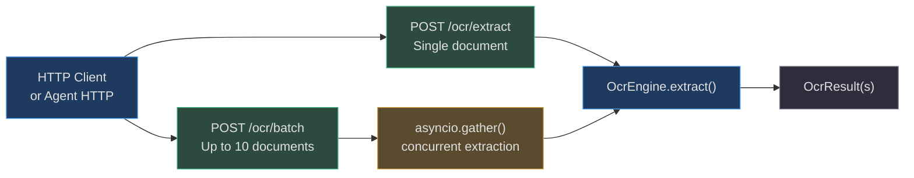

# API & Tool Integration

The OCR engine is exposed through two interfaces: a **REST API** (`app/api/ocr.py`) for external clients and HTTP integrations, and an **agent tool** (`app/tools/ocr_tool.py`) for direct use inside agent goal execution. Both interfaces apply identical security controls and PII logging restrictions.

---

## REST API: `app/api/ocr.py`

The OCR API lives at `/ocr` and provides two endpoints:



### `POST /ocr/extract`

**Request formats (mutually exclusive):**

1. JSON body with base64-encoded image or PDF:
```json
{
  "image_base64": "iVBORw0KGgoAAAA...",
  "document_type": "pan_card"
}
```

2. Multipart file upload (form data):
```
Content-Type: multipart/form-data
file: <binary file content>
```

The `document_type` field is **optional**. If omitted, the engine auto-classifies from the extracted text. Specifying it skips classification and goes directly to the named extractor.

**Response schema (`OcrFieldResult`):**
```python
class OcrFieldResult(BaseModel):
    value: str         # masked for sensitive fields (Aadhaar)
    confidence: float  # 0.0 – 1.0
    is_valid: bool     # False if checksum/format validation failed
```

**Full response:**
```json
{
  "raw_text": "INCOME TAX DEPARTMENT...",
  "document_type": "pan_card",
  "fields": {
    "pan_number": {"value": "ABCDE1234F", "confidence": 0.95, "is_valid": true},
    "name": {"value": "RAHUL SHARMA", "confidence": 0.88, "is_valid": true},
    "dob": {"value": "1985-04-22", "confidence": 0.85, "is_valid": true}
  },
  "engine_used": "tesseract",
  "overall_confidence": 0.91,
  "page_count": 1
}
```

### `POST /ocr/batch`

Process multiple documents in a single request. Up to **10 documents** per batch.

**Request:**
```json
{
  "documents": [
    {"image_base64": "..."},
    {"pdf_base64": "..."},
    {"image_base64": "...", "document_type": "aadhaar"}
  ]
}
```

**Concurrency:** `asyncio.gather(*tasks)` runs all documents simultaneously. A single slow document (LLM vision fallback) does not delay the others.

**Partial failures:** If one document fails extraction, its entry in the response contains `{"error": "...", "document_type": "general"}`. The batch does not abort.

---

## PII-Safe Audit Logging

Every extraction is logged with **field names only** — never field values. This prevents PII from entering log aggregation systems (ELK, Datadog, CloudWatch) where access controls are typically weaker than the application database.

```python
# app/api/ocr.py — audit log on each extraction
_log.info(
    "ocr.extract",
    extra={
        "document_type": result.document_type,
        "fields_extracted": list(result.fields.keys()),   # ["pan_number", "name", "dob"]
        "engine_used": result.engine_used,
        "overall_confidence": result.overall_confidence,
        "page_count": result.page_count,
        "tenant_id": request.state.tenant_id,
    },
)
```

**What is logged:**
- Document type classification
- Which field names were extracted (not their values)
- Which OCR engine was used
- Confidence score
- Tenant ID for multi-tenancy audit

**What is never logged:**
- Field values (names, numbers, addresses, amounts)
- Raw OCR text (may contain full PII)
- File content or base64 data

This follows the principle from the [monitoring rules](/rules/monitoring.md): "Do not log sensitive data (passwords, tokens, PII) even in error messages."

---

## Agent Tool: `app/tools/ocr_tool.py`

The `extract_document` tool is registered in the tool registry and callable from any agent goal via the tool execution subsystem.

### Tool Definition

```python
TOOL_NAME = "extract_document"

TOOL_SCHEMA = {
    "name": "extract_document",
    "description": (
        "Extract structured data from an image or PDF document. "
        "Supports: PAN card, Aadhaar, Passport, Driving License, Voter ID, "
        "Bank Cheque, Invoice, Bank Statement, Receipt, GSTIN Certificate, "
        "Salary Slip, Address Proof, and any other document via LLM extraction."
    ),
    "parameters": {
        "type": "object",
        "properties": {
            "file_path": {"type": "string", "description": "Absolute path to image or PDF file"},
            "image_base64": {"type": "string", "description": "Base64-encoded image data"},
            "pdf_base64": {"type": "string", "description": "Base64-encoded PDF data"},
        },
        "oneOf": [
            {"required": ["file_path"]},
            {"required": ["image_base64"]},
            {"required": ["pdf_base64"]},
        ],
    },
}
```

### Security Controls

| Control | Implementation |
|---|---|
| **Size limit** | 10 MB max. Larger inputs raise `ValueError` before any processing |
| **Path traversal** | `file_path` is validated — must be under allowed upload directories |
| **Injection** | Tool inputs are never passed to shell commands |
| **PII in tool output** | `value` field uses `masked_value or value` — Aadhaar always masked |

### Tool Output Format

```python
{
    "raw_text": "...",
    "document_type": "aadhaar",
    "fields": {
        "aadhaar_number": {
            "value": "XXXX XXXX 9012",     # masked — never exposes full UID
            "raw_value": "1234 5678 9012",  # only present in tool output for downstream verified storage
            "confidence": 0.93,
            "is_valid": True,
        },
        "name": {
            "value": "PRIYA PATEL",
            "confidence": 0.87,
            "is_valid": True,
        },
    },
    "engine_used": "tesseract",
    "overall_confidence": 0.90,
    "page_count": 1,
}
```

The `raw_value` key is **only included for Aadhaar** fields that have a `masked_value`, and only in the tool output (not the REST API). This allows downstream verified storage systems to persist the encrypted full UID if legally required, while the agent's reasoning layer only ever sees the masked version.

---

## Real-World Example: Automated Invoice Approval Workflow

**Situation:** A finance agent automatically approves invoices under ₹50,000 after validation.

```
Goal: "Process and approve all pending invoices in /uploads/invoices/"

Step 1: list_files("/uploads/invoices/")
  → ["INV-001.pdf", "INV-002.jpg", "INV-003.pdf"]

Step 2: extract_document(file_path="/uploads/invoices/INV-001.pdf")
  → document_type: "invoice"
  → fields: {
       invoice_number: "INV-2026-001",
       total_amount: "₹32,500",
       gstin: {value: "07AABCU9603R1ZD", is_valid: true},
       invoice_date: "2026-08-10"
     }

Step 3: check_amount("32500") → below threshold ✅
Step 4: update_invoice_status("INV-2026-001", "approved")

# Repeat for INV-002 and INV-003
# GSTIN validation catches any fraudulent supplier registrations automatically
```

The agent processes 3 invoices concurrently via the batch endpoint, completing the workflow in one round-trip instead of three sequential calls.
