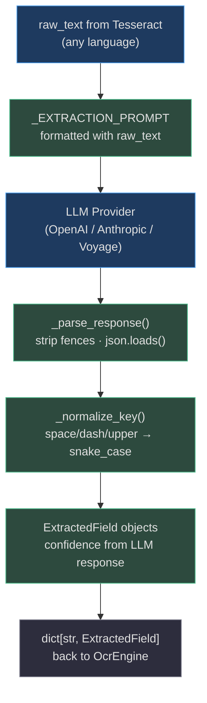
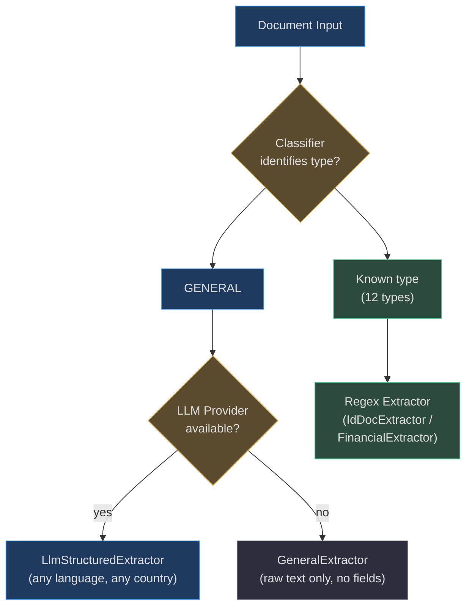

# Global Documents & LLM Extraction

The `LlmStructuredExtractor` (`app/ocr/extractors/general.py`) is the engine's answer to the world beyond India: **any document, any language, any country**. When the `DocumentClassifier` returns `GENERAL` and an LLM provider is available, this extractor sends the raw OCR text to the LLM and asks it to identify and return all key-value fields as structured JSON.

---

## Why Regex Alone Is Not Enough

Regex-based extraction works well for documents with standardized formats (PAN cards, GSTIN certificates) where field positions and formats are legislated. It fails for:

| Scenario | Problem |
|---|---|
| French invoices | Different field labels, different number formats |
| Japanese contracts | Entirely different script and document structure |
| US driver's licenses | 50+ state-specific formats |
| UK bank statements | Different terminology (Sort Code vs. IFSC) |
| Arabic passports | Right-to-left text, different character sets |
| Medical records | Highly variable structure, institution-specific |
| Custom business forms | No standardized field names |

Adding regex extractors for every country and document type is **not scalable**. The LLM approach solves this generically.

---

## Architecture


<!-- Source: app/ocr/extractors/general.py -->

---

## The Extraction Prompt

```python
_EXTRACTION_PROMPT = """You are a document data extraction specialist.
Extract all key-value fields from the following document text.
Return a JSON object where each key is the field name in snake_case
and the value is an object with "value" (string) and "confidence" (0.0-1.0).

Example output format:
{{
    "invoice_number": {{"value": "INV-2026-001", "confidence": 0.95}},
    "date": {{"value": "2026-08-15", "confidence": 0.90}},
    "total_amount": {{"value": "1500.00", "confidence": 0.85}}
}}

Document text:
{raw_text}

Return only the JSON object, no additional text."""
```

### Prompt Design Decisions

**1. Snake_case instruction:** The prompt explicitly requests `snake_case` key names. Combined with the `_normalize_key()` function, this ensures consistent field names regardless of whether the LLM returns `"Invoice Number"`, `"invoice_number"`, or `"invoice-number"`.

**2. Confidence per field:** Each field carries its own confidence score. The LLM assigns higher confidence to clearly printed, unambiguous fields (like an invoice number in large print) and lower confidence to partially obscured or ambiguous values.

**3. `{{` double-braces:** The prompt template uses `str.format()` substitution for `{raw_text}`. Literal `{` and `}` in the example JSON must be escaped as `{{` and `}}` to prevent `KeyError`.

**4. "Return only JSON":** Prevents markdown prose, explanatory sentences, or apologies from appearing in the response. These would break `json.loads()`.

---

## Response Parsing: `_parse_response()`

LLMs sometimes wrap JSON in markdown code fences even when instructed not to. The parser handles this:

```python
def _parse_response(self, response: str) -> dict:
    text = response.strip()
    # Strip markdown code fences: ```json ... ``` or ``` ... ```
    if text.startswith("```"):
        lines = text.splitlines()
        # Remove first line (```json or ```) and last line (```)
        text = "\n".join(lines[1:-1]).strip()
    return json.loads(text)
```

**What it handles:**
- Plain JSON: `{"key": {"value": "...", "confidence": 0.9}}`
- Fenced JSON: ` ```json\n{...}\n``` `
- Fenced without language tag: ` ```\n{...}\n``` `

**What it does NOT handle:**
- Multiple JSON objects in one response (only the first `json.loads()` call matters)
- Partial/truncated JSON (raises `json.JSONDecodeError`, caught by the outer exception handler)

---

## Key Normalization: `_normalize_key()`

```python
def _normalize_key(self, key: str) -> str:
    return re.sub(r'[\s\-]+', '_', key.strip()).lower()
```

| LLM Output Key | Normalized |
|---|---|
| `"Invoice Number"` | `invoice_number` |
| `"invoice-number"` | `invoice_number` |
| `"TOTAL AMOUNT"` | `total_amount` |
| `"  date of birth  "` | `date_of_birth` |
| `"dob"` | `dob` |

---

## Graceful Fallback

The entire extraction is wrapped in a broad exception handler:

```python
async def extract_async(self, raw_text: str) -> dict[str, ExtractedField]:
    try:
        prompt = _EXTRACTION_PROMPT.format(raw_text=raw_text)
        response = await self._provider.complete_async(prompt)
        raw = self._parse_response(response)
        fields = {}
        for key, data in raw.items():
            if isinstance(data, dict) and "value" in data:
                norm_key = self._normalize_key(key)
                fields[norm_key] = ExtractedField(
                    name=norm_key,
                    value=str(data["value"]),
                    confidence=float(data.get("confidence", 0.7)),
                )
        return fields
    except Exception:
        return {}   # Return empty dict — caller gets GENERAL type with no fields
```

**Failure modes handled silently:**
- LLM provider unavailable / rate-limited
- Malformed JSON response
- Unexpected response structure
- Network timeout

In all failure cases, the engine returns an `OcrResult` with `document_type=GENERAL`, `fields={}`, and the raw text still available. The agent can inspect `raw_text` directly or request a retry.

---

## Supported Documents (Examples)

Since `LlmStructuredExtractor` relies on LLM intelligence, it adapts to any document the LLM can reason about:

### Identity Documents (Global)

| Document | Country | What LLM Extracts |
|---|---|---|
| US Driver's License | USA | name, license_number, address, dob, class |
| UK Passport | UK | passport_number, name, nationality, dob, expiry |
| German ID Card (Personalausweis) | Germany | name, birth_date, nationality, id_number |
| Singapore NRIC | Singapore | nric_number, name, address, dob |
| UAE Emirates ID | UAE | id_number, name, nationality, expiry |

### Financial Documents (Global)

| Document | Country | What LLM Extracts |
|---|---|---|
| EU VAT Invoice | France/Germany/etc. | invoice_number, vat_number, total, date |
| US W-2 | USA | employer_ein, wages, federal_tax_withheld |
| UK P60 | UK | national_insurance, total_pay, tax_year |
| Australian Tax Invoice | Australia | abn, gst_amount, total |
| Chinese fapiao (发票) | China | invoice_code, amount, buyer_name |

### Other Documents

| Document | What LLM Extracts |
|---|---|
| Medical prescription | patient_name, doctor_name, medications, dosage |
| Academic transcript | institution, student_name, gpa, subjects |
| Property deed | property_address, owner_name, survey_number |
| Customs declaration | hs_code, description, declared_value, origin |

---

## Real-World Example: Processing a Japanese Utility Bill

**Situation:** A property management agent needs to verify tenant utility bills during onboarding.

```
Input: Japanese electricity bill (Tokyo Electric Power / TEPCO)
Tesseract (hin+eng): extracts mixed Latin + Kanji characters, low confidence
→ LLM Vision fallback: transcribes Japanese text accurately
→ Classifier: no keywords matched → GENERAL
→ LlmStructuredExtractor sends to LLM:

Prompt includes raw text containing:
"東京電力エナジーパートナー  お客様番号: 1234-567890
 ご使用期間: 2026年7月15日〜2026年8月14日
 ご請求金額: ¥8,640"

LLM returns:
{
  "customer_number": {"value": "1234-567890", "confidence": 0.95},
  "billing_period_start": {"value": "2026-07-15", "confidence": 0.90},
  "billing_period_end": {"value": "2026-08-14", "confidence": 0.90},
  "amount_due": {"value": "¥8,640", "confidence": 0.95},
  "utility_company": {"value": "Tokyo Electric Power", "confidence": 0.88}
}

OcrResult.fields = {
  customer_number: ExtractedField(value="1234-567890", confidence=0.95),
  billing_period_start: ExtractedField(value="2026-07-15", confidence=0.90),
  ...
}
```

The agent receives clean structured data in English-normalized snake_case keys — no Japanese parsing code required.

---

## When to Use Each Extractor



| Situation | Extractor Used | Speed | Cost |
|---|---|---|---|
| Indian PAN / Aadhaar / Passport | `IdDocExtractor` (regex) | < 1 ms | Free |
| Invoice / Bank statement | `FinancialExtractor` (regex) | < 1 ms | Free |
| Any unrecognized document + provider configured | `LlmStructuredExtractor` | 200–2000 ms | LLM tokens |
| Any unrecognized document + no provider | `GeneralExtractor` | < 1 ms | Free (raw text only) |
