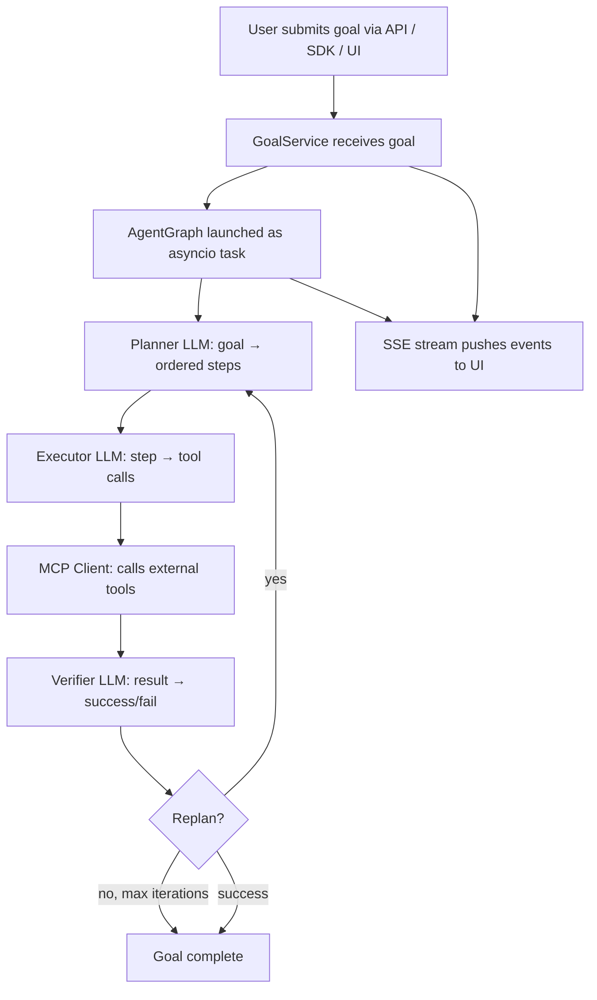
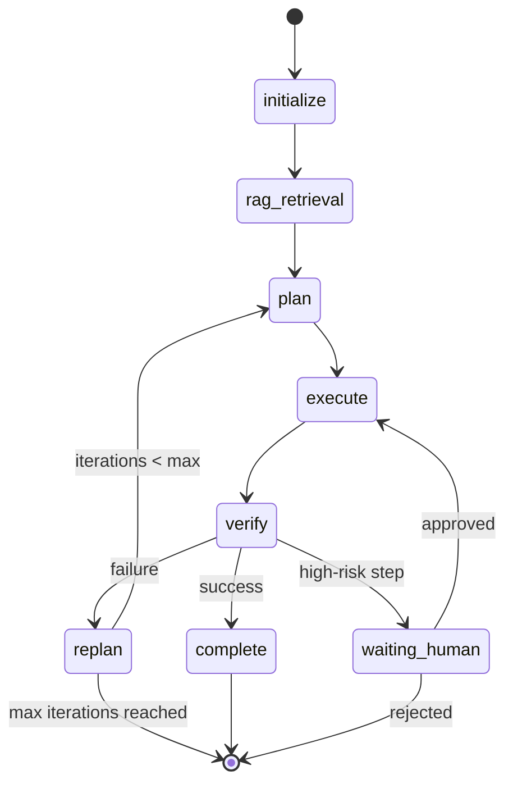
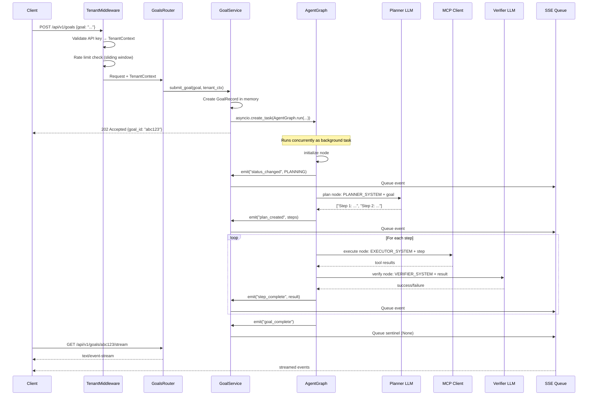

# Contributor Guide

> **Audience:** New engineers and open-source contributors who want to run AgentVerse locally, understand the codebase deeply, and make their first meaningful contribution.

**Repository:** https://github.com/harsh786/agent-verse  
**Stack:** Python 3.12 · FastAPI · LangGraph · Celery · PostgreSQL · Redis · React 19

---

## Table of Contents

1. [Prerequisites & System Requirements](#1-prerequisites--system-requirements)
2. [Getting the Repository Running](#2-getting-the-repository-running)
3. [Mental Model: What AgentVerse Actually Does](#3-mental-model-what-agentverse-actually-does)
4. [The Agent Loop — Deep Dive](#4-the-agent-loop--deep-dive)
5. [Codebase Map: Where Everything Lives](#5-codebase-map-where-everything-lives)
6. [The Request Lifecycle — Trace a Goal End-to-End](#6-the-request-lifecycle--trace-a-goal-end-to-end)
7. [Testing Strategy](#7-testing-strategy)
8. [Making Your First Contribution](#8-making-your-first-contribution)
9. [Debugging Guide](#9-debugging-guide)
10. [Glossary (40+ terms)](#10-glossary)

---

## 1. Prerequisites & System Requirements

### Required Tools

| Tool | Version | Install |
|------|---------|---------|
| Python | 3.12 (via `uv`) | `brew install uv` |
| `uv` | ≥ 0.4 | `curl -LsSf https://astral.sh/uv/install.sh \| sh` |
| Node.js | ≥ 20 | `brew install node` |
| Docker / Colima | any | `brew install colima docker` |
| `docker-compose` (v1 standalone) | any | `brew install docker-compose` |
| Git | ≥ 2.40 | pre-installed on macOS |

> **macOS Note:** This machine uses **Colima** instead of Docker Desktop. Docker is never auto-started — you must run `colima start` before any container commands. The `docker compose` v2 plugin is absent; always use `docker-compose` (standalone binary).

### Hardware

- 8 GB RAM minimum (16 GB recommended with full stack)
- 4 CPU cores
- 10 GB disk for container images

---

## 2. Getting the Repository Running

### Step 1 — Clone

```bash
git clone https://github.com/harsh786/agent-verse.git
cd agent-verse/agent-verse-backend
```

### Step 2 — Start Infrastructure

```bash
colima start
docker-compose -f infra/docker-compose.yml up -d postgres redis
```

Wait for PostgreSQL to be ready:
```bash
docker-compose -f infra/docker-compose.yml logs -f postgres | grep "ready to accept"
```

### Step 3 — Install Python Dependencies

```bash
uv sync
```

This creates `.venv` using Python 3.12 (pinned in `pyproject.toml`) and installs all deps from the lockfile. The local SDK is installed as an editable path source — changes to `agent-verse-sdk-python/` are immediately reflected in backend tests.

### Step 4 — Apply Database Migrations

```bash
uv run alembic upgrade head
```

This runs all 104 migrations, creating the full schema with RLS policies, indexes, and triggers.

### Step 5 — Run the Backend

```bash
uv run uvicorn app.main:app --reload --port 8000
```

Verify: `curl http://localhost:8000/api/v1/system/health`

Expected response:
```json
{"status": "healthy", "checks": {"db": "ok", "redis": "ok"}}
```

### Step 6 — Run the Frontend (optional)

```bash
cd ../agent-verse-frontend
npm install
npm run dev
```

Opens at `http://localhost:5173`.

### Step 7 — Verify Tests Pass

```bash
cd ../agent-verse-backend
uv run pytest --ignore=tests/real_e2e -q --no-cov
```

All tests use `FakeProvider` — no LLM API keys required.

---

## 3. Mental Model: What AgentVerse Actually Does

Before touching code, you need a clear mental model of what happens when a user submits a goal.



**Key insight:** There are no hardcoded workflows. The Planner LLM determines the steps. The Executor LLM determines what tools to call. The Verifier LLM determines if it worked. AgentVerse is the infrastructure that makes this safe, observable, and multi-tenant.

### Three Things AgentVerse Is NOT

1. **Not a chatbot framework.** Goals are executed, not conversed about.
2. **Not a workflow engine.** Workflows are dynamically generated from NL, not pre-coded.
3. **Not a vendor-specific tool.** The same goal runs on Anthropic, OpenAI, or any OpenAI-compatible endpoint.

---

## 4. The Agent Loop — Deep Dive

**Source:** [`app/agent/graph.py`](https://github.com/harsh786/agent-verse/blob/main/agent-verse-backend/app/agent/graph.py)

### The LangGraph StateGraph

The agent is implemented as a LangGraph `StateGraph`. Understanding LangGraph is essential:

- **State** (`GraphState`): A `TypedDict` that flows through every node
- **Nodes**: Async functions `(state: GraphState) → dict` — return only the fields they modify
- **Edges**: Conditions that determine which node runs next
- **Checkpointing**: Every state transition is persisted (in-memory by default, Redis in production)



### The Five Nodes

**`initialize` node** — Sets up `AgentState`, loads execution memory, applies tenant policy.

**`rag_retrieval` node** — Queries `KnowledgeStore` using the goal text. Injects retrieved context into `GraphState.rag_context`. If no knowledge base is configured, this is a no-op.

**`plan` node** — Sends `[system: PLANNER_SYSTEM, user: goal + rag_context + memory]` to the Planner LLM. Parses the response into an ordered `list[str]` of steps. Writes to `GraphState.plan`.

**`execute` node** — For each step in `plan`, sends `[system: EXECUTOR_SYSTEM, user: step + context]` to the Executor LLM. Parses tool call JSON from the response. Calls tools via `MCPClient`. Records `StepResult` on `AgentState`.

**`verify` node** — Sends step description + output to the Verifier LLM. Returns `success`, `failure`, or `needs_replanning`. Records EvalRunner score dimensions.

### High-Risk Step Detection

```python
# Source: app/agent/graph.py
_HIGH_RISK_KEYWORDS = frozenset(
    ("deploy", "delete", "drop", "prod", "production", "destroy", "wipe", "truncate")
)
_RM_COMMAND_PATTERN = re.compile(r"\brm\b")
```

If `_is_high_risk_step(step)` returns `True`, the node transitions to `waiting_human` and creates an approval record in `HITLGateway`. The graph pauses until a human approves or rejects.

### State Persistence

```python
# Source: app/agent/graph.py:32
from langgraph.checkpoint.memory import MemorySaver
```

In tests and local dev: `MemorySaver` (in-process memory). In production (when Redis is available): `AsyncRedisSaver`. A crashed goal can be resumed by re-invoking `AgentGraph.run()` with the same `thread_id` — LangGraph replays from the last checkpoint.

---

## 5. Codebase Map: Where Everything Lives

```
app/
├── main.py                    ← Application factory + router registration
├── main_services.py           ← Service wiring helpers
├── core/
│   ├── config.py              ← Settings (12-factor env vars)
│   ├── errors.py              ← PlatformError hierarchy
│   ├── pools.py               ← ConnectionPools (DB + Redis async pools)
│   └── secrets.py             ← Secret file / env var resolution
├── agent/                     ← The execution engine (READ THIS FIRST)
│   ├── graph.py               ← LangGraph StateGraph (5 nodes)
│   ├── state.py               ← AgentState, GoalStatus, StepResult
│   ├── prompts.py             ← All LLM system prompts
│   ├── tool_calls.py          ← Tool call extraction + repair
│   └── [25+ more modules]
├── services/
│   ├── goal_service.py        ← Goal lifecycle + SSE streaming
│   └── tenant_service.py      ← Tenant CRUD + API key management
├── providers/
│   ├── base.py                ← LLMProvider protocol (the contract)
│   ├── fake.py                ← FakeProvider (tests, no API keys)
│   ├── anthropic_provider.py  ← Anthropic Claude
│   └── openai_compatible.py   ← Any OpenAI-compatible endpoint
├── rag/
│   ├── store.py               ← KnowledgeStore (pgvector + BM25)
│   ├── contracts.py           ← RAGStrategy enum + resolver
│   └── [18+ strategy modules]
├── governance/
│   ├── audit.py               ← AuditLog (append-only)
│   ├── cost.py                ← CostController (budget enforcement)
│   └── hitl.py                ← HITLGateway (approval queue)
├── tenancy/
│   ├── context.py             ← TenantContext, PlanTier, PlanLimits
│   └── middleware.py          ← TenantMiddleware (auth + rate limit)
├── db/
│   ├── models/                ← SQLAlchemy 2 async models
│   ├── migrations/            ← Alembic revisions (0001→0104)
│   └── rls.py                 ← RLS context manager
└── api/                       ← FastAPI routers (~40 files)
```

### Golden Path: How to Find Any Feature

1. **API endpoint:** Look in `app/api/<feature>.py` for the router
2. **Business logic:** The router calls a service in `app/services/`
3. **Data access:** Services use models in `app/db/models/` + `app/db/rls.py`
4. **Agent behavior:** Lives in `app/agent/graph.py` nodes
5. **LLM calls:** Always go through `app/providers/base.py` protocol
6. **External tools:** Called via `app/mcp/client.py`

---

## 6. The Request Lifecycle — Trace a Goal End-to-End

Let's trace `POST /api/v1/goals` from HTTP request to SSE stream.



### Key Source Locations in this Flow

| Step | File | Line approx |
|------|------|-------------|
| API key validation | [`app/tenancy/middleware.py`](https://github.com/harsh786/agent-verse/blob/main/agent-verse-backend/app/tenancy/middleware.py) | — |
| Goal submission endpoint | [`app/api/goals.py`](https://github.com/harsh786/agent-verse/blob/main/agent-verse-backend/app/api/goals.py) | — |
| `submit_goal()` | [`app/services/goal_service.py`](https://github.com/harsh786/agent-verse/blob/main/agent-verse-backend/app/services/goal_service.py) | ~120 |
| AgentGraph entry point | [`app/agent/graph.py`](https://github.com/harsh786/agent-verse/blob/main/agent-verse-backend/app/agent/graph.py) | ~120 |
| Plan node | [`app/agent/graph.py`](https://github.com/harsh786/agent-verse/blob/main/agent-verse-backend/app/agent/graph.py) | ~220 |
| Execute node | [`app/agent/graph.py`](https://github.com/harsh786/agent-verse/blob/main/agent-verse-backend/app/agent/graph.py) | ~290 |
| MCP tool call | [`app/mcp/client.py`](https://github.com/harsh786/agent-verse/blob/main/agent-verse-backend/app/mcp/client.py) | — |
| Verify node | [`app/agent/graph.py`](https://github.com/harsh786/agent-verse/blob/main/agent-verse-backend/app/agent/graph.py) | ~370 |
| SSE stream endpoint | [`app/api/goals.py`](https://github.com/harsh786/agent-verse/blob/main/agent-verse-backend/app/api/goals.py) | — |

---

## 7. Testing Strategy

### Architecture

Tests mirror the source layout under `tests/`. Every test gets a `FakeProvider` so **no API keys are required**.

```
tests/
├── agent/          ← AgentGraph, supervisor, debate, consensus
├── api/            ← HTTP endpoint tests (TestClient)
├── e2e/            ← End-to-end goal execution (FakeProvider)
├── services/       ← GoalService, TenantService
├── governance/     ← AuditLog, CostController, HITL
├── rag/            ← All 18 RAG strategies
├── memory/         ← All 9 memory types
├── mcp/            ← MCPRegistry, MCPClient
├── scaling/        ← Celery task tests
├── tenancy/        ← TenantMiddleware, RLS
├── integration/    ← Testcontainers (real DB + Redis)
└── real_e2e/       ← Ignored in CI (real LLM API keys required)
```

### Running Tests

```bash
# Fast (no infrastructure needed)
uv run pytest --ignore=tests/real_e2e --ignore=tests/integration -q --no-cov

# Single file
uv run pytest tests/agent/test_loop.py -q --no-cov

# Single test
uv run pytest tests/agent/test_loop.py::test_plan_execute_verify -q --no-cov

# Integration (needs Docker)
DOCKER_HOST="unix:///Users/harsh.kumar01/.colima/default/docker.sock" \
TESTCONTAINERS_RYUK_DISABLED=true \
uv run pytest -m integration -q --no-cov

# With coverage
uv run pytest --ignore=tests/real_e2e --ignore=tests/integration --cov=app --cov-report=term-missing
```

### Warning: pytest treats all warnings as errors

The config in `pyproject.toml` sets `filterwarnings = ["error"]`. If your code emits a `DeprecationWarning`, the test will fail. Only specific testcontainers/asyncpg deprecations are scoped-ignored. This is intentional — fix the warning, don't suppress it.

### Test Patterns

**Pattern 1 — Unit test with FakeProvider:**
```python
from app.providers.fake import FakeProvider
from app.agent.graph import AgentGraph

async def test_plan_executes():
    provider = FakeProvider()
    agent = AgentGraph(provider=provider, ...)
    state = await agent.run(goal="do something", tenant_ctx=...)
    assert state["terminal_reason"] == "complete"
```

**Pattern 2 — API endpoint test:**
```python
from fastapi.testclient import TestClient
from app.main import create_app

def test_submit_goal(client: TestClient, tenant_headers: dict):
    resp = client.post("/api/v1/goals", json={"goal": "test"}, headers=tenant_headers)
    assert resp.status_code == 202
    assert "goal_id" in resp.json()
```

**Pattern 3 — Testing with real DB (integration):**
```python
import pytest
from testcontainers.postgres import PostgresContainer

@pytest.mark.integration
async def test_goal_persists(pg_container, ...):
    # Uses real PostgreSQL via testcontainers
    ...
```

---

## 8. Making Your First Contribution

### Step 1 — Find a Good First Issue

Look for issues tagged `good-first-issue` or `help-wanted` in the repo. Good areas to start:

- Adding a new RAG strategy (there's a clear pattern to follow in `app/rag/`)
- Adding tests for an untested module (check `coverage.json`)
- Improving error messages in `app/core/errors.py`
- Adding a new memory type following the pattern in `app/memory/`

### Step 2 — Understand the Affected Subsystem

Before writing code, read the relevant section of this wiki and trace through the source files. Use the golden path rule: API → Service → DB.

### Step 3 — Branch and Develop

```bash
git checkout -b feature/your-feature-name
```

Convention: `feature/`, `fix/`, `chore/`, `refactor/`, `docs/` prefixes.

### Step 4 — Write Tests First

AgentVerse follows TDD. Write a failing test before implementation:

```bash
uv run pytest tests/your_new_test.py -q --no-cov  # should fail
# implement the feature
uv run pytest tests/your_new_test.py -q --no-cov  # should pass
```

### Step 5 — Lint and Type-check

```bash
uv run ruff check .          # lint (must pass)
uv run ruff format .         # auto-format
uv run mypy app              # strict type checking (must pass)
```

Config in `pyproject.toml`: ruff line-length 100, target Python 3.12, rule sets `E,F,I,N,UP,B,A,C4,SIM,RUF`. mypy strict mode with the pydantic plugin.

### Step 6 — Run the Full Test Suite

```bash
uv run pytest --ignore=tests/real_e2e --ignore=tests/integration -q --no-cov
```

All tests must pass. Do not submit PRs with failing tests.

### Step 7 — Open a PR

- Write a clear description: what changed, why, how to test
- Reference the related issue
- The PR diff should be focused — one logical change only

### Adding a New RAG Strategy (Example Walkthrough)

Say you want to add a `HYPOTHETICAL_DOCUMENT` strategy:

1. Add the enum value to [`app/rag/contracts.py`](https://github.com/harsh786/agent-verse/blob/main/agent-verse-backend/app/rag/contracts.py):
   ```python
   class RAGStrategy(StrEnum):
       ...
       HYPOTHETICAL_DOCUMENT = "hypothetical_document"
   ```

2. Create `app/rag/hypothetical_document.py` implementing the `RAGExecutor` protocol (see `app/rag/contracts.py` for the interface).

3. Register the strategy in `app/rag/catalogue.py`.

4. Write tests in `tests/rag/test_hypothetical_document.py`.

5. Update the API schema if needed (`app/api/knowledge.py`).

---

## 9. Debugging Guide

### Goal Stuck in PLANNING

**Symptom:** Goal submitted, SSE shows `PLANNING` but no plan events.

**Check:**
```bash
# Is the Celery worker running? (for async goals)
uv run celery -A app.scaling.celery_app inspect active

# Is there a Python traceback?
uv run uvicorn app.main:app --reload --log-level debug 2>&1 | grep ERROR
```

**Common causes:**
1. No LLM provider configured — check env vars (`ANTHROPIC_API_KEY`, `OPENAI_API_KEY`)
2. Provider circuit breaker open — check `app/providers/circuit_breaker.py` state
3. DB connection failure — check `DATABASE_URL` and that Postgres is running

### "Works in Tests, Fails in Production"

**Root cause:** The two-phase service wiring. Tests build the app without `manage_pools=True`, so they use in-memory services. Production runs through the lifespan swap. The most common issue is code that works against the in-memory `TenantService` but not the DB-backed one.

**Debug:** Add `manage_pools=True` in a test fixture and see if it reproduces.

### SSE Stream Closes Immediately

**Cause:** The goal completed before the client connected. Check if the `GoalRecord` is already in a terminal state (`COMPLETE`, `FAILED`, `CANCELLED`).

**Check:**
```bash
curl http://localhost:8000/api/v1/goals/<goal_id> -H "Authorization: Bearer <key>"
```

If `status` is already terminal, the stream will return the buffered events and close.

### RLS Errors in Tests

**Symptom:** `missing app.tenant_id` or rows not found in integration tests.

**Fix:** Ensure tests use `rls_context()` from [`app/db/rls.py`](https://github.com/harsh786/agent-verse/blob/main/agent-verse-backend/app/db/rls.py) inside a transaction.

### Tool Call Parsing Failures

**Symptom:** Executor node returns `StepStatus.FAILED` with `"tool call parse error"`.

**Debug:** The LLM returned malformed JSON. Check `app/agent/tool_calls.py`:
```python
def repair_tool_call_arguments(raw: str) -> dict:
    # Attempts to repair common LLM JSON mistakes
```

If the LLM consistently produces bad output, the prompt in `app/agent/prompts.py` may need tuning.

### mypy Errors You Don't Understand

```bash
uv run mypy app --show-error-codes --pretty
```

The most common false positive is `Any` propagating through `app.state`. Cast explicitly:
```python
from typing import cast
goal_service = cast(GoalService, request.app.state.goal_service)
```

---

## 10. Glossary

### A

**A2A (Agent-to-Agent):** Internal dispatch mechanism where one agent submits a goal to another agent within the same civilization. Uses HMAC-SHA256 signatures and W3C traceparent propagation. See [`app/civilization/a2a_dispatch.py`](https://github.com/harsh786/agent-verse/blob/main/agent-verse-backend/app/civilization/a2a_dispatch.py).

**AgentGraph:** The LangGraph `StateGraph` that implements the core plan→execute→verify loop. Replaces the original hand-written `AgentLoop`. See [`app/agent/graph.py`](https://github.com/harsh786/agent-verse/blob/main/agent-verse-backend/app/agent/graph.py).

**AgentState:** The serializable dataclass holding all runtime state for one goal execution: goal text, tenant context, steps completed, plan, events. See [`app/agent/state.py`](https://github.com/harsh786/agent-verse/blob/main/agent-verse-backend/app/agent/state.py).

**Alembic:** Database migration tool for SQLAlchemy. AgentVerse has 104 migrations (`0001` → `0104`). Never edit deployed migrations.

**Agentic RAG:** A RAG pattern where the agent itself decides when to retrieve and what to retrieve, as opposed to a fixed pre-retrieval step. See `app/rag/agentic/`.

**Autonomy Mode:** Controls HITL behavior: `supervised` (always pause), `bounded-autonomous` (pause on high-risk), `fully-autonomous` (never pause).

**Audit Trail:** Append-only log of all governed actions with SOC2-required fields (IP, user agent, request ID, auth type). Three versions: `AuditLog` (v1), `AuditLogV2` (v2, structured), `AuditLogV3` (v3, tamper-evident). See [`app/governance/audit.py`](https://github.com/harsh786/agent-verse/blob/main/agent-verse-backend/app/governance/audit.py).

### B

**Beat (Celery Beat):** Celery's scheduler daemon. Runs periodic tasks defined in `celery_app.conf.beat_schedule` — memory consolidation, goal cleanup, embedding drift checks.

**Blackboard:** Shared in-memory data structure for agents in the same civilization to post and read information. Inspired by the classic AI blackboard architecture. See [`app/civilization/blackboard.py`](https://github.com/harsh786/agent-verse/blob/main/agent-verse-backend/app/civilization/blackboard.py).

**BM25:** Probabilistic text ranking algorithm (Best Match 25). Used in `KnowledgeStore` alongside vector similarity for hybrid retrieval.

**Bounded-Autonomous:** Autonomy mode where HITL approval is only required for steps matching `_HIGH_RISK_KEYWORDS` or `rm` commands.

**Bulkhead:** Reliability pattern that limits concurrent operations per tenant to prevent one tenant from starving others. See [`app/reliability/bulkhead.py`](https://github.com/harsh786/agent-verse/blob/main/agent-verse-backend/app/reliability/bulkhead.py).

### C

**CAMEL:** Communicative Agents for "Mind" Exploration. A coordination pattern where two agents role-play (e.g., "instructor" and "assistant") to collaborate on a task. See `app/coordination/camel/`.

**Celery:** Distributed task queue used to run goals asynchronously and execute scheduled triggers. Four plan-specific queues prevent noisy-neighbour effects.

**Checkpointing:** LangGraph feature that persists every state transition. Enables goal resumption after crashes. See `app/agent/graph.py` — `MemorySaver` in tests, `AsyncRedisSaver` in production.

**Circuit Breaker:** Reliability pattern that opens after N consecutive failures, preventing cascading failures. AgentVerse has both in-memory (`app/reliability/circuit_breaker.py`) and Redis-backed (`app/reliability/redis_circuit_breaker.py`) implementations.

**Civilization:** A collection of agents with membership governance, shared blackboard, and A2A dispatch. Think of it as a team with rules. See [`app/civilization/`](https://github.com/harsh786/agent-verse/blob/main/agent-verse-backend/app/civilization/).

**ColBERT:** Late-interaction retrieval model where query and document embeddings interact token-by-token at retrieval time (vs. a single vector comparison). Expensive but high-quality. See `app/rag/colbert.py`.

**CompletionRequest:** The standardized request type passed to any `LLMProvider`. Contains messages, model name, tools, max_tokens, temperature. See [`app/providers/base.py`](https://github.com/harsh786/agent-verse/blob/main/agent-verse-backend/app/providers/base.py).

**Context Budget:** Per-model token limit enforcement. Prevents prompts from exceeding model context windows. See `app/context/context_budget.py`.

**Corrective RAG (CRAG):** Retrieves documents, then uses an LLM to assess their relevance and correct retrieved content before using it. Higher latency, higher accuracy.

### D

**Debate Pattern:** Multi-agent pattern where several agents argue different positions and a judge synthesizes the final answer. Reduces single-model biases. See [`app/agent/debate.py`](https://github.com/harsh786/agent-verse/blob/main/agent-verse-backend/app/agent/debate.py).

**Dead Letter Queue (DLQ):** The `goals_dlq` Celery queue receives tasks that failed all retries. Enables manual investigation and resubmission.

**Deduplication Cache:** Content-hash-based dedup that prevents duplicate goal submissions from spawning multiple executions. See [`app/reliability/dedup.py`](https://github.com/harsh786/agent-verse/blob/main/agent-verse-backend/app/reliability/dedup.py).

**Drift Monitor:** Detects when embedding model output distribution has shifted (e.g., model version change), triggering automatic re-embedding of the knowledge base. See [`app/embedding/drift_monitor.py`](https://github.com/harsh786/agent-verse/blob/main/agent-verse-backend/app/embedding/drift_monitor.py).

### E

**Embedding Orchestrator:** Selects the optimal embedding model per content type and plan tier. Implements a fallback chain across providers. See [`app/embedding/orchestrator.py`](https://github.com/harsh786/agent-verse/blob/main/agent-verse-backend/app/embedding/orchestrator.py).

**Episodic Memory:** Stores specific past events (goal attempts, outcomes) for replay and learning. See [`app/memory/episodic.py`](https://github.com/harsh786/agent-verse/blob/main/agent-verse-backend/app/memory/episodic.py).

**Eval Runner:** Scores completed agent executions on 7 dimensions: `task_completion`, `efficiency`, `accuracy`, `safety`, `coherence`, `sla`, `tool_relevance`. See [`app/intelligence/eval_runner.py`](https://github.com/harsh786/agent-verse/blob/main/agent-verse-backend/app/intelligence/eval_runner.py).

**Executor LLM:** The LLM role responsible for converting a single planned step into concrete tool calls. Uses `EXECUTOR_SYSTEM` prompt.

**Execution Memory:** Per-goal, in-memory store of tool call history and intermediate results. Injected into the executor context. See [`app/memory/execution.py`](https://github.com/harsh786/agent-verse/blob/main/agent-verse-backend/app/memory/execution.py).

### F

**FakeProvider:** A deterministic, zero-cost LLM provider used in all tests. Returns scripted responses without making API calls. See `app/providers/fake.py`.

**FLARE:** Forward-Looking Active REtrieval. Retrieves proactively when the model's next-token confidence drops below a threshold. See `app/rag/flare.py`.

**Fusion RAG:** Generates multiple query variations, retrieves for each, then fuses the results with Reciprocal Rank Fusion (RRF). See `app/rag/fusion.py`.

### G

**GoalRecord:** In-memory runtime record for one submitted goal. Holds status, events, SSE subscriber queues, tenant ID, priority.

**GoalService:** The central service managing goal lifecycle. Not a god class — it delegates to `goal_lifecycle.py`, `goal_events.py`, `goal_metrics.py`, `goal_queue.py`. See [`app/services/goal_service.py`](https://github.com/harsh786/agent-verse/blob/main/agent-verse-backend/app/services/goal_service.py).

**GoalStatus:** Enum: `PLANNING` → `EXECUTING` → `VERIFYING` → `COMPLETE` | `FAILED` | `CANCELLED` | `WAITING_HUMAN`.

**GraphState:** The `TypedDict` that flows through LangGraph nodes. Contains `goal`, `tenant_ctx`, `agent_state`, `rag_context`, `plan`, `iteration`, `terminal_reason`.

**Guardrails 2.0:** Content safety layer applied at both input (goal text) and output (LLM responses). Detects PII, secrets, prompt injection, toxicity, encoding attacks, indirect injection. See [`app/guardrails_v2/`](https://github.com/harsh786/agent-verse/blob/main/agent-verse-backend/app/guardrails_v2/).

### H

**HITL (Human-in-the-Loop):** Mechanism for pausing agent execution to await human approval. Required for high-risk steps in non-fully-autonomous mode. See [`app/governance/hitl.py`](https://github.com/harsh786/agent-verse/blob/main/agent-verse-backend/app/governance/hitl.py).

**HyDE (Hypothetical Document Embeddings):** Generates a hypothetical answer to the query, embeds it, and uses that embedding for retrieval. Often outperforms direct query embedding on zero-shot tasks.

### I

**Idempotency Key:** A client-supplied key that prevents duplicate processing of retried requests. See [`app/reliability/idempotency.py`](https://github.com/harsh786/agent-verse/blob/main/agent-verse-backend/app/reliability/idempotency.py).

**Indirect Injection:** Attack where malicious instructions are embedded in retrieved documents (e.g., a webpage the agent reads says "ignore previous instructions"). Guardrails 2.0 detects these in retrieved chunks before injection into context.

### K

**KnowledgeStore:** Hybrid retrieval store backed by pgvector (dense) and PostgreSQL trigram (sparse). Tenant-isolated via RLS. See [`app/rag/store.py`](https://github.com/harsh786/agent-verse/blob/main/agent-verse-backend/app/rag/store.py).

### L

**LangGraph:** Graph-based state machine framework for LLM applications. AgentVerse uses it for the agent execution loop. Key concepts: nodes, edges, state reducers, checkpointing.

**Late Chunking:** Embeds the full document in a single forward pass, then chunks the resulting token-level embeddings. Preserves cross-sentence context lost by pre-chunking.

**Legal Hold:** Freeze operation on tenant data during legal discovery. Prevents data deletion and audit log modifications. See [`app/governance/legal_holds.py`](https://github.com/harsh786/agent-verse/blob/main/agent-verse-backend/app/governance/legal_holds.py).

**LLMProvider:** The structural Protocol that all provider implementations must satisfy. Duck-typed — no inheritance required. See [`app/providers/base.py`](https://github.com/harsh786/agent-verse/blob/main/agent-verse-backend/app/providers/base.py).

**Long-term Memory:** Cross-session knowledge store. Learnings from past goals that inform future planning. Persisted in PostgreSQL. See [`app/memory/long_term.py`](https://github.com/harsh786/agent-verse/blob/main/agent-verse-backend/app/memory/long_term.py).

### M

**MAGENTIC:** Multi-Agent task assignment pattern that magnetically attracts tasks to the most capable available agent.

**MCPClient:** HTTP client that calls external tools exposed via the Model Context Protocol (`tools/list` and tool execution endpoints). See [`app/mcp/client.py`](https://github.com/harsh786/agent-verse/blob/main/agent-verse-backend/app/mcp/client.py).

**MCPRegistry:** Redis-backed per-tenant registry of MCP server configurations. Survives restarts; enables runtime registration. See [`app/mcp/registry.py`](https://github.com/harsh786/agent-verse/blob/main/agent-verse-backend/app/mcp/registry.py).

**MCP (Model Context Protocol):** Open protocol for connecting LLM agents to external tools via a standardized HTTP interface.

**MetaAgentPlanner:** Converts natural language descriptions into complete agent configurations (model, RAG strategy, tools, memory). See [`app/intelligence/meta_agent.py`](https://github.com/harsh786/agent-verse/blob/main/agent-verse-backend/app/intelligence/meta_agent.py).

**Memory Consolidation:** Nightly Celery task that merges episodic memories into long-term storage using importance scoring. Prevents memory bloat. See [`app/memory/consolidation.py`](https://github.com/harsh786/agent-verse/blob/main/agent-verse-backend/app/memory/consolidation.py).

**MOA (Mixture-of-Agents):** Aggregation pattern that runs multiple agents and uses a synthesizer agent to merge their outputs into a single high-quality response.

### N

**NLI Checker:** Natural Language Inference module that verifies whether a claim is entailed by, contradicted by, or neutral with respect to a body of evidence. See [`app/intelligence/nli_checker.py`](https://github.com/harsh786/agent-verse/blob/main/agent-verse-backend/app/intelligence/nli_checker.py).

**NLScheduler:** Converts natural language scheduling descriptions ("every Monday at 9am") into `TriggerSpec` cron expressions. See `app/triggers/`.

### P

**Parent-Child Chunking:** Stores child chunks (small, precise) for retrieval but returns the parent chunk (large, contextual) to the LLM. Best of both worlds.

**pgvector:** PostgreSQL extension for vector similarity search. Stores document embeddings and executes ANN (approximate nearest neighbor) queries.

**Plan Tier:** Subscription level: `free`, `starter`, `professional`, `enterprise`. Determines rate limits, queue priority, and available features.

**Planner LLM:** The LLM role responsible for converting a goal + context into an ordered list of steps. Uses `PLANNER_SYSTEM` prompt.

**PolicyEngine:** Evaluates tool calls against tenant-configured allow/deny policies. Propagates policy updates via Redis pub/sub across replicas. See [`app/governance/policies.py`](https://github.com/harsh786/agent-verse/blob/main/agent-verse-backend/app/governance/policies.py).

**Procedural Memory:** Stores reusable "how-to" procedures (e.g., "steps to deploy a service"). Retrieved during planning for similar tasks. See [`app/memory/procedural.py`](https://github.com/harsh786/agent-verse/blob/main/agent-verse-backend/app/memory/procedural.py).

**Prompt Compressor:** Reduces prompt length when it exceeds the context window, prioritizing recent and relevant content. Auto-invoked when content exceeds 85% of context window. See `app/context/prompt_compressor.py`.

**Prospective Memory:** Stores future-oriented reminders and intentions (e.g., "follow up on X tomorrow"). See [`app/memory/prospective.py`](https://github.com/harsh786/agent-verse/blob/main/agent-verse-backend/app/memory/prospective.py).

### R

**RAFT (Retrieval-Augmented Fine-Tuning):** Technique for generating fine-tuning datasets where the model learns to identify relevant documents and ignore irrelevant distractors. See [`app/rag/raft.py`](https://github.com/harsh786/agent-verse/blob/main/agent-verse-backend/app/rag/raft.py).

**RAPTOR:** Recursive Abstractive Processing for Tree-Organized Retrieval. Builds a hierarchical tree of document summaries for multi-level retrieval.

**Reflexion Memory:** Stores lessons learned from past failures, injected into the planner to avoid repeating mistakes. See [`app/memory/reflexion.py`](https://github.com/harsh786/agent-verse/blob/main/agent-verse-backend/app/memory/reflexion.py).

**RLS (Row-Level Security):** PostgreSQL feature that filters rows per-tenant at the database level using the `app.tenant_id` GUC. No application-level WHERE clause required. See [`app/db/rls.py`](https://github.com/harsh786/agent-verse/blob/main/agent-verse-backend/app/db/rls.py).

**Rollback Engine:** Reverses completed tool calls by executing their inverse operations (e.g., `delete_file` reverses `create_file`). See [`app/reliability/rollback.py`](https://github.com/harsh786/agent-verse/blob/main/agent-verse-backend/app/reliability/rollback.py).

**RPA (Robotic Process Automation):** Browser automation for tasks that require interacting with web interfaces. Powered by Playwright. See `app/rpa/`.

### S

**Salience Scoring:** Ranks memories by importance (recency, access frequency, goal relevance) to decide what to consolidate vs. evict. See [`app/memory/salience.py`](https://github.com/harsh786/agent-verse/blob/main/agent-verse-backend/app/memory/salience.py).

**SCIM:** System for Cross-domain Identity Management. Protocol for automated user provisioning from enterprise IdPs. See `app/auth/scim.py`.

**Self-RAG:** Retrieval pattern where the model decides whether to retrieve at all, and then filters the retrieved documents itself using special control tokens.

**Semantic Cache:** Caches LLM responses by embedding similarity. If a semantically similar query was already answered, returns the cached response. Reduces cost and latency. See [`app/rag/semantic_cache.py`](https://github.com/harsh786/agent-verse/blob/main/agent-verse-backend/app/rag/semantic_cache.py).

**Self-Optimizer:** Analyzes failed EvalRunner scores and proposes agent configuration improvements (different model, RAG strategy, prompt adjustments). See [`app/intelligence/self_optimizer_v2.py`](https://github.com/harsh786/agent-verse/blob/main/agent-verse-backend/app/intelligence/self_optimizer_v2.py).

**SSE (Server-Sent Events):** One-way streaming from server to client. Used to push goal execution events to the UI in real time.

**StepResult:** Dataclass recording the outcome of one planned step: step_id, description, status, output, tool_calls, error. See [`app/agent/state.py`](https://github.com/harsh786/agent-verse/blob/main/agent-verse-backend/app/agent/state.py).

**Streaming Guard:** Applies guardrail checks mid-stream, before tokens reach the client. Blocks or redacts violations without buffering the full response. See [`app/guardrails_v2/streaming_guard.py`](https://github.com/harsh786/agent-verse/blob/main/agent-verse-backend/app/guardrails_v2/streaming_guard.py).

### T

**TenantContext:** Immutable, frozen dataclass carrying `tenant_id`, `plan`, `api_key_id`, `roles`. Injected into every authenticated request. Never mutated after creation. See [`app/tenancy/context.py`](https://github.com/harsh786/agent-verse/blob/main/agent-verse-backend/app/tenancy/context.py).

**TenantMiddleware:** FastAPI middleware that validates API keys, constructs `TenantContext`, and enforces sliding-window rate limits. See `app/tenancy/middleware.py`.

**Token Streaming:** Partial LLM tokens surfaced as `token` SSE events for real-time word-by-word display in the UI.

**Tool Inverse:** A compensating action that undoes a tool call. E.g., `create_file` → inverse is `delete_file`. Used by `RollbackEngine`. See [`app/reliability/tool_inverses.py`](https://github.com/harsh786/agent-verse/blob/main/agent-verse-backend/app/reliability/tool_inverses.py).

**Tool Risk:** Classification of tool calls by risk level (`LOW`, `MEDIUM`, `HIGH`, `CRITICAL`). High-risk calls trigger HITL in bounded-autonomous mode. See [`app/agent/tool_risk.py`](https://github.com/harsh786/agent-verse/blob/main/agent-verse-backend/app/agent/tool_risk.py).

### V

**Vault:** Encrypted per-tenant API key storage. Keys decrypted at goal submission using `VAULT_MASTER_KEY`. Never stored in plaintext. See `app/providers/vault.py`.

**Verifier LLM:** The LLM role that judges whether a step's output constitutes success or failure. Uses `VERIFIER_SYSTEM` prompt. Triggers replanning on failure.

### W

**Working Memory:** Ephemeral, per-step in-memory state for intermediate results. Discarded after step completion. See [`app/memory/working_memory.py`](https://github.com/harsh786/agent-verse/blob/main/agent-verse-backend/app/memory/working_memory.py).

**Workflow DAG:** Directed Acyclic Graph of agent tasks with explicit dependencies. Built by `workflow_planner.py`, executed by `workflow_executor.py`.

---

## Quick Command Reference

```bash
# Start infrastructure
colima start
docker-compose -f infra/docker-compose.yml up -d postgres redis

# Backend
uv sync                               # install dependencies
uv run alembic upgrade head           # apply migrations
uv run uvicorn app.main:app --reload  # start API server

# Testing
uv run pytest --ignore=tests/real_e2e --ignore=tests/integration -q --no-cov
uv run pytest tests/agent/ -q --no-cov  # specific package
uv run pytest tests/agent/test_loop.py::test_name -q  # single test

# Code quality
uv run ruff check .          # lint
uv run ruff format .         # format
uv run mypy app              # type check

# Database
uv run alembic revision --autogenerate -m "description"  # create migration
uv run alembic downgrade -1                               # roll back

# Celery
celery -A app.scaling.celery_app worker -Q goals,goals.free,goals.starter,goals.professional,goals.enterprise -c 4
celery -A app.scaling.celery_app beat --scheduler celery.beat.PersistentScheduler
```

---

*Last updated: 2026-08-14 · [Wiki Index](../README.md) · [Staff Engineer Guide](staff-engineer-guide.md) · [Executive Guide](executive-guide.md)*
