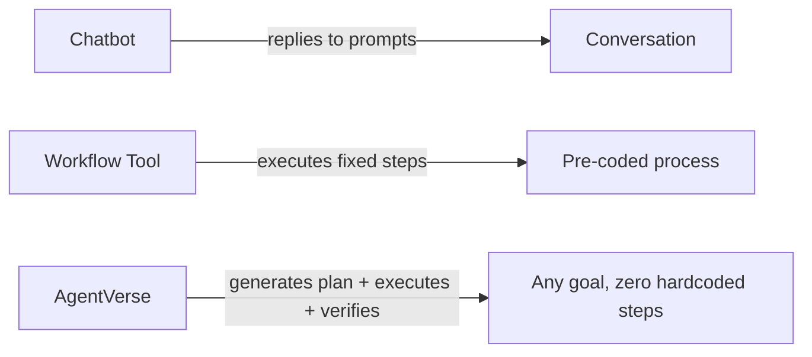
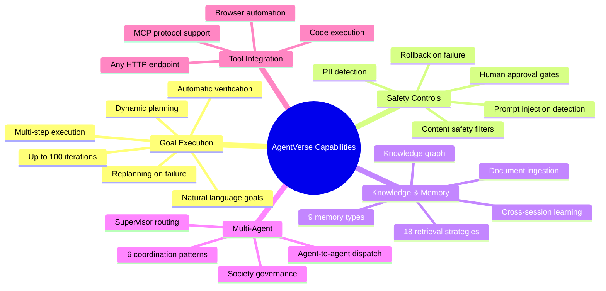
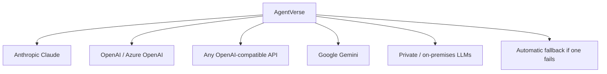
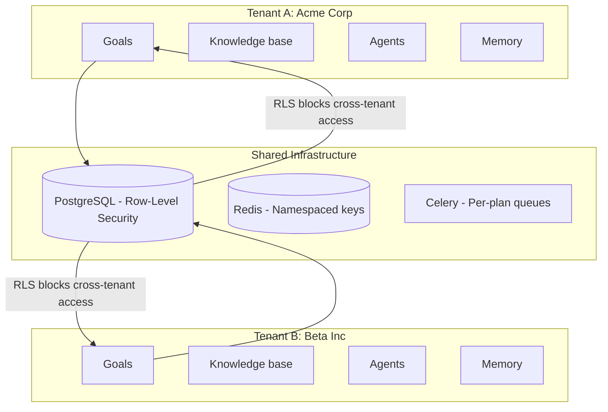
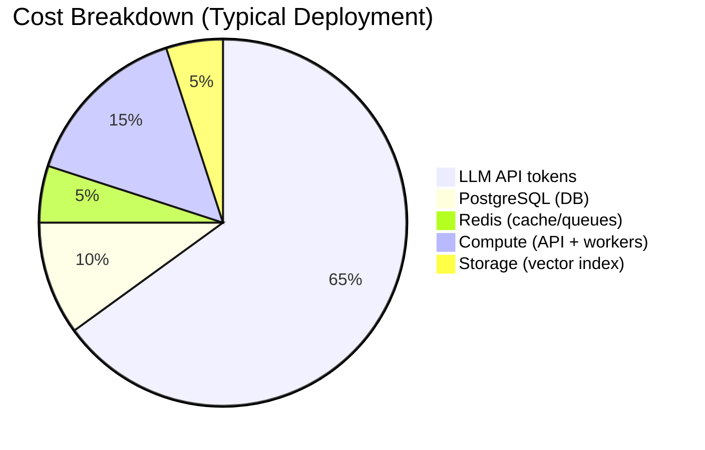
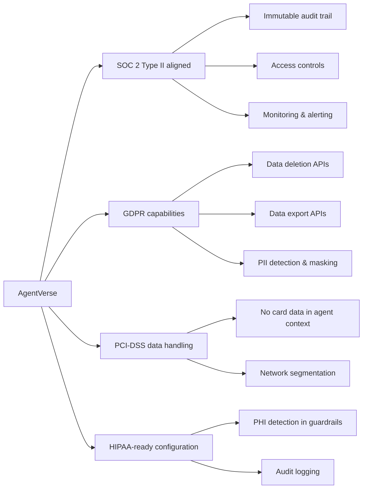

# Executive Guide

> **Audience:** VP Engineering, Director, CTO, and Product leaders who need to understand what AgentVerse is, what it can do, what it costs to operate, and where the risks lie. No code required.

**Repository:** https://github.com/harsh786/agent-verse  
**Date:** August 2026

---

## Table of Contents

1. [What AgentVerse Is — In Plain Language](#1-what-agentverse-is)
2. [Capability Map — What the System Can Do](#2-capability-map)
3. [Multi-Tenant Architecture — How We Serve Many Customers Safely](#3-multi-tenant-architecture)
4. [Technology Investment Thesis](#4-technology-investment-thesis)
5. [Risk Assessment](#5-risk-assessment)
6. [Cost & Scaling Model](#6-cost--scaling-model)
7. [Compliance & Security Posture](#7-compliance--security-posture)
8. [Strategic Roadmap Context](#8-strategic-roadmap-context)
9. [Key Metrics to Track](#9-key-metrics-to-track)
10. [Actionable Recommendations](#10-actionable-recommendations)

---

## 1. What AgentVerse Is

AgentVerse is an **operating system for AI agents** — not a single AI application, but the infrastructure that lets businesses create and run AI agents that autonomously complete complex multi-step tasks.

### The Core Capability in One Sentence

A user submits a goal in plain English ("research our top 10 competitors and summarize their pricing strategies"). AgentVerse creates a plan, executes it by calling real external tools, verifies the results, and delivers the output — without any human involvement unless the task is flagged as risky.

### What Makes It Different

| Traditional AI Tools | AgentVerse |
|---------------------|------------|
| Fixed workflows coded by engineers | Dynamic plans generated from natural language |
| Single AI vendor dependency | Runs on any LLM (Anthropic, OpenAI, or private) |
| Single tenant, no isolation | Multi-tenant with enterprise-grade isolation |
| No audit trail | Complete immutable audit log of every action |
| No safety controls | Built-in content filtering, human-in-the-loop approvals |

### The Business Value

| Use Case | Example |
|----------|---------|
| **Research automation** | Competitive analysis, market research, literature reviews |
| **Software development** | Code review, test generation, documentation |
| **Data processing** | ETL pipelines, report generation, data cleaning |
| **Customer operations** | Ticket routing, response drafting, escalation detection |
| **Security automation** | Audit runs, vulnerability assessment from CI |
| **Browser automation** | Form filling, data extraction, web scraping |

---

## 2. Capability Map

### Core Execution Engine

### Retrieval & Knowledge

AgentVerse can ingest and search:

| Document Type | Source |
|---------------|--------|
| PDFs, DOCX, emails | Direct upload |
| Web pages | Live retrieval |
| Google Drive | Connector |
| SharePoint | Connector |
| Notion | Connector |
| Images (with text) | Vision extraction |
| Audio files | Transcription |
| Video | Scene extraction + transcript |

18 distinct retrieval strategies available, from basic keyword search to advanced multi-hop reasoning across a knowledge graph.

### Model Flexibility

AgentVerse is not locked to any AI provider:

If one provider goes down or raises prices, switch to another with a configuration change — no code changes required.

---

## 3. Multi-Tenant Architecture

AgentVerse is built from the ground up to serve multiple organizations safely from the same deployment.

### Isolation Guarantee

Tenant isolation is enforced at the **database level** using PostgreSQL Row-Level Security — not just application code. This means a software bug cannot leak one tenant's data to another. It's a database-enforced physical barrier.

### Plan Tiers

| Feature | Free | Starter | Professional | Enterprise |
|---------|------|---------|-------------|------------|
| Goals per day | 25 | 100 | 1,000 | 50,000 |
| API requests/min | 60 | 120 | 600 | 10,000 |
| Maximum agents | 3 | 10 | 50 | 1,000 |
| Goal timeout | 1 hour | 2 hours | 8 hours | 24 hours |
| Queue priority | Lowest | Normal | High | Dedicated |
| Knowledge collections | 1 | 10 | 50 | 200 |

Enterprise tenants run on dedicated Celery worker queues — their workloads are never delayed by free-tier traffic.

---

## 4. Technology Investment Thesis

### Why LangGraph (Not a Simpler Approach)

Most AI frameworks force engineers to pre-define exactly what an agent will do. LangGraph allows the agent to determine its own execution path. This is architecturally significant: the same infrastructure can handle tasks the engineering team has never anticipated, because the plan comes from the LLM at runtime.

The investment in LangGraph pays dividends in:
- **Zero incremental engineering** for new task types
- **Checkpointing** — a crashed agent resumes from where it stopped
- **Testability** — the graph structure makes behavior predictable

### Why 18 RAG Strategies

Different knowledge retrieval problems require different strategies. A simple FAQ retrieval (NAIVE) is 10× cheaper than a multi-document reasoning query (MULTI_HOP). Having all strategies as interchangeable units means:
- Tenants can select the right cost/quality trade-off
- The system can auto-select based on query complexity
- New strategies can be added without touching existing ones

### Why Multi-Tenant by Default

Building multi-tenancy in from the start (rather than retrofitting it) is a significant engineering investment that pays off in:
- **Sales velocity** — enterprise deals require data isolation guarantees before signing
- **Operational efficiency** — one deployment serves all customers
- **Security posture** — database-level isolation is auditable and certifiable

---

## 5. Risk Assessment

### Technical Risks

| Risk | Likelihood | Impact | Mitigation |
|------|-----------|--------|------------|
| LLM provider outage | Medium | High | Multi-provider routing; automatic failback |
| LLM cost increase | High | Medium | Provider flexibility; semantic cache reduces calls |
| Prompt injection attacks | Medium | High | Guardrails 2.0 detects and blocks injection patterns |
| PII leakage in outputs | Medium | Very High | PII detection layer; audit trail for forensics |
| Agent takes destructive action | Low | Very High | HITL gates for high-risk operations; rollback engine |
| Tenant data leakage | Very Low | Critical | Database RLS (physical barrier); tested continuously |

### Operational Risks

| Risk | Likelihood | Impact | Mitigation |
|------|-----------|--------|------------|
| Redis outage | Low | High | Sentinel HA; graceful degradation (in-memory fallback) |
| PostgreSQL outage | Low | Critical | Read replicas; connection pooling; automated backups |
| Celery worker saturation | Medium | Medium | Per-plan queues; auto-scaling; queue depth alerts |
| Memory bloat (in-memory goals) | Low | Medium | 1-hour TTL eviction; DB persistence before eviction |

### Agent Behavior Risks

| Risk | How AgentVerse Addresses It |
|------|----------------------------|
| Agent loops indefinitely | Hard cap of 100 iterations per goal |
| Agent takes unauthorized action | Policy engine; HITL approval for high-risk steps |
| Agent produces incorrect output | 7-dimension scoring; self-optimizer suggests corrections |
| Agent leaks secrets | Secret detection in guardrails; sanitization before logging |
| Agent runs malicious code | Sandboxed code execution environment |

### What AgentVerse Cannot Guarantee

- **Correctness of LLM outputs** — the system verifies and scores, but LLMs can hallucinate
- **Real-time performance** — goal execution time depends on LLM latency (typically 2-30 seconds)
- **Deterministic behavior** — same goal may produce different plans across runs (inherent to LLMs)
- **Zero cost** — each goal consumes LLM tokens (see cost model below)

---

## 6. Cost & Scaling Model

### Infrastructure Cost Components

### LLM Token Cost Estimate

A typical 3-step goal with Anthropic Claude:

| Step | Model | Input tokens | Output tokens | Cost (est.) |
|------|-------|-------------|--------------|-------------|
| RAG retrieval | — | — | — | ~$0.0001 |
| Planning | claude-3-5-sonnet | ~2,500 | ~200 | ~$0.003 |
| Execution (×3 steps) | claude-3-5-sonnet | ~1,200 | ~400 | ~$0.004 |
| Verification (×3) | claude-3-haiku | ~800 | ~60 | ~$0.001 |
| **Total** | | | | **~$0.008** |

The semantic cache reduces repeat costs by 20-40% for tenants with similar query patterns.

### Infrastructure Sizing Guide

| Traffic Level | API instances | Celery workers | PostgreSQL | Redis |
|---------------|--------------|----------------|-----------|-------|
| Dev/test | 1 | 1 | 2 vCPU / 4 GB | 1 GB |
| Small (<100 goals/day) | 2 | 2 | 4 vCPU / 8 GB | 2 GB |
| Medium (<1,000 goals/day) | 3 | 8 | 8 vCPU / 32 GB | 4 GB |
| Large (10,000+ goals/day) | 5+ | 20+ | 16+ vCPU / 64+ GB | Sentinel cluster |

### Cost Controls Built In

- **Per-goal budget:** Tenants can set maximum token spend per goal
- **Per-tenant daily budget:** Hard cap on total daily spend
- **Semantic cache:** Identical or similar queries served from cache
- **Model routing:** Simple tasks routed to cheaper models automatically
- **Anthropic prompt caching:** Stable prompt prefixes cached at provider level

---

## 7. Compliance & Security Posture

### Data Handling

| Data Type | Where Stored | Encryption |
|-----------|-------------|-----------|
| API keys | PostgreSQL (hashed) + encrypted vault | AES-256 at rest |
| Goal text | PostgreSQL | TLS in transit, at-rest encryption |
| LLM outputs | PostgreSQL | TLS in transit, at-rest encryption |
| Document chunks | PostgreSQL + pgvector | TLS in transit, at-rest encryption |
| Agent configuration | PostgreSQL | TLS in transit |
| Audit logs | PostgreSQL (append-only) | TLS in transit |

### Standards Coverage

### Security Architecture Highlights

- **No plaintext secrets stored** — all API keys encrypted via `VAULT_MASTER_KEY`
- **Prompt injection detection** — guardrails block attempts to override agent behavior
- **Immutable audit log** — database triggers prevent deletion or modification
- **Legal hold capability** — tenant data can be frozen for legal discovery
- **SIEM integration** — audit events forwarded to Splunk/Datadog/QRadar
- **Scope-based API keys** — keys restricted to specific API endpoints
- **MFA support** — TOTP-based for user accounts
- **SAML 2.0 / OIDC** — enterprise SSO via Keycloak or any SAML IdP
- **SCIM 2.0** — automated user provisioning from enterprise directories

---

## 8. Strategic Roadmap Context

### Current State (Production-Ready)

AgentVerse is a fully functional platform with:
- 1,227 Python source files representing 18+ months of engineering
- 104 database migrations (complete production schema)
- Full test suite with no infrastructure dependencies for unit tests
- Comprehensive observability (logging, metrics, tracing, cost tracking)
- Multi-tenant SaaS-grade isolation

### Where Investment Pays Off Most

**Highest leverage areas:**

1. **Eval-driven improvement loop** — The `EvalRunner` + `SelfOptimizer` system exists to automatically improve agent behavior from failure data. This flywheel compounds: more goals → more eval data → better agent configs → more successful goals. Investing in golden-set evals accelerates this.

2. **RAG quality** — Knowledge retrieval quality directly determines agent output quality. Investing in document ingestion pipelines and knowledge graph construction pays dividends across all use cases.

3. **MCP tool ecosystem** — Every new MCP-compatible tool integration expands what agents can do without any agent code changes. Building or partnering on high-value tools (ERP connectors, analytics platforms, communication tools) is a force multiplier.

4. **Enterprise coordination patterns** — The CAMEL, Swarm, and MOA multi-agent patterns unlock qualitatively different capabilities (consensus-based decisions, creative exploration) that simple single-agent systems cannot match.

### Known Technical Debt

| Area | Current State | Recommended Investment |
|------|--------------|----------------------|
| HITL persistence | In-memory only (lost on restart) | Persist to Redis/DB; medium effort |
| Rollback completeness | Best-effort (not atomic) | Saga pattern; high effort |
| Front-end test coverage | Playwright e2e only | Component test library; medium effort |
| Cost prediction | Post-hoc only | Pre-flight cost estimation; medium effort |

---

## 9. Key Metrics to Track

### Business Health Metrics

| Metric | What It Tells You |
|--------|------------------|
| **Goals submitted / day** | Platform adoption velocity |
| **Goal success rate** | Agent quality and reliability |
| **Goals per tenant** | Engagement depth |
| **p95 goal completion time** | User experience quality |
| **Token cost per successful goal** | Economics per unit of value |
| **Semantic cache hit rate** | Cost efficiency |
| **HITL approval rate** | Agent autonomy vs. safety balance |

### Operational Health Metrics

| Metric | Alert Threshold |
|--------|----------------|
| API error rate | > 1% |
| Goal failure rate | > 10% |
| p99 API latency | > 2 seconds |
| Celery queue depth (enterprise) | > 50 |
| Celery queue depth (free) | > 500 |
| Redis memory usage | > 80% |
| PostgreSQL connection pool | > 90% utilization |
| Circuit breaker open rate | Any provider > 0 |

### Security Metrics

| Metric | Alert Threshold |
|--------|----------------|
| Guardrail violation rate | Spike > 2× baseline |
| Failed auth attempts per tenant | > 100 / hour |
| HITL rejection rate | > 50% (suggests over-permissive policy) |
| Audit log gaps | Any gap (possible tampering) |

---

## 10. Actionable Recommendations

### For Engineering Leadership

**Immediate (0-30 days):**
1. Establish SLO targets: 99.5% availability, p95 goal completion < 30s
2. Instrument the `goal_success_rate` metric in your monitoring dashboard
3. Set up cost alerting at $X/day to prevent runaway token spend

**Short-term (30-90 days):**
4. Build a golden-set eval library (50+ representative goals with expected outcomes) to track quality regressions
5. Deploy Redis Sentinel for HA — single-node Redis is the most likely single point of failure
6. Implement HITL persistence to Redis so restarts don't lose pending approvals

**Medium-term (90-180 days):**
7. Invest in the MCP tool ecosystem — each new tool multiplies platform value without agent code changes
8. Enable the SelfOptimizer feedback loop — feed EvalRunner scores back to improve agent configurations automatically
9. Build tenant-facing cost dashboards so users understand their token spend

### For Product Leadership

- **Position the eval system as a feature**, not just infrastructure. "Your agents get smarter over time" is a differentiable product claim backed by the EvalRunner → SelfOptimizer loop.
- **The 18 RAG strategies are a configuration choice**, not a complexity burden. Expose them as "accuracy vs. speed" sliders in the UI.
- **Human-in-the-Loop is a competitive advantage** for regulated industries. Healthcare, finance, and legal customers will pay a premium for auditable, approvable AI actions.
- **The GitHub Action unlocks a developer-tool go-to-market angle.** Every pull request can trigger an AI-powered review, security scan, or documentation update.

### For Security Leadership

- **Verify the RLS migration** — run `tests/integration/` with real PostgreSQL to confirm tenant isolation holds
- **Rotate `VAULT_MASTER_KEY`** immediately in production if using the default
- **Enable `AuditLogV3`** (hash-chained) for maximum tamper-evidence
- **Connect SIEM adapters** to your existing security tooling (`app/governance/siem_adapters.py`)
- **Review the guardrails configuration** — ensure PII detection is calibrated for your tenants' data types

---

*Last updated: 2026-08-14 · [Wiki Index](../README.md) · [Contributor Guide](contributor-guide.md) · [Staff Engineer Guide](staff-engineer-guide.md)*
