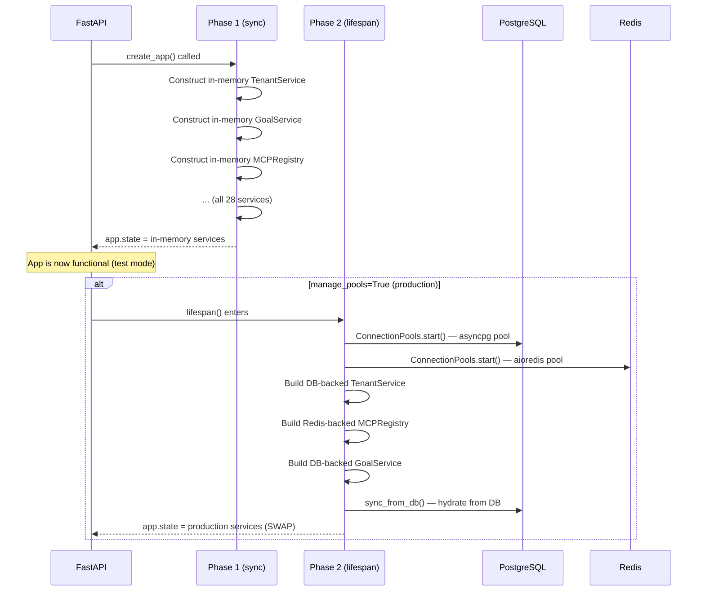
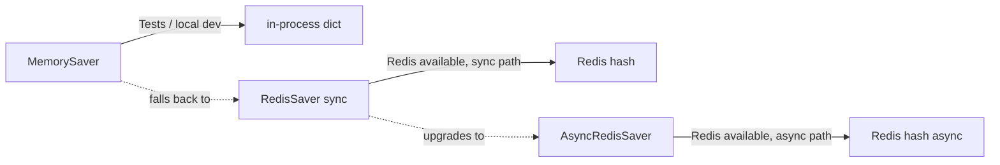
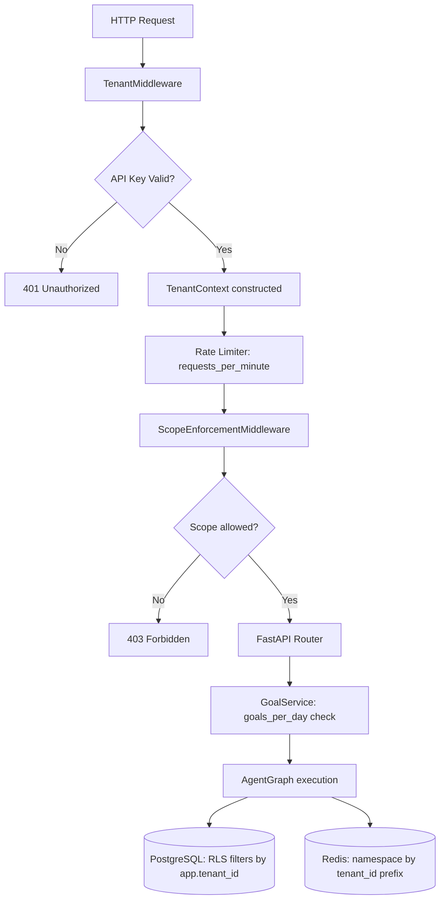
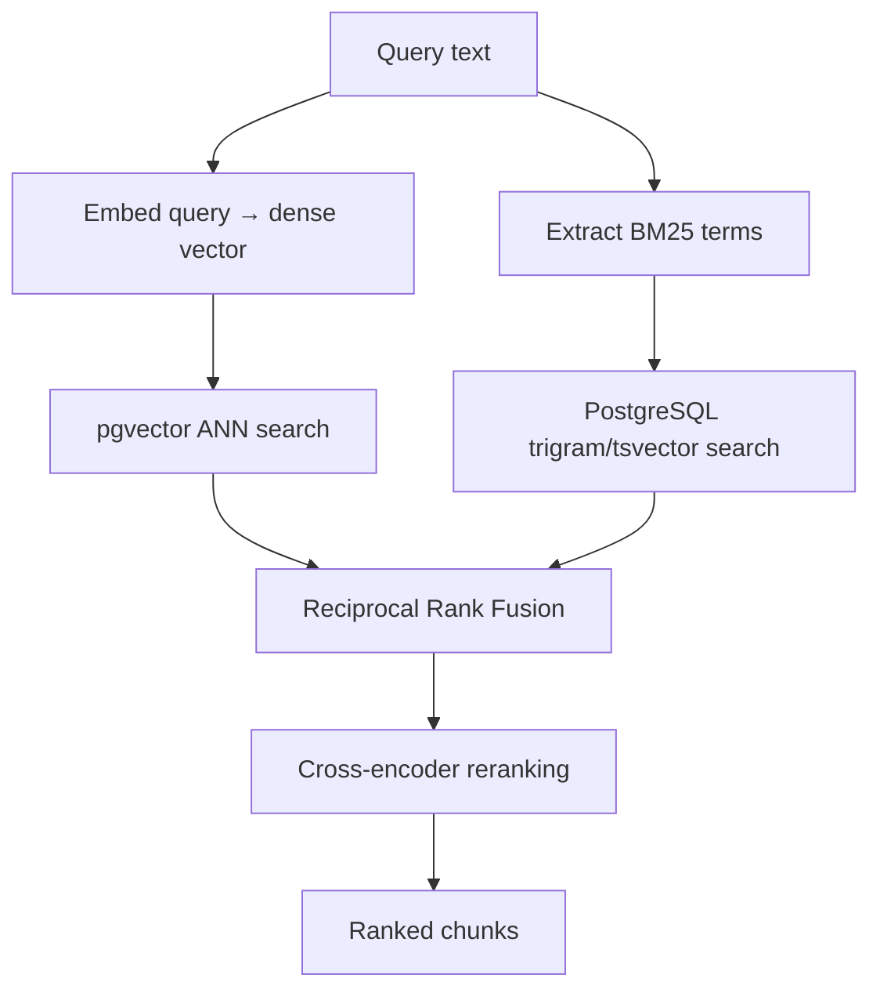
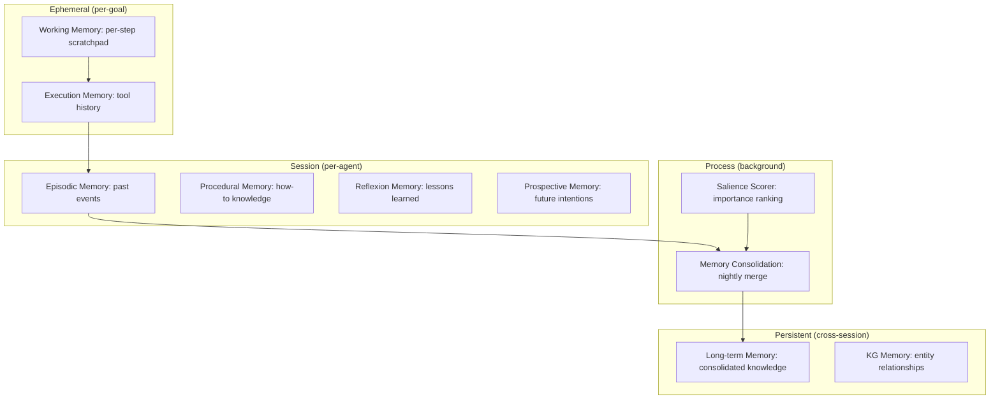
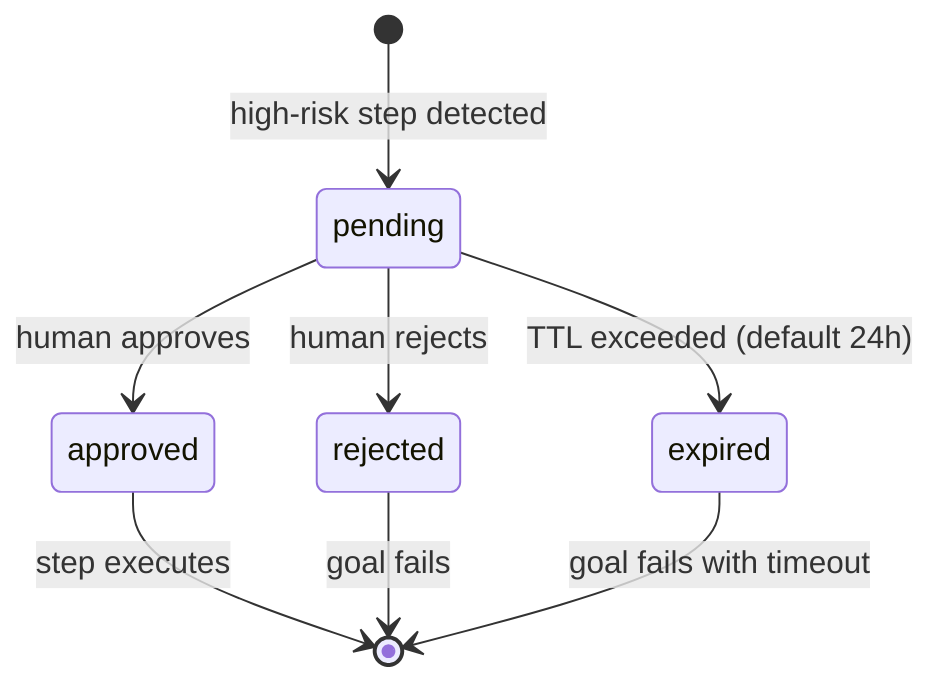
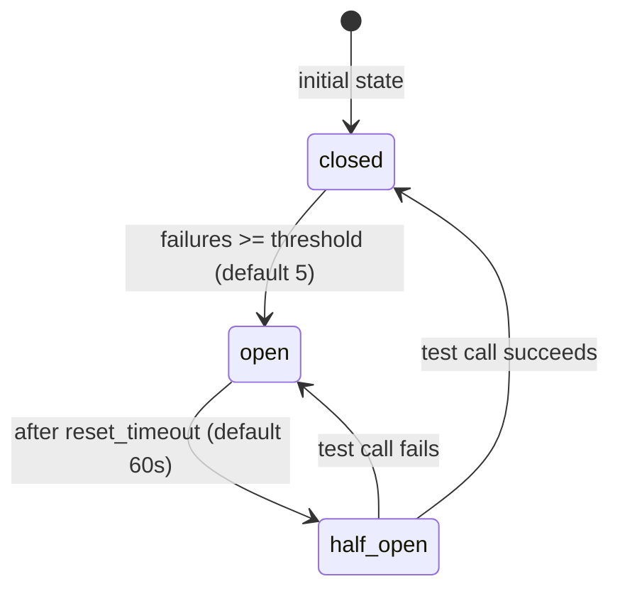
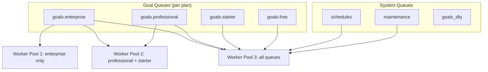
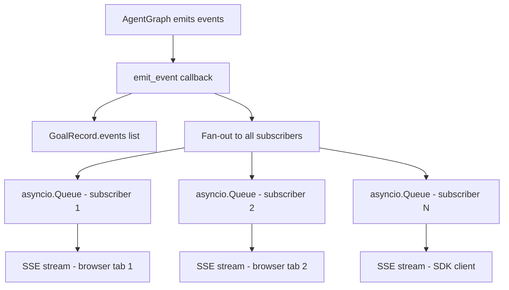
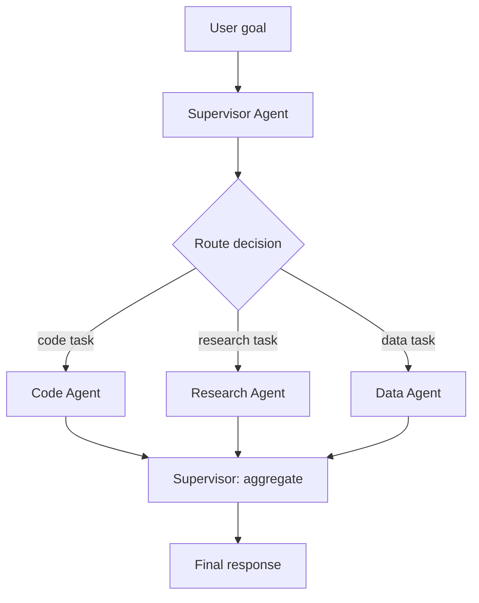

# Staff Engineer Guide

> **Audience:** Staff engineers, principal engineers, and architects who need deep understanding of AgentVerse's design decisions, failure modes, and system invariants. Assumes familiarity with distributed systems, async Python, and LLM architecture.

**Repository:** https://github.com/harsh786/agent-verse  
**Stack:** Python 3.12 · FastAPI · LangGraph · Celery · PostgreSQL+pgvector · Redis

---

## Table of Contents

1. [System Philosophy — Design Principles](#1-system-philosophy)
2. [Two-Phase Service Wiring — The Most Critical Invariant](#2-two-phase-service-wiring)
3. [The LangGraph Execution Model — State, Reducers, Checkpointing](#3-the-langgraph-execution-model)
4. [Multi-Tenancy — Four-Layer Isolation](#4-multi-tenancy--four-layer-isolation)
5. [The Provider Abstraction — Protocol-Based Duck Typing](#5-the-provider-abstraction)
6. [RAG Architecture — Strategy Composition, Not Strategy Selection](#6-rag-architecture)
7. [Memory Architecture — Nine Distinct Cognitive Stores](#7-memory-architecture)
8. [Governance Layer — Audit Immutability, HITL Semantics, Policy Propagation](#8-governance-layer)
9. [Reliability Subsystem — Circuit Breakers, Bulkheads, Rollback](#9-reliability-subsystem)
10. [Celery Queue Design — Per-Plan Isolation](#10-celery-queue-design)
11. [SSE Streaming — Event Fan-out Architecture](#11-sse-streaming)
12. [Database Design — RLS, Connection Pooling, Migration Safety](#12-database-design)
13. [Multi-Agent Patterns — Topology Trade-offs](#13-multi-agent-patterns)
14. [Observability Architecture](#14-observability-architecture)
15. [Known Failure Modes and Mitigations](#15-known-failure-modes-and-mitigations)
16. [Decision Log — Why We Chose X Over Y](#16-decision-log)
17. [Performance Characteristics](#17-performance-characteristics)
18. [Extension Points — Where to Hook In](#18-extension-points)

---

## 1. System Philosophy

AgentVerse is built on three inviolable principles:

### 1.1 Zero Hardcoded Workflows

No part of the system encodes specific task sequences. The Planner LLM generates the plan from the natural language goal. This means the system can handle any goal type without code changes — but it also means correctness depends on LLM quality, which the Verifier and EvalRunner measure.

**Consequence:** Regression testing is fundamentally different. You can't unit-test "does the agent correctly deploy a container" — you test the scaffolding (does replanning trigger on verification failure, does HITL gate high-risk steps, does the rollback engine reverse tool calls). The LLM behavior is tested via golden-set evals (`tests/real_e2e/`).

### 1.2 Tenant Isolation as a Physical Invariant

Tenant isolation is not a software convention — it is enforced at the infrastructure level via PostgreSQL RLS. A bug in application code cannot cross tenant boundaries as long as RLS policies are active. This is a stronger guarantee than per-query `WHERE tenant_id = ?` patterns.

**Consequence:** Any new DB table needs RLS policies. Any raw asyncpg query needs `rls_context()`. This is a hard requirement, not a guideline.

### 1.3 Observability by Default

Every goal produces structured logs, OTEL spans, Prometheus metrics, and an audit trail. This is not optional and not configurable off. The cost of silent failures in an autonomous agent system is too high.

**Consequence:** Adding a new capability means also adding its observability. A new node in the agent graph needs a metric counter and an OTEL span.

---

## 2. Two-Phase Service Wiring

**File:** [`app/main.py`](https://github.com/harsh786/agent-verse/blob/main/agent-verse-backend/app/main.py)

This is the single most important architectural detail. Understanding it prevents most "works in tests, fails in prod" bugs.



### The Swap Semantics

Phase 2 literally replaces the `app.state.*` references. This means any code holding a direct reference to a service at startup (before the lifespan runs) will hold a stale in-memory reference. **Always read services from `request.app.state.*` at request time, never capture them at module import time.**

### Why This Matters for Testing

Tests that build the app without `manage_pools=True` use in-memory services. Integration tests that need DB behavior must explicitly pass `manage_pools=True` and set up testcontainers. This split is intentional:

- **Unit tests** (no infra): Fast, deterministic, no setup. Test logic.
- **Integration tests** (with infra): Slower, test persistence, RLS, and the lifespan swap.

### The Service Dependency Graph

Some services depend on others. The wiring order in `create_app()` is load-bearing:

```
ConnectionPools
    └── TenantService (needs DB pool)
    └── AuditLog (needs DB pool)
    └── CostController (needs Redis pool)
    └── PolicyEngine (needs Redis pub/sub)
    └── MCPRegistry (needs Redis pool)
    └── GoalService (needs: TenantService, AuditLog, HITLGateway, CostController)
    └── KnowledgeStore (needs DB pool + embedding provider)
    └── SemanticCache (needs embedding provider + Redis)
```

If you add a new service, insert it at the correct point in this dependency order.

---

## 3. The LangGraph Execution Model

**File:** [`app/agent/graph.py`](https://github.com/harsh786/agent-verse/blob/main/agent-verse-backend/app/agent/graph.py)

### State as the Single Source of Truth

LangGraph's reducer pattern means nodes should be pure: take state, return updates. The framework merges updates into the running state. This enables:

1. **Reproducibility:** Given the same initial state and LLM responses, the graph always produces the same output.
2. **Resumability:** Any checkpoint can be replayed from an external checkpoint store.
3. **Testability:** You can inject any intermediate state and assert the next node's output.

### GraphState vs AgentState

There are **two** state objects:

```python
class GraphState(TypedDict, total=False):   # LangGraph's state — primitive types
    goal: str
    tenant_ctx: Any
    agent_state: Any          # wraps AgentState
    rag_context: str
    plan: list[str]
    iteration: int
    terminal_reason: str

@dataclass
class AgentState:             # Rich runtime state — full type annotations
    goal: str
    tenant_ctx: TenantContext
    goal_id: str
    status: GoalStatus
    steps: list[StepResult]
    plan: list[str]
    context: dict[str, Any]
```

`GraphState` uses `total=False` (all keys optional) because LangGraph nodes return partial updates. `AgentState` is a rich dataclass that lives inside `GraphState.agent_state`. The separation exists because LangGraph requires `TypedDict` for its state type, but `AgentState` needs dataclass features (defaults, post-init, methods).

### Checkpointing Strategy



The lifespan in `main.py` upgrades the checkpointer:
1. Try `AsyncRedisSaver` (preferred for async agent tasks)
2. Fall back to `RedisSaver` (sync, if async fails)
3. Fall back to `MemorySaver` (no Redis)

A crashed goal can be resumed by calling `AgentGraph.run()` with the same `thread_id` — LangGraph fetches the last checkpoint and continues from where it stopped. **Do not change the `thread_id` between retries.**

### The Execute Node's Tool Call Repair

The Executor LLM sometimes returns malformed JSON for tool calls. The repair logic in [`app/agent/tool_calls.py`](https://github.com/harsh786/agent-verse/blob/main/agent-verse-backend/app/agent/tool_calls.py) handles common LLM mistakes:

- Missing closing braces
- Trailing commas
- Single-quoted strings instead of double-quoted
- Numeric values as strings

`repair_tool_call_arguments()` uses a lenient JSON parser before falling back to structured extraction via the LLM itself. This repair adds latency but prevents the agent from failing on syntactically valid but JSONesque output.

---

## 4. Multi-Tenancy — Four-Layer Isolation



### Layer 1 — TenantMiddleware

Validates API key → constructs `TenantContext` → applies sliding-window rate limiter. All in one middleware pass. The rate limiter uses a Redis sorted set with `ZREMRANGEBYSCORE` + `ZADD` for O(log N) atomic operations.

### Layer 2 — Scope Enforcement

`ScopeEnforcementMiddleware` checks that the API key has the required scope for the endpoint. Scopes are seeded per-tenant by `scope_seeder.py` and stored on the API key record.

### Layer 3 — GoalService Limits

`GoalService` enforces `PlanLimits.goals_per_day` using a Redis counter with 24-hour TTL. The counter is atomic via `INCR` — safe across replicas.

### Layer 4 — PostgreSQL RLS

```sql
-- Policy (simplified, lives in migrations)
CREATE POLICY tenant_isolation ON goals
    USING (tenant_id = current_setting('app.tenant_id'));
```

The `rls_context()` context manager sets `app.tenant_id` as a session-local GUC via `SET LOCAL`. **`SET LOCAL` is transaction-scoped** — it resets automatically when the transaction ends, making cleanup safe even on exceptions.

Critical: The `system_session()` context manager in [`app/db/rls.py`](https://github.com/harsh786/agent-verse/blob/main/agent-verse-backend/app/db/rls.py) bypasses RLS for system-level operations (migrations, maintenance). Never use it in request handlers.

### Plan Tier Enforcement in Celery

The plan tier also determines Celery queue priority. When `GoalService` submits a Celery task, it routes to `PLAN_QUEUE_MAP[tenant.plan]`. Enterprise tenants get a dedicated queue that is never shared with free-tier traffic.

---

## 5. The Provider Abstraction

**File:** [`app/providers/base.py`](https://github.com/harsh786/agent-verse/blob/main/agent-verse-backend/app/providers/base.py)

### Why Protocol (Not ABC)

```python
@runtime_checkable
class LLMProvider(Protocol):
    async def complete(self, request: CompletionRequest) -> CompletionResponse: ...
    async def stream(self, request: CompletionRequest) -> AsyncIterator[str]: ...
```

Using `Protocol` instead of an abstract base class has three advantages:

1. **Zero-cost duck typing.** Any class with the right method signatures satisfies `LLMProvider` without imports or inheritance. This enables third-party providers without SDK changes.
2. **Testability.** `FakeProvider` is just a class with the two methods — no inheritance, no mocks.
3. **Runtime checking.** `isinstance(obj, LLMProvider)` works because `@runtime_checkable`. This is used in service wiring to validate provider instances.

### CompletionRequest Design Decisions

```python
@dataclass
class CompletionRequest:
    messages: list[Message]
    model: str
    system: str | None = None       # separate from messages for Anthropic compat
    tools: list[ToolDefinition] = []
    max_tokens: int = 4096
    temperature: float = 0.0        # 0.0 default for deterministic planning
    response_schema: dict | None = None  # JSON Schema for structured output
    cache_prefix: str | None = None      # Anthropic ephemeral caching
```

- `system` is separated from `messages` because Anthropic's API treats the system prompt as a top-level field, not a message with `role: "system"`. OpenAI-compatible providers receive it as a `system` role message.
- `temperature: 0.0` default — agent planning and verification benefit from determinism.
- `response_schema` — when set, all providers must return valid JSON matching the schema. OpenAI uses `response_format: {type: "json_schema"}`, Anthropic uses tool-use with a structured output tool.

### The Fake Provider

`FakeProvider` is not a mock — it's a real implementation with scripted responses:

```python
class FakeProvider:
    """Deterministic provider that returns scripted responses.
    
    Responses are consumed FIFO. Raises IndexError if no responses left.
    Use FakeProvider(responses=["response 1", "response 2"]) in tests.
    """
```

This makes tests hermetic: no network, no API keys, deterministic output. The cost is that tests must script responses for each LLM call in the execution path.

---

## 6. RAG Architecture

**Directory:** [`app/rag/`](https://github.com/harsh786/agent-verse/blob/main/agent-verse-backend/app/rag/)

### Strategy as a Value, Not a Class

```python
class RAGStrategy(StrEnum):
    NAIVE = "naive"
    HYBRID = "hybrid"
    # ... 16 more
```

RAG strategies are enum values, not class hierarchies. `resolve_rag_strategy()` maps strategy names (including aliases) to the correct implementation module and returns a `RAGExecutor` callable. This design allows:

1. **Runtime strategy selection** — a tenant can change RAG strategy without redeployment
2. **Strategy composition** — `ADAPTIVE` dynamically selects between strategies at query time
3. **A/B testing** — route a % of queries to a new strategy and compare eval scores

### The KnowledgeStore Hybrid Architecture



The RRF fusion formula: `score(d) = Σ 1/(k + rank_i(d))` where k=60. This is implementation-proven to be robust to different scoring scales from dense and sparse retrievers.

### Semantic Cache Design

The `SemanticCache` uses a two-tier lookup:

1. **Exact match** (O(1)): Hash the serialized request → Redis key lookup
2. **Semantic match** (O(log N)): Embed the query → ANN search over cached query embeddings

Cache invalidation is TTL-based (default: 24 hours). Tenant isolation is enforced by prefixing all Redis keys with `tenant_id`. A semantic cache hit saves both LLM tokens and retrieval latency.

### The RAFT Strategy — Why It's Different

RAFT (`app/rag/raft.py`) is unique: it doesn't retrieve at query time. Instead, it generates fine-tuning datasets where:
- "Oracle documents" contain the true answer
- "Distractor documents" are plausible but irrelevant
- The model learns to identify the oracle and ignore distractors

This is used for dataset generation, not live retrieval. The `RAGStrategy.RAFT` enum value triggers dataset export, not retrieval augmentation.

---

## 7. Memory Architecture

**Directory:** [`app/memory/`](https://github.com/harsh786/agent-verse/blob/main/agent-verse-backend/app/memory/)

The nine memory types form a layered cognitive architecture inspired by cognitive science:



### Consolidation and Eviction

The `MemoryConsolidation` Celery task runs nightly. It:
1. Scores all episodic memories by salience (recency × access frequency × goal-relevance)
2. Merges high-salience items into `LongTermMemoryStore`
3. Evicts low-salience episodic memories that haven't been accessed in 30 days

This prevents memory bloat while retaining important learnings. The salience formula is:

```
salience = 0.4 × recency_score + 0.3 × access_frequency + 0.3 × goal_relevance
```

Where `recency_score = exp(-λ × days_since_access)` with λ = 0.1.

### Reflexion Integration

The `ReflexionMemory` and `reflexion_wirer.py` implement the Reflexion paper's core idea: after a failed goal, the agent generates a verbal reflection ("I failed because I didn't check if the file existed before deleting it") and stores it. On the next similar goal, this lesson is injected into the planner context.

The injection point is the `plan` node in the graph:
```python
reflexion_lessons = await reflexion_memory.get_relevant_lessons(goal)
plan_context = f"{rag_context}\n\nLessons from past failures:\n{reflexion_lessons}"
```

---

## 8. Governance Layer

**Directory:** [`app/governance/`](https://github.com/harsh786/agent-verse/blob/main/agent-verse-backend/app/governance/)

### Audit Log Immutability

Three versions, each stronger:

| Version | Immutability Mechanism |
|---------|----------------------|
| `AuditLog` (v1) | In-memory only; production DB uses `BEFORE UPDATE OR DELETE` trigger |
| `AuditLogV2` | Adds SIEM export adapters; same DB immutability |
| `AuditLogV3` | Hash-chained records: each record includes SHA256 of the previous record |

The v3 hash chain means tampering with any historical record is detectable by re-computing the chain. This is SOC2 audit evidence.

### HITL Semantics

The `HITLGateway` is a priority queue of pending approvals, not a persistent store. In the current implementation, pending approvals are lost on restart — they need to be re-triggered.



**HITL Gateway approval flow:**
1. `AgentGraph.verify` node detects high-risk step
2. Creates `ApprovalRequest` in `HITLGateway` 
3. Emits `waiting_human` status via GoalService SSE
4. Graph transitions to `waiting_human` state and pauses
5. Human POSTs to `/api/v1/goals/{goal_id}/approve` or `/reject`
6. `HITLGateway.resolve()` wakes the graph via `asyncio.Event`
7. Graph resumes at the `execute` node

### PolicyEngine Cross-Replica Propagation

Policy changes must propagate immediately to all API replicas:

```python
# app/governance/policies.py
class PolicyEngine:
    def update_policy(self, policy: Policy) -> None:
        self._local_policies[policy.id] = policy
        # Publish to Redis pub/sub — all replicas subscribe
        self._redis.publish("policy_updates", policy.json())
    
    async def _subscribe_loop(self):
        # Background task on each replica
        async for message in self._pubsub.listen():
            policy = Policy.parse_raw(message["data"])
            self._local_policies[policy.id] = policy
```

Policy evaluation is local (in-memory dict lookup) — zero Redis overhead per tool call. Only updates cross the network. This gives P99 < 1ms for policy evaluation.

---

## 9. Reliability Subsystem

**Directory:** [`app/reliability/`](https://github.com/harsh786/agent-verse/blob/main/agent-verse-backend/app/reliability/)

### Circuit Breaker State Machine



Two implementations:
- **`circuit_breaker.py`**: In-memory. State lost on restart. Suitable for single-process.
- **`redis_circuit_breaker.py`**: Redis-backed. State shared across replicas. Production-grade.

The Redis implementation uses atomic Lua scripts to avoid race conditions in state transitions.

### Rollback Engine Design

`RollbackEngine` records all executed tool calls in `AgentState.steps[*].tool_calls`. On failure, it walks the list in reverse and calls the corresponding inverse for each tool that has one.

```python
# app/reliability/tool_inverses.py
TOOL_INVERSES: dict[str, str] = {
    "create_file": "delete_file",
    "write_file": "restore_file",  # requires saved original content
    "run_sql_INSERT": "run_sql_DELETE",
    "send_email": None,  # not reversible
}
```

Tools with `None` inverses log a warning but don't block rollback of other tools. The rollback is best-effort, not atomic — if an inverse tool call fails, it's logged but execution continues to the next inverse.

### Bulkhead Pattern

```python
class Bulkhead:
    """Per-tenant concurrency limiter."""
    
    def __init__(self, max_concurrent: int = 10):
        self._semaphores: dict[str, asyncio.Semaphore] = {}
    
    async def acquire(self, tenant_id: str) -> None:
        sem = self._semaphores.setdefault(
            tenant_id, asyncio.Semaphore(max_concurrent)
        )
        await sem.acquire()
```

The default max concurrent is plan-tier dependent. Free: 2, Starter: 5, Professional: 20, Enterprise: 100. This prevents a single tenant from exhausting asyncio resources and causing latency spikes for others.

---

## 10. Celery Queue Design

**File:** [`app/scaling/celery_app.py`](https://github.com/harsh786/agent-verse/blob/main/agent-verse-backend/app/scaling/celery_app.py)



### Why Per-Plan Queues?

Without queue isolation, a free-tier tenant submitting 1,000 goals would queue-starve enterprise tenants. With isolated queues, you can allocate workers proportionally:

```bash
# Production worker deployment:
# Dedicated enterprise workers
celery -A app.scaling.celery_app worker -Q goals.enterprise -c 8 --hostname=enterprise@%h

# Professional + starter workers  
celery -A app.scaling.celery_app worker -Q goals.professional,goals.starter -c 4 --hostname=pro@%h

# All queues (backup + free tier)
celery -A app.scaling.celery_app worker -Q goals.free,goals.enterprise,goals.professional,goals.starter,schedules,maintenance,goals_dlq -c 2 --hostname=general@%h
```

### Redis Sentinel Support

```python
def _build_celery_broker_url() -> str:
    if _SENTINEL_URLS:
        # Celery Sentinel format: sentinel://[:password@]host1;host2/db
        nodes = ";".join(entry.strip() for entry in _SENTINEL_URLS.split(","))
        return f"sentinel://{auth}{nodes}/{db}"
    return REDIS_URL
```

Sentinel provides Redis HA without manual failover. The `master_name` is passed via `broker_transport_options` rather than the URL because Celery only reads it from transport options.

---

## 11. SSE Streaming — Event Fan-out Architecture

**File:** [`app/services/goal_service.py`](https://github.com/harsh786/agent-verse/blob/main/agent-verse-backend/app/services/goal_service.py)

### Per-Goal Queue Topology



Each subscriber gets its own `asyncio.Queue`. The `GoalRecord` holds a list of subscriber queues. When the agent emits an event, `goal_service.emit_event()` appends to `GoalRecord.events` and then iterates all subscriber queues with `queue.put_nowait()`.

### Late Subscriber Handling

A client that connects after events have been emitted receives the full event history:

```python
async def stream_goal_events(goal_id: str):
    record = goal_service.get_goal(goal_id)
    
    # Replay buffered events first
    for event in record.events:
        yield format_sse(event)
    
    # If terminal, close immediately  
    if record.status in TERMINAL_STATUSES:
        return
    
    # Subscribe for new events
    queue = asyncio.Queue()
    record.subscribers.append(queue)
    try:
        while True:
            event = await queue.get()
            if event is None:  # sentinel
                return
            yield format_sse(event)
    finally:
        record.subscribers.remove(queue)
```

### Memory Management

Completed goals are evicted from in-memory cache after `_COMPLETED_GOAL_TTL_SECONDS` (1 hour). A background Celery task runs the eviction loop at `_EVICTION_INTERVAL_SECONDS` (60 seconds). Events are also persisted to the `goal_events` DB table before eviction so they can be queried via the REST API.

---

## 12. Database Design

**Directory:** [`app/db/`](https://github.com/harsh786/agent-verse/blob/main/agent-verse-backend/app/db/)

### RLS Deep Dive

```sql
-- The RLS context is set per-transaction via SET LOCAL
-- This means it auto-resets when the transaction ends — no cleanup code needed
-- Source: app/db/rls.py

SELECT set_config('app.tenant_id', $1, true);
-- true = local (transaction-scoped)
-- false = session-scoped (NEVER use this — leaks across connections in pool)
```

**Critical:** `set_config('app.tenant_id', ..., true)` with `true` means the setting is **local to the current transaction**. Using `false` would be session-scoped and would leak across connection pool reuse.

### Migration Safety for Large Tables

With 104 migrations, schema evolution must be safe for large tables. The pattern:

```sql
-- UNSAFE: Locks the whole table
ALTER TABLE goals ADD COLUMN new_field TEXT NOT NULL DEFAULT 'default';

-- SAFE: Three-phase migration
-- Phase 1 (0099): Add nullable column
ALTER TABLE goals ADD COLUMN new_field TEXT;

-- Phase 2 (0100): Backfill asynchronously (separate Celery task)
UPDATE goals SET new_field = 'default' WHERE new_field IS NULL;

-- Phase 3 (0101): Add NOT NULL constraint
ALTER TABLE goals ALTER COLUMN new_field SET NOT NULL;
```

Indexes on large tables use `CREATE INDEX CONCURRENTLY` (no lock).

### asyncpg Pool Sizing

```python
# app/core/config.py
db_pool_max: int = 20    # max asyncpg connections
db_pool_min: int = 5     # min asyncpg connections (always ready)
db_pool_size: int = 10   # SQLAlchemy pool size
db_max_overflow: int = 5  # SQLAlchemy overflow
```

The asyncpg pool is sized at `2 × CPU + spindles` as a starting point. For the typical 4-CPU API server: 9 connections. Add more for Celery workers. Monitor `pg_stat_activity` to tune.

### Model Table Inventory

The 20+ SQLAlchemy models in `app/db/models/`:

| Model file | Tables |
|------------|--------|
| `tenant.py` | `tenants`, `api_keys` |
| `agent.py` | `agents`, `agent_configs` |
| `goal.py` | `goals`, `goal_events` |
| `governance.py` | `audit_log`, `hitl_requests`, `policies` |
| `knowledge.py` | `knowledge_collections`, `chunks` |
| `memory.py` | `execution_memory`, `long_term_memory`, `episodic_memory` |
| `mcp.py` | `mcp_servers`, `mcp_oauth_states` |
| `auth.py` | `users`, `mfa_devices`, `sessions` |
| `scheduling.py` | `triggers`, `trigger_runs` |
| `raft.py` | `raft_datasets`, `raft_examples` |
| `skill.py` | `skills`, `skill_versions` |
| `workflow.py` | `workflows`, `workflow_runs` |

---

## 13. Multi-Agent Patterns — Topology Trade-offs

**Directory:** [`app/coordination/`](https://github.com/harsh786/agent-verse/blob/main/agent-verse-backend/app/coordination/)

### Pattern Comparison Matrix

| Pattern | Topology | Latency | Cost | Best For |
|---------|----------|---------|------|----------|
| **Single agent** | 1 agent | Lowest | Lowest | Simple tasks |
| **Supervisor** | 1 router + N specialists | Medium | Medium | Task decomposition |
| **CAMEL** | 2 agents (role-play) | Medium | Medium | Creative collaboration |
| **Debate** | N agents + 1 judge | High | High | Controversial decisions |
| **Consensus** | N agents + voting | High | High | High-stakes decisions |
| **Swarm** | N agents (emergent) | Variable | High | Exploration tasks |
| **MOA** | N generators + 1 synthesizer | High | Very High | Maximum quality |
| **Auction** | N bidders + 1 auctioneer | Low overhead | Medium | Load balancing |
| **MAGENTIC** | Dynamic routing | Low | Medium | Heterogeneous agents |

### The Supervisor Pattern (Most Common)



The supervisor uses `app/agent/router.py` to determine which specialized agent to route each sub-task to. Routing is based on agent capability descriptions stored in `AgentStore`.

### A2A vs Coordination Patterns

**A2A (Civilization dispatch):** Agents operate in separate tenant-scoped goal contexts. Communication via signed HTTP messages. W3C traceparent propagated. Use for: agents that need full autonomy and independent audit trails.

**Coordination patterns:** Agents share a single goal context and coordinate via shared state or a facilitator agent. Use for: tightly coupled workflows where agents need to reference each other's intermediate results.

---

## 14. Observability Architecture

**Directory:** [`app/observability/`](https://github.com/harsh786/agent-verse/blob/main/agent-verse-backend/app/observability/)

### Structured Logging

Every log entry includes:
```json
{
  "timestamp": "2026-08-14T10:00:00Z",
  "level": "INFO",
  "logger": "app.agent.graph",
  "message": "plan_created",
  "tenant_id": "t_abc123",
  "goal_id": "g_def456",
  "request_id": "req_789",
  "iteration": 1,
  "step_count": 4
}
```

The `request_id` is set by `TenantMiddleware` and propagated via context vars. Log correlation across services uses this field.

### OTEL Span Hierarchy

```
HTTP request span (root)
  └── tenant_middleware span
  └── goal_service.submit span
      └── agent_graph.run span
          ├── initialize_node span
          ├── rag_retrieval span
          │   └── knowledge_store.search span
          ├── plan_node span
          │   └── llm.complete span (provider: anthropic, model: claude-3-5-sonnet)
          ├── execute_node span
          │   ├── llm.complete span
          │   └── mcp.tool_call span (tool: search_web)
          └── verify_node span
              └── llm.complete span
```

All spans include `tenant_id` and `goal_id` as span attributes for cross-service filtering.

### Cost Breakdown

`cost_breakdown.py` records per-goal, per-LLM-call token costs:

```json
{
  "goal_id": "g_def456",
  "total_cost_usd": 0.0045,
  "breakdown": [
    {"call": "plan_node", "model": "claude-3-5-sonnet", "input_tokens": 2300, "output_tokens": 180, "cost": 0.0025},
    {"call": "execute_node", "model": "claude-3-5-sonnet", "input_tokens": 1200, "output_tokens": 350, "cost": 0.0015},
    {"call": "verify_node", "model": "claude-3-haiku", "input_tokens": 800, "output_tokens": 50, "cost": 0.0005}
  ]
}
```

This drives the cost dashboard in the frontend and feeds into `CostController` budget enforcement.

---

## 15. Known Failure Modes and Mitigations

### FM-1: Agent Stuck in Infinite Replan Loop

**Cause:** Verifier consistently marks steps as failed even when they succeed (hallucination, calibration issue).

**Mitigation:** `_DEFAULT_MAX_ITERATIONS = 100` in `graph.py`. After 100 iterations, the graph terminates with `terminal_reason = "max_iterations_exceeded"`. The EvalRunner scores this as a failure, feeding the SelfOptimizer.

**Tuning:** Reduce `max_iterations` for free-tier tenants via plan limits; increase for enterprise via custom agent config.

### FM-2: MCP Server Unresponsive

**Cause:** External tool server times out or returns errors.

**Mitigation sequence:**
1. Per-call timeout in `MCPClient` (default: 30s)
2. Circuit breaker opens after 5 consecutive failures
3. Tool call marked `StepStatus.FAILED`
4. Verifier sees failed tool call → triggers replan
5. Planner may choose alternative approach or different tool

**If all MCP servers fail:** `AgentGraph` emits `GoalStatus.FAILED` with `"all tool providers unavailable"`.

### FM-3: LLM Provider Rate Limit

**Cause:** Provider returns 429 Too Many Requests.

**Mitigation:**
1. `call_with_circuit_breaker()` in `app/providers/circuit_breaker.py` retries with exponential backoff (3 retries, 1s/2s/4s)
2. After retries exhausted, `AI Router` tries next provider in health policy
3. If all providers rate-limited, goal fails with `"provider rate limit"` error

### FM-4: HITL Approval Queue Memory Growth

**Cause:** Many goals waiting for human approval with no approvers active.

**Mitigation:** 24-hour TTL on approval requests. Expired approvals fail the goal with `"hitl_timeout"`. Monitor `hitl_queue_depth` Prometheus metric and alert when > 100.

### FM-5: Redis Connection Pool Exhaustion

**Cause:** Celery workers + API replicas exhaust the Redis connection pool.

**Mitigation:** 
- API: `asyncio` event loop shares connections via connection pool (not per-request)
- Celery: `redis_max_connections` per worker config
- Sentinel: automatic failover if Redis primary fails

**Detection:** `redis_pool_exhausted_total` counter alert.

### FM-6: PostgreSQL RLS Bypass via Raw asyncpg

**Cause:** Code using raw asyncpg connection without `rls_context()` bypasses all tenant isolation.

**Mitigation:** 
- Code review policy: any `asyncpg.Connection` use requires `rls_context()` review
- `system_session()` is the only legitimate bypass and is restricted to maintenance
- Integration tests run with RLS enabled and verify cross-tenant isolation

### FM-7: LangGraph Checkpoint Deserialization Failure

**Cause:** `AgentState` dataclass fields changed between deployments while live checkpoints exist.

**Mitigation:**
- Checkpoints use Python `dataclasses` serialization — adding optional fields with defaults is backward compatible
- Removing fields requires a migration step
- Deploy with `manage_pools=True` disabled first (clears Redis checkpoints), then enable

---

## 16. Decision Log — Why We Chose X Over Y

### D-1: LangGraph over Hand-Written FSM

**Decision:** Use LangGraph for the agent execution loop.  
**Alternatives considered:** Custom FSM, workflow engine (Temporal, Prefect), chaining library (LangChain).  
**Rationale:** LangGraph provides checkpointing, state reducers, and graph visualization out of the box. A hand-written FSM would need to re-implement these. Temporal/Prefect introduce operational overhead (separate server). LangChain's chain abstraction doesn't expose the graph structure needed for HITL and replan routing.  
**Trade-off:** LangGraph's `TypedDict` state constraint requires the `GraphState` vs `AgentState` dual-state design.

### D-2: Protocol over ABC for LLMProvider

**Decision:** `LLMProvider` as a `Protocol`, not an abstract base class.  
**Rationale:** Third-party provider integrations should not require importing from `app.providers.base`. Protocol enables duck-typing, reducing coupling. `FakeProvider` requires zero inheritance.  
**Trade-off:** IDE autocompletion less helpful for Protocol-satisfying classes (no explicit `@abstractmethod` warnings).

### D-3: PostgreSQL RLS over Application-Level Tenant Filtering

**Decision:** PostgreSQL Row-Level Security for tenant isolation.  
**Alternatives considered:** Application-level `WHERE tenant_id = ?` in every query.  
**Rationale:** Application-level filtering is fragile — a single forgotten `WHERE` clause leaks data. RLS is a database-enforced invariant. Even a compromised application server cannot bypass it.  
**Trade-off:** RLS requires `SET LOCAL` on every transaction, adding ~0.1ms latency per query. Required reading of migration files for RLS policy changes.

### D-4: Per-Plan Celery Queues over Priority Queues

**Decision:** Separate Celery queues per plan tier.  
**Alternatives considered:** Single queue with priority flags, Celery priority queues.  
**Rationale:** Celery's built-in priority queues use a single broker queue with priority headers — a high-priority item waits behind low-priority items already being processed. Separate queues allow allocating dedicated workers, guaranteeing isolation. Also enables different worker configs per tier (GPU workers for enterprise, CPU-only for free).  
**Trade-off:** More queues to manage, more worker configurations.

### D-5: Two-Phase Service Initialization

**Decision:** Two-phase service wiring in `create_app()`.  
**Rationale:** Tests must run without infrastructure. Production needs DB/Redis-backed services. A single factory function that conditionally builds the right services keeps test/prod code aligned. Dependency injection frameworks (like FastAPI's `Depends()`) were considered but add indirection that makes the startup sequence harder to reason about.  
**Trade-off:** The swap semantics require careful ordering and `app.state.*` reads at request time.

### D-6: SSE over WebSocket for Goal Streaming

**Decision:** Server-Sent Events for goal execution streaming.  
**Alternatives considered:** WebSocket, polling.  
**Rationale:** Goal streaming is unidirectional (server → client). SSE is simpler than WebSocket for this case: no upgrade handshake, automatic reconnection, native browser support. WebSocket is used for collaborative editing (`/api/v1/collab`) where bidirectional communication is required.  
**Trade-off:** SSE has no binary frame support. All events are JSON text.

---

## 17. Performance Characteristics

### Latency Budget for a Typical Goal

```
HTTP request processing     ~2ms
TenantMiddleware auth        ~3ms (Redis lookup)
Goal submission              ~5ms
Celery task dispatch         ~10ms (Redis RPUSH)
AgentGraph initialize        ~5ms
RAG retrieval                ~50-150ms (pgvector ANN)
Planner LLM call             ~500-2000ms (depends on model, context)
Per-step LLM call            ~300-1500ms
Per-step tool call           ~100-5000ms (external service)
Verifier LLM call            ~200-800ms
Total (simple 3-step goal)   ~2-8 seconds
```

### Scaling Bottlenecks

1. **LLM API latency** — the dominant cost. Mitigated by: semantic cache, model routing (cheap model for simple tasks), Anthropic ephemeral caching (`cache_prefix` in `CompletionRequest`).

2. **pgvector ANN search** — ~50ms for 100k vectors. Mitigated by: HNSW index (much faster than IVFFlat for small collections), tenant-scoped indexes (smaller search space), knowledge collection caching.

3. **asyncio event loop blocking** — Celery CPU-bound tasks (embedding, chunking) run in separate worker processes. API handles only I/O.

4. **GoalService in-memory fan-out** — O(N×E) where N = subscribers and E = events. Mitigated by: subscriber limit per goal, TTL eviction of completed goals.

### Horizontal Scaling Notes

- **API replicas**: Stateless. Load balance with any strategy. Session affinity not required (SSE reconnects via history replay).
- **Celery workers**: Scale independently per queue. `--autoscale=10,2` for dynamic worker allocation.
- **PostgreSQL**: Vertical scale first (pgvector benefits from RAM for index caching). Horizontal: read replicas for analytics queries, PgBouncer for connection pooling.
- **Redis**: Sentinel for HA. Cluster for >10k goals/day. The MCPRegistry and rate limiter use Redis — shard by tenant prefix for cluster compatibility.

---

## 18. Extension Points — Where to Hook In

### Adding a New RAG Strategy

1. Add enum value to `RAGStrategy` in [`app/rag/contracts.py`](https://github.com/harsh786/agent-verse/blob/main/agent-verse-backend/app/rag/contracts.py)
2. Implement `RAGExecutor` protocol (see contracts.py for the interface)
3. Register in `app/rag/catalogue.py`
4. Add observability: `rag_trace.py` trace emission, `metrics.py` counter

### Adding a New LLM Provider

1. Implement the `LLMProvider` protocol in `app/providers/new_provider.py`
2. Register in `app/providers/vault.py` resolver (key check → provider instantiation)
3. Add to `_FALLBACK_ORDER` in `app/embedding/orchestrator.py` if it supports embeddings

### Adding a New Agent Pattern

1. Create `app/agent/patterns/new_pattern.py` implementing the pattern
2. Register in `app/agent/pattern_config.py`
3. Wire the API router in `app/api/coordination_new_pattern.py`
4. Add `pattern_trace.py` emission for observability

### Adding a New Memory Type

1. Create `app/memory/new_type.py` implementing the memory interface
2. Add DB model in `app/db/models/memory.py`
3. Create Alembic migration
4. Inject into `AgentGraph` context assembly in the `initialize` node

### Adding a New Governance Policy

1. Define policy schema in `app/governance/policy_rules.py`
2. Add evaluation logic to `PolicyEngine.evaluate()` in `app/governance/policies.py`
3. Add to `compliance_bundles.py` if it maps to a compliance standard

---

## Quick Reference for Staff Engineers

```bash
# Inspect live Celery queue depths
celery -A app.scaling.celery_app inspect reserved
celery -A app.scaling.celery_app inspect active_queues

# Check circuit breaker state (Redis-backed)
redis-cli HGETALL "cb:state:<provider_name>"

# Verify RLS is active
psql $DATABASE_URL -c "SELECT current_setting('app.tenant_id');"

# Check LangGraph checkpoint for a goal
redis-cli GET "langgraph:checkpoint:<thread_id>"

# Flush semantic cache (careful!)
redis-cli --scan --pattern "semantic_cache:*" | xargs redis-cli DEL

# Run specific test with full output
uv run pytest tests/agent/test_graph.py::test_name -s -v

# Profile a slow endpoint
uv run python -m cProfile -o profile.out -m uvicorn app.main:app
python -m pstats profile.out

# Check mypy strict errors
uv run mypy app --strict --ignore-missing-imports
```

---

*Last updated: 2026-08-14 · [Wiki Index](../README.md) · [Contributor Guide](contributor-guide.md) · [Executive Guide](executive-guide.md)*
