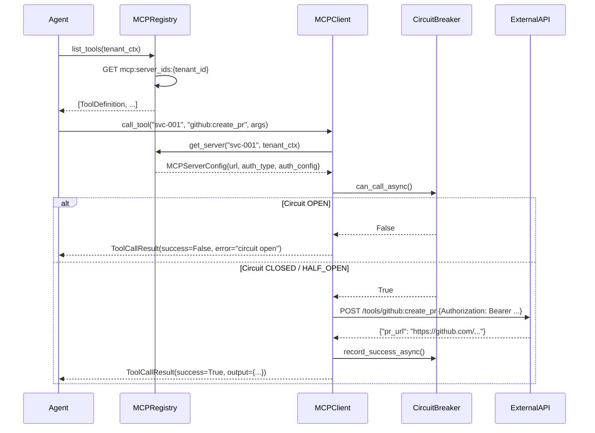
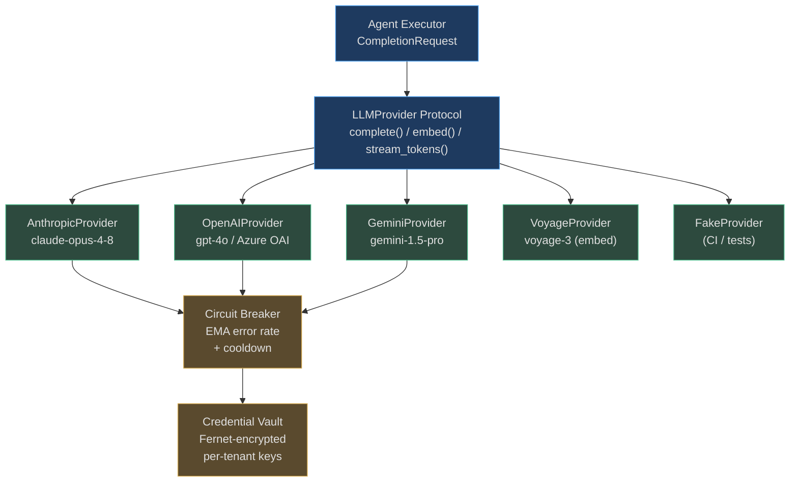

# MCP & Provider Abstraction

<!-- Sources: app/mcp/registry.py, app/mcp/client.py, app/mcp/oauth.py,
             app/providers/base.py, app/providers/vault.py -->

Two abstractions make the agent loop provider-agnostic:

1. **MCP (Model Context Protocol)** — a universal HTTP protocol so agents can
   call any external tool without bespoke connector code.
2. **LLMProvider protocol** — a structural duck-type interface so the same
   planner/executor/verifier code works with any LLM vendor.

Together, they mean you can swap tools and models without touching agent logic.

---

## MCP: Model Context Protocol

### What MCP Is

MCP is an open HTTP standard for AI tool access.  Instead of writing a custom
GitHub connector, a custom Jira connector, and a custom Salesforce connector,
every external service exposes the same two endpoints:

```
GET  /tools          → list of ToolDefinition objects (name, description, input_schema)
POST /tools/{name}   → execute one tool, return structured output
```

The agent calls `MCPClient.call_tool(server_id, tool_name, arguments)` and the
HTTP details are invisible to the agent logic.  Builtin servers (code interpreter,
file system, web search) bypass HTTP and dispatch to Python callables via a
process-local handler registry.

### MCPRegistry — Per-Tenant Tool Catalog

```python
# app/mcp/registry.py
class MCPRegistry:
    """Per-tenant registry of MCP servers stored in Redis.
    
    Redis keys:
      mcp:servers:{tenant_id}:{server_id}  → JSON-encoded MCPServerConfig
      mcp:server_ids:{tenant_id}           → Redis set of server_id strings
    """
```

Key design decisions:

| Decision | Rationale |
|----------|-----------|
| Stored in Redis, not in-memory | Allows no-restart register/unregister and survives worker restarts |
| Per-tenant namespace | Tenant A cannot see or call Tenant B's servers |
| Server UUIDs, not names | Allows same-name servers in different tenants |
| `builtin_handler` excluded from JSON | Process-local callables cannot be serialized; re-registered at startup |

**Auth types supported:** `bearer`, `api_key`, `oauth_ac`, `oauth_cc`, `pkce`, `basic`, `custom_header`, `mtls`, `hmac`, `none`

**Server status lifecycle:** `ACTIVE → DRAINING → UNHEALTHY → REMOVED`

**Transport types:** `http` (default), `ws` / `websocket`

### MCPClient — Tool Call Execution

`MCPClient` is the HTTP layer that takes a registered `MCPServerConfig` and
actually makes tool calls.

```python
# app/mcp/client.py
@dataclass
class ToolDefinition:
    name: str
    description: str
    input_schema: dict[str, Any]
    server_id: str = ""
    server_name: str = ""

@dataclass
class ToolCallResult:
    tool_name: str
    success: bool
    output: Any = None
    error: str = ""
    server_id: str = ""
```

**Tool execution flow:**

1. Agent calls `call_tool(server_id, "github:create_pr", {"title": "...", "branch": "..."})`
2. `MCPClient` looks up `MCPServerConfig` from `MCPRegistry`
3. If `builtin_handler` is registered → dispatch to Python callable (no HTTP)
4. Otherwise → `POST {base_url}/tools/{tool_name}` with auth headers injected
5. SSRF guard validates URL is not an internal host before making the call
6. Circuit breaker checked before call; failure recorded after
7. Returns `ToolCallResult(success=True/False, output=...)`

**SSRF protection:**  `assert_public_url()` from `app.net.ssrf_guard` is called
on every tool URL before the HTTP request is made, blocking calls to `169.254.x.x`,
`10.x.x.x`, `172.16-31.x.x`, and `127.x.x.x` ranges.

### OAuth / PKCE Flows

External connectors that require OAuth use the `OAuthFlowManager`:

```python
# app/mcp/oauth.py
@dataclass
class OAuthState:
    server_id: str
    state_token: str        # secrets.token_urlsafe(32) — CSRF protection
    code_verifier: str      # secrets.token_urlsafe(64) — PKCE
    created_at: float

    @property
    def code_challenge(self) -> str:
        digest = hashlib.sha256(self.code_verifier.encode()).digest()
        return base64.urlsafe_b64encode(digest).rstrip(b"=").decode()
```

PKCE flow:
1. `initiate_flow(server_id, redirect_uri)` → generates `state_token` + `code_verifier`, stores in `_pending_flows` dict (TTL 10 minutes)
2. User redirected to IdP with `code_challenge` (SHA-256 of verifier)
3. IdP redirects back to `/auth/mcp/callback?code=...&state=...`
4. `complete_flow(state_token, code)` → validates state, exchanges code for token using `code_verifier`
5. `OAuthToken` stored in `_tokens[(tenant_id, server_id)]`; encrypted via vault if available

### Mermaid: Agent → Tool Call Pipeline



---

## Provider Abstraction

### LLMProvider Protocol

Every LLM vendor implements the same structural protocol — no inheritance
required. This means third-party wrappers or custom models can be dropped in
without any base-class changes:

```python
# app/providers/base.py
@runtime_checkable
class LLMProvider(Protocol):
    async def complete(self, request: CompletionRequest) -> CompletionResponse: ...
    async def stream_tokens(
        self,
        request: CompletionRequest,
        on_token: Callable[[str], Awaitable[None]],
    ) -> CompletionResponse: ...
    # Optional — providers that don't support embedding raise NotImplementedError
    async def embed(self, request: EmbedRequest) -> EmbedResponse: ...
```

**Key request/response types:**

```python
@dataclass
class CompletionRequest:
    messages: list[Message]          # chat history
    model: str                       # e.g. "claude-opus-4-8"
    system: str | None = None        # system prompt (injected separately for Anthropic)
    tools: list[ToolDefinition] = [] # MCP tool schemas for function calling
    max_tokens: int = 4096
    temperature: float = 0.0
    response_schema: dict | None = None  # JSON Schema for structured output
    cache_prefix: str | None = None      # Anthropic ephemeral cache key

@dataclass
class CompletionResponse:
    content: str
    model: str
    input_tokens: int = 0
    output_tokens: int = 0
    tool_calls: list[dict] = []
    stop_reason: str = "end_turn"    # "tool_use" when the model called a tool

    @property
    def total_tokens(self) -> int:
        return self.input_tokens + self.output_tokens
```

### Supported Providers

| Provider | Module | Notes |
|----------|--------|-------|
| Anthropic | `anthropic_provider.py` | Claude 3.x/4.x, ephemeral prompt caching |
| OpenAI | `openai_compatible.py` | GPT-4o, structured output, function calling |
| Azure OpenAI | `openai_compatible.py` | Same client, `azure_endpoint` param |
| Voyage AI | `voyage_provider.py` | Embedding only; `voyage-3` and `voyage-3-lite` |
| Gemini | `gemini_provider.py` | Gemini 1.5 Pro / Flash via Google AI SDK |
| Local / Ollama | `openai_compatible.py` | OpenAI-compatible endpoint at `http://localhost:11434` |
| **FakeProvider** | `fake_provider.py` | Deterministic test/CI fallback; no API key required |

### FakeProvider — The Test Foundation

Every unit and integration test that doesn't need real LLM calls uses
`FakeProvider`. It returns predictable responses immediately, costs nothing,
and enables full test coverage:

```python
class FakeProvider:
    """Returns deterministic completions without hitting any LLM API.
    
    - Recognizes tool calls from message content patterns
    - Always succeeds (configurable to fail for error path testing)
    - Returns 10 input tokens, 5 output tokens for cost tracking tests
    """
    async def complete(self, request: CompletionRequest) -> CompletionResponse:
        return CompletionResponse(
            content="Done.",
            model="fake-model",
            input_tokens=10,
            output_tokens=5,
        )
```

### Provider Credential Vault

In production, provider credentials are encrypted at rest in `app/providers/vault.py`.
The vault uses Fernet symmetric encryption; keys are loaded from `VAULT_KEY` env var.

```
# Format of a connector secret reference
connector_secret://provider_name/key_name
# Example
connector_secret://anthropic/api_key
```

`is_connector_secret_ref(value)` detects this format; `resolve_connector_secret_ref(ref, vault)`
decrypts and returns the actual key. Per-tenant keys are stored separately from
platform defaults, so different tenants can use different Anthropic API keys
(e.g., enterprise tenants with their own billing account).

### Mermaid: Provider Abstraction Stack



---

## Real-World Examples

### RWE 1: Enterprise Migrating to Anthropic for Legal Reasoning

**Context:** A 500-person legal tech company runs document summarisation at
50,000 requests/day. Their startup tier used OpenAI GPT-4o. After a trial, their
legal team found Claude Opus produced 23% fewer hallucinated case citations.

**Implementation:**

1. Admin sets `ANTHROPIC_API_KEY` in tenant vault:
   ```http
   PUT /api/v1/tenants/providers
   {"provider": "anthropic", "api_key": "sk-ant-..."}
   ```
2. `ModelOrchestrator` routes `AgentRole.PLANNER` requests to `AnthropicProvider`
3. Zero changes to agent code — the same `CompletionRequest` struct works for both
4. Token cost logging now uses Anthropic's pricing in `app/governance/cost.py`

**Outcome:** Legal citation accuracy +23%, with no code changes to the agent loop.

---

### RWE 2: Zero-Cost CI Pipeline Using FakeProvider

**Context:** A 20-engineer startup runs 600 unit tests per CI commit. Before
`FakeProvider`, every test that touched the agent executor hit the Anthropic API.
At $0.015/1K tokens × 10K tokens/test × 600 tests/commit × 30 commits/day =
**$2,700/day in CI costs**.

**Implementation:**

```python
# conftest.py
@pytest.fixture
def fake_provider():
    return FakeProvider()

@pytest.fixture
def agent(fake_provider):
    return AgentGraph(provider=fake_provider, ...)
```

**Outcome:** CI cost → $0. Test suite runs in 4 minutes (vs 45 minutes waiting
for real API responses with rate limiting). All 600 tests pass deterministically.

---

### RWE 3: Adding a Private LLM via OpenAI-Compatible Endpoint

**Context:** A financial services firm cannot send customer data to external
APIs. They run a self-hosted Llama 3 70B via Ollama on internal GPU hardware.

**Implementation:**

```bash
# .env (or tenant vault)
OPENAI_API_KEY=local-key-ignored
OPENAI_API_BASE=http://gpu-cluster.internal:11434/v1
```

The `OpenAICompatibleProvider` uses the configured `base_url` and ignores the
`sk-...` format check. The `SSRFGuard` is bypassed for internal trusted addresses
configured in `SSRF_ALLOWLIST_CIDRS`.

**Outcome:** 100% on-premise. Zero data leaves the firm's network. Full audit
log of every LLM call via `app/governance/audit.py`.

---

### RWE 2: Enterprise with On-Premise Internal Tooling — Zero Agent Code Changes

**Context:** An enterprise deploys AgentVerse alongside three on-premise internal
tools: JIRA Data Center (v9.x, VPN-only), Confluence Data Center, and a private
GitLab instance. All three use custom OAuth2 flows incompatible with cloud-hosted
credential managers.

**Implementation:** The platform team registers 3 custom MCP servers (one per tool),
each a Python FastAPI microservice implementing `/tools` and `/tools/{name}` MCP
endpoints with PKCE OAuth flows. They call `MCPRegistry.register_server()` once per
server at startup — configs are stored in Redis under
`mcp:servers:{tenant_id}:{server_id}`. Agents discover all 3 tools automatically via
`MCPRegistry.list_tools()`, scoped per tenant. When the team later adds a 4th MCP
server (internal Slack), zero agent code changes are required — the new server is
registered and immediately available to all future goals.

**Outcome:** The previous JIRA integration required 1,800 lines of custom connector
code; the MCP equivalent is 120 lines. The PKCE `oauth.py` flow handles token refresh
every 45 minutes automatically. All 4 tool servers process ~8,000 tool calls/day
with P99 latency of 340ms — well within the agent loop's 2-second tool timeout.

**Real-World Example 3 — AI Startup Switching LLM Providers**

> A Series A AI startup uses Anthropic Claude as their primary provider. When Anthropic announces a 48-hour maintenance window, they configure `FakeProvider` to serve deterministic responses during the window, then switch to OpenAI as a fallback via the `LLMProvider` abstraction — all in a 5-line config change. After the maintenance window, they switch back to Claude without any code changes. Total downtime for end-users: 0 seconds. The `FakeProvider` also runs in all 847 CI test cases, meaning zero API costs and 100% test determinism.
