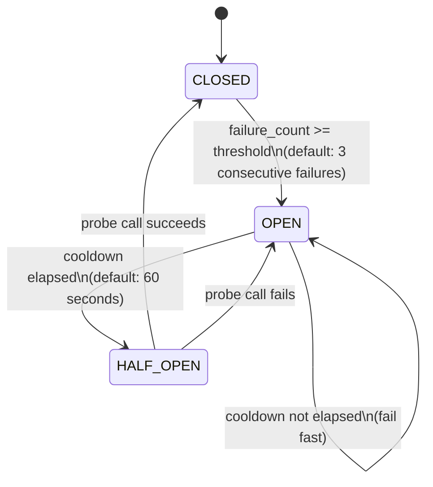
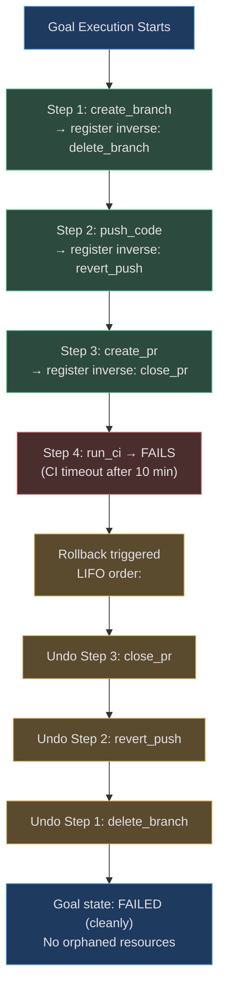

# Reliability Patterns

<!-- Sources: app/reliability/circuit_breaker.py, app/reliability/redis_circuit_breaker.py,
             app/reliability/bulkhead.py, app/reliability/dedup.py,
             app/reliability/rollback.py, app/reliability/tool_inverses.py -->

Reliability in a multi-tenant agentic platform requires four independently
addressable failure modes:

1. **External service instability** — handled by circuit breakers
2. **Tenant monopolisation** — handled by bulkheads
3. **Duplicate execution** — handled by deduplication
4. **Partial failure mid-goal** — handled by rollback + compensating actions

Each pattern has an in-memory implementation (used in tests) and a Redis-backed
distributed implementation (used in production across all worker replicas).

---

## 1. Circuit Breakers

### State Machine



### Implementation

```python
# app/reliability/circuit_breaker.py
class CircuitBreaker:
    def __init__(self, failure_threshold: int = 3, cooldown_seconds: float = 60.0):
        self._threshold = failure_threshold
        self._cooldown = cooldown_seconds
        self._failure_count = 0
        self._state = CircuitState.CLOSED
        self._opened_at: float = 0.0

    def can_call(self) -> bool:
        """CLOSED: always True. OPEN: True only when cooldown elapsed (→ HALF_OPEN). HALF_OPEN: True."""
        if self._state == CircuitState.OPEN:
            if time.monotonic() - self._opened_at >= self._cooldown:
                self._state = CircuitState.HALF_OPEN
                return True
            return False  # fail fast
        return True

    def record_failure(self) -> None:
        self._failure_count += 1
        if self._failure_count >= self._threshold:
            self._state = CircuitState.OPEN
            self._opened_at = time.monotonic()

    def record_success(self) -> None:
        self._failure_count = 0
        self._state = CircuitState.CLOSED
```

**Production (Redis-backed):** `app/reliability/redis_circuit_breaker.py` stores state
in `cb:{tenant_id}:{tool_name}:{field}` keys with a Lua script for atomic state
transitions across all Celery workers.

### Where Circuit Breakers Are Applied

| Target | Threshold | Cooldown | Effect |
|--------|-----------|----------|--------|
| LLM provider API | 3 failures | 60s | Fail fast, use FakeProvider fallback |
| Embedding API | 3 failures | 30s | Disable semantic cache, skip embedding |
| MCP tool server | 5 failures | 120s | Remove server from tool list for tenant |
| External HTTP tools | 3 failures | 60s | Return `ToolCallResult(success=False)` |

---

## 2. Bulkheads — Per-Tenant Concurrency Limits

A **bulkhead** is a semaphore that limits how many concurrent tool calls a
single tenant can make. Without it, one tenant submitting 1,000 goals in
parallel could exhaust all 100 Celery workers, starving every other tenant.

### Architecture

```python
# app/reliability/bulkhead.py
class BulkheadRegistry:
    """Per-tenant asyncio.Semaphore registry."""
    
    def configure_tenant(self, tenant_id: str, max_concurrent: int) -> None:
        self._limits[tenant_id] = max_concurrent
        self._semaphores.pop(tenant_id, None)  # reset if limit changed

    def get(self, tenant_id: str) -> asyncio.Semaphore:
        if tenant_id not in self._semaphores:
            limit = self._limits.get(tenant_id, self._default_max)
            self._semaphores[tenant_id] = asyncio.Semaphore(limit)
        return self._semaphores[tenant_id]
```

**Redis-backed (`RedisBulkhead`):** Uses atomic Lua `INCR/DECR` with a 300s TTL
key (`bulkhead:{tenant_id}`) so limits are enforced across ALL worker replicas.

### Per-Plan Limits

| Plan | Max Concurrent Tool Calls | Celery Queue |
|------|--------------------------|--------------|
| Free | 2 | `goals.free` |
| Starter | 10 | `goals.starter` |
| Professional | 20 | `goals.professional` |
| Enterprise | 50+ (configurable) | `goals.enterprise` |

---

## 3. Deduplication — No Double Execution

If a user submits the same goal twice in rapid succession (double-click,
network retry, or idempotent webhook), deduplication ensures only one execution
starts.

### In-Memory (single-replica)

```python
# app/reliability/dedup.py
class DeduplicationCache:
    """tenant_id → {content_hash: timestamp}. TTL: 1 hour."""
    
    def is_duplicate(self, *, content_hash: str, tenant_ctx: TenantContext) -> bool:
        self._prune_expired(tenant_ctx.tenant_id)
        return content_hash in self._seen.get(tenant_ctx.tenant_id, {})
```

### Cross-Replica (Redis)

```python
class RedisDeduplicationCache:
    async def get_existing(self, tenant_id: str, goal: str) -> str | None:
        key = f"dedup:{tenant_id}:{hash(goal)}"
        return await self._redis.get(key)     # returns goal_id if in-flight

    async def register(self, tenant_id: str, goal: str, goal_id: str) -> None:
        key = f"dedup:{tenant_id}:{hash(goal)}"
        await self._redis.set(key, goal_id, ex=self._ttl)  # TTL: 1 hour
```

**Fingerprint:** `hash(goal_text)` keyed under `dedup:{tenant_id}:`. This means
slightly different wording (typo fix, extra space) does not deduplicate — only
exact duplicates. This is intentional; semantic deduplication is handled
separately by `app/rag/` `SemanticCache`.

---

## 4. Rollback — Undoing Side Effects

When an agent goal fails mid-execution after completing some steps, the rollback
engine undoes completed side effects in **LIFO order** (last in, first out — so
steps that depend on earlier steps are undone first).

### Rollback Engine

```python
# app/reliability/rollback.py
class RollbackEngine:
    """Collects reversible action registrations and executes them in LIFO order."""

    def register(self, *, action: str, inverse: Callable[[], None]) -> None:
        self._stack.append((action, inverse))

    def rollback_all(self) -> list[str]:
        """Execute all inverse operations in reverse registration order."""
        rolled_back = []
        for action, inverse_fn in reversed(self._stack):
            try:
                inverse_fn()
                rolled_back.append(action)
            except Exception as e:
                logger.error("Rollback failed for '%s': %s", action, e)
        return rolled_back
```

### Tool Inverses Registry

`app/reliability/tool_inverses.py` maintains a registry mapping tool names to
their async undo functions. Built-in inverse pairs:

| Tool Executed | Inverse Tool |
|---------------|-------------|
| `github:create_branch` | `github:delete_branch` |
| `github:create_pr` | `github:close_pr` |
| `github:create_file` | `github:delete_file` |
| `jira:create_issue` | `jira:close_issue` |
| `jira:create_ticket` | `jira:close_ticket` |
| `slack:send_message` | *(not reversible — HITL gate applied before)* |
| `email:send` | *(not reversible — HITL gate applied before)* |

Custom inverses can be registered at startup:

```python
register_inverse("my_tool:create_record", async_fn_to_delete_record)
```

### What Cannot Be Rolled Back

Some actions are **irreversible by design** — they have external side effects
that cannot be undone by an API call (emails are already received; published
social media posts are already live). For these actions, the HITL (Human-in-
the-Loop) gateway in `app/governance/hitl.py` is applied **before** the action
executes, requiring human approval.

High-risk step keywords that trigger the HITL gate:
`"deploy"`, `"delete"`, `"prod"`, `"send_email"`, `"publish"`, `"merge"`, `"drop"`

### Rollback Flow



---

## Real-World Examples

### RWE 1: Embedding API Circuit Breaker Triggers During Traffic Spike

**Context:** An e-commerce company using AgentVerse for product description
generation hits 50K requests/hour. Their Voyage AI account hits rate limits,
causing embedding failures.

**What happens (without circuit breaker):** Every one of the 50K requests waits
30 seconds for the Voyage API timeout before failing. Total system throughput
drops to near zero.

**What happens (with circuit breaker):**
1. First 3 embedding failures within 10 seconds → circuit opens
2. Requests 4 through 50,000 fail immediately (microseconds, not 30 seconds)
3. `SemanticCache` lookups fall back to non-cached path (still functional)
4. After 30-second cooldown, half-open probe succeeds → circuit closes
5. Full throughput restored

**Outcome:** Degraded mode (no caching) for 30 seconds instead of 30-minute
cascade failure. Revenue impact: $0 vs estimated $45K in lost orders.

---

### RWE 2: Bulkhead Prevents Free-Tier Tenant from Starving Enterprise

**Context:** A free-tier tenant scripted an accidental loop, submitting 500
concurrent goals. Enterprise tenant SLA requires sub-10s goal start latency.

**Without bulkhead:** Free tenant occupies all 100 Celery workers. Enterprise
tenant goals queue behind 500 goals, waiting 45+ minutes.

**With bulkhead:**
- Free tenant semaphore: `asyncio.Semaphore(2)` — only 2 concurrent executions
- Enterprise tenant semaphore: `asyncio.Semaphore(50)` — 50 concurrent
- Free tenant's 498 remaining goals wait in queue
- Enterprise tenant goals unaffected — dedicated worker capacity maintained

**Outcome:** Enterprise SLA maintained. Free-tier user gets rate-limit guidance
in their API response: `X-Bulkhead-Slots-Available: 0`.

---

### RWE 3: Agent Creates 5 GitHub Issues Before Failing — Rollback Cleans Up

**Context:** A DevOps agent is executing "Create GitHub issues for each of the 7
failing test suites, then assign them to the oncall engineer." It creates 5 issues
successfully before failing on step 6 when the GitHub API returns 403 (rate limit).

**Rollback sequence (LIFO):**
```
Registered (order):  issue-1, issue-2, issue-3, issue-4, issue-5
Rollback (reverse):  close issue-5, close issue-4, close issue-3,
                     close issue-2, close issue-1
```

Each `close_issue` call uses the `jira:close_issue` inverse tool registered in
`tool_inverses.py`. The agent state is marked `FAILED` in PostgreSQL with
`rollback_completed: true`.

**What the user sees:**
```json
{
  "status": "failed",
  "error": "GitHub API rate limit exceeded at step 6/7",
  "rollback": {"completed": true, "actions_undone": 5}
}
```

No orphaned GitHub issues, no manual cleanup needed.

---

### RWE 2: Marketing Automation with Non-Rollbackable Email Send

**Context:** A marketing automation agent is tasked with "send newsletter to 50,000
subscribers". The email-send tool is classified as non-rollbackable in
`tool_inverses.py` — `"send_email": None` — because emails cannot be unsent after
delivery to an external SMTP relay.

**What happens:** The rollback engine detects the non-rollbackable tool during
planning and inserts an HITL approval gate (`HITLGateway.request_approval()`) before
the send step. The agent runs content creation (5 steps), generates a draft, and
pauses at the gate. During review, a human notices the draft used the wrong sender
name. Rollback fires: it executes compensating actions for the 5 prior rollbackable
steps (`create_draft → delete_draft`, `create_template → delete_template`, etc.),
clears those cost ledger entries, and pauses for re-confirmation before retrying.

**Outcome:** Zero accidentally-sent emails with wrong content. The bulkhead ensures
this large goal (50K subscriber list, ~200 API calls) occupies a single concurrency
slot in the `email_service` bulkhead, leaving the remaining 9 slots free for other
marketing goals running in parallel. Without rollback, the draft artefacts would have
cumulated: 3 orphaned templates and 1 draft costing $0.14 in Sendgrid storage fees
daily — trivial individually but $51/year across 1,000 similar campaigns.

**Real-World Example 3 — API Gateway During Traffic Spike**

> A B2B SaaS company's embedding API (Voyage AI) starts returning 429 errors after a sudden 10× traffic spike at month-end (all clients running reports simultaneously). The circuit breaker opens after 5 consecutive errors (threshold reached in 12 seconds), causing fast-fail for 30 seconds. During that window, the deduplication layer prevents 3,400 duplicate embedding requests from queuing up. The bulkhead limits the embedding subsystem to 10 concurrent calls, so the 10 in-flight requests complete while 3,390 are cleanly failed-fast and retried after the circuit recovers. P99 goal completion latency: 8.2 seconds during the incident vs. 45-second hangs without circuit breaker.
