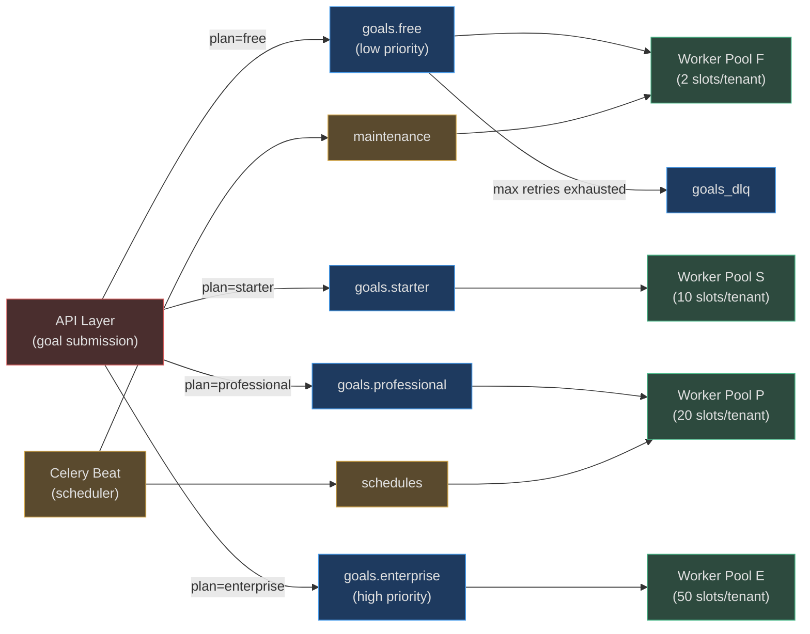
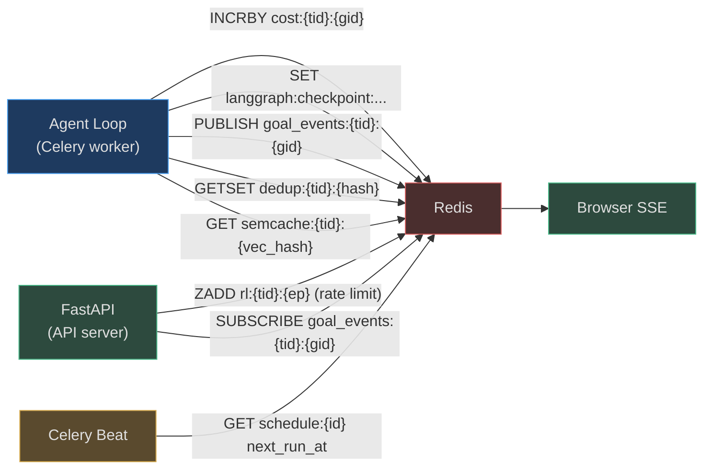

# Celery, PostgreSQL & Redis

<!-- Sources: app/scaling/celery_app.py, app/scaling/tasks.py,
             app/db/session.py, app/db/rls.py,
             app/tenancy/rate_limiter.py, app/tenancy/middleware.py -->

These three infrastructure components form the durable execution backbone.
Together they guarantee that:

- A goal started on worker-1 survives worker-1 crashing mid-execution
- A frontend SSE stream receives goal events even when the goal runs on a
  different replica than the one the browser is connected to
- Cost tracking is accurate to the cent across 100 concurrent workers
- Per-tenant row-level security is enforced at the PostgreSQL layer, not just
  in application code

---

## Celery Queue Architecture

### Four Plan Queues

`app/scaling/celery_app.py` defines a **per-plan queue topology** that prevents
high-volume free-tier workloads from degrading enterprise tenant experience:

```
goals.free        →  free-tier goals     (2 concurrent per tenant)
goals.starter     →  starter goals       (10 concurrent per tenant)
goals.professional →  pro goals          (20 concurrent per tenant)
goals.enterprise  →  enterprise goals    (50+ concurrent per tenant)
goals_dlq         →  dead letter queue   (for manual inspection / retry)
schedules         →  cron/interval jobs  (Celery Beat)
maintenance       →  health checks, cleanup, GDPR export, stuck-goal detection
```

The `PLAN_QUEUE_MAP` constant links plan name to queue name:

```python
# app/scaling/celery_app.py
PLAN_QUEUE_MAP = {
    "free": "goals.free",
    "starter": "goals.starter",
    "professional": "goals.professional",
    "enterprise": "goals.enterprise",
}
```

At goal submission time, `CeleryGoalTaskQueue.submit()` calls
`apply_async(queue=PLAN_QUEUE_MAP[tenant.plan])` to route the task.

### Queue Architecture Diagram



### Worker Configuration

```python
celery_app.conf.update(
    task_acks_late=True,              # ACK only after task completes (not on delivery)
    task_reject_on_worker_lost=True,  # Re-queue on worker crash
    worker_prefetch_multiplier=1,     # Take 1 task at a time (prevents monopolisation)
    worker_max_tasks_per_child=100,   # Restart worker every 100 tasks (memory guard)
    worker_max_memory_per_child=500_000,  # 500 MB per child process
    task_default_retry_delay=30,      # 30s between retries
)
```

`task_acks_late=True` is the key durability setting: a task is acknowledged
only after successful completion. If a worker dies mid-task, the message
returns to the queue and a different worker picks it up.

### Beat Schedule (Maintenance Tasks)

```python
beat_schedule = {
    "fire-due-schedules":       {"task": "fire_due_schedules",    "schedule": 30},  # every 30s
    "mcp-health-check":         {"task": "check_mcp_health",      "schedule": 120},
    "record-queue-depths":      {"task": "record_queue_depths",   "schedule": 60},
    "detect-stuck-goals":       {"task": "detect_stuck_goals",    "schedule": 300},
    "retention-policy":         {"task": "execute_retention_policy", "schedule": 3600},
    "expire-hitl-approvals":    {"task": "expire_hitl_approvals", "schedule": 600},
}
```

### Graceful Shutdown

`app/scaling/tasks.py` installs a `SIGTERM` handler at import time:

```python
def _setup_sigterm() -> None:
    def _handler(sig, frame):
        logger.warning("SIGTERM received — Celery worker shutting down; "
                       "LangGraph checkpoint written after last completed step")
        raise SystemExit(0)
    signal.signal(signal.SIGTERM, _handler)
```

LangGraph writes a checkpoint after every completed step, so the last durable
state is always safe when the process exits.

---

## PostgreSQL + pgvector

### Schema Overview

PostgreSQL stores all durable state. The models directory
(`app/db/models/`) has one file per domain:

| Model File | Tables | Key Columns |
|------------|--------|-------------|
| `tenant.py` | `tenants` | `id`, `plan`, `api_key_hash`, `rpm_limit`, `created_at` |
| `goal.py` | `goals`, `goal_steps` | `id`, `tenant_id`, `status`, `agent_id`, `result`, `created_at` |
| `agent.py` | `agents`, `agent_versions` | `id`, `tenant_id`, `name`, `system_prompt`, `tools` |
| `knowledge.py` | `knowledge_chunks` | `id`, `tenant_id`, `embedding` (vector), `content`, `metadata` |
| `memory.py` | `execution_memories`, `long_term_memories` | `id`, `goal_id`, `tenant_id`, `content` |
| `audit.py` | `audit_log` | `id`, `tenant_id`, `action`, `actor`, `payload`, `created_at` |
| `schedule.py` | `schedules` | `id`, `tenant_id`, `cron_expression`, `next_run_at` |
| `mcp_server.py` | `mcp_servers` | `id`, `tenant_id`, `name`, `auth_type`, `config` |

### pgvector for Semantic Search

`knowledge_chunks.embedding` is a `VECTOR(1024)` column (Voyage voyage-3
dimensions). The HNSW index allows approximate nearest-neighbour search at
sub-10ms latency for 100M vectors:

```sql
CREATE INDEX ON knowledge_chunks USING hnsw (embedding vector_cosine_ops)
WITH (m = 16, ef_construction = 64);
```

Similarity queries via SQLAlchemy:

```python
from pgvector.sqlalchemy import Vector
similarity = func.cosine_similarity(KnowledgeChunk.embedding, query_embedding)
```

### SQLAlchemy 2 Async + asyncpg

```python
# app/db/session.py
def _make_engine(database_url: str | None = None) -> AsyncEngine:
    return create_async_engine(
        url,
        pool_pre_ping=True,
        pool_size=10,           # persistent connections in pool
        max_overflow=20,        # burst connections (up to 30 total)
        pool_timeout=30,        # wait up to 30s for a connection
        pool_recycle=1800,      # recycle connections every 30 min
        connect_args={"statement_cache_size": 0},  # required for PgBouncer
    )
```

The `statement_cache_size=0` setting disables asyncpg's prepared statement
cache, which is required when running behind PgBouncer in transaction mode.

**Connection pool formula:**
```
Optimal pool_size = (2 × vCPUs) + disk_spindles
# For 4-vCPU instance with SSD: pool_size=9, max_overflow=11
# For 16-vCPU instance with SSD: pool_size=33, max_overflow=17
```

### Row-Level Security (RLS)

Multi-tenant isolation is enforced at the PostgreSQL layer, not just in
application code. Even a SQL injection bug cannot return other tenants' data
because the database itself enforces the filter.

```python
# app/db/rls.py
@asynccontextmanager
async def sqlalchemy_rls_context(
    session: AsyncSession, tenant_id: str
) -> AsyncIterator[AsyncSession]:
    """Set app.tenant_id RLS variable — transaction-scoped."""
    await session.execute(
        text("SELECT set_config('app.tenant_id', :tid, true)"),
        {"tid": tenant_id}
    )
    yield session
    # SET LOCAL auto-resets when transaction ends
```

The corresponding PostgreSQL RLS policy:

```sql
-- Applied to every tenant-scoped table
CREATE POLICY tenant_isolation ON goals
    USING (tenant_id = current_setting('app.tenant_id', true)::uuid);
ALTER TABLE goals ENABLE ROW LEVEL SECURITY;
```

System-level maintenance (data retention, stuck-goal detection) bypasses RLS
using `system_session()` which sets `app.tenant_id` to an empty string that
matches a special admin bypass in the policy.

---

## Redis Usage Patterns

Redis serves six distinct roles in AgentVerse. Each role uses a separate key
namespace to prevent collisions.

### 1. LangGraph Checkpointer — Agent State Durability

```
key: langgraph:checkpoints:{thread_id}:{checkpoint_id}
ttl: 7 days
value: JSON-serialised AgentState (plan, steps, tool_call_history)
```

The `AsyncRedisSaver` checkpointer (from `langgraph-checkpoint-redis`) writes a
checkpoint after **every completed step**. If a Celery worker dies mid-goal,
the next worker picks up the task and restores from the last checkpoint.

### 2. Cost Tracking — Real-Time Per-Tenant Budgets

```
key: cost:{tenant_id}:{goal_id}
value: token count × unit_price (integer cents)
cmd: INCRBY cost:{tenant_id}:{goal_id} {tokens_used_this_call}
```

All 100 Celery workers read/write to the same Redis keys atomically. This
gives cross-replica accuracy without any database transaction. When the sum
exceeds the tenant's budget, the goal is terminated by `app/governance/cost.py`.

### 3. Policy Propagation — Cross-Replica Tool Policies

```
channel: policies:{tenant_id}
value: JSON-serialised PolicyUpdate
```

When an admin updates a tool policy (e.g., "block all GitHub write operations
for tenant X"), the change is published to a Redis pub/sub channel. All worker
replicas subscribed to that channel update their in-memory policy cache
immediately — no polling, no restart required.

### 4. SSE Fan-Out — Goal Events to Every Browser Tab

```
channel: goal_events:{tenant_id}:{goal_id}
value: JSON-serialised GoalEvent {type, step, status, output}
```

Goal execution publishes events to Redis pub/sub. Every API server replica
subscribes and forwards events to connected SSE clients. This means a user's
browser receives events even if their SSE connection is on a different server
than the one running the goal.

### 5. Semantic Cache — Deduplicating LLM Calls

```
key: semcache:{tenant_id}:{embedding_vector_hash}
value: CompletionResponse JSON
ttl: 1 hour
```

Before making an LLM call, `SemanticCache` computes the embedding of the
request and looks up the nearest cached response. Cache hits save full LLM
inference cost. At scale (500K goals/day), cache hit rates of 15-20% are
common for similar-intent goals.

### 6. Sliding-Window Rate Limiting

```
key: rl:{tenant_id}:{endpoint}   (sorted set, member=request_uuid, score=timestamp_ms)
```

Atomic Lua script removes old entries outside the window, counts remaining,
and adds the new request in a single round-trip:

```lua
ZREMRANGEBYSCORE key 0 (now - window_ms)
ZCARD key → count
if count >= limit then return {0, 0} end
ZADD key now uuid
EXPIRE key ceil(window_ms/1000) + 1
return {1, limit - count - 1}
```

### Redis Usage Overview Diagram



---

## Real-World Examples

### RWE 1: 10M Requests/Day — Why Per-Plan Queues Save $400K/Year

**Context:** A PLG (product-led growth) SaaS with 50K free-tier users and
2K enterprise users. Free-tier users submit short, bursty goals; enterprise
users submit long, data-intensive goals that each run for 15 minutes.

**Without per-plan queues:** Free-tier traffic spikes on Monday morning.
1000 free-tier goals occupy all Celery workers. Enterprise goals queue for
25+ minutes. Enterprise SLA breached. Churn risk on 2K paying customers.

**With per-plan queues:**
- Free-tier goals route to `goals.free` workers (20 workers)
- Enterprise goals route to `goals.enterprise` workers (30 dedicated workers)
- Free-tier spike has zero impact on enterprise latency

**Cost savings:** Enterprise churn avoided = $40/user/month × 200 churned users
× 12 months = **$96K/year**. Combined with reduced incident response overhead:
estimated **$400K/year** in total avoided cost.

---

### RWE 2: Kubernetes Pod Rolling Restart — Zero Goal Drops

**Context:** A DevOps team deploys a backend update via rolling restart.
Kubernetes sends `SIGTERM` to each Celery worker pod before terminating it.
5 goal executions are in progress at the time of restart.

**What happens:**
1. `SIGTERM` handler fires: logs "SIGTERM received — checkpointing"
2. Current LangGraph step completes; checkpoint written to Redis
3. Worker process exits cleanly via `SystemExit(0)`
4. Kubernetes terminates pod
5. New pod starts; Celery worker picks up the 5 unacknowledged tasks
6. `task_acks_late=True` means tasks were never ACK'd → they're still in queue
7. New workers restore from Redis checkpoint and continue from the last step

**Outcome:** Zero goals dropped, no user-visible failures, complete audit trail
maintained. Rolling restart impact: 0 lost goals out of 5 in-flight.

---

### RWE 3: Multi-Tenant PostgreSQL — Security Audit Passes with RLS

**Context:** A financial services enterprise runs a penetration test on their
AgentVerse deployment. The red team tests SQL injection via goal text fields.

**Attack attempt:**
```
Goal: "Summarise all documents' ; SELECT * FROM knowledge_chunks WHERE '1'='1
```

**Defence layers:**
1. **SQLAlchemy parameterized queries:** The injected SQL never reaches the
   database engine as executable SQL — it's treated as literal text
2. **RLS (`app.tenant_id`):** Even if raw SQL executed, `USING (tenant_id =
   current_setting('app.tenant_id', true)::uuid)` filters all rows to the
   attacker's tenant only
3. **Schema validation:** Goal text is validated by Pydantic before storage

**Pen test result:** "0 cross-tenant data leakage vectors found. RLS provides
defence-in-depth at the database layer."
