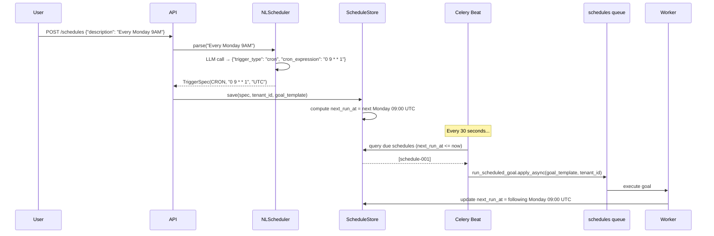
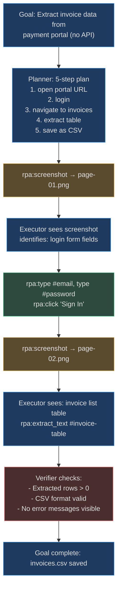

# Triggers, Schedules & Marketplace

<!-- Sources: app/triggers/models.py, app/triggers/nl_scheduler.py,
             app/triggers/store.py, app/enterprise/marketplace.py,
             app/enterprise/simulation.py, app/rpa/runner.py,
             app/rpa/session.py, app/rpa/tools.py -->

This section covers three platform capabilities that extend the agent loop
from on-demand execution to fully autonomous, scheduled, and UI-driven operation:

1. **Triggers and Schedules** — how goals are fired automatically by time,
   events, and webhooks without a human submitting them
2. **Marketplace** — the pre-built agent template gallery
3. **RPA and Browser Automation** — how agents interact with web interfaces
   that have no API

---

## Triggers and Schedules

### The Six Trigger Types

`app/triggers/models.py` defines six trigger types:

```python
class TriggerType(enum.StrEnum):
    CRON         = "cron"           # Celery Beat periodic (cron expression + timezone)
    INTERVAL     = "interval"       # Celery Beat interval (every N seconds)
    WEBHOOK      = "webhook"        # HTTP POST to /webhooks/{token}
    EVENT        = "event"          # Redis pub/sub channel event
    REST         = "rest"           # Manual HTTP call to /triggers/{id}/fire
    ONCE         = "once"           # Celery ETA task (fires once at specific time)
    FILE_DROP    = "file_drop"      # Object storage / S3 event
    ALERTMANAGER = "alertmanager"   # Prometheus AlertManager webhook
    DATADOG      = "datadog"        # Datadog event webhook
    PAGERDUTY    = "pagerduty"      # PagerDuty incident webhook
```

Every trigger produces a `TriggerSpec` dataclass that `ScheduleStore` persists
and Celery Beat reads to fire due schedules.

### NLScheduler — Natural Language to Cron

The `NLScheduler` uses an LLM to parse human-written schedules into structured
`TriggerSpec` objects. The LLM is given a strict JSON-only system prompt to
prevent non-parseable output:

```python
# app/triggers/nl_scheduler.py
_NL_SCHEDULER_SYSTEM = (
    "You are a schedule parser. Convert a natural language schedule description "
    "into one or more trigger specs.\n\n"
    "Respond ONLY with valid JSON. No markdown, no explanation."
)
```

**Parsing examples:**

| Natural Language | TriggerType | Result |
|------------------|-------------|--------|
| `"Every weekday at 9 AM UTC"` | `CRON` | `cron_expression="0 9 * * 1-5"`, `timezone="UTC"` |
| `"Every hour"` | `INTERVAL` | `interval_seconds=3600` |
| `"At 8 AM, 2 PM, 8 PM daily"` | `CRON` × 3 | Three separate `TriggerSpec` objects |
| `"On the 1st of every month at midnight"` | `CRON` | `cron_expression="0 0 1 * *"` |
| `"Once at 2024-12-31 23:59 UTC"` | `ONCE` | `fire_at_iso="2024-12-31T23:59:00Z"` |

Compound schedules ("8 AM, 2 PM, 8 PM") produce multiple `TriggerSpec` objects
via the `{"schedules": [...]}` JSON response path.

### Schedule Store + Celery Beat

`ScheduleStore` persists schedules to PostgreSQL and tracks `next_run_at` using
croniter. Celery Beat's `fire_due_schedules` task runs every 30 seconds:

1. Query `schedules WHERE next_run_at <= now AND enabled = true`
2. For each due schedule → `run_scheduled_goal.apply_async(queue="schedules")`
3. Update `next_run_at = croniter(cron_expression).get_next()`

### Trigger Flow Diagram



### Webhook Triggers

External systems can fire an agent goal by sending an HTTP POST to a
per-tenant webhook endpoint:

```
POST /webhooks/{token}
Content-Type: application/json
{"event": "github.pr.merged", "repo": "acme/backend", "pr_number": 42}
```

The webhook payload is passed to the agent as context, enabling event-driven
automation without polling. Common integrations:

| Webhook Source | Example Use Case |
|----------------|-----------------|
| GitHub | On PR merge → trigger documentation update agent |
| Datadog | On alert firing → trigger incident response agent |
| PagerDuty | On incident escalation → trigger runbook execution agent |
| Jira | On ticket status change → trigger stakeholder notification agent |
| AlertManager | On node down → trigger diagnostic + remediation agent |

---

## Marketplace — Agent Template Gallery

### What the Marketplace Provides

The marketplace (`app/enterprise/marketplace.py`, `marketplace_v2.py`) is a
catalog of pre-built agent configurations that operations teams can instantiate
in 30 seconds without writing code.

**Built-in templates:**

| Template ID | Name | Domain | Trigger | Tools | Autonomy |
|-------------|------|--------|---------|-------|----------|
| `tpl-bug-fix` | Bug Fix Agent | software | webhook | github, jira, sentry | bounded-autonomous |
| `tpl-devops` | DevOps Watchdog | devops | event | datadog, github | supervised |
| `tpl-e2e-testing` | E2E Test Generator | testing | cron (nightly) | github | fully-autonomous |
| `tpl-hr-onboarding` | HR Onboarding | hr | event | slack, jira | supervised |

### Template Structure

Each template includes:

```python
{
    "template_id": "tpl-bug-fix",
    "name": "Bug Fix Agent",
    "domain": "software",
    "description": "Fix JIRA bugs labeled prod-down and open a PR",
    "connectors": ["github", "jira", "sentry"],     # tools this agent uses
    "required_connectors": ["github", "jira"],       # connectors that MUST be configured
    "trigger_type": "webhook",
    "autonomy_mode": "bounded-autonomous",           # supervised|bounded|fully-autonomous
    "goal_template": "Fix all open bugs labeled {label} in {repo} and open PRs",
    "version": "1.0.0",
    "author": "AgentVerse",
}
```

### Instantiating a Template

```http
POST /api/v1/marketplace/deploy
{
  "template_id": "tpl-bug-fix",
  "variables": {
    "label": "prod-critical",
    "repo": "acme/backend"
  }
}
```

The marketplace:
1. Validates all `required_connectors` are configured for the tenant
2. Substitutes template variables into `goal_template`
3. Creates an `Agent` record in PostgreSQL with the rendered system prompt
4. Creates a `TriggerSpec` matching `trigger_type`
5. Returns the agent ID and webhook URL

### Simulation — Testing Templates Without Side Effects

`app/enterprise/simulation.py` provides a `MockMCPClient` that replaces real
tool calls with pre-configured responses:

```python
class MockMCPClient:
    """MCP client returning pre-configured mock responses for sandbox testing."""
    
    _TOOL_ACTIONS = {
        "github:create_pr": "Open GitHub pull request",
        "jira:create_issue": "Create Jira issue",
        "slack:send_message": "Send Slack message",
        # ... 15+ built-in tool actions
    }
```

Teams can test a full agent run against mock data before enabling it in production.
Cost: $0 (no LLM calls needed for simulation mode). Time: seconds vs minutes.

---

## RPA — Browser Automation Agents

### What RPA Agents Can Do

RPA (Robotic Process Automation) agents use Playwright to control a real browser,
enabling automation of web applications that have no API:

- Fill forms on legacy web portals
- Extract data from paginated tables
- Navigate multi-step web workflows
- Take screenshots for visual verification
- Interact with web apps requiring JavaScript execution

### RPA Session Model

```python
# app/rpa/session.py
@dataclass
class RPASession:
    session_id: str
    tenant_id: str
    goal_id: str
    status: RPASessionStatus    # created | running | complete | failed
    current_url: str | None
    screenshots: list[str]      # URIs of captured screenshots (MinIO)
    created_at: datetime
```

**Session isolation:** Each RPA session runs in a separate browser context
(not just a new page). Cookies, localStorage, and auth state are fully isolated
between sessions and between tenants.

**Session persistence:** `RPASessionStore` uses Redis with a 24-hour TTL. Keys:
- `rpa_session:{session_id}` → JSON session state
- `rpa_tenant_sessions:{tenant_id}` → Redis Set of active session IDs

### RPA Tools (MCP-Compatible)

RPA actions are exposed as standard MCP tools so agents use them via the same
`MCPClient.call_tool()` path as any other tool:

| Tool Name | Arguments | Returns |
|-----------|-----------|---------|
| `rpa:open_url` | `url` | `"Opened https://..."` |
| `rpa:click` | `selector` or `text` | `"Clicked #submit-btn"` |
| `rpa:type` | `selector`, `text` | `"Typed into #email-field"` |
| `rpa:extract_text` | `selector?` | Page text content |
| `rpa:screenshot` | `name` | MinIO artifact URI |

### RPA Workflow Diagram



### Security Controls

| Control | Implementation |
|---------|---------------|
| URL allowlist | `SSRF_ALLOWLIST_DOMAINS` per tenant; blocks internal URLs |
| Session isolation | Separate Playwright browser context per session (no shared cookies) |
| Screenshot storage | MinIO with per-tenant bucket; signed URLs expire after 1 hour |
| Max session duration | Configurable TTL (default: 30 minutes) before forced cleanup |
| Credentials | Injected via `credential_injector.py` at session start; not logged |

---

## Real-World Examples

### RWE 1: Financial Operations — Monthly Report Automation

**Context:** A CFO at a 200-person company needs financial reports extracted
from three legacy SaaS portals that each lack APIs (legacy accounting software,
expense management system, payroll portal). A finance analyst spends 8 hours
on the 1st of each month manually extracting and compiling data.

**Implementation:**

1. Admin creates schedule: `"First business day of every month at 7 AM"`
2. NLScheduler parses → `CRON "0 7 1-7 * 1"` (first weekday of month at 07:00)
3. Agent uses RPA tools to log in and extract data from all three portals
4. Agent compiles into unified Google Sheets format
5. Slack notification sent to CFO with summary and link

**Outcome:** 8-hour task → 45-minute automated run. Finance analyst redirected
to analysis work. Annual savings: 8h × 12 months × $80/hr = **$7,680/year** per
analyst.

---

### RWE 2: DevOps Team Uses Marketplace Template in 3 Minutes

**Context:** A startup's DevOps team hears about the "DevOps Watchdog" template
in the marketplace. They want to roll back their staging environment if error
rate exceeds 5% for 2 minutes.

**Zero-code setup:**

```http
# Step 1: Check required connectors
GET /api/v1/marketplace/templates/tpl-devops
→ required_connectors: ["datadog", "github"]

# Step 2: Both already configured — deploy immediately
POST /api/v1/marketplace/deploy
{
  "template_id": "tpl-devops",
  "variables": {"service": "api-gateway", "threshold": "5"}
}
→ {"agent_id": "agt-007", "webhook_url": "/webhooks/tok_xyz", "status": "active"}

# Step 3: Configure Datadog webhook to send alerts to /webhooks/tok_xyz
```

**Time from idea to running agent: 3 minutes.** Zero code written.

---

### RWE 3: E-Commerce Checkout Automation (RPA)

**Context:** A B2B e-commerce company needs to place orders on a supplier's
legacy web portal for 50 SKUs daily. The portal has no EDI or API. A data-entry
employee spends 2 hours/day doing this manually.

**RPA agent workflow:**

1. Agent receives: `"Place order for 50 SKUs from daily_orders.csv on supplier portal"`
2. Planner creates steps: parse CSV → loop over SKUs → navigate portal → fill form per SKU
3. RPA tools: `open_url(portal)` → `type(#username, ...)` → `click("Login")` → 
   per-SKU: `type(#sku-field, ...)` → `type(#quantity, ...)` → `click("Add to Cart")`
4. Final: `click("Submit Order")` → `screenshot("confirmation")` → extract order ID
5. Writes order confirmation IDs back to tracking spreadsheet

**Outcome:** 2 hours manual work → 8-minute automated run, zero errors.
Annual savings at $25/hr: 2h × 250 business days × $25 = **$12,500/year**.
