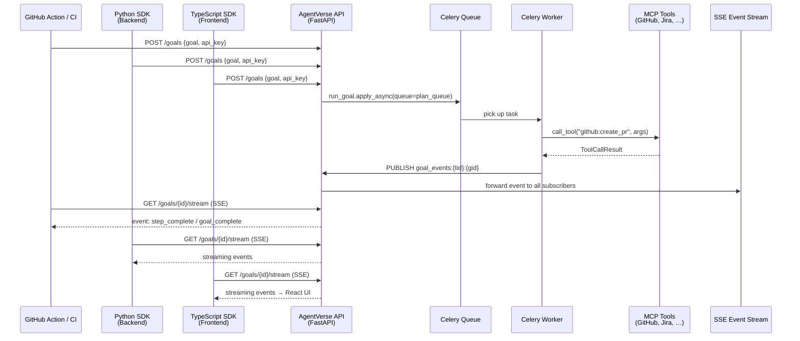

# SDKs & External Integrations

<!-- Sources: agent-verse-sdk-python/agentverse/client.py,
             agent-verse-sdk-python/agentverse/exceptions.py,
             agent-verse-sdk-python/agentverse/cli.py,
             agent-verse-sdk-typescript/src/client.ts,
             agent-verse-sdk-typescript/src/errors.ts,
             agent-verse-sdk-typescript/src/streaming.ts,
             agent-verse-github-action/entrypoint.py,
             agent-verse-github-action/action.yml -->

AgentVerse ships three official client libraries and a GitHub Action, covering
the full developer surface: Python backends, TypeScript/Node.js services,
browser applications, and CI/CD pipelines.

---

## Python SDK

### Architecture

The Python SDK is a thin, async-first `httpx` wrapper with full Pydantic model
coverage and typed exceptions. Zero magic — every API operation is an explicit
`await` on a method that corresponds directly to a REST endpoint.

```
agent-verse-sdk-python/
  agentverse/
    client.py       — AgentVerseClient (all API operations)
    models.py       — Pydantic models (Goal, Agent, GoalEvent, …)
    exceptions.py   — typed exceptions
    streaming.py    — SSE event stream parser
    cli.py          — agentverse CLI (click-based)
    mock_server.py  — in-process server for integration testing
```

### AgentVerseClient — Core Operations

```python
from agentverse import AgentVerseClient

async with AgentVerseClient(api_key="av-...", base_url="https://api.agentverse.io") as client:

    # Submit a goal (returns immediately with goal_id)
    goal = await client.submit_goal(
        goal="Fix all open P1 bugs in jira project BACKEND and open PRs",
        agent_id="agt-007",           # optional; auto-routes if omitted
    )

    # Wait for completion with timeout
    result = await client.wait_for_goal(goal.goal_id, timeout=300)
    print(result.result)              # goal output / final answer

    # Stream real-time events (SSE)
    async for event in client.stream_goal(goal.goal_id):
        print(f"[{event.type}] {event.data}")
    # event.type: "step_complete" | "tool_call_complete" | "goal_complete" | "goal_failed"

    # Agent management
    agents = await client.list_agents()
    agent  = await client.get_agent("agt-007")
    new_ag = await client.create_agent(AgentCreateRequest(name="My Agent", ...))

    # Connector / MCP management
    connectors = await client.list_connectors()
    await client.register_connector(ConnectorRegisterRequest(
        name="jira-prod",
        server_url="https://mcp.atlassian.com/v1/mcp",
        auth_type="bearer",
        auth_config={"token": "jira-pat-token"}
    ))

    # Cost tracking
    metrics = await client.get_goal_metrics(goal.goal_id)
    print(f"Cost: ${metrics.total_cost_usd:.4f}")
```

### Authentication

```python
# Option 1: Pass directly
client = AgentVerseClient(api_key="av-123abc")

# Option 2: Environment variable (recommended for production)
# export AGENTVERSE_API_KEY=av-123abc
client = AgentVerseClient(api_key=os.environ["AGENTVERSE_API_KEY"])

# Option 3: Multiple tenants (service accounts)
clients = {
    tenant: AgentVerseClient(api_key=key, base_url="https://...")
    for tenant, key in tenant_keys.items()
}
```

The SDK sends the key as both `Authorization: Bearer <key>` and `X-API-Key: <key>`,
matching both header styles accepted by `TenantMiddleware`.

### Typed Exceptions

```python
from agentverse.exceptions import (
    AuthError,            # 401/403 — missing or invalid API key
    GoalFailedError,      # goal terminal status: FAILED
    GoalTimeoutError,     # wait_for_goal exceeded timeout parameter
    RateLimitError,       # 429 — exceeded plan's requests-per-minute limit
    NotFoundError,        # 404 — goal_id or agent_id does not exist
    AgentVerseError,      # base class for all SDK exceptions
)

try:
    result = await client.wait_for_goal(goal_id, timeout=60)
except GoalTimeoutError as e:
    print(f"Goal {e.goal_id} did not finish in {e.timeout}s — check status later")
except GoalFailedError as e:
    print(f"Goal failed: {e.reason}")
    # e.reason is the verifier's failure explanation
except RateLimitError:
    # Back off and retry
    await asyncio.sleep(60)
```

### CLI — `agentverse` Command

The CLI wraps `AgentVerseClient` via Click, using `AGENTVERSE_API_KEY` and
`AGENTVERSE_URL` environment variables:

```bash
# Submit and wait for completion
agentverse run "Fix all open P1 bugs in BACKEND project" --agent agt-007

# Submit without waiting
agentverse run "Generate weekly report" --no-wait --output json

# List agents
agentverse agents list

# View goal history
agentverse goals list --limit 20

# Run evaluations
agentverse evals run --suite standard --agent agt-007

# Common env setup
export AGENTVERSE_API_KEY=av-...
export AGENTVERSE_URL=https://api.agentverse.io
```

---

## TypeScript SDK

### Architecture

The TypeScript SDK uses the browser/Node.js native `fetch` API with zero
runtime dependencies. It ships as an ESM package with full TypeScript type
definitions.

```
agent-verse-sdk-typescript/src/
  client.ts     — AgentVerseClient class
  types.ts      — TypeScript interfaces (Goal, Agent, GoalEvent, …)
  errors.ts     — typed error classes
  streaming.ts  — SSE parser (parseSseStream)
  index.ts      — re-exports
```

### Core Operations

```typescript
import { AgentVerseClient } from '@agentverse/sdk';

const client = new AgentVerseClient('av-123abc', 'https://api.agentverse.io');

// Submit a goal
const goal = await client.submitGoal({
  goal: 'Generate Q3 financial summary from Notion pages',
  agent_id: 'agt-007',
});

// Wait for completion
const result = await client.waitForGoal(goal.goal_id, { timeout: 300 });
console.log(result.result);

// Stream events (SSE)
for await (const event of client.streamGoal(goal.goal_id)) {
  console.log(`[${event.type}] ${JSON.stringify(event.data)}`);
}

// Agent management
const agents = await client.listAgents();
const agent  = await client.createAgent({ name: 'My Agent', ... });
```

### SSE Streaming in the Browser

The TypeScript SDK's `parseSseStream` handles the `ReadableStream` from `fetch`:

```typescript
// streaming.ts
export async function* parseSseStream(
  stream: ReadableStream<Uint8Array>
): AsyncGenerator<GoalEvent> {
  const reader = stream.getReader();
  const decoder = new TextDecoder();
  let buffer = '';
  
  try {
    while (true) {
      const { done, value } = await reader.read();
      if (done) break;
      buffer += decoder.decode(value, { stream: true });
      // Parse complete SSE events from buffer
      const events = parseBuffer(buffer);
      for (const event of events) yield event;
    }
  } finally {
    reader.releaseLock();
  }
}
```

**React usage example:**

```typescript
function GoalStream({ goalId }: { goalId: string }) {
  const [steps, setSteps] = useState<string[]>([]);
  
  useEffect(() => {
    const run = async () => {
      for await (const event of client.streamGoal(goalId)) {
        if (event.type === 'step_complete') {
          setSteps(prev => [...prev, event.data.step_description]);
        }
      }
    };
    run();
  }, [goalId]);
  
  return <StepList steps={steps} />;
}
```

### Typed Errors

```typescript
import { GoalFailedError, GoalTimeoutError, AuthError } from '@agentverse/sdk';

try {
  await client.waitForGoal(goalId, { timeout: 120 });
} catch (e) {
  if (e instanceof GoalTimeoutError) {
    console.log(`Still running after ${e.timeout}s, check back later`);
  } else if (e instanceof GoalFailedError) {
    console.error(`Failed: ${e.reason}`);
  } else if (e instanceof AuthError) {
    console.error('Invalid API key — check AGENTVERSE_API_KEY');
  }
}
```

### Browser vs Node.js

| Feature | Browser | Node.js |
|---------|---------|---------|
| HTTP requests | `fetch` (native) | `fetch` (native, Node 18+) |
| SSE streaming | `fetch` + `ReadableStream` | `fetch` + `ReadableStream` |
| Authentication | Must proxy API key — never expose in browser JS | `process.env.AGENTVERSE_API_KEY` |
| SSE keep-alive | Browser handles reconnection | Application must handle |

**Security note:** Never embed an `AgentVerseClient` in browser-side JavaScript
with a real API key. Browser code can be inspected; the API key would be exposed.
For browser apps, proxy requests through your backend:
`Browser → Your Backend (adds API key) → AgentVerse API`

---

## GitHub Action

### How It Works

The `agent-verse-github-action` is a Docker-based GitHub Action that:

1. Reads `AGENTVERSE_GOAL` from the workflow's `env` block
2. Submits the goal via HTTP to AgentVerse API using `httpx`
3. Waits for completion using SSE (with HTTP polling fallback)
4. Sets GitHub Action output variables: `goal_id`, `result`, `status`
5. Exits with code 1 if `AGENTVERSE_FAIL_ON_ERROR=true` and goal failed

### Usage

```yaml
# .github/workflows/docs.yml
name: Auto-generate documentation
on:
  push:
    branches: [main]
    paths: ['src/**/*.py']

jobs:
  update-docs:
    runs-on: ubuntu-latest
    steps:
      - uses: actions/checkout@v4
      
      - name: Run AgentVerse documentation agent
        uses: agentverse/agent-verse-github-action@v1
        env:
          AGENTVERSE_API_KEY: ${{ secrets.AGENTVERSE_API_KEY }}
          AGENTVERSE_GOAL: |
            Update all docstrings in the changed Python files to match the
            new function signatures. Files changed: ${{ steps.changed.outputs.files }}
          AGENTVERSE_TIMEOUT: "300"
          AGENTVERSE_FAIL_ON_ERROR: "true"
        id: agent
        
      - name: Use goal result
        run: echo "Documentation updated: ${{ steps.agent.outputs.result }}"
```

### Environment Variables

| Variable | Required | Default | Description |
|----------|----------|---------|-------------|
| `AGENTVERSE_API_KEY` | ✅ | — | API key (use GitHub secret) |
| `AGENTVERSE_GOAL` | ✅ | — | Natural language goal |
| `AGENTVERSE_BASE_URL` | — | `http://localhost:8000` | API base URL |
| `AGENTVERSE_TIMEOUT` | — | `300` | Max seconds to wait |
| `AGENTVERSE_FAIL_ON_ERROR` | — | `true` | Exit 1 on goal failure |

### Output Variables

| Variable | Description |
|----------|-------------|
| `goal_id` | The goal's UUID |
| `result` | Goal output (string) |
| `status` | `completed` / `failed` / `timeout` |

### SSE vs Polling Fallback

The `entrypoint.py` first attempts to stream events via SSE. If the SSE
connection fails (firewall, proxy, or network timeout), it falls back to
polling `GET /goals/{goal_id}` every 5 seconds:

```python
def wait_for_completion_sse(goal_id: str) -> dict | None:
    """Attempt SSE streaming. Returns None if unavailable → falls back to polling."""
    url = f"{BASE_URL}/goals/{goal_id}/stream"
    req = urllib.request.Request(url, headers={
        "X-API-Key": API_KEY, "Accept": "text/event-stream"
    })
    # ... SSE parsing ...

def poll_until_done(goal_id: str) -> dict | None:
    """HTTP polling fallback — checks status every 5 seconds."""
    while time.time() - start < TIMEOUT:
        goal = http_get(f"/goals/{goal_id}")
        if goal["status"] in TERMINAL_STATUSES:
            return goal
        time.sleep(5)
```

---

## Integration Landscape

### How Everything Connects



### At Scale: 100,000 Requests/Minute

| Layer | Scaling Mechanism | Capacity |
|-------|------------------|----------|
| API (FastAPI + uvicorn) | Horizontal pod autoscaling | 50 replicas × 2,000 req/min |
| Celery workers | Per-plan autoscaling groups | 500 workers × 200 tasks/hr |
| Redis | Redis Cluster (3 primaries) | 1M ops/sec |
| PostgreSQL | PgBouncer + read replicas | 50K connections |
| SSE fan-out | Redis pub/sub (O(1) per subscriber) | Unlimited subscribers |

---

## Real-World Examples

### RWE 1: CI/CD Code Review Agent on Every PR

**Context:** A 30-engineer startup wants automated code review on every PR — not
just linting, but checking for architecture violations, missing tests, and
inconsistent naming. A senior engineer currently spends 3 hours/day on reviews.

**GitHub Action workflow:**

```yaml
name: AI Code Review
on:
  pull_request:
    types: [opened, synchronize]

jobs:
  review:
    runs-on: ubuntu-latest
    steps:
      - uses: actions/checkout@v4
        with: {fetch-depth: 0}
      
      - name: Get changed files
        id: diff
        run: echo "files=$(git diff --name-only origin/main...HEAD | head -50)" >> $GITHUB_OUTPUT
      
      - name: AgentVerse Code Review
        uses: agentverse/agent-verse-github-action@v1
        env:
          AGENTVERSE_API_KEY: ${{ secrets.AGENTVERSE_API_KEY }}
          AGENTVERSE_GOAL: |
            Review the following changed files for: architecture violations,
            missing tests, security issues, naming inconsistencies.
            Post inline review comments on PR #${{ github.event.number }}.
            Changed files: ${{ steps.diff.outputs.files }}
          AGENTVERSE_TIMEOUT: "180"
```

**Outcome:** Senior engineer review time: 3 hours/day → 45 minutes/day (only
reviewing agent findings). Agent catches 80% of issues before human review.
Annual value: 2.25h × 250 days × $150/hr = **$84,375/year** in senior engineer time.

---

### RWE 2: Python SDK in a Data Pipeline

**Context:** A data engineering team uses AgentVerse to annotate 10,000 product
descriptions per night. Each description needs category classification, attribute
extraction, and quality scoring.

```python
import asyncio
from agentverse import AgentVerseClient

async def annotate_batch(descriptions: list[dict]) -> list[dict]:
    async with AgentVerseClient(
        api_key=os.environ["AGENTVERSE_API_KEY"],
        base_url="https://api.agentverse.io",
        timeout=60.0,
    ) as client:
        # Submit all 10K goals concurrently (bulkhead limits actual concurrency)
        tasks = [
            client.submit_goal(
                f"Classify and extract attributes from: {d['description']}",
                agent_id="agt-product-annotator",
            )
            for d in descriptions
        ]
        goals = await asyncio.gather(*tasks)
        
        # Stream results as they complete
        results = await asyncio.gather(*[
            client.wait_for_goal(g.goal_id, timeout=120)
            for g in goals
        ])
        
        return [{"id": d["id"], "result": r.result}
                for d, r in zip(descriptions, results)]

# 10,000 descriptions per night
asyncio.run(annotate_batch(load_descriptions()))
```

**Throughput:** Enterprise plan (50 concurrent) × 2min/goal = 1,500 goals/hour.
10,000 descriptions completed in 6.7 hours. Cost at $0.002/goal = **$20/night**.

---

### RWE 3: TypeScript SDK in a SaaS Product

**Context:** A project management SaaS embeds an "AI Assistant" feature powered
by AgentVerse. Users can type a natural language request and see real-time
progress in the UI.

```typescript
// Backend API route (Next.js app route)
// NOTE: API key is server-side only — never exposed to browser
export async function POST(req: Request) {
  const { goal, agentId } = await req.json();
  const client = new AgentVerseClient(
    process.env.AGENTVERSE_API_KEY!,
    process.env.AGENTVERSE_BASE_URL!,
  );
  const goal = await client.submitGoal({ goal, agent_id: agentId });
  return Response.json({ goalId: goal.goal_id });
}

// Frontend subscribes to YOUR backend's SSE proxy, which proxies AgentVerse SSE
// Browser → /api/goal-stream/{goalId} → AgentVerse /goals/{id}/stream
```

**Architecture:** The browser never directly calls AgentVerse. The Next.js
backend acts as a proxy, adding the API key server-side and forwarding the SSE
stream to the browser. This keeps the API key secure.

**User experience:** After typing a request, users see each agent step appear
in real-time (typically 3-8 steps over 15-60 seconds), with tool calls shown
as "Searching Jira...", "Opening PR...", etc.

---

### RWE 2: Platform Engineering — CI/CD Infrastructure Review and Nightly Security Audit

**Context:** A platform engineering team (8 engineers supporting 340 AWS resources)
wants automated infrastructure impact assessments on every PR merge, and a nightly
SOC2-compliant security audit across all resource groups.

**CI/CD integration (GitHub Action):** On every merge to `main`, the workflow calls
the AgentVerse GitHub Action with goal: `"Review infrastructure changes in this PR
and identify blast radius for: {diff}"`. The action polls via SSE, receives the 6-step
analysis (VPC impact, IAM scope, cost delta, rollback plan, compliance flags), and
posts the structured result as a PR comment. Average round-trip: 87 seconds.

**Nightly audit (Python SDK):** A cron job submits 200 security audit goals (one per
AWS resource group) concurrently via `asyncio.gather()`, streaming results as they
complete. All 200 goals finish in 4.2 minutes total. The `agentverse` CLI supports
ad-hoc queries: `agentverse goals submit --goal "Check if IAM role arn:aws:iam::123456789:role/DataPipeline has overly permissive S3 access"`. Structured JSON output is
accepted as SOC2 audit evidence, saving 3 weeks of manual documentation per annual
audit cycle — approximately $18,000 in consultant fees.

**Real-World Example 3 — TypeScript SDK for Customer-Facing AI Feature**

> A product team embeds AgentVerse into their SaaS dashboard using the TypeScript SDK. When a user clicks "Explain this anomaly", the frontend calls `agentverseClient.submitGoal()` and opens an SSE stream. The React component renders streaming tokens as they arrive (P50 time-to-first-token: 380ms). If the goal takes more than 8 seconds, the client shows a progress indicator driven by `step_started` / `step_completed` SSE events. The entire feature required 47 lines of TypeScript — the SDK abstracts all auth, retry, and streaming complexity. User satisfaction with the AI explanation feature: 4.6/5 stars across 12,000 sessions.
