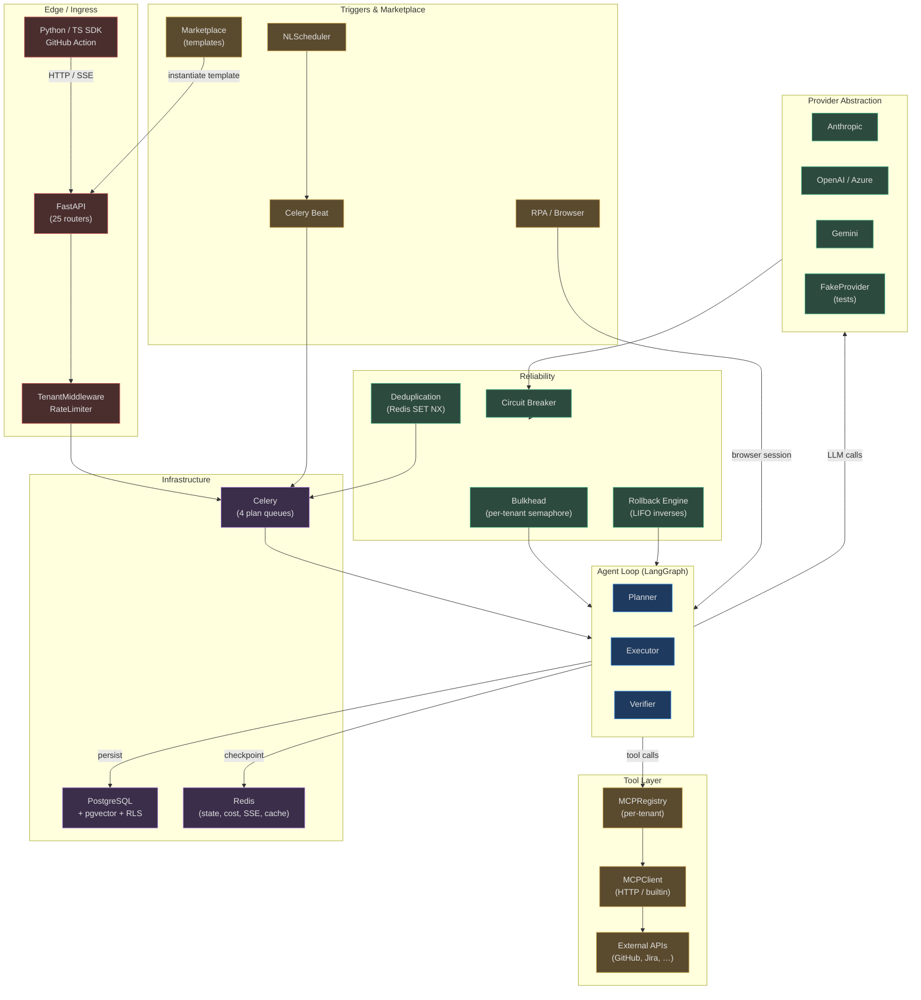

# Other Core Platform Concepts

The agent loop gets all the attention, but the subsystems in this section are
what make 1M+ requests/day at production reliability actually work.  Without
these layers, the planner–executor–verifier state machine is just a clever
algorithm.  With them, it becomes a multi-tenant platform that enterprise
teams can depend on.

This section covers **six interconnected capability groups**:

| Group | What It Does | Files |
|-------|-------------|-------|
| [MCP & Provider Abstraction](./01-mcp-and-provider-abstraction.md) | Universal tool protocol + LLM provider interface | `app/mcp/`, `app/providers/` |
| [Reliability Patterns](./02-reliability-patterns.md) | Circuit breakers, bulkheads, dedup, rollback | `app/reliability/` |
| [Celery, PostgreSQL & Redis](./03-celery-postgres-redis.md) | Task queues, persistence, caching, fan-out | `app/scaling/`, `app/db/` |
| [Triggers, Schedules & Marketplace](./04-triggers-schedules-and-marketplace.md) | NL scheduling, template gallery, RPA | `app/triggers/`, `app/enterprise/`, `app/rpa/` |
| [SDKs & External Integrations](./05-sdks-and-external-integrations.md) | Python SDK, TypeScript SDK, GitHub Action | `agent-verse-sdk-python/`, `agent-verse-sdk-typescript/`, `agent-verse-github-action/` |

---

## Why These Concepts Matter as Much as the Agent Patterns

The RAG patterns, multi-agent patterns, and model router documentation describe
*what* agents do.  This section describes *how they do it at scale*:

- **MCP** is why an agent can call 200+ tools without any bespoke integration
  code — the same `MCPClient.call_tool()` path handles GitHub, Jira, Salesforce,
  and any MCP-compatible external API.
- **Provider abstraction** is why the same executor code works whether the tenant
  is running local Ollama, OpenAI, Anthropic, or a private Azure OpenAI endpoint.
- **Reliability patterns** are why a runaway tenant does not crash every other
  tenant, why a failing embedding API does not cascade into agent failures, and
  why a multi-step agent that fails mid-way can undo its side effects.
- **Celery + Redis + PostgreSQL** are why goal execution is durable across worker
  restarts, why SSE events reach every browser tab even across pod restarts, and
  why per-tenant cost tracking is accurate across all 100 Celery workers.
- **Triggers and marketplace** are why operations teams can deploy pre-built agent
  templates in 30 seconds and schedule them without writing code.
- **SDKs and GitHub Action** are why developers can integrate AgentVerse into CI
  pipelines, product backends, and data pipelines with a 10-line snippet.

---

## Architecture Overview

How all these components connect to the agent loop and to each other:

---

## Navigation

Start with [01 — MCP & Provider Abstraction](./01-mcp-and-provider-abstraction.md)
to understand how agents communicate with tools and LLMs.  Then read
[02 — Reliability Patterns](./02-reliability-patterns.md) to understand how the
platform handles failure.  The infrastructure and integration pages can be read
in any order after that.
