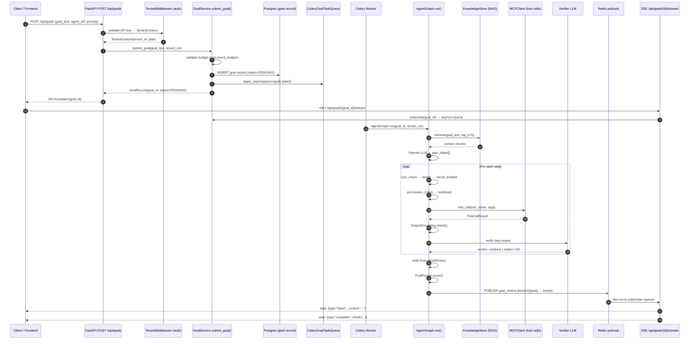
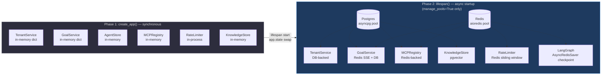
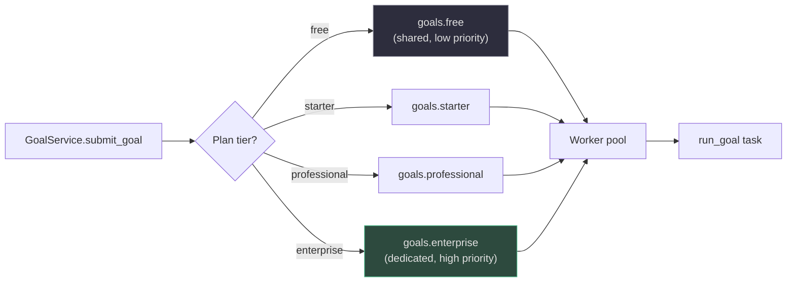
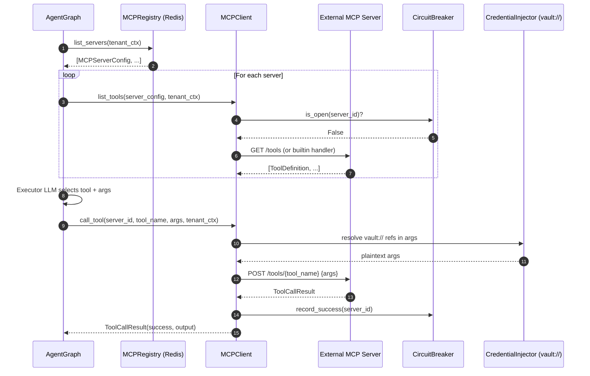
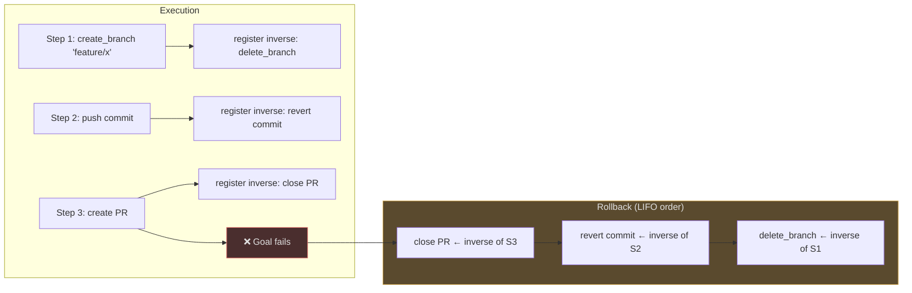
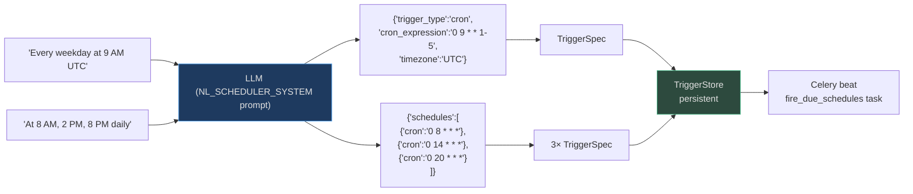

# Platform Execution Workflows

AgentVerse's execution model consists of four tightly coupled systems: an async FastAPI gateway, a Celery task queue with per-plan routing, the LangGraph agent graph, and a Redis pub/sub fan-out for real-time SSE streaming.

---

## 1. Full Request Lifecycle


<!-- Sources: app/services/goal_service.py:1-100, app/scaling/tasks.py:1-100, app/agent/graph.py, app/mcp/client.py:1-100 -->

---

## 2. Two-Phase Service Wiring

`create_app()` in [`app/main.py`](https://github.com/harsh786/agent-verse/blob/main/agent-verse-backend/app/main.py) constructs services in two phases to support both test isolation and production pooling:


<!-- Sources: app/main.py:1-100 -->

**Why two phases?** Tests build the app with `manage_pools=False`, getting the in-memory path with no external dependencies. Production sets `manage_pools=True`, and the lifespan function swaps every service for a DB/Redis-backed implementation via `sync_from_db()`.

The LangGraph checkpointer follows the same pattern:
1. `MemorySaver` (no-deps, tests)
2. `RedisSaver` (sync, fallback)
3. `AsyncRedisSaver` (full async, production)

---

## 3. Celery Queue Routing

[`celery_app.py`](https://github.com/harsh786/agent-verse/blob/main/agent-verse-backend/app/scaling/celery_app.py#L30-L80) defines per-plan queue isolation to prevent noisy-neighbour effects:


<!-- Sources: app/scaling/celery_app.py:30-80 -->

### Queue and Task Routing Table

| Celery Queue | Tasks | Purpose |
|---|---|---|
| `goals.free` | `run_goal` (free tier) | Free-plan goal execution |
| `goals.starter` | `run_goal` (starter tier) | Starter-plan goal execution |
| `goals.professional` | `run_goal` (pro tier) | Professional-plan goal execution |
| `goals.enterprise` | `run_goal` (enterprise tier) | Enterprise-plan, isolated workers |
| `goals_dlq` | `run_goal_dlq` | Dead-letter queue for failed goals |
| `schedules` | `run_scheduled_goal`, `fire_due_schedules` | Cron/interval trigger execution |
| `maintenance` | `detect_stuck_goals`, `consolidate_memories`, `expire_hitl_approvals`, `check_email_goals`, `execute_retention_policy` | Background housekeeping |

### Key Celery Configuration

| Setting | Value | Reason |
|---|---|---|
| `task_acks_late=True` | True | Acknowledge only after completion (safe retry on crash) |
| `task_reject_on_worker_lost=True` | True | Re-queue when worker dies mid-task |
| `worker_prefetch_multiplier=1` | 1 | One task at a time per worker (long-running goals) |
| `worker_max_tasks_per_child=100` | 100 | Prevent memory leaks in long-lived workers |
| `worker_max_memory_per_child` | 500 MB | OOM protection |

---

## 4. MCP Tool Discovery and Execution


<!-- Sources: app/mcp/client.py:1-100, app/mcp/registry.py:1-100 -->

### Server Authentication Types

[`MCPServerConfig.auth_type`](https://github.com/harsh786/agent-verse/blob/main/agent-verse-backend/app/mcp/registry.py#L27-L45) supports 9 authentication mechanisms:

| Auth Type | Use Case |
|---|---|
| `NONE` | Internal / development servers |
| `BEARER` | OAuth Bearer token (resolved from Vault) |
| `API_KEY` | API key in header |
| `OAUTH_AC` | OAuth Authorization Code flow |
| `OAUTH_CC` | OAuth Client Credentials (M2M) |
| `PKCE` | OAuth PKCE for user-delegated access |
| `BASIC` | HTTP Basic auth |
| `HMAC` | HMAC request signing |
| `MTLS` | Mutual TLS certificate authentication |

### Server Types

| Type | `builtin_handler` | `url` | Description |
|---|---|---|---|
| Built-in | Callable | `builtin://` | In-process handler (e.g. built-in Jira) |
| Remote HTTP | None | `https://...` | External MCP server via HTTP |
| WebSocket | None | `wss://...` | Streaming MCP server (`transport="ws"`) |

---

## 5. SSE Event Flow

```mermaid
flowchart TD
    AG[AgentGraph executes step] --> EV["publish event dict<br>{type, content, step_id, ...}"]
    EV --> GS[GoalService._handle_event]
    GS --> SAN[sanitize_event<br>remove PII / tokens from logs]
    SAN --> STORE[goal.events.append(event)]
    SAN --> PUB{Redis available?}
    PUB -->|Yes| RPUB["PUBLISH goal_tokens:{tenant}/{goal}\nJSON-encoded event"]
    PUB -->|No| LOCAL[fan-out to in-memory queues]
    RPUB --> SUB[Redis Subscriber<br>goal_service._redis_subscriber]
    SUB --> FAN[For each asyncio.Queue\nin goal.subscribers]
    LOCAL --> FAN
    FAN --> SSE["SSE endpoint\nGET /api/goals/{id}/stream\nasync for event in queue"]
    SSE --> CLIENT[Frontend receives\ndata: {type:token, content:...}]

    style RPUB fill:#1e3a5f,stroke:#4a9eed,color:#e0e0e0
    style CLIENT fill:#2d4a3e,stroke:#4aba8a,color:#e0e0e0
```
<!-- Sources: app/services/goal_service.py:1-100 -->

### Event Types

| Event Type | When Emitted | Frontend Effect |
|---|---|---|
| `status` | Goal state change | Update status badge |
| `token` | Streaming LLM output | Append to response text |
| `step_start` | Before step execution | Show step in progress UI |
| `step_complete` | After step verification | Mark step done |
| `tool_call` | MCP tool invoked | Show tool activity |
| `hitl_required` | HITL escalation | Show approval modal |
| `complete` | Goal finished | Show final result |
| `failed` | Unrecoverable error | Show error state |

Redis channel: `goal_tokens:{tenant_id}/{goal_id}`. Subscribers use a poison-pill sentinel (`None`) to detect end-of-stream.

### Completed Goal TTL

[`GoalRecord`](https://github.com/harsh786/agent-verse/blob/main/agent-verse-backend/app/services/goal_service.py#L78-L98) are kept in the in-memory cache for `_COMPLETED_GOAL_TTL_SECONDS = 3600` (1 hour) after completion. Eviction runs at most every 60 seconds to avoid O(N) scans on every event.

---

## 6. Rollback Engine

[`RollbackEngine`](https://github.com/harsh786/agent-verse/blob/main/agent-verse-backend/app/reliability/rollback.py#L1-L100) implements LIFO compensating actions. Each successful tool call registers an inverse:


<!-- Sources: app/reliability/rollback.py:1-100, app/reliability/tool_inverses.py:1-100 -->

### Rollback Actions and Inverses

| Action (`RollbackAction`) | Inverse |
|---|---|
| `CREATE_FILE` | delete file |
| `DELETE_FILE` | restore from backup |
| `MODIFY_FILE` | revert to previous content |
| `CREATE_BRANCH` | delete branch |
| `DELETE_BRANCH` | recreate branch |
| `CREATE_PR` | close PR |
| `CLOSE_PR` | reopen PR |
| `CREATE_TICKET` | close ticket |
| `CLOSE_TICKET` | reopen ticket |
| `SEND_MESSAGE` | ⚠️ generally not reversible |

[`tool_inverses.py`](https://github.com/harsh786/agent-verse/blob/main/agent-verse-backend/app/reliability/tool_inverses.py#L1-L100) maintains `_INVERSE_REGISTRY: dict[str, Callable]` keyed by MCP tool name. New inverses are registered at startup via `register_inverse(tool_name, fn)`.

`rollback_all_async()` is preferred in async contexts to guarantee completion. `rollback_all()` fires async inverses as `create_task` (fire-and-forget) with a warning log.

---

## 7. Natural Language Scheduling

[`NLScheduler`](https://github.com/harsh786/agent-verse/blob/main/agent-verse-backend/app/triggers/nl_scheduler.py#L1-L75) converts human-readable schedules to cron expressions via LLM:


<!-- Sources: app/triggers/nl_scheduler.py:1-75, app/triggers/store.py -->

Compound schedules (`"8 AM, 2 PM, 8 PM"`) produce multiple `TriggerSpec` objects. Falls back to `TriggerType.ONCE` on JSON parse failure.

---

## Related Pages

| Page | Relevance |
|---|---|
| [AI Model Router](ai-model-router.md) | Model selection for planner/executor/verifier |
| [Hallucination Handling](hallucination-handling.md) | Verifier and grounding check details |
| [Governance & Security](governance-and-security.md) | HITL gateway, audit log, cost enforcement |
| [Multimodal Processing](multimodal.md) | Ingestion pipeline feeding RAG |
| [Chunking Strategies](chunking-strategies.md) | How knowledge is prepared for retrieval |
