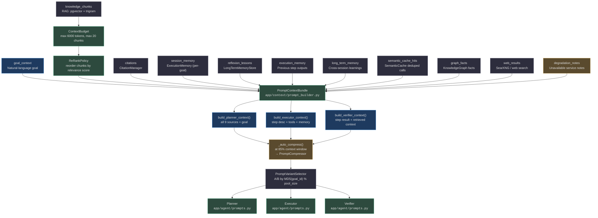
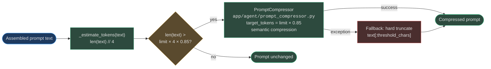
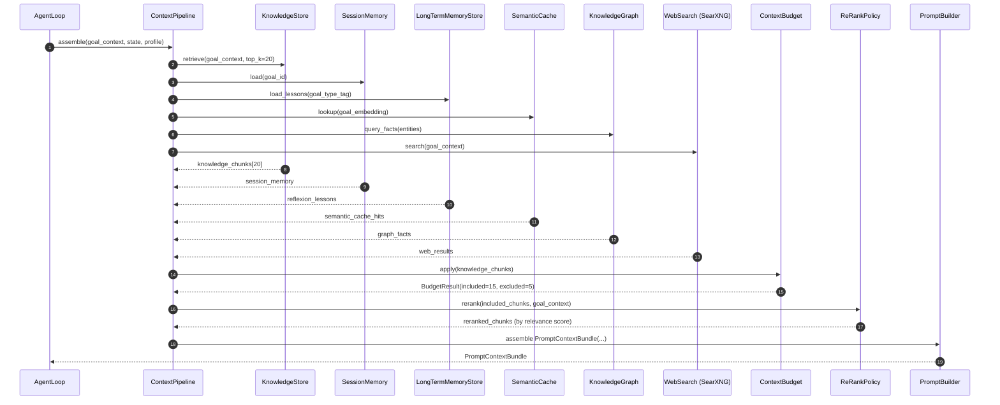

# Prompt Builder

Every LLM call in AgentVerse is preceded by a deterministic prompt assembly pipeline. Nine distinct context sources are weighted, budgeted, compressed if necessary, and formatted into role-specific prompts for the planner, executor, and verifier. This page documents the complete pipeline from context sources to final prompt string.

## Context Assembly Pipeline



<!-- Sources: app/context/prompt_builder.py, app/context/context_budget.py, app/context/rerank_policy.py, app/context/prompt_variant_selector.py, app/agent/prompts.py -->

---

## PromptContextBundle — 9 Context Sources

[`app/context/prompt_builder.py`](https://github.com/harsh786/agent-verse/blob/main/agent-verse-backend/app/context/prompt_builder.py) defines the `PromptContextBundle` dataclass that aggregates all context sources before prompt construction:

<!-- Source: app/context/prompt_builder.py:18-33 -->
```python
@dataclass
class PromptContextBundle:
    goal_context: str                         # Natural-language goal description
    knowledge_chunks: list[dict[str, Any]]    # Retrieved RAG chunks
    citations: list[Any]                      # CitationManager tracked citations
    session_memory: list[dict[str, Any]]      # ExecutionMemory for this goal
    reflexion_lessons: list[str]              # LongTermMemory lessons from similar past goals
    execution_memory: list[dict[str, Any]]    # Outputs from previous steps in this run
    long_term_memory: list[dict[str, Any]]    # Cross-session learnings
    semantic_cache_hits: list[dict[str, Any]] # Cached LLM responses (avoids duplicate calls)
    graph_facts: list[dict[str, Any]]         # KnowledgeGraph structured facts
    web_results: list[dict[str, Any]]         # Live web search results (SearXNG)
    degradation_notes: list[str]             # Notes about unavailable services (graceful deg.)
    source_inventory: dict[str, Any]          # Metadata about which sources contributed
```

### Source Reference Table

| Field | Source | Provider Module | Role Priority |
|---|---|---|---|
| `goal_context` | User input | Direct | Planner, Executor, Verifier |
| `knowledge_chunks` | KnowledgeStore (pgvector + trigram) | [`app/knowledge/`](https://github.com/harsh786/agent-verse/blob/main/agent-verse-backend/app/knowledge/) | Planner, Executor |
| `citations` | CitationManager | [`app/context/citation_manager.py`](https://github.com/harsh786/agent-verse/blob/main/agent-verse-backend/app/context/citation_manager.py) | Verifier |
| `session_memory` | ExecutionMemory (per-goal in-flight) | [`app/memory/`](https://github.com/harsh786/agent-verse/blob/main/agent-verse-backend/app/memory/) | Executor |
| `reflexion_lessons` | LongTermMemoryStore | [`app/memory/`](https://github.com/harsh786/agent-verse/blob/main/agent-verse-backend/app/memory/) | Planner |
| `execution_memory` | Previous step tool outputs | AgentState | Executor |
| `long_term_memory` | Cross-session learnings | LongTermMemoryStore | Planner |
| `semantic_cache_hits` | SemanticCache (embedding dedup) | [`app/rag/`](https://github.com/harsh786/agent-verse/blob/main/agent-verse-backend/app/rag/) | All roles |
| `graph_facts` | KnowledgeGraph (structured triples) | [`app/knowledge_graph/`](https://github.com/harsh786/agent-verse/blob/main/agent-verse-backend/app/knowledge_graph/) | Planner, Executor |
| `web_results` | SearXNG live search | [`app/net/`](https://github.com/harsh786/agent-verse/blob/main/agent-verse-backend/app/net/) | Executor |
| `degradation_notes` | Service health checks | AppState | All roles |

---

## Token Budget Allocation

[`app/context/context_budget.py`](https://github.com/harsh786/agent-verse/blob/main/agent-verse-backend/app/context/context_budget.py) enforces per-chunk limits before any content reaches the prompt builder:

<!-- Source: app/context/context_budget.py:20-44 -->
```python
class ContextBudget:
    def __init__(self, max_tokens: int = 6000, max_chunks: int = 20):
        # 1 token ≈ 4 characters (_CHARS_PER_TOKEN)
        ...

    def apply(self, chunks) -> BudgetResult:
        # Iterates chunks in relevance order (pre-ranked)
        # Stops when: max_chunks reached OR token budget exhausted
        # Returns: BudgetResult(included_chunks, excluded_count, total_tokens)
```

[`app/context/prompt_budget.py`](https://github.com/harsh786/agent-verse/blob/main/agent-verse-backend/app/context/prompt_budget.py) enforces per-role token limits on the final assembled prompt.

### Token Budget by Role and Source

| Role | Total Token Budget | `knowledge_chunks` | `session_memory` | `reflexion_lessons` | Tool schemas | Goal + system |
|---|---|---|---|---|---|---|
| **Planner** | 6 000 | ≤ 3 000 (50%) | ≤ 600 (10%) | ≤ 600 (10%) | — | ≤ 1 800 (30%) |
| **Executor** | 6 000 | ≤ 1 800 (30%) | ≤ 900 (15%) | ≤ 300 (5%) | ≤ 1 500 (25%) | ≤ 1 500 (25%) |
| **Verifier** | 4 000 | ≤ 1 600 (40%) | ≤ 400 (10%) | — | — | ≤ 2 000 (50%) |

> **Note**: These ratios reflect the `_truncate_chunks()` split in `build_planner_context()` and `build_executor_context()`. The verifier focuses on the step result and retrieved context rather than tool schemas.

---

## Auto-Compression Flow



<!-- Sources: app/context/prompt_builder.py:40-60, app/agent/prompt_compressor.py -->

The auto-compress threshold is `_AUTO_COMPRESS_THRESHOLD = 0.85`. When the assembled prompt would exceed 85% of the model's context window:

<!-- Source: app/context/prompt_builder.py:41-56 -->
```python
def _auto_compress(self, text: str, model_max_tokens: int | None = None) -> str:
    limit = model_max_tokens or self._max_tokens
    threshold_chars = int(limit * _CHARS_PER_TOKEN * _AUTO_COMPRESS_THRESHOLD)
    if len(text) <= threshold_chars:
        return text                    # fast path: no compression needed
    try:
        from app.context.prompt_compressor import PromptCompressor
        compressor = PromptCompressor(target_tokens=int(limit * _AUTO_COMPRESS_THRESHOLD))
        return compressor.compress(text)  # semantic compression preserving meaning
    except Exception:
        return text[:threshold_chars]  # fallback: hard truncate
```

`PromptCompressor` ([`app/agent/prompt_compressor.py`](https://github.com/harsh786/agent-verse/blob/main/agent-verse-backend/app/agent/prompt_compressor.py)) performs **semantic compression**: it uses embeddings to identify and retain the highest-information sentences while discarding redundant or low-relevance content — preserving meaning at a fraction of the token count. The fallback hard-truncation is a last resort that ensures the system never crashes on an oversized prompt.

---

## Role-Specific Prompt Construction

[`app/context/prompt_builder.py`](https://github.com/harsh786/agent-verse/blob/main/agent-verse-backend/app/context/prompt_builder.py) exposes three builder methods:

### `build_planner_context(bundle)`

Builds context for the **planner LLM** — the role that translates a natural-language goal into an ordered step list. Includes all 9 sources with the largest token share allocated to `knowledge_chunks` (the planner needs the most factual breadth). Reflexion lessons from past similar goals are prominently placed to prevent known failure patterns.

Structure:
```
Goal: {bundle.goal_context}
Knowledge:
  {knowledge_chunks, truncated to token_budget // 2}
Reflexion Lessons:
  {bundle.reflexion_lessons}
Long-Term Memory:
  {bundle.long_term_memory}
Degradation Notes:
  {bundle.degradation_notes}
```

### `build_executor_context(bundle)`

Builds context for the **executor LLM** — the role that executes a single step using tool calls. Injects tool schemas via [`app/context/tool_prompt_builder.py`](https://github.com/harsh786/agent-verse/blob/main/agent-verse-backend/app/context/tool_prompt_builder.py) for function-calling models. Includes session memory (previous step outputs) so the executor knows what has already been done.

### `build_verifier_context(bundle)`

Builds context for the **verifier LLM** — the role that evaluates whether the step outcome satisfies the step description. Focuses on citations and retrieved knowledge so the verifier can ground-truth the executor's output. Output contract is defined by [`app/context/output_contract_builder.py`](https://github.com/harsh786/agent-verse/blob/main/agent-verse-backend/app/context/output_contract_builder.py) to enforce structured JSON output (`{"success": bool, "confidence": float, "feedback": str}`).

---

## Prompt Variant A/B Testing

[`app/context/prompt_variant_selector.py`](https://github.com/harsh786/agent-verse/blob/main/agent-verse-backend/app/context/prompt_variant_selector.py) implements **deterministic A/B variant selection**:

<!-- Source: app/context/prompt_variant_selector.py:1-20 -->
```python
class PromptVariantSelector:
    def select(self, goal_id: str, variant_pool: list[str]) -> PromptVariant:
        if not variant_pool:
            return PromptVariant("default")
        idx = int(hashlib.md5(goal_id.encode()).hexdigest(), 16) % len(variant_pool)
        return PromptVariant(variant_id=variant_pool[idx])
```

### Key Properties

| Property | Value | Effect |
|---|---|---|
| **Deterministic** | `MD5(goal_id) % pool_size` | Same goal always receives the same variant — consistent evaluation |
| **No user context** | Goal ID only (no tenant or user hash) | Ensures even distribution across goal types |
| **Zero infrastructure** | No Redis or DB required | Variant selection is pure in-memory computation |
| **Pool-driven** | Variant pool updated by `SelfImprovementEngine` | New winning variants replace losers without deployment |

The `PromptOptimizer` in [`app/intelligence/prompt_optimizer.py`](https://github.com/harsh786/agent-verse/blob/main/agent-verse-backend/app/intelligence/prompt_optimizer.py) generates candidate variants and runs them through `EvalRunner`. The winner replaces the current variant in the pool, and the MD5 distribution ensures the traffic split adjusts automatically.

### Why MD5 and Not Random?

Using `MD5(goal_id)` instead of random selection means:
- The same goal run twice always gets the same variant (reproducible debugging).
- Eval scores for a variant are not contaminated by the variant changing mid-evaluation.
- No sticky session state is needed — variant assignment is stateless and can be computed on any replica.

---

## Context Pipeline

[`app/context/context_pipeline.py`](https://github.com/harsh786/agent-verse/blob/main/agent-verse-backend/app/context/context_pipeline.py) orchestrates the assembly of a `PromptContextBundle` from all sources:



<!-- Sources: app/context/context_pipeline.py, app/context/context_budget.py, app/context/rerank_policy.py, app/context/prompt_builder.py -->

The pipeline runs source fetches **concurrently** via `asyncio.gather()` to minimize latency. If any source fails (e.g., web search unavailable), the failure is caught, a note is added to `degradation_notes`, and assembly continues without that source.

---

## Tool Schema Injection

[`app/context/tool_prompt_builder.py`](https://github.com/harsh786/agent-verse/blob/main/agent-verse-backend/app/context/tool_prompt_builder.py) formats MCP tool schemas for function-calling models. For each available tool:

```json
{
  "name": "web_search",
  "description": "Search the web for current information",
  "parameters": {
    "type": "object",
    "properties": {
      "query": {"type": "string", "description": "Search query"},
      "max_results": {"type": "integer", "default": 10}
    },
    "required": ["query"]
  }
}
```

Tool schemas are injected into the executor context but **not** the planner or verifier contexts — the planner decides what to do, not how to call tools; the verifier evaluates outcomes, not tool signatures.

---

## Citation Manager

[`app/context/citation_manager.py`](https://github.com/harsh786/agent-verse/blob/main/agent-verse-backend/app/context/citation_manager.py) tracks which knowledge chunks were included in the prompt and assigns sequential citation indices (`[1]`, `[2]`, …). When `_truncate_chunks()` includes a chunk, it appends the citation index:

```python
ref = f" [{citation_idx}]" if citation_idx else ""
parts.append(f"{content}{ref}")
```

The verifier uses these indices to cross-reference claims in the executor's output against the source chunks. Low citation accuracy feeds into the `citation_quality` dimension of `RuntimeScorecard`.

---

## Related Pages

| Page | Why it's related |
|---|---|
| [Memory System](./memory-system.md) | `session_memory`, `long_term_memory`, and `reflexion_lessons` sources |
| [Knowledge & KG](./knowledge-and-kg.md) | `knowledge_chunks` and `graph_facts` sources |
| [Evals & Improvement](./evals-and-improvement.md) | `PromptVariantSelector` variant pool updated by `SelfImprovementEngine` |
| [Agent Loop](../architecture/agent-loop.md) | Where `build_planner_context()`, `build_executor_context()`, `build_verifier_context()` are called |
| [Guardrails](./guardrails.md) | Indirect injection detection runs on `knowledge_chunks` before they enter the bundle |
