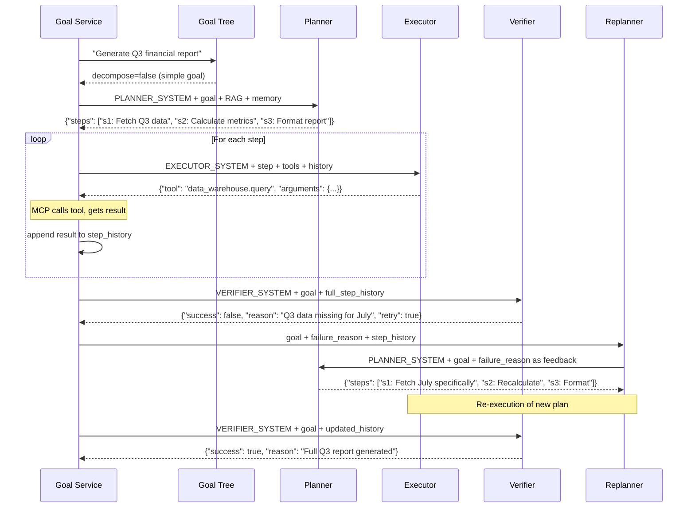

# Planner, Executor, and Verifier Prompts

The AgentVerse agent loop makes exactly three types of LLM calls per iteration cycle.
Each call uses a different system prompt that constrains the model to a specific role and
output format. Understanding these structures is prerequisite to debugging agent failures,
writing custom agent configs, or extending the loop with new capabilities.

## Planner Prompt

**Role**: Convert a natural-language goal into an ordered, executable step list.

**Input**: goal text + retrieved knowledge context + memory lessons + available tools
**Output**: `{"steps": ["Step 1: ...", "Step 2: ...", ...]}`

### System Prompt (PLANNER_SYSTEM)

```
You are an expert task planner. Given a goal, break it into a minimal ordered list of steps.
Respond ONLY with valid JSON in this exact format:
{"steps": ["Step 1: <description>", "Step 2: <description>", ...]}
No markdown, no explanation, only the JSON object.
```

**Design choices:**
- "minimal ordered list" — prevents over-engineering (5 steps, not 20)
- "Respond ONLY with valid JSON" — eliminates preamble that breaks JSON parsing
- Strict format constraint enables reliable parsing without LLM-specific gymnastics

### Structured Planner (STRUCTURED_PLANNER_SYSTEM)

For complex goals requiring parallel execution or risk-aware planning, the structured
planner adds tool references, dependency graphs, and risk classification:

```json
{
  "steps": [
    {
      "id": "s1",
      "description": "Fetch issue #123 from Jira",
      "tool": "jira.get_issue",
      "arguments": {"issue_id": "PROJ-123"},
      "depends_on": [],
      "risk": "read",
      "expected_output": "Issue title, description, assignee, status"
    },
    {
      "id": "s2",
      "description": "Get comments for issue #123",
      "tool": "jira.get_comments",
      "arguments": {"issue_id": "PROJ-123"},
      "depends_on": [],
      "risk": "read",
      "expected_output": "List of comments with author and timestamp"
    },
    {
      "id": "s3",
      "description": "Write bug report from issue data",
      "tool": null,
      "arguments": {},
      "depends_on": ["s1", "s2"],
      "risk": "read",
      "expected_output": "Formatted bug report markdown"
    }
  ]
}
```

**Risk levels** (`read | write_low | write_high | destructive`) gate HITL approval:
- `read`: always auto-approved
- `write_low`: auto-approved for non-production environments
- `write_high`: requires human approval in production
- `destructive`: always requires human approval + confirmation

## Executor Prompt

**Role**: Execute exactly one step using available tools.

**Input**: current step description + tool list + prior step results + constraints
**Output**: `{"tool": "server.tool_name", "arguments": {...}}` OR plain text result

### System Prompt (EXECUTOR_SYSTEM)

```
You are an expert task executor. Given a step to execute, perform it using the available tools.

CRITICAL GROUNDING RULES — NEVER violate these:
1. If a tool call is needed, respond with ONLY JSON (no markdown, no explanation):
   {"tool": "server_name.tool_name", "arguments": {"param": "value"}}
2. If no tool is needed and you can state the result from provided context, describe it concisely.
3. If you are UNCERTAIN or lack data, respond:
   {"tool": null, "result": "INSUFFICIENT DATA: <what is missing>"}
4. NEVER fabricate specific values (IDs, counts, dates, ticket numbers, names, URLs) without tool evidence.
5. NEVER claim a tool succeeded or returned data if you did not actually receive tool output.
6. NEVER invent tool names — only use tools from the ALLOWED TOOLS list provided in context.
```

The "CRITICAL GROUNDING RULES" section exists because early versions of the executor
hallucinated tool results without calling them. Rule 5 — "NEVER claim a tool succeeded
if you did not actually receive tool output" — was added after observing agents that
would say "I fetched the tickets and found 42 issues" when they had not called any tool.

### Context Injection Into Executor

```python
# app/agent/graph.py — executor node
messages = [
    Message(role="system", content=EXECUTOR_SYSTEM),
    Message(role="user", content=f"""
STEP TO EXECUTE:
{current_step}

ORIGINAL GOAL:
{goal}

ALLOWED TOOLS:
{json.dumps(tool_schemas, indent=2)}

RETRIEVED CONTEXT:
{rag_chunks_formatted}

PREVIOUS STEP RESULTS:
{step_history_formatted}

CONSTRAINTS:
- Max tool calls: 3
- Context window remaining: {tokens_remaining} tokens
""")
]
```

### Tool Call Format

The executor outputs a JSON object that `extract_tool_call()` in `app/agent/tool_calls.py`
parses to a `ToolCall` object:

```python
@dataclass
class ToolCall:
    server_name: str    # e.g. "jira"
    tool_name: str      # e.g. "get_issue"
    arguments: dict     # e.g. {"issue_id": "PROJ-123"}
```

If the LLM produces malformed JSON, `repair_tool_call_arguments()` attempts to fix common
errors (trailing commas, single quotes, missing braces) before failing.

## Verifier Prompt

**Role**: Determine whether the original goal has been achieved, given the full execution trace.

**Input**: original goal + all step results + evidence
**Output**: `{"success": true, "reason": "..."}` or `{"success": false, "reason": "...", "retry": true/false}`

### System Prompt (VERIFIER_SYSTEM)

```
You are a goal-completion verifier for an autonomous AI agent.

You receive:
- The original goal
- A summary of all execution steps taken so far and their outputs

Your task: determine whether the OVERALL GOAL has been sufficiently achieved.

Respond with ONLY a valid JSON object — no other text:
{"success": true, "reason": "Goal was achieved because..."}
or
{"success": false, "reason": "Goal not achieved: specifically, X was missing or wrong", "retry": true}
or
{"success": false, "reason": "Goal cannot be achieved: Y is fundamentally blocked", "retry": false}

Rules:
- "success": boolean — true only if the goal is genuinely, fully achieved
- "reason": string — specific, actionable explanation
- "retry": boolean — true if replanning could fix it, false if permanently blocked
- CRITICAL: if any step shows [TOOL FAILED] or [STEP ERROR], the goal is NOT successfully achieved
- CRITICAL: "Found 0 issues" when issues were expected is a FAILURE
- CRITICAL: a tool being called is NOT sufficient — the tool must return actual results
```

The `retry` field is critical for the loop. `retry: true` triggers replanning with the
failure reason injected as feedback. `retry: false` terminates the loop — no amount of
replanning will fix a fundamentally blocked goal (e.g., "the Jira project doesn't exist").

## Goal Tree System Prompt (GOAL_TREE_SYSTEM)

Before planning, large goals pass through the goal decomposer which decides whether
parallel sub-goals would be beneficial:

```
You are an expert goal decomposer. Given a high-level goal, decide whether it needs to be
broken into parallel sub-goals...

Rules:
- Only decompose if the goal has clearly independent sub-tasks.
- Simple goals (fewer than 4 steps) must NOT be decomposed — return decompose=false.
- Each sub-goal must be a self-contained, executable task.
- depends_on lists the IDs of sub-goals that must complete first.
```

## Chained Prompt Sequence



## Real-World Walkthrough: "Write a bug report for issue #123"

### Step 1 — Planning

```
[System] PLANNER_SYSTEM
[User]
GOAL: Write a detailed bug report for Jira issue #123 including reproduction steps

RETRIEVED CONTEXT:
<chunk source="jira-docs">
  Jira issues can be fetched via the jira.get_issue tool.
  Issue descriptions include: summary, description, priority, assignee.
</chunk>

MEMORY LESSONS:
- Past goal: "Fetch Jira tickets" — learned that issue IDs must be strings like "PROJ-123", not ints
```

**Planner output:**
```json
{
  "steps": [
    "Step 1: Fetch the details of Jira issue #123 using jira.get_issue",
    "Step 2: Retrieve comments on issue #123 for context",
    "Step 3: Compose the bug report from the fetched data"
  ]
}
```

### Step 2 — Execution (Step 1)

```
[System] EXECUTOR_SYSTEM
[User]
STEP: Step 1 — Fetch the details of Jira issue #123

ALLOWED TOOLS:
- jira.get_issue: Retrieves a Jira issue by ID. Args: {"issue_id": string}
- jira.get_comments: Retrieves comments for an issue. Args: {"issue_id": string}

GOAL: Write a detailed bug report for Jira issue #123
```

**Executor output:**
```json
{"tool": "jira.get_issue", "arguments": {"issue_id": "PROJ-123"}}
```

**MCP returns:**
```json
{
  "summary": "Login page crashes on Safari 17",
  "description": "Users on Safari 17.0 experience a crash on /login. Error: TypeError: Cannot read property 'token'",
  "priority": "High",
  "assignee": "alice@example.com"
}
```

### Step 3 — Verification

```
[System] VERIFIER_SYSTEM
[User]
GOAL: Write a detailed bug report for Jira issue #123

STEP RESULTS:
Step 1: ✅ Fetched issue PROJ-123 — "Login page crashes on Safari 17" (High priority)
Step 2: ✅ Retrieved 3 comments — Alice confirmed reproduction on macOS 14.2
Step 3: ✅ Composed bug report with title, description, environment, reproduction steps
```

**Verifier output:**
```json
{"success": true, "reason": "Complete bug report generated covering all required sections"}
```

## Token Budget in Practice

| Component | Typical Tokens | Source |
|---|---|---|
| `PLANNER_SYSTEM` | ~80 tokens | `app/agent/prompts.py` |
| `EXECUTOR_SYSTEM` | ~200 tokens | `app/agent/prompts.py` |
| `VERIFIER_SYSTEM` | ~220 tokens | `app/agent/prompts.py` |
| Goal text | 20–200 tokens | Goal service |
| Step history (per step) | 100–500 tokens | Accumulates per iteration |
| RAG chunks (3 chunks) | 300–1500 tokens | `ContextBudgetManager` |
| Tool schemas (5 tools) | 200–800 tokens | MCP registry |

For a 3-step goal with 3 RAG chunks and 5 tools: approximately **2,400–4,000 tokens** per
LLM call, comfortably within an 8K context window. After 10 steps, accumulated history
reaches 5,000 tokens — the oldest steps are trimmed to stay within budget.

**Real-World Example 2 — Sales CRM Agent**

> A sales CRM agent receives the goal "create a follow-up email for deal ACME-2024-Q3". The Planner LLM receives: `PLANNER_SYSTEM` (~80 tokens) + goal text (~25 tokens) + 4 memory chunks from `ExecutionMemory` about past ACME interactions (1,200 tokens) + 2 RAG chunks from the ACME company profile collection (600 tokens) + 8 CRM tool schemas (`jira.get_deal`, `crm.list_contacts`, `email.draft`, `email.send`, `crm.get_deal_history`, `crm.get_contacts`, `crm.update_deal`, `calendar.schedule`) (640 tokens). The Planner also receives a Verifier success-criteria hint injected as planning context: "email must reference deal value $485,000 and the Q3 close date". Total Planner context: ~2,545 tokens — well within the 8K limit. The resulting 3-step plan (fetch deal → fetch contact history → draft email) keeps each Executor call under 3,500 tokens because `ContextBudgetManager` scopes the history chunks to ACME only, preventing unrelated past deals from consuming the context budget. The Verifier's `retry: false` condition is pre-seeded: if the drafted email omits the deal value, the failure reason "email missing deal value $485,000" is injected as explicit feedback into the replanning cycle.

<!-- Sources: app/agent/prompts.py, app/agent/graph.py, app/agent/tool_calls.py -->
