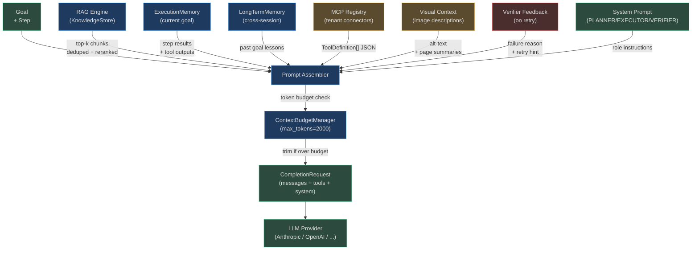

# Context Injection

The prompt assembler combines five distinct information sources into a single, token-budget-
constrained prompt for each LLM call. Getting this right determines whether the agent has
the right information at the right time — too little and it hallucmates; too much and it loses
focus or exceeds the context window.

## Full Injection Pipeline



## RAG Context Injection

The most impactful injection source. Retrieved chunks provide grounding facts that the LLM
cannot know from its training data alone (current ticket status, internal documentation,
real-time system state).

### ContextBudgetManager

`app/rag/context_manager.py` orchestrates which chunks make it into the prompt:

```python
class ContextBudgetManager:
    def __init__(self, max_tokens: int = 2000) -> None:
        self.max_tokens = max_tokens
        self._seen_chunk_ids: set[str] = set()

    def prepare(self, chunks: list[dict], step_query: str = "") -> ManagedContext:
        # 1. Remove already-seen chunks (cross-iteration dedup)
        seen_filtered = [c for c in chunks if c.get("chunk_id") not in self._seen_chunk_ids]

        # 2. Deduplicate by content (same text, different chunk_id)
        seen_content: set[str] = set()
        deduped = [c for c in seen_filtered if not (c["content"] in seen_content
                    or seen_content.add(c["content"]))]

        # 3. Re-rank by step query relevance (word overlap + base score)
        if step_query:
            query_words = set(step_query.lower().split())
            def relevance(c): return c.get("score", 0.5) + 0.1 * sum(
                1 for w in query_words if w in c.get("content", "").lower()
            )
            deduped = sorted(deduped, key=relevance, reverse=True)

        # 4. Token budget enforcement (chars / 4 ≈ tokens)
        selected, token_count = [], 0
        for c in deduped:
            tokens = max(1, len(c.get("content", "")) // 4)
            if token_count + tokens > self.max_tokens and selected: break
            selected.append(c); token_count += tokens
            self._seen_chunk_ids.add(c["chunk_id"])
        ...
```

**Key design decisions:**
- `_seen_chunk_ids` persists across steps within a goal — the same chunk won't be injected
  twice even if retrieved again in step 3 after being used in step 1
- Token estimation at 4 chars/token is intentionally conservative (true ratio is ~3.5)
- Re-ranking by step query (not just original goal) ensures step-specific chunks float up

### Chunk Formatting in Prompt

Chunks are formatted to make the source clear to the LLM:

```
RETRIEVED CONTEXT:
---
[Source: internal/jira-docs, Score: 0.89]
Jira issues can be fetched using the jira.get_issue tool. The tool accepts
a string issue_id parameter in the format "PROJECT-NUMBER"...

[Source: internal/api-reference, Score: 0.77]
Authentication tokens expire after 1 hour. Refresh using the auth.refresh_token tool...
---
```

## Memory Injection

Memory provides temporal continuity — the agent can learn from mistakes and apply lessons
from past similar goals. Three memory layers are injected in priority order:

### Memory Priority Order

```
1. ExecutionMemory (current goal)  ← highest priority, most recent
2. LongTermMemory (past goals)     ← lessons from previous goal runs
3. Reflexion traces                ← meta-learning from failure patterns
```

### ExecutionMemory Injection

Step results accumulated during the current goal execution:

```
STEP HISTORY:
Step 1 [✅ SUCCESS]: Fetched issue PROJ-123 — "Login crash on Safari"
  Tool: jira.get_issue → {"summary": "Login crash...", "priority": "High"}
Step 2 [❌ FAILED]: Could not fetch comments — tool returned empty list
  Tool: jira.get_comments → []
  Error: jira.get_comments returned 0 results; comments may be restricted
```

The `[TOOL FAILED]` and `[STEP ERROR]` markers in step history are specifically detected
by the verifier to force `success: false`.

### LongTermMemory Injection

Cross-session lessons are injected as a compact block:

```
MEMORY LESSONS FROM SIMILAR PAST GOALS:
- "Fetching Jira issues": issue IDs must be strings "PROJ-123", not integers
- "Writing reports": always include date, author, and version in report header
- "API authentication": auth tokens expire after 60 minutes; refresh before long operations
```

These lessons are retrieved by **semantic similarity** — the goal embedding is used to
find the top-3 most relevant memory entries.

## Tool Schema Injection

The executor receives the full JSON schema of every available tool:

```python
# CompletionRequest.tools contains ToolDefinition objects
@dataclass
class ToolDefinition:
    name: str          # "jira.get_issue"
    description: str   # "Fetches a Jira issue by its ID"
    input_schema: dict # JSON Schema for arguments
```

These are injected as `tools: list[ToolDefinition]` in the `CompletionRequest`. The LLM
sees them as a structured function-calling list:

```json
[
  {
    "name": "jira.get_issue",
    "description": "Fetches a Jira issue by its ID. Returns summary, description, priority, assignee.",
    "input_schema": {
      "type": "object",
      "properties": {
        "issue_id": {"type": "string", "description": "Issue ID like 'PROJ-123'"}
      },
      "required": ["issue_id"]
    }
  }
]
```

The executor system prompt explicitly says "only use tools from the ALLOWED TOOLS list" —
the injected tool list is that definitive catalogue.

## Visual Context Injection

When the agent operates on images (e.g., from the RPA/perception module or multimodal uploads),
image descriptions are injected as base64 data in the Message:

```python
# app/providers/base.py
class Message(BaseModel):
    role: MessageRole
    content: str | list[dict[str, Any]]
    image_data: str | None = None  # Base64-encoded image for vision models
```

For Anthropic Claude vision:
```python
content = [
    {"type": "image", "source": {"type": "base64", "media_type": "image/png",
                                  "data": base64_image}},
    {"type": "text", "text": "Describe the error visible in this screenshot"}
]
```

Visual context is injected for:
- RPA browser automation (screenshots of current page state)
- PDF pages with diagrams (page image + extracted text)
- Dashboard monitoring (chart screenshots for anomaly detection)

## Feedback Injection (Retry Loop)

When the verifier returns `success: false, retry: true`, the failure reason is injected
as explicit feedback into the next planning cycle:

```
PREVIOUS ATTEMPT FAILED:
Reason: "Step 2 returned empty comments list. The jira.get_comments tool may require
additional permissions or the issue may have no comments. Consider fetching issue
history instead, or checking with jira.get_issue_history tool."

RETRY HINT: Try jira.get_issue_history as alternative to jira.get_comments
```

This transforms the retry from a blind re-execution into an **informed retry** where the
planner knows exactly what went wrong and can choose a different path.

## System Prompt Customisation

Each agent deployment can override the default system prompts via agent configuration:

```python
# app/api/agents_router.py — agent creation
agent_config = {
    "custom_system_prompt": "You are a specialized financial analyst agent...",
    "planner_override": "Always include risk assessment in every step.",
    "executor_constraints": "Never call DELETE tools without explicit confirmation.",
}
```

When a custom system prompt is set, it is **prepended** to the base system prompt, not
replaced. This ensures the core grounding rules (no fabrication, strict JSON output) are
always enforced even in highly customised agents.

## Token Budget Allocation and Trimming

```
Available context window: 8192 tokens
System prompt:            ~200 tokens  (EXECUTOR_SYSTEM)
Tool schemas (8 tools):   ~640 tokens
Goal + step:              ~150 tokens
─────────────────────────────────────
Remaining for content:    7202 tokens

  RAG context budget:     2800 tokens (ContextBudgetManager max_tokens=2000 + rerank overhead)
  Memory budget:          1200 tokens
  Step history:           2000 tokens (current goal execution)
  Visual context:          500 tokens (if images present)
  Verifier feedback:       300 tokens (retry mode only)
  Reserved/output:         402 tokens
```

### Trimming Priority (Last to First)

When budget is exceeded, content is dropped in this order:
1. **Oldest step history** — oldest steps from 5+ iterations back
2. **Long-term memory** — least-relevant past goal lessons
3. **Lower-scored RAG chunks** — chunks with similarity score < 0.6
4. **Visual context** — image descriptions (expensive tokens, often redundant)

The system prompt, goal text, current step, and high-scoring RAG chunks are **never trimmed**.

## Real-World Example: Support Agent

A support agent handles "How do I configure SSO for my organization?":

| Injection Source | Content | Tokens |
|---|---|---|
| System prompt | `EXECUTOR_SYSTEM` | 200 |
| Tool schemas | `confluence.search`, `jira.create_issue`, `slack.send_message` | 240 |
| Goal + step | "Step 1: Search Confluence for SSO configuration guide" | 35 |
| RAG chunk 1 | Confluence page: "SAML 2.0 Configuration" (Score: 0.94) | 650 |
| RAG chunk 2 | Confluence page: "Okta Integration Guide" (Score: 0.87) | 580 |
| RAG chunk 3 | Confluence page: "Single Sign-On FAQ" (Score: 0.78) | 420 |
| Memory | Past lesson: "SSO config requires admin privileges to verify" | 25 |
| **Total** | | **2,150 tokens** |

The response will be a Confluence search tool call, grounded in the actual documentation
chunks rather than the LLM's potentially-stale training data.

**Real-World Example 2 — Code Review Agent**

> A code review agent assembles its Executor prompt for "Step 2: identify security issues in the authentication module". The `ContextBudgetManager` receives 18 candidate RAG chunks from the codebase knowledge collection but must fit within the 2,000-token budget: 12 chunks survive (4,800 chars ≈ 1,200 tokens), covering `auth.py`, `middleware.py`, and 10 related modules. Three `LongTermMemory` entries about past review patterns contribute 800 tokens ("always check JWT expiry handling", "check for timing attacks in comparisons", "verify CSRF token scope"). Six GitHub tool schemas (`github.get_file`, `github.create_comment`, `github.list_pr_files`, `github.get_diff`, `github.approve_pr`, `github.request_changes`) add 1,200 tokens. Visual context from an architecture diagram screenshot — analyzed by the vision provider to produce alt-text — contributes 400 tokens. The total assembled context before trimming is 3,600 tokens: 400 tokens over the 2,000-token `ContextBudgetManager` budget. `ContextBudgetManager` drops the 3 lowest-relevance RAG chunks (scores 0.38, 0.41, 0.44), saving ~320 tokens, then trims one older memory entry, delivering a final injected context of 1,980 tokens that retains all high-signal chunks (score > 0.6) and all three memory lessons intact.

<!-- Sources: app/rag/context_manager.py, app/agent/graph.py, app/providers/base.py -->
