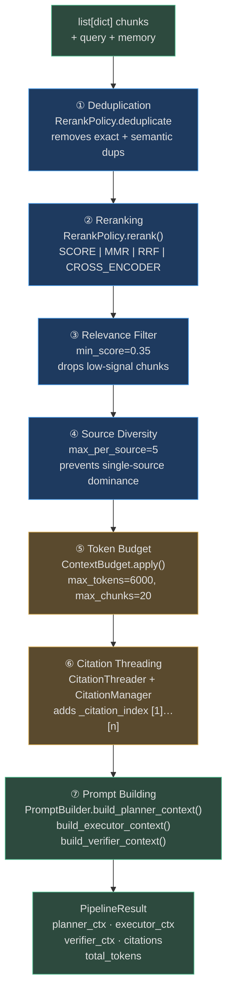

# Context Module

`app/context/` is the **prompt assembly engine**. It sits between the RAG layer (which returns
raw chunks) and the LLM provider (which receives a structured `CompletionRequest`). The four
classes in this module handle every step from raw chunks to final prompt:

| Class | File | Role |
|---|---|---|
| `ContextPipeline` | `app/context/context_pipeline.py` | Orchestrates the 7-step assembly pipeline |
| `PromptBuilder` | `app/context/prompt_builder.py` | Builds role-specific prompt text from a bundle |
| `PromptBudget` | `app/context/prompt_budget.py` | Typed exact-token budget with immutable safety blocks |
| `CitationManager` | `app/context/citation_manager.py` | Threads `[1]`–`[n]` citation indices onto chunks |

Together they turn a raw list of retrieved chunks + memory traces into the final
`planner_context`, `executor_context`, and `verifier_context` strings injected into every LLM
call.

---

## Architecture: The Seven-Step Pipeline



---

## ContextPipeline

`ContextPipeline` is the entry point. Calling `.run()` once executes all seven steps and
returns a `PipelineResult` with all three role-specific context strings plus citation metadata.

### Constructor

```python
# app/context/context_pipeline.py
class ContextPipeline:
    def __init__(
        self,
        max_tokens: int = 6000,
        min_relevance_score: float = 0.35,
        max_chunks: int = 20,
        max_per_source: int = 5,
        rerank_strategy: RerankStrategy = RerankStrategy.SCORE,
        citation_required: bool = True,
        deduplication_enabled: bool = True,
    ) -> None:
```

| Parameter | Default | Effect |
|---|---|---|
| `max_tokens` | 6000 | Hard token budget for all injected context |
| `min_relevance_score` | 0.35 | Chunks below this score are dropped |
| `max_chunks` | 20 | Maximum number of chunks regardless of token budget |
| `max_per_source` | 5 | Prevents any single document from dominating |
| `rerank_strategy` | `SCORE` | `SCORE` \| `MMR` \| `RRF` \| `CROSS_ENCODER` |
| `citation_required` | `True` | Whether to generate citation indices |
| `deduplication_enabled` | `True` | Whether to remove duplicate chunks |

### `.run()` — Single Entry Point

```python
result: PipelineResult = pipeline.run(
    chunks=retrieved_chunks,           # from RAGEngine / KnowledgeStore
    query="What is the refund policy?",
    goal_context="Handle customer refund request",
    step_context="Step 3: look up order history",
    session_memory=[{"role": "user", "content": "..."}],
    reflexion_lessons=["Avoid over-promising timelines"],
    web_results=[{"title": "...", "content": "..."}],
)

# Use the outputs:
planner_prompt = result.planner_context    # → Planner LLM
executor_prompt = result.executor_context  # → Executor LLM
verifier_prompt = result.verifier_context  # → Verifier LLM
citations = result.citations               # [Citation(index=1, source_url=...)]
total_tokens = result.total_tokens         # how many tokens were used
```

### PipelineResult

```python
@dataclass
class PipelineResult:
    included_chunks: list[dict]     # chunks that survived all filters
    planner_context: str            # pre-built planner prompt section
    executor_context: str           # pre-built executor prompt section
    verifier_context: str           # pre-built verifier prompt section
    citations: list[Citation]       # ordered list of citation metadata
    total_tokens: int               # total tokens used by all included chunks
    dedup_removed: int              # how many duplicates were removed
    filtered_removed: int           # how many failed the relevance threshold
```

---

## PromptBuilder

`PromptBuilder` converts a `PromptContextBundle` (chunks + citations + memory + web results)
into three distinct prompt strings, one per LLM role.

### Constructor

```python
class PromptBuilder:
    def __init__(self, max_context_tokens: int = 6000) -> None:
```

### PromptContextBundle

The input data object:

```python
@dataclass
class PromptContextBundle:
    goal_context: str = ""
    knowledge_chunks: list[dict] = field(default_factory=list)
    citations: list[Any] = field(default_factory=list)
    session_memory: list[dict] = field(default_factory=list)
    reflexion_lessons: list[str] = field(default_factory=list)
    web_results: list[dict] = field(default_factory=list)
    tool_schemas: list[dict] = field(default_factory=list)
    image_descriptions: list[str] = field(default_factory=list)
```

### Three Role Methods

```python
# Build Planner context: goal + memory + knowledge summary + lessons
planner_ctx: str = builder.build_planner_context(bundle)

# Build Executor context: knowledge details + tools + step instructions
executor_ctx: str = builder.build_executor_context(bundle, step="Step 2: ...")

# Build Verifier context: success criteria + evidence + expected outputs
verifier_ctx: str = builder.build_verifier_context(bundle)
```

Each method formats context differently:

| Method | Primary Content | Token Priority |
|---|---|---|
| `build_planner_context` | Goal, memory, high-level knowledge summary, lessons | Goal first, memory second, knowledge summarized |
| `build_executor_context` | Detailed chunk content with `[n]` citations, tool schemas | Knowledge first (executor needs facts to act) |
| `build_verifier_context` | Citations list, success criteria, evidence fragments | Citations prominent (verifier is checking grounding) |

### Auto-Compression

When context exceeds `max_context_tokens`, `PromptBuilder._auto_compress()` triggers:

```python
def _auto_compress(self, text: str, model_max_tokens: int | None = None) -> str:
    # Truncates to model_max_tokens * 4 chars (chars/4 ≈ tokens)
    # Preserves start and end, truncates middle with "[...truncated...]"
```

---

## PromptBudget

`PromptBudget` is a **typed, exact-token budget manager** for scenarios requiring precise
control over which content blocks are included in a prompt.

Unlike `ContextBudget` (which operates on chunks), `PromptBudget` operates on **named
`PromptBlock` partitions** — structured content units that can be individually marked as
immutable (never compressed or dropped).

### Partitions

```python
PromptPartition = Literal[
    "instructions",       # system-level role instructions (usually immutable)
    "current_plan",       # current goal plan steps
    "working_memory",     # short-term working memory
    "reflexion",          # reflexion lessons from past failures
    "long_term_memory",   # cross-session memory
    "episodic_memory",    # episode memories
    "procedural_memory",  # how-to skill memories
    "retrieval",          # RAG chunks
    "tool_schemas",       # MCP tool definitions
    "conversation",       # conversation history
    "reserved_output",    # reserved space for LLM output
]
```

### PromptBlock

```python
class PromptBlock(BaseModel):
    block_id: str
    partition: PromptPartition
    content: str
    immutable: bool = False             # if True, never compressed or dropped
    required_fact_ids: tuple[str, ...]  # facts that must be present
    source_references: tuple[str, ...]  # provenance references
```

### Usage Pattern

```python
from app.context.prompt_budget import PromptBudget, PromptBlock

budget = PromptBudget(
    token_counter=lambda t: len(t) // 4,    # chars / 4 ≈ tokens
    compressor=my_compressor,               # callable that condenses a block
)

blocks = (
    PromptBlock(
        block_id="system",
        partition="instructions",
        content=PLANNER_SYSTEM_PROMPT,
        immutable=True,              # never drop system instructions
    ),
    PromptBlock(
        block_id="retrieval-1",
        partition="retrieval",
        content=chunk_text,
    ),
)

result: PromptBudgetResult = budget.fit(
    blocks,
    maximum_tokens=8000,
    reserved_output_tokens=2000,
)

# result.blocks — the surviving blocks after compression/dropping
# result.token_savings — tokens saved by compression
# result.compressed_block_ids — which blocks were compressed
```

### Safety Guarantee

`PromptBudget` enforces two invariants:

1. **Immutable blocks are never dropped or compressed** — system instructions and required
   facts are always present
2. **`reserved_output_tokens` are always honoured** — the LLM always has space to generate
   its response

---

## CitationManager

`CitationManager` threads `[1]`–`[n]` citation indices onto chunks and generates a formatted
`Sources:` block for inclusion in prompts and API responses.

### Core Methods

```python
class CitationManager:
    def attach_citations(
        self, chunks: list[dict]
    ) -> tuple[list[dict], list[Citation]]:
        """
        Adds '_citation_index' key to each chunk dict.
        Returns (annotated_chunks, citations_list).
        """

    def format_citation_block(self, citations: list[Citation]) -> str:
        """
        Returns a formatted 'Sources:' section, e.g.:
        Sources:
        [1] https://docs.company.com/refund-policy (score: 0.92, p.4)
            Preview: Customers may request a full refund within 30 days...
        [2] https://jira.company.com/TICKET-123 (score: 0.87)
            Preview: Customer reported issue with order #98765...
        """
```

### Citation Dataclass

```python
@dataclass
class Citation:
    index: int             # [1], [2], ... displayed in prompt
    chunk_id: str          # internal chunk identifier
    source_url: str        # full URL to source document
    page_number: int | None
    score: float           # retrieval relevance score
    content_preview: str   # first 100 chars of chunk content
```

### Example — With Formatted Output

```python
manager = CitationManager()
annotated_chunks, citations = manager.attach_citations(retrieved_chunks)

# Each chunk now has: {"_citation_index": 1, "content": "...", ...}

citation_block = manager.format_citation_block(citations)
# Sources:
# [1] https://kb.company.com/policy-2026 (score: 0.94, p.2)
#     Preview: All refunds are processed within 5–7 business days...
# [2] https://jira.company.com/SUPPORT-4421 (score: 0.81)
#     Preview: Customer dispute for order #AB-99321 was resolved...
```

The `citation_block` string is injected by `PromptBuilder.build_verifier_context()` to give
the Verifier LLM explicit source evidence when checking grounding.

---

## Data Flow: From Chunks to LLM

```
RAGEngine.retrieve(query)
    → list[dict] raw_chunks

ContextPipeline.run(chunks, query, ...)
    → ① dedup (RerankPolicy)
    → ② rerank
    → ③ filter (min_score=0.35)
    → ④ diversity (max_per_source=5)
    → ⑤ token budget (ContextBudget)
    → ⑥ citations (CitationManager → [1][2][3]...)
    → ⑦ PromptBuilder.build_planner_context()
              .build_executor_context()
              .build_verifier_context()
    → PipelineResult{planner_ctx, executor_ctx, verifier_ctx, citations}

AgentGraph._build_completion_request(role="planner")
    → CompletionRequest(system=PLANNER_SYSTEM, messages=[..., planner_ctx])

LLMProvider.complete(request)
    → CompletionResponse.content  (the plan steps)
```

---

## Integration with the Agent Loop

`ContextPipeline` is instantiated once per `AgentGraph` execution and called at each step:

```python
# app/agent/graph.py (simplified)
pipeline = ContextPipeline(
    max_tokens=settings.context_max_tokens,
    rerank_strategy=RerankStrategy.SCORE,
)

# Per step:
chunks = await rag_engine.retrieve(step_query, strategy=rag_strategy, ...)
result = pipeline.run(
    chunks=chunks,
    query=step_query,
    goal_context=state.goal,
    step_context=current_step.description,
    session_memory=memory.session_entries(),
    reflexion_lessons=memory.reflexion_lessons(),
)
# result.executor_context → Executor LLM system message
# result.citations        → stored in state for provenance
```

---

## Related Pages

- [01 — Planner, Executor & Verifier Prompts](./01-planner-executor-verifier-prompts.md) — the role-specific system prompts
- [02 — Context Injection](./02-context-injection.md) — `ContextBudgetManager` (RAG-layer chunk manager)
- [03 — Prompt Safety & Optimization](./03-prompt-safety-and-optimization.md) — injection attack prevention, PromptOptimizer
- [RAG System](../rag/README.md) — the retrieval strategies that produce the chunks
- [Hallucination Handling](../hallucination-handling/README.md) — how `CitationManager` feeds into the attribution verifier

---

## Real-World Examples

**Real-World Example 1 — Data Analytics Agent**

> A data analytics agent processes the goal "summarize Q2 sales performance across APAC regions". The RAG engine returns 15 candidate chunks (5 from `sales_reports`, 4 from `regional_benchmarks`, 6 from `product_catalog`), 4 memory items from past analytics goals (800 tokens total), and 5 tool schemas (`data_warehouse.query`, `excel.export`, `slack.send`, `confluence.create_page`, `charts.render`) for a 16K context window configured with `ContextPipeline(max_tokens=6000, max_chunks=20)`. The `min_relevance_score=0.35` filter drops 3 of the 6 product-catalog chunks (scores 0.37, 0.39, 0.41). Source diversity enforcement (`max_per_source=5`) then caps `sales_reports` at 5 chunks, preventing a single over-represented collection from consuming the budget. The final `PipelineResult` contains 10 chunks (3,400 tokens), 4 memory items (800 tokens), and 5 tool schemas (900 tokens) — 5,100 total tokens, under the 6,000-token cap with `dedup_removed=2` and `filtered_removed=3` reported for observability. No information critical to the analytics task is trimmed.

**Real-World Example 2 — Multi-Lingual Support Agent**

> A Japanese-language support agent handles the query「注文#98765の返金状況を確認してください」("Check refund status for order #98765"). Japanese text incurs approximately 2× token overhead versus English due to Unicode character encoding — the same semantic content that takes 120 English tokens requires ~230 Japanese tokens. `PromptBudget` detects that the assembled prompt totals 8,200 tokens against an 8,000-token hard cap (200 tokens over). It compresses in strict priority order: the two oldest `episodic_memory` blocks (from goals 14 days ago) are compressed from 800 tokens to 200 tokens via `_auto_compress()`, saving 600 tokens. The `immutable=True` blocks — system instructions, current plan steps, and the specific order ID "#98765" — are never touched. The final prompt is 7,600 tokens, and `PromptBudgetResult` reports `compressed_block_ids=["episodic-1", "episodic-2"]` and `token_savings=600` — surfaced as structured log fields for the observability dashboard to track per-language compression rates.
