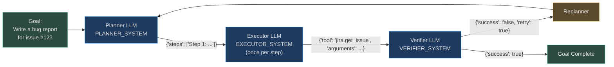
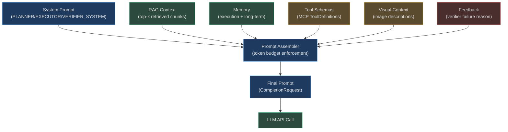

# Prompt Builder

Every action an AgentVerse agent takes begins with a prompt. The prompt assembler combines
system instructions, retrieved knowledge, memory traces, tool schemas, and safety guardrails
into the precise sequence of tokens that determines what the LLM does next.

**Prompt quality directly equals agent quality.** A vague planner prompt produces vague
step lists. An executor prompt that doesn't emphasise grounding produces hallucinated tool
calls. A verifier prompt with loose success criteria accepts wrong answers. This section
documents the exact prompt structures and how they are built.

## The Three Prompt Roles

AgentVerse uses **three structurally distinct LLM calls** per agent iteration, each with
its own system prompt, input format, and output format:



## Prompt Assembly Pipeline

Building each LLM call involves injecting multiple context sources:



## How Prompt Quality Drives Agent Quality

The executor prompt's grounding rules are particularly critical. Notice the explicit
anti-hallucination constraints in `EXECUTOR_SYSTEM`:

```
4. NEVER fabricate specific values (IDs, counts, dates, ticket numbers, names, URLs)
   without tool evidence.
5. NEVER claim a tool succeeded or returned data if you did not actually receive tool output.
6. NEVER invent tool names — only use tools from the ALLOWED TOOLS list.
```

These constraints directly prevent the most common agent failure modes:
- **ID hallucination**: "I found ticket PROJ-1234" (the ticket doesn't exist)
- **Phantom success**: "The file was uploaded successfully" (no upload tool was called)
- **Invented tools**: calling `database.sql_query` when only `jira.*` tools are available

The verifier prompt enforces matching standards:

```
- CRITICAL: if any step shows [TOOL FAILED] or [STEP ERROR], the goal is NOT successfully achieved
- CRITICAL: "Found 0 issues" when issues were expected is a FAILURE
- CRITICAL: a tool being called is NOT sufficient — the tool must return actual results
```

## CompletionRequest Structure

Every prompt is wrapped in a `CompletionRequest` from `app/providers/base.py`:

```python
@dataclass
class CompletionRequest:
    messages: list[Message]
    model: str
    system: str | None = None          # system prompt (PLANNER/EXECUTOR/VERIFIER_SYSTEM)
    tools: list[ToolDefinition] = ...  # available MCP tools
    max_tokens: int = 4096
    temperature: float = 0.0           # always 0 for determinism
    response_schema: dict | None = ... # JSON Schema for structured output
    cache_prefix: str | None = None    # Anthropic prompt caching prefix
```

`temperature=0.0` is hardcoded across all three roles — agents must be **deterministic**,
not creative. Creativity in the prompts themselves (rephrasing, diverse step generation)
is achieved through the planner system prompt's phrasing, not temperature.

## Token Budget Allocation

A typical 8K-token context window is allocated as follows (approximate):

| Injection | Target % | Tokens (8K) | Contents |
|---|---|---|---|
| System prompt | 10% | 800 | PLANNER/EXECUTOR/VERIFIER_SYSTEM |
| Tool schemas | 20% | 1,600 | MCP ToolDefinition JSON |
| RAG context | 35% | 2,800 | Top-k retrieved chunks |
| Memory | 15% | 1,200 | Execution + long-term memory |
| Goal + history | 15% | 1,200 | Goal, previous steps, verifier feedback |
| Reserved | 5% | 400 | Output tokens buffer |

When content exceeds budget, it is trimmed in reverse priority order:
RAG chunks first, then memory entries, then older step history.

## In This Section

| File | Contents |
|---|---|
| [01-planner-executor-verifier-prompts.md](./01-planner-executor-verifier-prompts.md) | Deep dive on each role: structure, real examples, token budget |
| [02-context-injection.md](./02-context-injection.md) | RAG, memory, tools, visual, feedback injection mechanics |
| [03-prompt-safety-and-optimization.md](./03-prompt-safety-and-optimization.md) | Injection detection, encoding attacks, A/B testing, optimizer |

<!-- Sources: app/agent/prompts.py, app/agent/graph.py, app/providers/base.py -->
