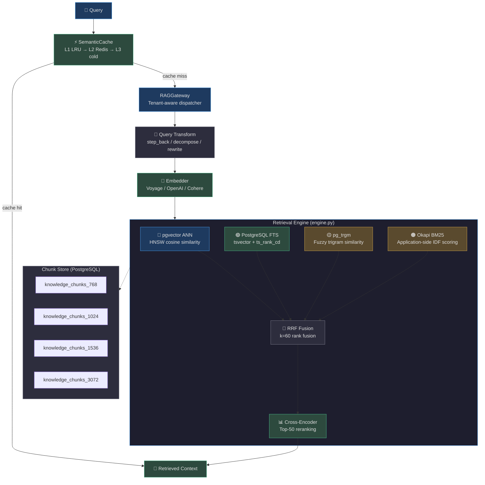
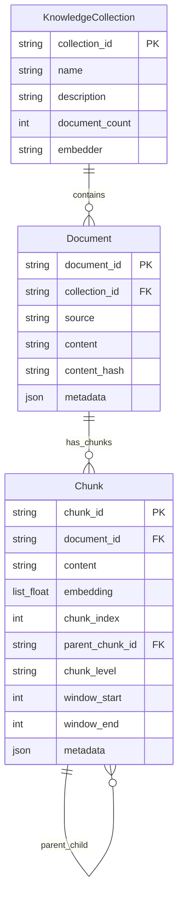
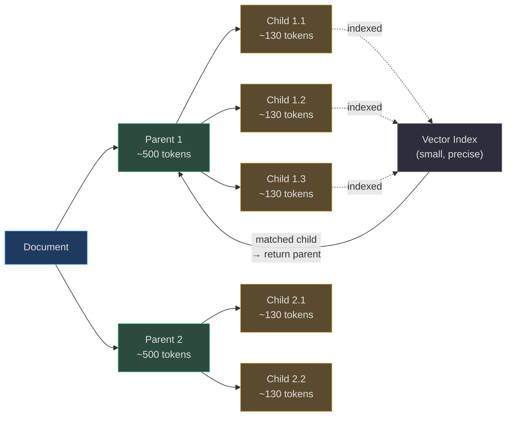
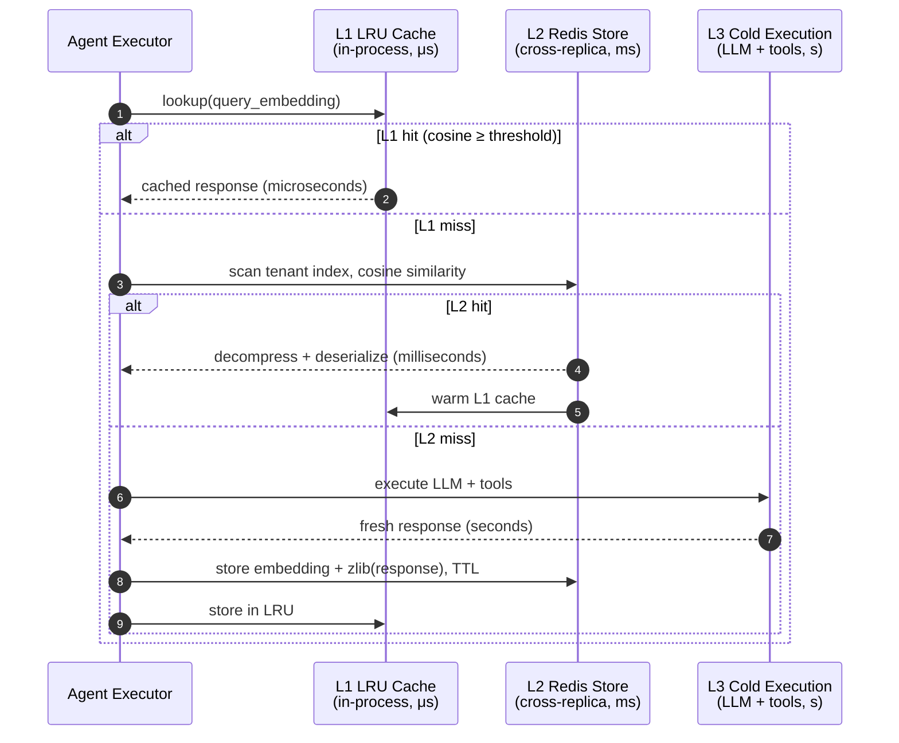
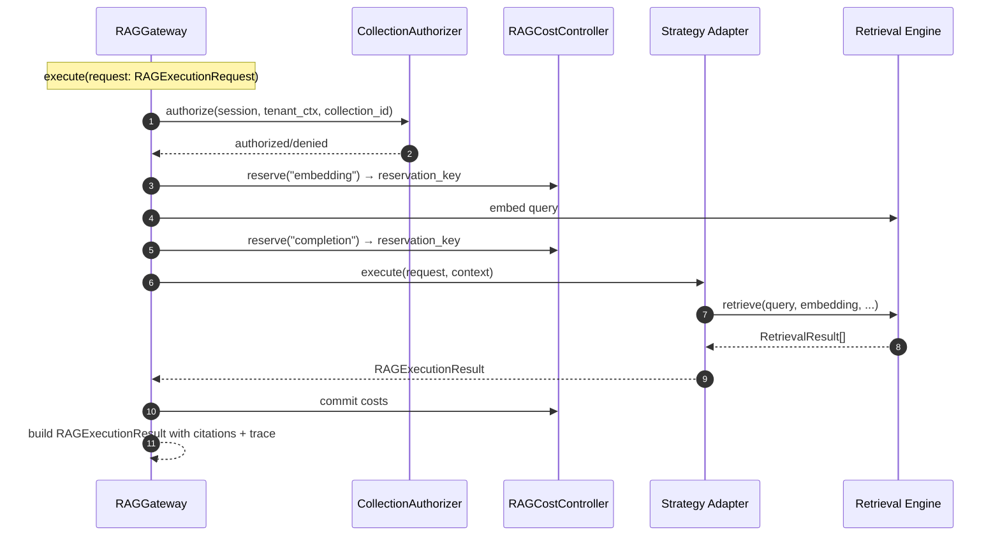
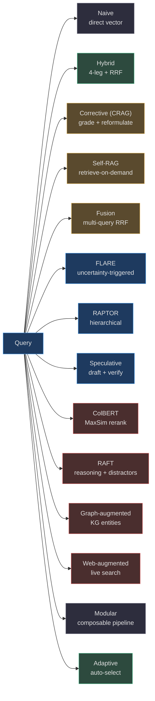
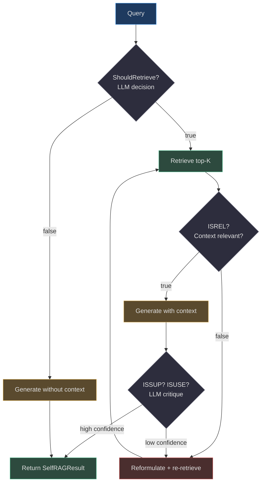
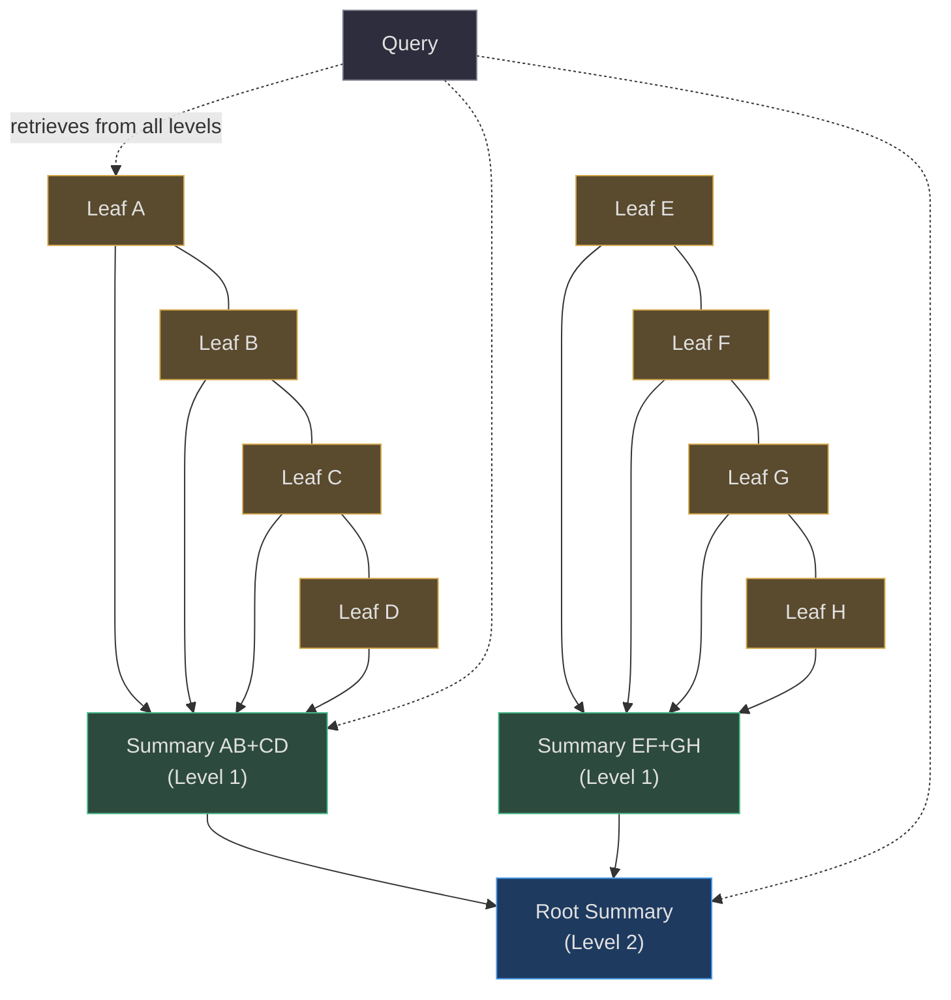

# RAG System

AgentVerse implements a **production-grade, multi-strategy RAG system** that routes every query through the most appropriate combination of vector search, full-text search, BM25, and reranking — all fused with Reciprocal Rank Fusion. On top of this retrieval engine sits a catalogue of 13 agentic patterns (FLARE, RAPTOR, Self-RAG, ColBERT, and more) that compose retrieval with LLM reasoning for maximum answer quality.

This page covers:
- The **four-leg retrieval engine** and how RRF fusion works
- All **chunking strategies** — from fixed to late chunking
- The **semantic cache** — three-layer deduplication with true cosine similarity
- All **13 agentic RAG patterns** with When / How / Trade-offs
- The **RAGGateway** — the public interface
- The **LLM query transformer** and query expansion utilities

---

## 1. Architecture Overview


<!-- Sources: app/rag/engine.py:1-50, app/rag/gateway.py:1-50, app/rag/store.py:1-40 -->

---

## 2. The Retrieval Engine

### 2.1 Four Retrieval Legs

[`app/rag/engine.py`](https://github.com/harsh786/agent-verse/blob/main/agent-verse-backend/app/rag/engine.py) implements four parallel retrieval legs, each specializing in a different aspect of similarity:

| Leg | Technology | What It Captures | Fails On |
|---|---|---|---|
| **Vector ANN** | pgvector HNSW, cosine similarity | Semantic meaning, paraphrases | Exact keyword matches, rare terms |
| **Full-Text Search** | PostgreSQL `tsvector` + `ts_rank_cd` | Exact keyword matches, morphological variants | Synonyms, abbreviations |
| **Trigram** | `pg_trgm` fuzzy similarity | Typo tolerance, partial word matches | Long phrases, semantic meaning |
| **BM25** | Application-side Okapi BM25 | Term frequency + inverse document frequency | Semantic similarity |

**Retrieval modes** (per-query configurable):
- `"hybrid"` (default): all 4 legs + RRF fusion + optional reranking
- `"lexical"`: FTS + trigram only (no embeddings needed — works in vector-DB-less mode)
- `"vector"`: ANN only (fastest, requires embeddings)

**Vector-DB-less graceful degradation**: when a collection has no embeddings or no embedding provider is configured, the engine automatically falls back to `lexical` mode.

<!-- Source: app/rag/engine.py:1-30 — module docstring -->

### 2.2 Reciprocal Rank Fusion (RRF)

RRF merges ranked lists from multiple retrieval legs without needing calibrated scores across legs. For each document $d$ ranked at position $r_i$ by leg $i$:

$$\text{RRF}(d) = \sum_{i} \frac{1}{k + r_i}$$

Where $k = 60$ ([`_RRF_K`](https://github.com/harsh786/agent-verse/blob/main/agent-verse-backend/app/rag/engine.py#L40)) is the RRF dampening constant (standard value from Cormack et al. 2009).

**Why k=60?** The constant 60 prevents over-weighting of very high positions (rank 1 scores 1/61 ≈ 0.016) while still distinguishing between positions 1 and 10 (1/61 vs. 1/70).

Each `RetrievalResult` carries:
- `score`: final RRF-fused score
- `rrf_score`: raw RRF contribution
- `component_scores`: per-leg scores for debugging
- `retrieval_legs`: which legs contributed (e.g., `["vector", "bm25"]`)

<!-- Source: app/rag/engine.py:37, 43-60 — _RRF_K, RetrievalResult -->

### 2.3 BM25 Implementation

[`app/rag/bm25.py`](https://github.com/harsh786/agent-verse/blob/main/agent-verse-backend/app/rag/bm25.py) implements **application-side Okapi BM25** (no external dependency):

$$\text{BM25}(q, d) = \sum_{t \in q} \text{IDF}(t) \cdot \frac{f_{t,d} \cdot (k_1 + 1)}{f_{t,d} + k_1 \cdot (1 - b + b \cdot |d|/\text{avgdl})}$$

Parameters: `k1=1.5`, `b=0.75` (standard Okapi BM25 defaults).

`BM25CorpusScorer` operates in two phases:
1. **`observe(content)`**: accumulate document frequency statistics over the corpus
2. **`score(content)`**: score a document against the current query using accumulated stats

The corpus is loaded in pages of [`_BM25_PAGE_SIZE=500`](https://github.com/harsh786/agent-verse/blob/main/agent-verse-backend/app/rag/engine.py#L43) documents to keep memory bounded.

<!-- Source: app/rag/bm25.py:1-100 -->

### 2.4 Cross-Encoder Reranking

After RRF fusion, the top-50 candidates are reranked by a cross-encoder model (e.g., ColBERT or a standard cross-encoder) that scores each (query, document) pair jointly — capturing fine-grained relevance that bi-encoder models miss. The reranker is injected via the `retrieval_gateway` dependency and can be swapped without touching the engine.

---

## 3. Data Model


<!-- Source: app/rag/models.py:1-45 -->

Chunks are stored in dimension-specific tables:

| Table | Embedding Size | Provider Examples |
|---|---|---|
| `knowledge_chunks_768` | 768 dims | Voyage, various open-source |
| `knowledge_chunks_1024` | 1024 dims | Cohere, Voyage large |
| `knowledge_chunks_1536` | 1536 dims | `text-embedding-3-small` |
| `knowledge_chunks_3072` | 3072 dims | `text-embedding-3-large` |

Using separate tables (instead of a `vector(n)` column with nullable dimensions) allows Postgres to build tight HNSW indexes and avoids dimension mismatch errors at query time.

<!-- Source: app/rag/store.py:26-32 — SUPPORTED_EMBEDDING_DIMENSIONS -->

---

## 4. Chunking Strategies

Six chunking strategies are implemented, each optimizing a different retrieval trade-off:

```mermaid
graph TB
    DOC["📄 Raw Document"]

    DOC --> FIXED["Fixed-size<br><i>SemanticChunker(strategy='fixed')</i><br>• Fixed N chars + overlap<br>• Fast, predictable"]
    DOC --> TEXT["Text (Sentence-boundary)<br><i>SemanticChunker(strategy='text')</i><br>• Split on .!?<br>• Respects sentence integrity"]
    DOC --> MD["Markdown<br><i>SemanticChunker(strategy='markdown')</i><br>• Split on # headings<br>• Semantic section boundaries"]
    DOC --> CODE["Code<br><i>SemanticChunker(strategy='code')</i><br>• Split on class/def<br>• Function-level granularity"]
    DOC --> PC["Parent-Child<br><i>ParentChildChunker</i><br>• Large parent + small children<br>• Precise match, rich return"]
    DOC --> SW["Sentence Window<br><i>SentenceWindowChunker</i><br>• Single sentence indexed<br>• ±N window returned"]
    DOC --> LATE["Late Chunking<br><i>LateChunker</i><br>• Full-doc embedding sliced<br>• Best context awareness"]
    DOC --> CTX["Contextual Enrichment<br><i>ContextualChunkEnricher</i><br>• Doc summary prepended<br>• Improves recall for orphan chunks"]

    style DOC fill:#1e3a5f,stroke:#4a9eed,color:#e0e0e0
    style FIXED fill:#2d2d3d,stroke:#7a7a8a,color:#e0e0e0
    style TEXT fill:#2d4a3e,stroke:#4aba8a,color:#e0e0e0
    style MD fill:#2d4a3e,stroke:#4aba8a,color:#e0e0e0
    style CODE fill:#2d4a3e,stroke:#4aba8a,color:#e0e0e0
    style PC fill:#1e3a5f,stroke:#4a9eed,color:#e0e0e0
    style SW fill:#1e3a5f,stroke:#4a9eed,color:#e0e0e0
    style LATE fill:#5a4a2e,stroke:#d4a84b,color:#e0e0e0
    style CTX fill:#5a4a2e,stroke:#d4a84b,color:#e0e0e0
```


<!-- Sources: app/rag/chunker.py, app/rag/parent_child_chunker.py, app/rag/sentence_window.py, app/rag/late_chunker.py, app/rag/contextual_enricher.py -->

### 4.1 SemanticChunker

**File**: [`app/rag/chunker.py`](https://github.com/harsh786/agent-verse/blob/main/agent-verse-backend/app/rag/chunker.py)

Four strategies via `source_type` parameter:

| Strategy | `source_type` | Split Logic | Best For |
|---|---|---|---|
| Sentence-boundary | `"text"` | Regex `(?<=[.!?])\s+`, respects `max_chars` with overlap | Prose documents, articles |
| Markdown-aware | `"markdown"` | Split on `#` heading patterns | Documentation, README files |
| Code-aware | `"code"` or `"python"` | Split on `class`/`def` definitions | Source code files |
| Fixed-size | (fallback) | Fixed `max_chars` with `overlap_chars` tail | Any text, guaranteed chunk sizes |

Default configuration: `max_chars=512`, `overlap_chars=64`, `min_chunk_chars=50`.

**Overlap rationale**: the last 64 characters of each chunk are prepended to the next chunk. This ensures that sentences or code blocks split at a boundary don't lose context.

<!-- Source: app/rag/chunker.py:30-100 -->

### 4.2 Parent-Child Chunker

**File**: [`app/rag/parent_child_chunker.py`](https://github.com/harsh786/agent-verse/blob/main/agent-verse-backend/app/rag/parent_child_chunker.py)


<!-- Source: app/rag/parent_child_chunker.py:1-80 -->

**Why**: Small children provide precise retrieval matches. Large parents provide rich context for the LLM. This "small-to-big" retrieval pattern avoids the precision/recall trade-off of a single chunk size.

**Defaults**: `parent_chunk_size=1500` chars (~500 tokens), `child_chunk_size=400` chars (~130 tokens), `child_overlap=50` chars.

### 4.3 Sentence Window Chunker

**File**: [`app/rag/sentence_window.py`](https://github.com/harsh786/agent-verse/blob/main/agent-verse-backend/app/rag/sentence_window.py)

**Ingestion**: each sentence is indexed as its own chunk, with the full ±`window_size` sentence window stored in `metadata["window_context"]`.

**Retrieval**: `SentenceWindowRetriever.expand()` replaces the retrieved sentence content with its stored window context before passing to the LLM — giving the model the surrounding sentences for comprehension without sacrificing retrieval precision.

**Why**: A single sentence is the most precise retrieval unit. But a single sentence is often incomprehensible without context ("He agreed." — who agreed to what?). The window provides that context at response time, not at index time.

<!-- Source: app/rag/sentence_window.py:1-80 -->

### 4.4 Contextual Chunk Enricher

**File**: [`app/rag/contextual_enricher.py`](https://github.com/harsh786/agent-verse/blob/main/agent-verse-backend/app/rag/contextual_enricher.py)

Implements [Anthropic's Contextual Retrieval](https://www.anthropic.com/news/contextual-retrieval) approach (2024):

```
[Doc context: {summary}]

{original chunk content}
```

Each chunk is prepended with a document-level summary before embedding. The 200-character summary is either pre-supplied (fast mode) or LLM-generated via `summarize_document()`.

**Why it works**: orphaned chunks ("The Q3 revenue increased 23%") gain context that improves their embedding placement in the vector space. With context, the embedding captures that this is about financial performance, not generic numeric data.

<!-- Source: app/rag/contextual_enricher.py:1-80 -->

### 4.5 Late Chunker

**File**: [`app/rag/late_chunker.py`](https://github.com/harsh786/agent-verse/blob/main/agent-verse-backend/app/rag/late_chunker.py)

Traditional RAG embeds each chunk independently, losing cross-chunk context. Late Chunking:
1. Embeds the **full document** to get token-level embeddings (requires a provider exposing `embed_tokens`)
2. **Slices** the resulting token-level embedding array at chunk boundaries
3. **Averages** token embeddings within each chunk's boundary range

This gives each chunk an embedding that encodes the full document context, not just the chunk text.

**Fallback**: when the provider doesn't support `embed_tokens` (most commercial APIs), `chunk_and_embed()` returns `None` and the caller falls back to `chunk_and_embed_standard()` (standard per-chunk embedding).

<!-- Source: app/rag/late_chunker.py:1-80 -->

### 4.6 Chunking Strategy Selection Guide

| Document Type | Recommended Chunker | Rationale |
|---|---|---|
| Long prose (articles, PDFs) | Parent-Child | Precise match + rich context return |
| Technical docs / READMEs | Markdown-aware | Respects section boundaries |
| Source code files | Code-aware | Function/class-level granularity |
| Short documents with pronouns | Sentence Window | Context expansion fixes pronoun resolution |
| Documents with ambiguous terms | Contextual Enrichment | Prepended summary disambiguates embeddings |
| Scientific papers | Late Chunking | Full-doc context critical for jargon |
| Unknown / mixed | Fixed (fallback) | Always works, predictable chunk sizes |

---

## 5. The Semantic Cache

**File**: [`app/rag/semantic_cache.py`](https://github.com/harsh786/agent-verse/blob/main/agent-verse-backend/app/rag/semantic_cache.py)

The semantic cache deduplicates LLM calls using **true cosine-similarity matching** across three layers:


<!-- Source: app/rag/semantic_cache.py:1-100 -->

**Key design decisions** vs. the previous hash-based implementation:

| Property | Old (Hash-based) | New (Semantic) |
|---|---|---|
| Match criterion | Byte-for-byte identical | Cosine similarity ≥ threshold (default: 0.92) |
| Cross-replica | ❌ Per-process only | ✅ Redis-backed |
| Storage format | Plain text | zlib compressed (~40% smaller) |
| Embedding storage | ❌ Not stored | ✅ Binary-packed (`struct.pack("nf")`) alongside response |
| TTL | Hardcoded 3600s | Configurable per-tenant |
| Stats | Basic | Hit rate, bytes saved, avg_similarity, p50/p95 latency |

**Cosine similarity** is computed efficiently as:
$$\cos(a, b) = \frac{a \cdot b}{\|a\| \cdot \|b\|}$$

With truncation to the shorter vector when dimensions differ (e.g., after provider migration).

**Tenant scoping**: each tenant has its own Redis index set key (`sem_cache:{tenant_id}:index`), enabling O(1) enumeration and TTL management per tenant.

<!-- Source: app/rag/semantic_cache.py:40-100 -->

---

## 6. RAGGateway — The Public Interface

**File**: [`app/rag/gateway.py`](https://github.com/harsh786/agent-verse/blob/main/agent-verse-backend/app/rag/gateway.py)

`RAGGateway` is the tenant-aware, cost-controlled entry point for all RAG operations:


<!-- Source: app/rag/gateway.py:1-130 -->

Key responsibilities:
- **Authorization**: `CollectionAuthorizer.authorize()` verifies the collection belongs to the requesting tenant before any retrieval
- **Cost guarding**: `_RAGCostGuard` reserves estimated costs (`embedding=0.0001 USD`, `completion=0.001 USD`) before each operation, committing actual costs on completion
- **Strategy routing**: dispatches to the appropriate strategy adapter from `RAG_CAPABILITY_CATALOGUE`
- **HyDE**: generates a hypothetical document before embedding when `RAGStrategy.HYDE` is selected
- **Parent expansion**: calls `load_agentic_parent_citations()` to upgrade proposition hits to full parent context

### KnowledgeStore

**File**: [`app/rag/store.py`](https://github.com/harsh786/agent-verse/blob/main/agent-verse-backend/app/rag/store.py)

`KnowledgeStore` provides an **in-memory fallback** (for tests and no-DB mode) with a **PostgreSQL source of truth** (for production):

```python
# Hybrid search formula (store.py:27-28)
score = 0.7 * cosine_similarity(query_vec, chunk_vec)
      + 0.3 * trigram_overlap(query_text, chunk_text)
```

Production path: when `db_session_factory` is injected, `upsert()` and `query()` use the dimension-specific `knowledge_chunks_{dim}` tables with HNSW vector indexes. Each collection is namespaced by `(tenant_id, collection_id)` with Row-Level Security enforced at the database layer.

<!-- Source: app/rag/store.py:27-28, 95-100 -->

---

## 7. All 13 Agentic RAG Patterns


<!-- Source: app/rag/agentic/patterns/ directory listing -->

### 7.1 Adaptive RAG
**File**: [`app/rag/agentic/patterns/adaptive.py`](https://github.com/harsh786/agent-verse/blob/main/agent-verse-backend/app/rag/agentic/patterns/adaptive.py)

| | |
|---|---|
| **What** | Auto-selects the best retrieval strategy based on query heuristics: keyword analysis → strategy decision. No LLM call needed for strategy selection. |
| **Why** | Eliminates the need for the caller to know which strategy is best for a given query. The selection logic is pure Python (O(1), no latency overhead). |
| **How** | `select_adaptive_strategy()` applies a priority cascade: graph keywords → web keywords → comparison → abstract (`what is`) → verification → hybrid → naive. Anti-recursion guard prevents selecting `ADAPTIVE` from within adaptive. |
| **When** | Default strategy when the caller doesn't specify. Ideal as the entry point for general-purpose agents. |

**Decision flow**:

| Query Pattern | Selected Strategy |
|---|---|
| Contains "graph", "relationship", "connected" | `GRAPH` (if available) |
| Contains "current", "latest", "web", "internet" | `WEB_AUGMENTED` (if available) |
| Contains "compare", "contrast", "across" | `MULTI_HOP` (if available) |
| Starts with "what is", "explain", "describe" | `HYDE` (if available) |
| Contains "verify", "uncertain", "correct" | `CORRECTIVE` (if available) |
| Default | `HYBRID` → `NAIVE` |

<!-- Source: app/rag/agentic/patterns/adaptive.py:17-75 -->

---

### 7.2 Corrective RAG (CRAG)
**File**: [`app/rag/agentic/patterns/corrective.py`](https://github.com/harsh786/agent-verse/blob/main/agent-verse-backend/app/rag/agentic/patterns/corrective.py)

| | |
|---|---|
| **What** | Retrieves, grades each result's relevance (0.0–1.0 via LLM), reformulates the query if relevance is below threshold, and re-retrieves. Up to `MAX_CORRECTIVE_RETRIES=2` cycles. |
| **Why** | Shi et al. 2023: irrelevant context actively hurts LLM answers ("lost in the middle"). Filtering low-quality results before generation improves faithfulness. |
| **How** | `grade_evidence()` calls the LLM with all retrieved passages and asks for a JSON `{"relevance": [0.8, 0.2, ...]}` score per passage. Passages below `CORRECTIVE_RELEVANCE_THRESHOLD=0.6` are discarded. `reformulate_query()` generates a new query if not enough evidence passes. |
| **When** | Critical fact-retrieval tasks where hallucination is unacceptable. Adds 1-2 LLM calls per retrieval. |

```python
# Relevance grading prompt (corrective.py:21-32)
"Grade each passage for relevance to the query from 0.0 to 1.0.
 Return only JSON: {'relevance': [0.8, 0.2]}"
```
<!-- Source: app/rag/agentic/patterns/corrective.py:1-100 -->

---

### 7.3 Self-RAG
**File**: [`app/rag/agentic/patterns/self_rag.py`](https://github.com/harsh786/agent-verse/blob/main/agent-verse-backend/app/rag/agentic/patterns/self_rag.py)

| | |
|---|---|
| **What** | On-demand retrieval: the model first decides *whether* to retrieve (`[Retrieve]` token), then evaluates retrieved context relevance (`[ISREL]`), response support (`[ISSUP]`), and usefulness (`[ISUSE]`). |
| **Why** | Asai et al. 2023 Self-RAG: not every query needs retrieval. A model that skips unnecessary retrieval for simple queries and retrieves only when uncertain achieves better accuracy with lower latency. |
| **How** | Four-phase critique cycle: `ShouldRetrieve → retrieve (if yes) → ISREL check → generate → ISSUP + ISUSE check`. Uses `CritiqueDecision.from_json()` to parse LLM critique tokens. Results in `SelfRAGResult` with `retrieved`, `is_relevant`, `is_supported`, `is_useful`, `confidence` flags. |
| **When** | Mixed query portfolios where some queries are factual (need retrieval) and others are reasoning/math (don't need retrieval). |


<!-- Source: app/rag/agentic/patterns/self_rag.py:1-100 -->

---

### 7.4 Fusion RAG
**File**: [`app/rag/agentic/patterns/fusion.py`](https://github.com/harsh786/agent-verse/blob/main/agent-verse-backend/app/rag/agentic/patterns/fusion.py)

| | |
|---|---|
| **What** | Expands the query into N variants via `QueryExpander`, runs hybrid search in parallel for each variant, then merges all result lists with RRF. |
| **Why** | A single query formulation may miss relevant documents due to vocabulary mismatch. Multiple formulations cover the retrieval space more thoroughly, improving recall. |
| **How** | `FusionRAGPattern.execute()` delegates to `retrieve_fusion()` in the engine with `max_variants=3`. Each variant fires an independent hybrid search. RRF merges all result lists. |
| **When** | Complex or ambiguous queries where the user's intent can be expressed multiple ways. Information-seeking tasks with broad scope. |

<!-- Source: app/rag/agentic/patterns/fusion.py:1-60 -->

---

### 7.5 FLARE (Forward-Looking Active Retrieval)
**File**: [`app/rag/agentic/patterns/flare.py`](https://github.com/harsh786/agent-verse/blob/main/agent-verse-backend/app/rag/agentic/patterns/flare.py)

| | |
|---|---|
| **What** | Generates a draft response, detects uncertainty signals (hedging phrases), extracts the uncertain claim, retrieves context for that specific claim, then regenerates. |
| **Why** | Jiang et al. 2023: anticipating needed information and retrieving it proactively avoids the common failure mode of generating confident-sounding but incorrect text for missing knowledge. |
| **How** | `_detect_uncertainty()` scans for 20 hedging phrases: "I think", "I'm not sure", "might be", "could be", `[UNCERTAIN]`, etc. `_extract_uncertain_claim()` isolates the uncertain sentence. `_FLARE_FOLLOW_UP_SYSTEM` rewrites it as a standalone search query. Up to `max_iterations=2` refinement cycles. |
| **When** | Long-form generation, research summaries, technical explanations where partial knowledge gaps cause confident hallucination. |

**Uncertainty signals detected** (partial list from [`_UNCERTAINTY_SIGNALS`](https://github.com/harsh786/agent-verse/blob/main/agent-verse-backend/app/rag/agentic/patterns/flare.py#L38)):
```
"i think", "i'm not sure", "might be", "could be", "possibly",
"i believe", "unclear", "uncertain", "[uncertain]", "hard to say"
```
<!-- Source: app/rag/agentic/patterns/flare.py:1-100 -->

---

### 7.6 RAPTOR (Recursive Abstractive Processing)
**File**: [`app/rag/agentic/patterns/raptor.py`](https://github.com/harsh786/agent-verse/blob/main/agent-verse-backend/app/rag/agentic/patterns/raptor.py)

| | |
|---|---|
| **What** | Builds a **hierarchical summary tree**: cluster leaf chunks → LLM-summarize each cluster → add summaries as parent nodes → repeat until one root. At query time, retrieve from all tree levels. |
| **Why** | Sarthi et al. 2024 RAPTOR: for complex queries that require synthesizing information across many documents, retrieval from multiple levels of abstraction (specific facts + high-level summaries) significantly outperforms flat retrieval. |
| **How** | `RAPTORPattern` groups `cluster_size=4` leaf chunks, calls `_SUMMARIZE_SYSTEM` to produce a cluster summary, adds the summary as a `TreeNode(level=1)`. Repeats for `max_levels=3`. At retrieval time, searches both `level=0` (leaves) and `level>=1` (summaries) simultaneously. Supports pre-computed RAPTOR indexes via `retrieve_precomputed()`. |
| **When** | Long document corpora, encyclopedia-style knowledge bases, legal/medical document review where both specific facts and high-level conclusions are needed. |


<!-- Source: app/rag/agentic/patterns/raptor.py:1-100 -->

---

### 7.7 Speculative RAG
**File**: [`app/rag/agentic/patterns/speculative.py`](https://github.com/harsh786/agent-verse/blob/main/agent-verse-backend/app/rag/agentic/patterns/speculative.py)

| | |
|---|---|
| **What** | Generates N candidate answers in parallel (fast, low temperature), retrieves supporting context for each, scores each against its context, returns the highest-scoring supported answer. |
| **Why** | Inspired by speculative decoding: fast parallel generation + slow selective verification. Avoids committing to a single generation path before verifying support. |
| **How** | `SpeculativeRAGRuntimeAdapter` fires `candidate_count=3` parallel LLM calls. For each candidate, retrieves context and calls `_VERIFY_SYSTEM` for `{"score": 0.0-1.0, "supported": true/false}`. Returns highest-scored candidate. |
| **When** | High-confidence factual Q&A, structured data extraction, scenarios where multiple plausible answers exist and retrieval can distinguish the correct one. |

<!-- Source: app/rag/agentic/patterns/speculative.py:1-80 -->

---

### 7.8 ColBERT
**File**: [`app/rag/agentic/patterns/colbert.py`](https://github.com/harsh786/agent-verse/blob/main/agent-verse-backend/app/rag/agentic/patterns/colbert.py)

| | |
|---|---|
| **What** | **Late-interaction reranking**: instead of comparing single vectors, ColBERT computes token-level embeddings for query and document, then scores via MaxSim (sum of max cosine similarity per query token). |
| **Why** | Khattab & Zaharia 2020: ColBERT's late interaction captures fine-grained term-level relevance that bi-encoder models miss (e.g., "Python snake" vs. "Python programming"). MaxSim gives each query term a chance to find its best matching document token. |
| **How** | `maxsim_score(query_embeddings, doc_embeddings)`: for each query token embedding, find the maximum cosine similarity across all document token embeddings; sum over all query tokens. Top-100 candidates are reranked (`_MAX_CANDIDATES=100`). Uses `RAGatouilleColBERTModel` via `colbert-ir/colbertv2.0` checkpoint. |
| **When** | High-precision retrieval for technical documentation, code search, legal document matching where term-level precision matters. Requires ColBERT model loaded in memory. |

$$\text{MaxSim}(q, d) = \sum_{i \in q} \max_{j \in d} \cos(\mathbf{q}_i, \mathbf{d}_j)$$

<!-- Source: app/rag/agentic/patterns/colbert.py:1-80 — maxsim_score() -->

---

### 7.9 RAFT (Retrieval-Augmented Fine-Tuning style)
**File**: [`app/rag/agentic/patterns/raft.py`](https://github.com/harsh786/agent-verse/blob/main/agent-verse-backend/app/rag/agentic/patterns/raft.py)

| | |
|---|---|
| **What** | Presents the model with a mix of **oracle documents** (relevant) and **distractor documents** (plausible but irrelevant), forcing it to reason about which evidence supports the answer. |
| **Why** | Zhang et al. 2024: training/prompting with distractors teaches the model to cite specific evidence chains rather than generating confident-sounding answers from any context. Improves faithfulness. |
| **How** | `RAFTService` combines real retrieved results with distractor documents (similar but unrelated), builds a structured context, and prompts the model to produce a chain-of-thought reasoning trace pointing to specific evidence. |
| **When** | High-stakes fact retrieval where tracing evidence to sources is required. Legal and medical Q&A. |

<!-- Source: app/rag/gateway.py, app/rag/raft.py -->

---

### 7.10 Graph-Augmented RAG
**File**: [`app/rag/agentic/patterns/graph.py`](https://github.com/harsh786/agent-verse/blob/main/agent-verse-backend/app/rag/agentic/patterns/graph.py)

| | |
|---|---|
| **What** | Extracts named entities from the query, queries the **Knowledge Graph** for related entities and relationships, then expands the retrieval scope to include documents related to those entities. |
| **Why** | Graph traversal surfaces indirectly related information that keyword/vector search misses. "What is the relationship between A and B?" requires traversing the knowledge graph, not just matching text. |
| **How** | `GraphEvidence` + `GraphEvidenceQuery` bridge the knowledge graph (`app/knowledge_graph/`) with the retrieval engine. Entity extraction → KG lookup → related document IDs → hybrid retrieval on that expanded set. |
| **When** | Knowledge base Q&A, relationship queries, cross-domain synthesis where entities are linked in a graph. Requires a populated knowledge graph. |

---

### 7.11 Web-Augmented RAG
**File**: [`app/rag/agentic/patterns/web_augmented.py`](https://github.com/harsh786/agent-verse/blob/main/agent-verse-backend/app/rag/agentic/patterns/web_augmented.py)

| | |
|---|---|
| **What** | Augments persisted knowledge with **live web search results** via `SafeWebSearchCapability`. Blends fresh web content with existing collection knowledge using RRF. |
| **Why** | For queries about current events, recent software releases, or time-sensitive information, the persisted knowledge base will always be stale. Web augmentation provides recency without full re-indexing. |
| **How** | `SafeWebSearchCapability` wraps a web search provider (SearXNG, Bing, etc.) with rate limiting and content filtering. Web results are embedded at query time and fused with vector store results via RRF. |
| **When** | Real-time information needs: "What's the latest version of X?", "What happened with Y today?", breaking news summarization. |

---

### 7.12 Modular RAG
**File**: [`app/rag/agentic/patterns/modular.py`](https://github.com/harsh786/agent-verse/blob/main/agent-verse-backend/app/rag/agentic/patterns/modular.py)

| | |
|---|---|
| **What** | Compose a retrieval pipeline from a list of components in `ModularPipelineSpec`: e.g., `[query_expand, hybrid_retrieve, rerank, parent_expand, contextual_enrich]`. |
| **Why** | No single fixed strategy is optimal for all use cases. Modular RAG allows assembling custom pipelines per collection, tenant, or query type without rewriting code. |
| **How** | Each component in `ModularPipelineSpec` is a named function in the engine. The modular executor calls them in sequence, passing results between stages. Components can be added, removed, or reordered. |
| **When** | Production pipelines with specific quality/latency requirements that don't match any standard strategy. Enables A/B testing of retrieval configurations. |

---

## 8. LLM Query Transformation

**File**: [`app/rag/agentic/llm_query_transformer.py`](https://github.com/harsh786/agent-verse/blob/main/agent-verse-backend/app/rag/agentic/llm_query_transformer.py)

`LLMQueryTransformer` rewrites queries before retrieval to improve recall:

| Strategy | `method` | What it does | Input → Output example |
|---|---|---|---|
| Step-back | `step_back()` | Generate a more abstract question to retrieve broader background | "What's the Python GIL?" → "How does CPython manage thread safety?" |
| Decompose | `decompose()` | Break into 2–4 independent sub-questions | "Compare A and B performance" → ["What is A's performance?", "What is B's performance?"] |
| Rewrite | `rewrite()` | Fix ambiguity, improve clarity, preserve intent | "latest numbers" → "What are the Q3 2024 revenue figures?" |
| Transform | `transform()` | Apply all three, deduplicate results | All of the above, combined |

All strategies use `temperature=0.0`, `max_tokens=256` LLM calls for deterministic output. Boilerplate (list markers, empty lines) is stripped by `_parse_lines()`.

<!-- Source: app/rag/agentic/llm_query_transformer.py:1-80 -->

---

## 9. Strategy Selection Guide

### 9.1 By Query Type

| Query Type | Recommended Strategy | Why |
|---|---|---|
| Simple factual lookup | `HYBRID` | Best precision/recall balance |
| Ambiguous / broad | `FUSION` | Multi-query expands coverage |
| "What is / Explain" | `HYDE` | Hypothetical doc improves abstract query embedding |
| About current events | `WEB_AUGMENTED` | Persisted knowledge is stale |
| Relationship / graph | `GRAPH` | KG traversal captures indirect links |
| Verification required | `CORRECTIVE` | Grade + reformulate removes bad evidence |
| Unknown query type | `ADAPTIVE` | Auto-selects based on heuristics |
| Long document synthesis | `RAPTOR` | Hierarchical retrieval covers all abstraction levels |
| Precision-critical | `COLBERT` | MaxSim token-level matching |
| Evidence tracing | `RAFT` | Distractor-based reasoning forces citation |
| On-demand retrieval | `SELF_RAG` | Skips retrieval when not needed |
| Sentence-level match | Sentence Window chunking + `HYBRID` | Small-to-big with context expansion |

### 9.2 By Data Type

| Data Type | Recommended Chunker | Recommended Strategy |
|---|---|---|
| API documentation | Code-aware + Markdown | `HYBRID` + `FUSION` |
| Research papers | Sentence Window + Contextual | `RAPTOR` or `CORRECTIVE` |
| Source code | Code-aware (`def`/`class`) | `HYBRID` + `COLBERT` |
| Legal documents | Parent-Child + Late | `RAFT` or `CORRECTIVE` |
| News / current events | Fixed (fast ingest) + Web | `WEB_AUGMENTED` |
| Structured databases | Fixed | `HYBRID` |
| Long-form books | Late Chunking + RAPTOR | `RAPTOR` |
| Short FAQs | Fixed or Sentence | `NAIVE` or `HYBRID` |

### 9.3 Performance Comparison

| Strategy | Retrieval Calls | LLM Calls | Relative Latency | Quality Gain |
|---|---|---|---|---|
| Naive | 1 | 0 | 1× | Baseline |
| Hybrid (4-leg) | 4 | 0 | 1.2× | +15% |
| Fusion (3 variants) | 12 | 0 | 1.5× | +25% |
| Adaptive | 1-4 | 0 | 1-1.5× | +15-25% |
| CRAG | 1-3 | 1-2 | 2-3× | +30% |
| Self-RAG | 0-2 | 3-4 | 2-4× | +25% |
| FLARE | 2-4 | 3-6 | 3-6× | +35% |
| Speculative | 3 | 6-8 | 4-6× | +30% |
| RAPTOR | 1 (pre-built index) | N (build time) | 1.2× (query) | +40% |
| ColBERT | 1 + rerank | 0 | 2-3× | +35% |
| RAFT | 1 | 2-3 | 3-4× | +40% |
| Graph-augmented | 2-5 | 0 | 2-4× | +30-50% |
| Web-augmented | 1 + web | 0 | 3-5× | Recency |

---

## 10. Key Implementation Files

| File | Role | Source |
|---|---|---|
| [`app/rag/engine.py`](https://github.com/harsh786/agent-verse/blob/main/agent-verse-backend/app/rag/engine.py) | 4-leg retrieval, RRF fusion, cross-encoder reranking | Core |
| [`app/rag/gateway.py`](https://github.com/harsh786/agent-verse/blob/main/agent-verse-backend/app/rag/gateway.py) | `RAGGateway`: tenant-aware, cost-guarded dispatch | Core |
| [`app/rag/store.py`](https://github.com/harsh786/agent-verse/blob/main/agent-verse-backend/app/rag/store.py) | `KnowledgeStore`: in-memory + PostgreSQL hybrid store | Core |
| [`app/rag/models.py`](https://github.com/harsh786/agent-verse/blob/main/agent-verse-backend/app/rag/models.py) | `KnowledgeCollection`, `Document`, `Chunk` data models | Core |
| [`app/rag/bm25.py`](https://github.com/harsh786/agent-verse/blob/main/agent-verse-backend/app/rag/bm25.py) | `BM25CorpusScorer`: Okapi BM25 k1=1.5, b=0.75 | Core |
| [`app/rag/chunker.py`](https://github.com/harsh786/agent-verse/blob/main/agent-verse-backend/app/rag/chunker.py) | `SemanticChunker`: text/markdown/code/fixed strategies | Chunking |
| [`app/rag/parent_child_chunker.py`](https://github.com/harsh786/agent-verse/blob/main/agent-verse-backend/app/rag/parent_child_chunker.py) | Large parent + small child hierarchy | Chunking |
| [`app/rag/sentence_window.py`](https://github.com/harsh786/agent-verse/blob/main/agent-verse-backend/app/rag/sentence_window.py) | Single-sentence index + window expansion at retrieval | Chunking |
| [`app/rag/contextual_enricher.py`](https://github.com/harsh786/agent-verse/blob/main/agent-verse-backend/app/rag/contextual_enricher.py) | Doc-summary prefix (Anthropic Contextual Retrieval) | Chunking |
| [`app/rag/late_chunker.py`](https://github.com/harsh786/agent-verse/blob/main/agent-verse-backend/app/rag/late_chunker.py) | Full-doc embedding sliced per chunk | Chunking |
| [`app/rag/semantic_cache.py`](https://github.com/harsh786/agent-verse/blob/main/agent-verse-backend/app/rag/semantic_cache.py) | 3-layer semantic cache: LRU → Redis → cold | Caching |
| [`app/rag/agentic/llm_query_transformer.py`](https://github.com/harsh786/agent-verse/blob/main/agent-verse-backend/app/rag/agentic/llm_query_transformer.py) | `LLMQueryTransformer`: step_back/decompose/rewrite | Query |
| [`app/rag/agentic/patterns/`](https://github.com/harsh786/agent-verse/blob/main/agent-verse-backend/app/rag/agentic/patterns/) | All 13 agentic RAG pattern adapters | Patterns |

---

## Related Pages

| Page | Relationship |
|---|---|
| [Agent Patterns](./agent-patterns.md) | The `rag_retrieval` and `rag_remediate` nodes in AgentGraph drive the RAG gateway |
| Providers | Embedding providers (Voyage, OpenAI, Cohere) power the vector leg and semantic cache |
| Knowledge Graph | The Graph-augmented RAG pattern integrates with `app/knowledge_graph/` |
| Database Schema | `knowledge_chunks_{dim}` tables, HNSW indexes, RLS policies |
