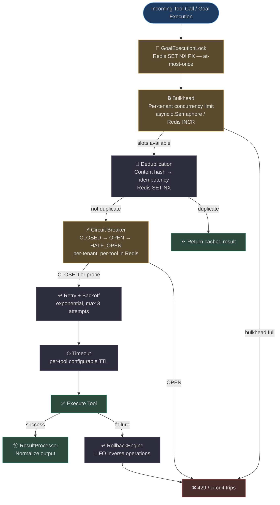
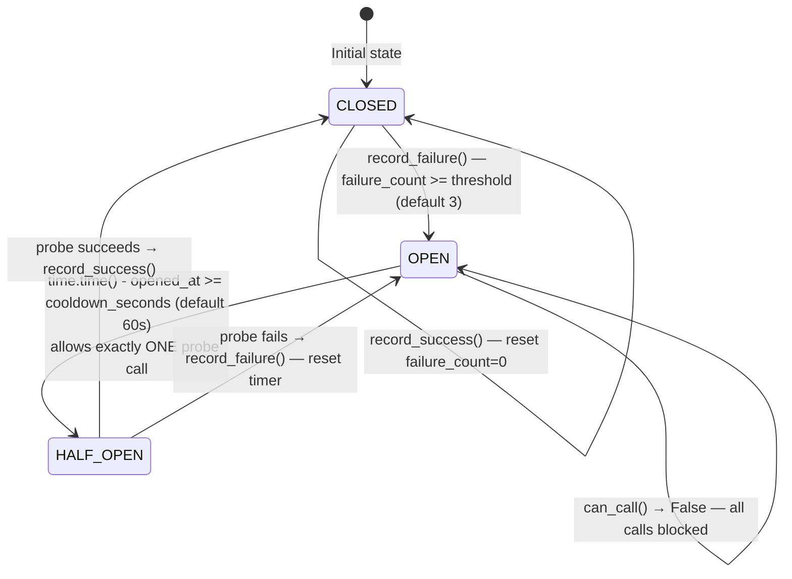
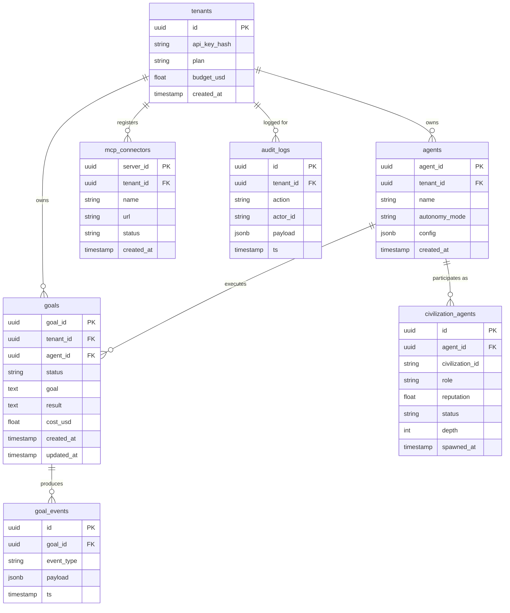
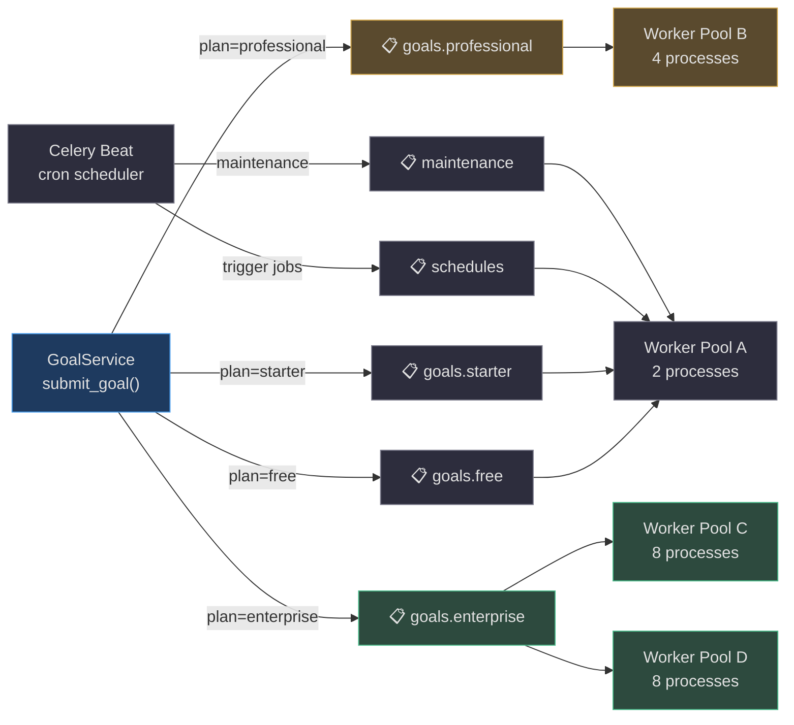

# Reliability & Infrastructure

AgentVerse runs multi-step autonomous goals that interact with external tools, databases, and LLM providers. A single flaky dependency should not crash an entire civilization of agents. This page documents the **defense-in-depth reliability stack** and the infrastructure primitives it runs on.

## Reliability Stack Overview



<!-- Sources:
  agent-verse-backend/app/reliability/circuit_breaker.py
  agent-verse-backend/app/reliability/bulkhead.py
  agent-verse-backend/app/reliability/dedup.py
  agent-verse-backend/app/reliability/distributed_lock.py
  agent-verse-backend/app/reliability/rollback.py
-->

## Circuit Breaker

### State Machine

The circuit breaker protects against cascading failures by stopping calls to a failing dependency after a threshold of consecutive failures.



<!-- Sources:
  agent-verse-backend/app/reliability/circuit_breaker.py:1-80
  agent-verse-backend/app/reliability/redis_circuit_breaker.py:1-60
-->

### Two Implementations

| Class | Module | Storage | Scope |
|---|---|---|---|
| `CircuitBreaker` | [circuit_breaker.py](https://github.com/harsh786/agent-verse/blob/main/agent-verse-backend/app/reliability/circuit_breaker.py) | In-process `enum` + `float` | Single worker process, used in tests |
| `RedisCircuitBreaker` | [redis_circuit_breaker.py](https://github.com/harsh786/agent-verse/blob/main/agent-verse-backend/app/reliability/redis_circuit_breaker.py) | Redis keys with 2x cooldown TTL | All workers — state survives restarts |

**Why Redis stores wall-clock time**: The `opened_at` key stores `time.time()` (UTC epoch), not `time.monotonic()`. Monotonic clocks are per-process and cannot be compared across Celery workers on different hosts — wall-clock epoch timestamps are the only safe cross-replica measure. See [redis_circuit_breaker.py:H16 fix comment](https://github.com/harsh786/agent-verse/blob/main/agent-verse-backend/app/reliability/redis_circuit_breaker.py#L17-L20).

Redis key format:
```
cb:{tenant_id}:{tool_name}:state      → "closed" | "open" | "half_open"
cb:{tenant_id}:{tool_name}:failures   → integer count
cb:{tenant_id}:{tool_name}:opened_at  → epoch float (wall-clock UTC)
TTL: 2 × cooldown_seconds (auto-expiry for stale keys)
```

## Per-Tenant Bulkhead

The [`BulkheadRegistry`](https://github.com/harsh786/agent-verse/blob/main/agent-verse-backend/app/reliability/bulkhead.py#L30-L70) gives each tenant an isolated `asyncio.Semaphore` so a runaway tenant cannot monopolize all concurrent tool slots.

```python
# Source: agent-verse-backend/app/reliability/bulkhead.py:30-40
class BulkheadRegistry:
    def __init__(self, default_max_concurrent: int = 20) -> None:
        self._semaphores: dict[str, asyncio.Semaphore] = {}
        self._default_max = default_max_concurrent

    def configure_tenant(self, tenant_id: str, max_concurrent: int) -> None:
        """Set per-tenant concurrency limit (resets semaphore)."""
```

For distributed deployments, [`RedisBulkhead`](https://github.com/harsh786/agent-verse/blob/main/agent-verse-backend/app/reliability/bulkhead.py#L75-L120) uses an atomic Lua INCR/DECR script with a 300s TTL to enforce limits across all worker replicas.

```
Key: bulkhead:{tenant_id}  →  current active count (TTL=300s)
Lua ACQUIRE: if count >= limit → return -1; else INCR + set TTL
Lua RELEASE: DECR key
```

## Distributed Lock: At-Most-Once Goal Execution

[`GoalExecutionLock`](https://github.com/harsh786/agent-verse/blob/main/agent-verse-backend/app/reliability/distributed_lock.py#L1-L70) prevents two Celery workers from executing the same goal simultaneously. It uses `SET NX PX` for atomic acquisition and a Lua script for safe release.

```python
# Source: agent-verse-backend/app/reliability/distributed_lock.py:38-42
async def acquire(self, goal_id: str, ttl_ms: int = 1_800_000) -> bool:
    key = f"goal_lock:{goal_id}"
    result = await self._redis.set(key, self._lock_value, nx=True, px=ttl_ms)
    return result is not None
```

**Safe release via Lua**: The `RELEASE_SCRIPT` checks `GET key == lock_value` before deleting — even if the TTL expires and another worker acquires the same lock, the original worker's `release()` call is a no-op, never deleting the new owner's lock.

## Deduplication

Goal deduplication prevents duplicate submissions. Two implementations serve different scopes:

| Class | Storage | Scope | Key Format |
|---|---|---|---|
| `DeduplicationCache` | In-process dict + TTL | Single process (tests/dev) | `{tenant_id} → {hash: timestamp}` |
| `RedisDeduplicationCache` | Redis SET NX | All replicas | `dedup:{tenant_id}:{hash(goal)}` TTL=3600s |

The `RedisDeduplicationCache.get_existing()` method returns the `goal_id` of the already-running goal when a duplicate is detected, so the SDK can stream events from the original execution rather than failing.

## Rollback Engine

The [`RollbackEngine`](https://github.com/harsh786/agent-verse/blob/main/agent-verse-backend/app/reliability/rollback.py) implements **LIFO compensating transactions**. Every tool execution registers its inverse before running; if a later step fails, all prior actions are undone in reverse order.

```python
# Source: agent-verse-backend/app/reliability/rollback.py:30-40
class RollbackEngine:
    def __init__(self) -> None:
        self._stack: list[tuple[str, Callable[[], None]]] = []

    def register(self, *, action: str, inverse: Callable[[], None]) -> None:
        """Register reversible action. Pushed to LIFO stack."""
        self._stack.append((action, inverse))
```

**Registered inverse types** ([tool_inverses.py](https://github.com/harsh786/agent-verse/blob/main/agent-verse-backend/app/reliability/tool_inverses.py)):

| Action | Inverse |
|---|---|
| `create_file` | `delete_file` |
| `create_branch` | `delete_branch` |
| `create_pr` | `close_pr` |
| `create_ticket` | `close_ticket` |
| `modify_file` | restore previous content |
| `send_message` | (logged as non-reversible, no-op inverse) |
| `CUSTOM` | caller-provided `inverse_fn` |

Inverses are called with `rollback_all_async()` in async contexts (preferred for guaranteed completion) or `rollback_all()` which schedules tasks in sync contexts.

## Goal Lifecycle State Machine

[`goal_lifecycle.py`](https://github.com/harsh786/agent-verse/blob/main/agent-verse-backend/app/reliability/goal_lifecycle.py) manages cross-process signaling between the API server and Celery workers via Redis pub/sub + flag keys:

```
Redis keys:
  goal_paused:{goal_id}     → "1"  (TTL=2h)
  goal_cancelled:{goal_id}  → "1"  (TTL=2h)

Redis channels:
  goal_pause:{goal_id}   → "pause"
  goal_cancel:{goal_id}  → "cancel"
  goal_resume:{goal_id}  → "resume"
```

The Celery worker calls `check_pause_cancel()` before each step. If the pause flag is set, the worker blocks on a Redis pub/sub subscription until a resume or cancel signal arrives — without polling.

## Database Architecture

### Schema Overview



<!-- Sources:
  agent-verse-backend/app/db/models/
  agent-verse-backend/app/db/rls.py
  agent-verse-backend/app/db/migrations/versions/
-->

### Row-Level Security (RLS)

Every table that contains tenant data has a PostgreSQL RLS policy. The [`rls_context()`](https://github.com/harsh786/agent-verse/blob/main/agent-verse-backend/app/db/rls.py#L18-L35) context manager sets the `app.tenant_id` GUC with `SET LOCAL` — transaction-scoped, automatically reverted on commit/rollback:

```python
# Source: agent-verse-backend/app/db/rls.py:18-35
@asynccontextmanager
async def rls_context(conn: asyncpg.Connection, tenant_id: str) -> AsyncIterator[None]:
    await conn.execute("SELECT set_config('app.tenant_id', $1, true)", tenant_id)
    try:
        yield
    finally:
        await conn.execute("SELECT set_config('app.tenant_id', '', true)")
```

For system-level maintenance (cross-tenant reads), [`system_session()`](https://github.com/harsh786/agent-verse/blob/main/agent-verse-backend/app/db/rls.py#L60-L90) issues `SET LOCAL row_security = off`, bypassing all tenant filters for the duration of the transaction.

**Why this matters**: Tenant isolation is enforced at the database layer, not just in application code. A bug in the application that fails to set the tenant context will see zero rows — it cannot accidentally leak another tenant's data.

### Migration Strategy

Alembic manages [104 numbered migrations](https://github.com/harsh786/agent-verse/blob/main/agent-verse-backend/app/db/migrations/versions/) (`0001_initial_schema` → `0104_...`):

| Rule | Rationale |
|---|---|
| **Never edit a deployed migration** | Alembic tracks applied migrations by checksum; editing breaks the chain |
| **Every migration has a `downgrade()`** | Required for rollback during deployment incidents |
| **Large tables: non-locking strategy** | Add column → backfill in batches → add constraint in separate migrations |
| **Test against production copy** | Run migrations against a pg_dump of production before shipping |
| **Naming**: `NNNN_<description>.py` | `0105_add_civilization_budget_spent_column.py` |

## Redis Usage Patterns

Redis is used for six distinct purposes with carefully isolated key namespaces:

| Purpose | Key Pattern | TTL | Notes |
|---|---|---|---|
| **Goal pub/sub fanout** | `goal_events:{goal_id}` | — | Stream; SSE delivery |
| **Goal pause/cancel signals** | `goal_paused:{goal_id}` / `goal_cancelled:{goal_id}` | 2h | Cross-process signaling |
| **Distributed lock** | `goal_lock:{goal_id}` | 30m | SET NX PX, Lua release |
| **Circuit breaker state** | `cb:{tenant_id}:{tool}:state/failures/opened_at` | 2×cooldown | Cross-replica breaker |
| **Bulkhead counters** | `bulkhead:{tenant_id}` | 5m | Atomic INCR/DECR via Lua |
| **Deduplication** | `dedup:{tenant_id}:{hash(goal)}` | 1h | Prevents duplicate submissions |
| **Rate limiting** | `ratelimit:{tenant_id}:{window}` | 1m sliding | Sliding window counter |
| **Semantic cache** | `semcache:{embedding_hash}` | configurable | LLM call deduplication |
| **LangGraph checkpoints** | `langgraph:{goal_id}:checkpoint` | goal TTL | Agent state for cross-replica resume |
| **Civilization bus channels** | `civ:{tenant_id}:{civ_id}:{topic}` | — | Pub/sub; persisted to Postgres |

## Celery Queue Topology

Goals are routed to **per-plan isolated queues** so enterprise tenants are insulated from free-tier noise:



<!-- Sources:
  agent-verse-backend/app/scaling/celery_app.py
  agent-verse-backend/app/scaling/tasks.py
-->

**Minimum production workers**: 4 queues × 4 workers = **16 Celery processes** to avoid starvation under load. Enterprise queues recommend 8+ workers for SLA compliance.

## OpenTelemetry Distributed Tracing

Every layer instruments spans using `app.observability.tracing.get_tracer()`:

| Component | Span Name | Key Attributes |
|---|---|---|
| Goal submission | `goal.submit` | `goal_id`, `tenant_id`, `agent_id` |
| Agent loop step | `agent.execute_step` | `step`, `tool_name` |
| A2A dispatch | `civ.a2a.dispatch` | `from_agent_id`, `to_agent_id`, `civilization_id` |
| Governor spawn | `civ.governor.evaluate_spawn` | `civilization_id`, `depth`, `verdict` |
| Tool call | `tool.{name}.call` | `tool_name`, `tenant_id`, `duration_ms` |
| Circuit breaker | `cb.{tool_name}` | `state`, `failure_count` |

W3C `traceparent` / `tracestate` headers are injected into A2A dispatches via `opentelemetry.propagate.inject()`, creating a **continuous trace across agent boundaries** that appears as a single request in Jaeger/Zipkin.

## Related Pages

| Page | Description |
|---|---|
| [Multi-Agent Civilization](multi-agent-civilization.md) | The civilization layer that sits on top of this reliability stack |
| [Configuration & Deployment](configuration-and-deployment.md) | PostgreSQL, Redis, and Celery infrastructure setup |
| [Agent Loop & LangGraph](agent-loop.md) | Where circuit breakers and bulkheads are actually invoked |
| [Governance & Audit](governance-and-audit.md) | Audit log written on every reliability event |
