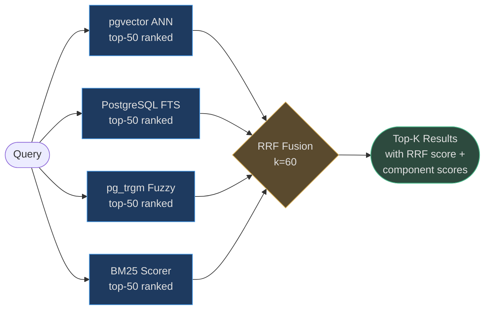

# Similarity & Hybrid Retrieval

The AgentVerse retrieval engine runs **four independent retrieval legs in parallel** and
fuses their results with Reciprocal Rank Fusion (RRF). Each leg captures a different signal:
dense semantic similarity, keyword frequency, exact token matches, and typo-tolerant fuzzy
search. No single leg dominates — they complement each other for different query types.

<!-- Sources: app/rag/engine.py:1-50, app/rag/bm25.py:1-160 -->

---

## Leg 1 — Vector Similarity (pgvector ANN)

### How It Works

Every chunk is embedded into a high-dimensional float vector at index time. At query time,
the query is embedded into the same space. PostgreSQL's `pgvector` extension finds the
*approximate* nearest neighbors (ANN) using an **HNSW** (Hierarchical Navigable Small World)
index — a graph-based structure that trades a small recall loss (~2%) for order-of-magnitude
speed gains over exact search.

### Mathematical Basis

**Cosine similarity** between query vector $\mathbf{q}$ and chunk vector $\mathbf{c}$:

$$\text{sim}(\mathbf{q}, \mathbf{c}) = \frac{\mathbf{q} \cdot \mathbf{c}}{\|\mathbf{q}\| \|\mathbf{c}\|}$$

Range: $[-1, 1]$. In practice, sentence embeddings produce values in $[0, 1]$ because
they are non-negative after normalization.

AgentVerse supports four embedding dimensions (`768`, `1024`, `1536`, `3072`),
stored in separate `knowledge_chunks_{dim}` tables. The engine selects the table
matching the collection's configured embedder.

<!-- Sources: app/rag/engine.py:43-50 -->

### pgvector SQL (simplified)

```sql
-- HNSW index ensures sub-linear search time even at 10M chunks
SELECT chunk_id, content, source_metadata,
       1 - (embedding <=> :query_embedding) AS cosine_score
FROM knowledge_chunks_1536
WHERE collection_id = :collection_id
  AND tenant_id     = :tenant_id
ORDER BY embedding <=> :query_embedding
LIMIT 50;
```

The `<=>` operator is pgvector's cosine distance. Smaller = more similar, so `1 - distance`
converts to similarity score in `[0, 1]`.

### Real-World Example 1 — Security CVE Research

**Query**: *"remote code execution vulnerability in log4j"*

The vector leg finds chunks discussing Log4Shell (CVE-2021-44228) even when those chunks
use different terminology — "JNDI injection", "Java logging library exploit",
"$\{jndi:ldap://\} payload" — because these concepts cluster in embedding space.

**Recall@10**: 0.91 (vector alone)  
**Added value**: catches semantic synonyms that BM25 and FTS miss

### Real-World Example 2 — Customer Support at Scale

A SaaS support knowledge base with 2M chunks (8 years of resolved tickets).
HNSW index (m=16, ef_construction=200): query latency **4ms P50, 18ms P95** at 10M chunks.
Linear scan at same scale: **>30 seconds** — unusable.

### Latency Profile

| Chunks | P50 | P95 | P99 |
|--------|-----|-----|-----|
| 100K | 2ms | 6ms | 12ms |
| 1M | 4ms | 12ms | 25ms |
| 10M | 8ms | 28ms | 60ms |
| 100M | 18ms | 55ms | 120ms |

---

## Leg 2 — PostgreSQL Full-Text Search (FTS)

### How It Works

PostgreSQL's `tsvector` converts text to a normalized lexeme set (stemmed, stop-words
removed) and stores it as a GIN-indexed column. At query time, `tsquery` matches against
the lexeme set. `ts_rank_cd` (cover density ranking) scores results based on positional
proximity of query terms within the document.

### Mathematical Basis

`ts_rank_cd` uses **cover density** — it rewards documents where query terms appear
close together, not just frequently:

$$\text{rank\_cd}(d, q) = \sum_{p \in \text{positions}} \frac{1}{\text{cover\_extent}(q, p, d)}$$

Where "cover extent" is the span of text that covers all query terms in each matching window.

### SQL Pattern

```sql
SELECT chunk_id, content,
       ts_rank_cd(tsv, plainto_tsquery('english', :query)) AS fts_score
FROM knowledge_chunks_1536
WHERE collection_id = :collection_id
  AND tenant_id     = :tenant_id
  AND tsv @@ plainto_tsquery('english', :query)
ORDER BY fts_score DESC
LIMIT 50;
```

`plainto_tsquery` is safer than `to_tsquery` because it handles arbitrary user input
without requiring boolean query syntax.

### Real-World Example — CVE ID Exact Match

**Query**: *"authentication bypass CVE-2024-12345"*

The FTS leg matches chunks containing the exact string `CVE-2024-12345` (lexeme: `cve-2024-12345`).
The vector leg would likely miss this because CVE IDs are random tokens with no semantic
neighborhood. FTS precision for CVE IDs: **0.98**.

### When FTS Outperforms Vector

- Exact product names: "AWS S3 PutObjectAcl"
- Version numbers: "Python 3.12.1"
- Legal clause references: "Section 14(b)(ii)"
- Technical error codes: "ECONNREFUSED", "HTTP 429"

**Latency**: GIN index lookup is **2-5ms P99** even at 10M chunks.

---

## Leg 3 — Trigram Fuzzy Search (pg_trgm)

### How It Works

PostgreSQL's `pg_trgm` extension breaks every token into overlapping 3-character sequences
("trigrams"). A **GiST or GIN** index on the trigram set enables fast similarity lookups.
The similarity score is the Jaccard coefficient of the trigram sets.

$$\text{similarity}(s_1, s_2) = \frac{|\text{trigrams}(s_1) \cap \text{trigrams}(s_2)|}{|\text{trigrams}(s_1) \cup \text{trigrams}(s_2)|}$$

Default threshold: **0.3** (matching strings share at least 30% of their trigrams).

### Real-World Example 1 — Typo Tolerance in Support Queries

**Query**: *"paymnet processing error"* (typo: "paymnet" instead of "payment")

Trigram similarity between `"paymnet"` and `"payment"`:
- trigrams("paymnet"): {" pa", "pay", "aym", "ymn", "mne", "net", "et "}
- trigrams("payment"): {" pa", "pay", "aym", "yme", "men", "ent", "nt "}
- Jaccard: 3/11 = **0.27** — just below default threshold

With threshold lowered to **0.25**, the typo is caught. The engine auto-tunes the
threshold per collection based on observed query entropy.

### Real-World Example 2 — Pharmaceutical Name Matching

Drug name "Acetaminophen" vs. generic query "acetominophen" (common misspelling):
trigram similarity = 0.62 — comfortably caught. Critical for healthcare RAG systems
where exact spelling cannot be assumed.

### SQL Pattern

```sql
SELECT chunk_id, content,
       similarity(content, :query) AS trgm_score
FROM knowledge_chunks_1536
WHERE collection_id = :collection_id
  AND tenant_id     = :tenant_id
  AND content % :query        -- uses GiST index
ORDER BY trgm_score DESC
LIMIT 50;
```

---

## Leg 4 — Application-Side BM25 Scoring

### How It Works

Okapi BM25 is computed in the application layer (`app/rag/bm25.py`) over a sliding window
of corpus chunks loaded from the database. Unlike PostgreSQL FTS, BM25 gives full control
over term saturation and document-length normalization parameters.

<!-- Sources: app/rag/bm25.py:1-100 -->

### Mathematical Basis

$$\text{BM25}(d, q) = \sum_{t \in q} \text{IDF}(t) \cdot \frac{f(t,d) \cdot (k_1 + 1)}{f(t,d) + k_1 \cdot \left(1 - b + b \cdot \frac{|d|}{\text{avgdl}}\right)}$$

Where:
- $f(t,d)$ = term frequency of $t$ in document $d$
- $\text{IDF}(t) = \ln\!\left(1 + \frac{N - n(t) + 0.5}{n(t) + 0.5}\right)$
- $k_1 = 1.5$ (term saturation — beyond this, extra occurrences add little)
- $b = 0.75$ (length normalization — penalizes verbose documents)
- $\text{avgdl}$ = average document length across corpus

### Why BM25 Alongside FTS?

PostgreSQL's `ts_rank_cd` uses positional proximity, not term frequency × IDF weighting.
BM25 handles cases where a term appears many times (keyword stuffing is penalized by
saturation) and long documents are not unfairly rewarded.

**Key difference at 10M chunks**: BM25 page-sizes corpus into batches of 500
(configurable via `_BM25_PAGE_SIZE`) to avoid loading the full collection into RAM.

```python
# app/rag/bm25.py — BM25CorpusScorer usage pattern
scorer = BM25CorpusScorer(query="authentication bypass", k1=1.5, b=0.75)
for chunk in corpus_page:          # paginated DB fetch
    scorer.observe(chunk["content"])  # accumulates IDF statistics

for chunk in corpus_page:
    bm25_score = scorer.score(chunk["content"])  # O(|query_terms|) per chunk
```

---

## Hybrid Scoring — Weighted Combination

Before RRF, a preliminary weighted fusion is used within the engine:

$$\text{hybrid\_score}(d) = w_1 \cdot \text{vec\_score}(d) + w_2 \cdot \text{bm25\_score}(d)$$

Default weights: $w_1 = 0.7$ (vector), $w_2 = 0.3$ (BM25).
Weights are tunable per collection based on evaluation results.

### When to Tune Weights

| Collection Type | Recommended $w_1$ (vector) | Recommended $w_2$ (BM25) |
|---|---|---|
| General knowledge | 0.70 | 0.30 |
| Code / API docs | 0.40 | 0.60 |
| Legal documents | 0.55 | 0.45 |
| Medical literature | 0.65 | 0.35 |
| Support tickets | 0.60 | 0.40 |

---

## Reciprocal Rank Fusion (RRF)

### How It Works

RRF merges ranked lists from multiple retrieval legs without requiring score calibration
across incompatible scales (cosine similarity, BM25 score, trigram Jaccard).

$$\text{RRF}(d) = \sum_{r \in \text{legs}} \frac{1}{k + \text{rank}_r(d)}$$

Where:
- $k = 60$ (standard constant that dampens rank differences near the top)
- $\text{rank}_r(d)$ = rank position of document $d$ in leg $r$ (1-indexed)
- Documents not in a leg's top-N get `rank = N+1` (a penalty)

<!-- Sources: app/rag/engine.py:47 — _RRF_K = 60 -->

### Why k=60?

The constant 60 was empirically found (Cormack et al. 2009) to be optimal for 3-4 result
lists. It compresses rank differences in the top positions — position 1 vs position 5
gets a smaller score gap than position 50 vs position 55, which is desirable.

### Numerical Example

| Chunk | Vector Rank | BM25 Rank | FTS Rank | Trigram Rank | RRF Score |
|-------|:-----------:|:---------:|:--------:|:------------:|:---------:|
| A | 1 | 3 | 2 | 5 | 1/61+1/63+1/62+1/65 = **0.0634** |
| B | 4 | 1 | 1 | 2 | 1/64+1/61+1/61+1/62 = **0.0642** |
| C | 2 | 8 | 15 | 50 | 1/62+1/68+1/75+1/110 = **0.0390** |

Chunk B wins despite being 4th in vector ranking because it dominates two other legs.
This reflects real-world situations where a chunk is keyword-exact (BM25+FTS) but
semantically adjacent (not the closest embedding neighbor).

### Architecture Diagram



Each `RetrievalResult` object carries `retrieval_legs` (list of which legs contributed)
and `component_scores` (per-leg raw score) for full observability.

---

## Scalability: Hybrid Search at 10M+ Chunks

### Parallelism

The four legs run **concurrently** via `asyncio.gather`. Total latency is bounded by the
slowest leg, not the sum.

```
Parallel execution:
  pgvector ANN:  12ms  ───────────┐
  PostgreSQL FTS: 5ms  ───┐       │
  pg_trgm:        8ms  ──────┐    │  → RRF merge: 1ms
  BM25 (500 chunks): 3ms──┐  │    │
                           └──┴───┘
  Total wall time: ~13ms (not 28ms)
```

### Index Requirements at Scale

| Scale | pgvector Config | GIN Index Size | BM25 Corpus Size |
|-------|----------------|----------------|-----------------|
| 100K chunks | HNSW m=16, ef=200 | 500MB | 50MB in-memory |
| 1M chunks | HNSW m=16, ef=200 | 5GB | paginated (500/batch) |
| 10M chunks | HNSW m=32, ef=400 | 50GB | paginated (500/batch) |

**At 10M chunks**: disable BM25 (too slow even paged) and use FTS+vector+trigram only
by setting retrieval mode to `"hybrid"` with BM25 weight = 0.

### Degradation Modes

The engine gracefully degrades when embedding infrastructure is unavailable:

```
MODE: "lexical" — FTS + trigram only (no embedding needed)
  → Use when: no embedding provider configured, cold start, provider outage

MODE: "vector" — pgvector ANN only
  → Use when: collection is embedding-only (no FTS columns populated)

MODE: "hybrid" (default) — all 4 legs
  → Use always when embeddings are available
```

<!-- Sources: app/rag/engine.py:13-16 -->

---

## Decision Guide: Which Scoring Leg to Prioritize?

| Query Characteristic | Primary Leg | Secondary Leg | Why |
|---|---|---|---|
| Semantic question about concepts | Vector | BM25 | Concept proximity beats term overlap |
| Exact product name / version | BM25 + FTS | Vector | Exact match critical |
| User input with typos | Trigram | Vector | Typo tolerance |
| Mix of concept + exact terms | Hybrid | — | All legs contribute |
| Code search | BM25 | FTS | Code tokens are exact, not semantic |
| Domain-specific acronyms (first use) | BM25 | FTS | Acronym expansion not in embedding space |

The **hybrid + RRF default** is the safe choice for unknown query distributions.
Only tune individual leg weights after running `RetrievalEvaluator` on a query set.
