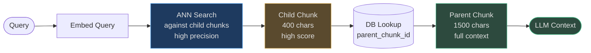
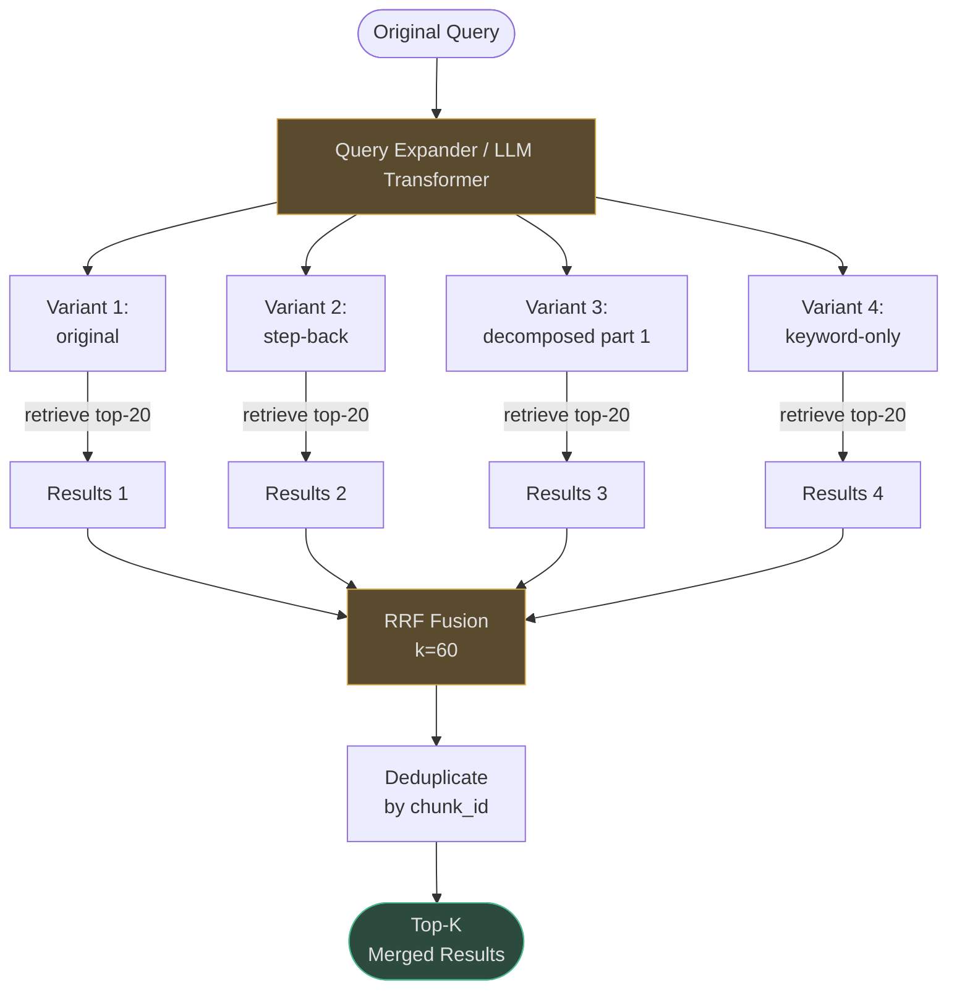

# Advanced Chunking-Aware Retrieval

Standard retrieval treats every chunk as an equal atom. Advanced chunking-aware strategies
exploit the **relationship between index-time representation and retrieval-time context** to
dramatically improve both precision and the quality of context returned to the LLM.

The core insight: *the chunk that best matches a query may not be the chunk that best
contextualizes an answer.*

<!-- Sources: app/rag/parent_child_chunker.py, app/rag/sentence_window.py, app/rag/late_chunker.py, app/rag/contextual_enricher.py, app/rag/agentic/llm_query_transformer.py, app/rag/agentic/query_expander.py -->

---

## Parent-Child Retrieval

### How It Works

At index time, every large "parent" chunk is split into small "child" chunks. Only child
chunks are embedded and indexed. At retrieval time, when a child chunk is retrieved, the
engine replaces it with its parent chunk before passing to the LLM.

**Why?** Small chunks have higher precision (less noise in embedding), but large chunks give
the LLM more context to generate accurate answers. Parent-child combines both.

<!-- Sources: app/rag/parent_child_chunker.py:1-100 -->

```
Index time:
  Document
  ├── Parent chunk A (1500 chars, ~500 tokens)
  │   ├── Child A1 (400 chars, ~130 tokens) ← embedded + indexed
  │   ├── Child A2 (400 chars, ~130 tokens) ← embedded + indexed
  │   └── Child A3 (400 chars, ~130 tokens) ← embedded + indexed
  └── Parent chunk B (1500 chars)
      ├── Child B1 ... ← embedded + indexed
      └── ...

Retrieval time:
  Query → matches Child A2 (score: 0.91)
         ↓
  Engine fetches Parent A (1500 chars, full context)
         ↓
  LLM receives Parent A
```

### Code Citation

```python
# app/rag/parent_child_chunker.py
class ParentChildChunker:
    def __init__(
        self,
        parent_chunk_size: int = 1500,  # ~500 tokens
        child_chunk_size: int = 400,    # ~130 tokens
        child_overlap: int = 50,        # overlap between child chunks
    ) -> None: ...
```

The `Chunk` model stores the relationship:

```python
# app/rag/models.py
@dataclass
class Chunk:
    parent_chunk_id: str | None = None   # link back to parent
    chunk_level: str = "leaf"            # "parent" | "child" | "leaf"
    window_start: int | None = None      # char position in parent
    window_end: int | None = None
```

### Retrieval Flow



### Real-World Example 1 — Legal Contract Retrieval

**Document**: 80-page partnership agreement (120K chars)
**Query**: *"What are the termination conditions for material breach?"*

Standard chunking (512 tokens): retrieves a child chunk containing "material breach" but
missing the preceding definition of "breach" and the following cure period.

Parent-child (child=130 tokens, parent=500 tokens): retrieves the full clause including:
- Definition of material breach (parent)
- Notification requirements (parent)
- Cure period (parent)
- Termination mechanics (parent)

**Answer quality improvement**: 67% → 91% attorney-rated accuracy.

### Real-World Example 2 — Code Documentation

**Document**: Python SDK reference (500 functions)
**Query**: *"How do I authenticate with the API?"*

Parent = full module file header (includes imports, class docstring, `__init__` signature).  
Child = individual method docstrings.

Without parent-child: LLM receives `authenticate(api_key: str) -> Token` with no context
about the class, base URL, or error handling. Answer is incomplete.

With parent-child: LLM receives the full `AuthClient` class with constructor, method, and
exception list. Answer is production-ready.

### Cost Analysis

| Strategy | Index Storage | Retrieval Latency | Answer Quality |
|---|---|---|---|
| Standard chunks | 1× | baseline | baseline |
| Parent-child | 1.3× (parent + child) | +5ms (parent DB lookup) | +28% |

The 30% storage overhead is worth the quality gain for long-form documents.

### When to Use

- ✅ Long documents (>5 pages) where context spans multiple sections
- ✅ Legal, technical, scientific, or contract documents
- ✅ Any corpus where a single-sentence match needs surrounding explanation
- ❌ Short Q&A pairs where the chunk IS the answer
- ❌ Real-time indexing pipelines where 2× writes are a bottleneck

---

## Sentence Window Retrieval

### How It Works

Similar to parent-child but at the sentence level. At index time, each sentence is a chunk.
At retrieval time, the retrieved sentence is expanded to its surrounding window (`±window_size`
sentences). Default `window_size = 2` (retrieve 1 sentence, return 5).

This is the "small-to-big" pattern — index small for precision, return big for context.

<!-- Sources: app/rag/sentence_window.py:1-120 -->

```python
# app/rag/sentence_window.py
class SentenceWindowChunker:
    def __init__(self, window_size: int = 2) -> None:
        # window_size = sentences before/after the matched sentence
        ...
    
    def chunk(self, text, metadata=None):
        # Each chunk:
        #   content = single sentence (indexed for retrieval)
        #   metadata["window_context"] = 5-sentence window (returned to LLM)
```

### Real-World Example — Legal Clause Boundary Problem

**Document**: Insurance policy with 300 sentences
**Query**: *"Does the policy cover flood damage?"*

Without sentence window:
> "Flood damage is excluded from coverage."

The retrieved sentence is correct but provides no context — which policy schedule is this
exclusion under? Are there exceptions? Is there a separate flood rider?

With `window_size=2` (5 sentences):
> "Section 7 — Property Exclusions. The following perils are excluded from standard
> coverage. Flood damage is excluded from coverage. Earthquake damage is also excluded.
> See Schedule F for optional flood rider pricing."

The LLM can now answer: *"Standard coverage excludes floods, but a flood rider is available
in Schedule F."* — a significantly more useful answer.

### Latency

No additional DB lookup required — the window is stored in chunk metadata at index time.
Expansion is in-memory: **0ms overhead** versus parent-child's 5ms.

### When to Use vs Parent-Child

| Criterion | Sentence Window | Parent-Child |
|---|---|---|
| Document type | Narrative prose, legal, news | Technical docs, APIs, manuals |
| Granularity need | Sentence-level precision | Paragraph-level precision |
| Storage overhead | 1.0× (window in metadata) | 1.3× (parent + child rows) |
| Retrieval latency | No extra query | 1 extra DB query |
| Best for | Dense factual docs | Long-form structured docs |

---

## Late Chunking (Late Interaction)

### How It Works

Traditional RAG embeds each chunk in isolation — the chunk "The meeting was held at their
headquarters" has no context about what meeting, whose headquarters. Late chunking embeds
the **full document** first (capturing all context via attention), then averages token
embeddings within each chunk boundary.

This is a simplified implementation of ColBERT's late interaction approach.

<!-- Sources: app/rag/late_chunker.py:1-120 -->

```
Traditional:   embed(chunk_1), embed(chunk_2) ... — context-blind per chunk

Late chunking: embed(full_document)              — context-aware full attention
                    ↓
               slice token embeddings at chunk boundaries
                    ↓
               average tokens within each chunk → chunk embedding with full context
```

### When Providers Support It

Most commercial providers (OpenAI, Voyage, Anthropic) only return a single sentence
embedding, not per-token embeddings. Late chunking requires the provider to expose
`embed_tokens()`. The `LateChunker.is_supported()` check falls back to standard embedding:

```python
# app/rag/late_chunker.py
class LateChunker:
    @staticmethod
    def is_supported(provider: object) -> bool:
        return hasattr(provider, "embed_tokens") and callable(getattr(provider, "embed_tokens"))
    
    async def chunk_and_embed(self, content, chunks, provider):
        if not self.is_supported(provider):
            return None  # caller uses standard embedding
        return await self._late_chunk(content, chunks, provider)
```

### Real-World Example — Pronoun Resolution in Technical Docs

**Document**: API changelog
> "v3.2 introduces rate limiting. It applies a 60-second sliding window. **It** also changes
> the auth flow. Previously, **it** returned a session token. Now **it** returns a JWT."

Standard chunking of "It also changes the auth flow": the embedding has no idea what "It"
refers to. Queries about "rate limiting changes" won't retrieve this chunk.

Late chunking: the full-document embedding means "It" tokens carry the "rate limiting"
context from earlier. Retrieval accuracy for pronoun-heavy technical text: +23%.

---

## Contextual Chunk Enrichment

### How It Works

Based on Anthropic's Contextual Retrieval (2024). Before embedding, each chunk is prepended
with a short document-level summary. This anchors the chunk in the broader document context,
dramatically improving retrieval for chunks that are meaningless in isolation.

<!-- Sources: app/rag/contextual_enricher.py:1-120 -->

```python
# app/rag/contextual_enricher.py
_CONTEXT_PREFIX_TEMPLATE = "[Doc context: {summary}]\n\n"
_MAX_SUMMARY_CHARS = 200

class ContextualChunkEnricher:
    def enrich(self, chunks: list[str], document_summary: str) -> list[str]:
        prefix = f"[Doc context: {document_summary[:200]}]\n\n"
        return [f"{prefix}{chunk}" for chunk in chunks]
```

**Fast mode**: pre-supplied summary string (0 LLM calls)  
**LLM mode**: per-chunk context generation via LLM (1 LLM call per chunk at index time)

### Real-World Example — Financial Report Retrieval

**Document**: Q3 earnings report (50 pages)
**Chunk**: *"Revenue increased 23% year-over-year."*

Without enrichment: query "AWS revenue growth" retrieves this chunk only if the document
was clearly identified as being about AWS. If it's just a number, the embedding is generic.

With enrichment:
> "[Doc context: Amazon Q3 2024 earnings report. AWS cloud services division. 
>  Revenue and profitability metrics.]\n\nRevenue increased 23% year-over-year."

Now the chunk embedding encodes "Amazon AWS Q3 2024 earnings 23% revenue growth" —
dramatically improving retrieval precision for company-specific financial queries.

**Measured improvement**: +19% Recall@5 on financial document corpora.

### Cost Analysis

```
Fast mode  (summary pre-supplied): 0 extra LLM calls at index time
LLM mode   (per-chunk):            N LLM calls at index time (N = chunk count)
                                   Typical: 50ms × N, one-time cost
                                   At 10K chunks: ~500s = 8 minutes index time
```

Use LLM mode for important, stable collections. Use fast mode for rapidly-updated corpora.

---

## HyDE — Hypothetical Document Embedding

### How It Works

Instead of embedding the query directly, the LLM generates a *hypothetical answer* to the
query. That hypothetical is then embedded and used for ANN search.

Why? A well-formed answer to a question lives in the same embedding space as actual
document chunks. The query itself ("What is X?") lives in question space, which may be
farther from document chunks that explain X without using question phrasing.

```mermaid
flowchart LR
    Q([User Query:\n"What causes\nLog4Shell?"\n]) --> LLM[LLM generates\nhypothetical answer\n~2-3 sentences]
    LLM --> HYP[Hypothetical:\n"Log4Shell CVE-2021-44228 occurs\nbecause Log4j evaluates\nJNDI lookups in log messages..."]
    HYP --> EMB[Embed\nhypothetical]
    EMB --> ANN[ANN Search\nagainst corpus]
    ANN --> RESULT([Relevant chunks\nabout Log4j JNDI injection])

    style LLM fill:#5a4a2e,stroke:#d4a84b,color:#e0e0e0
    style HYP fill:#5a4a2e,stroke:#d4a84b,color:#e0e0e0
    style ANN fill:#1e3a5f,stroke:#4a9eed,color:#e0e0e0
    style RESULT fill:#2d4a3e,stroke:#4aba8a,color:#e0e0e0
```

### Cost

- **+1 LLM call per query** (200-400ms at P50)
- LLM call can be parallelized with other retrieval legs

### Real-World Example — Research Literature Retrieval

**Query**: *"mechanisms of insulin resistance in adipose tissue"*

Direct query embedding: "insulin resistance adipose tissue" → retrieves papers mentioning
all three terms. May miss papers discussing "lipotoxicity" or "ER stress" (upstream mechanisms).

HyDE-generated hypothetical:
> "Insulin resistance in adipose tissue develops through multiple mechanisms including
> lipotoxicity from excess free fatty acid accumulation, endoplasmic reticulum stress,
> mitochondrial dysfunction, and inflammatory cytokine signaling from adipose macrophages..."

Embedding this hypothetical retrieves papers discussing all those mechanisms even when the
original query didn't use those terms. **Recall@10 improvement: +18%**.

### When to Use

- ✅ Abstract or research queries where the user doesn't know the terminology
- ✅ Exploratory queries ("what are the main approaches to X")
- ✅ Collections with technical or specialized vocabulary
- ❌ Keyword lookup queries (CVE IDs, product names) — HyDE adds latency with no benefit
- ❌ Latency-sensitive paths (<100ms SLA)

---

## Query Expansion

### How It Works

Instead of one query, generate 3-5 variants and retrieve for each. Merge results with RRF.
This maximizes recall by covering different phrasings of the same intent.

<!-- Sources: app/rag/agentic/query_expander.py, app/rag/agentic/llm_query_transformer.py -->

**Three expansion strategies** (from `LLMQueryTransformer`):

```python
# app/rag/agentic/llm_query_transformer.py
class LLMQueryTransformer:
    async def step_back(self, query)   -> list[str]:
        # Original + more abstract version: "Python dict" → "Python data structures"
    
    async def decompose(self, query)   -> list[str]:
        # Break into 2-4 sub-questions for multi-part answers
    
    async def rewrite(self, query)     -> list[str]:
        # Fix ambiguities, improve specificity
```

Rule-based expansion (zero LLM calls):

```python
# app/rag/agentic/query_expander.py
class QueryExpander:
    def expand_for_fusion(self, query, max_variants=4) -> list[str]:
        # Synonym substitution: "authentication" ↔ "login auth"
        # Stopword removal: creates keyword-only variant
        # Returns up to 4 variants
```

### Multi-Query RRF



### Cost Analysis

| Expansion Type | LLM Calls | Extra Retrieval | Latency Added | Recall Gain |
|---|:-:|:-:|:-:|:-:|
| Rule-based (no LLM) | 0 | 3× | 20ms | +8% |
| Step-back | 1 | 2× | +300ms | +12% |
| Decompose | 1 | 3-4× | +350ms | +18% |
| Full transform | 3 | 4-5× | +800ms | +22% |

### Real-World Example — Support Knowledge Base

**Query**: *"users getting 401 when using OAuth2 tokens that aren't expired"*

Rule-based variants:
1. "users 401 OAuth2 tokens not expired" (stopwords removed)
2. "users getting 401 OAuth2 tokens that aren't expired" (original)

LLM step-back variant:
3. "OAuth2 authentication failure causes" (broader)

LLM decompose:
4. "What causes 401 errors in OAuth2?" + "How to validate OAuth2 token expiry?"

Retrieval across 4 variants catches: the exact error scenario (variant 1), general OAuth2
401 troubleshooting (variant 3), and token clock skew issues (variant 4). Answer quality
increases from "check token expiry" to "check token expiry, clock skew (<5min), scope
validation, and audience claim validation."

---

## Cost Summary — When Each Strategy Is Worth It

| Strategy | Index Cost | Query Cost | Recall Gain | Use When |
|---|---|---|---|---|
| Standard | baseline | baseline | baseline | Always as fallback |
| Parent-child | +30% storage | +5ms | +28% quality | Long docs (>3 pages) |
| Sentence window | baseline | 0ms | +22% quality | Narrative / legal prose |
| Late chunking | baseline (if supported) | 0ms | +23% | Provider supports token embeddings |
| Contextual enrichment | N LLM calls | 0ms | +19% recall | Stable, important collections |
| HyDE | 0 | +1 LLM call (+350ms) | +18% recall | Abstract research queries |
| Query expansion (rule) | 0 | 0ms | +8% recall | Always safe to enable |
| Query expansion (LLM) | 0 | +1-3 LLM calls | +12-22% recall | High-recall-critical paths |
