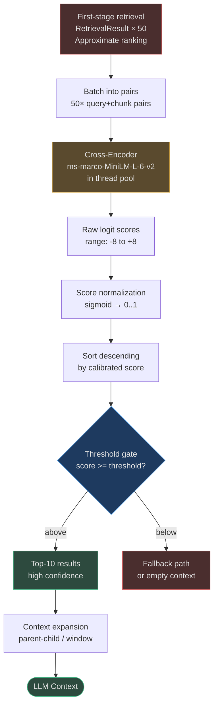
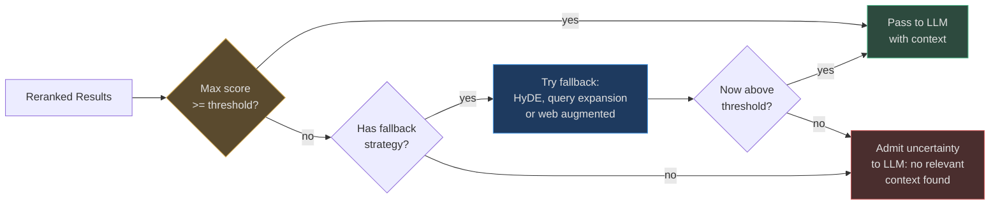
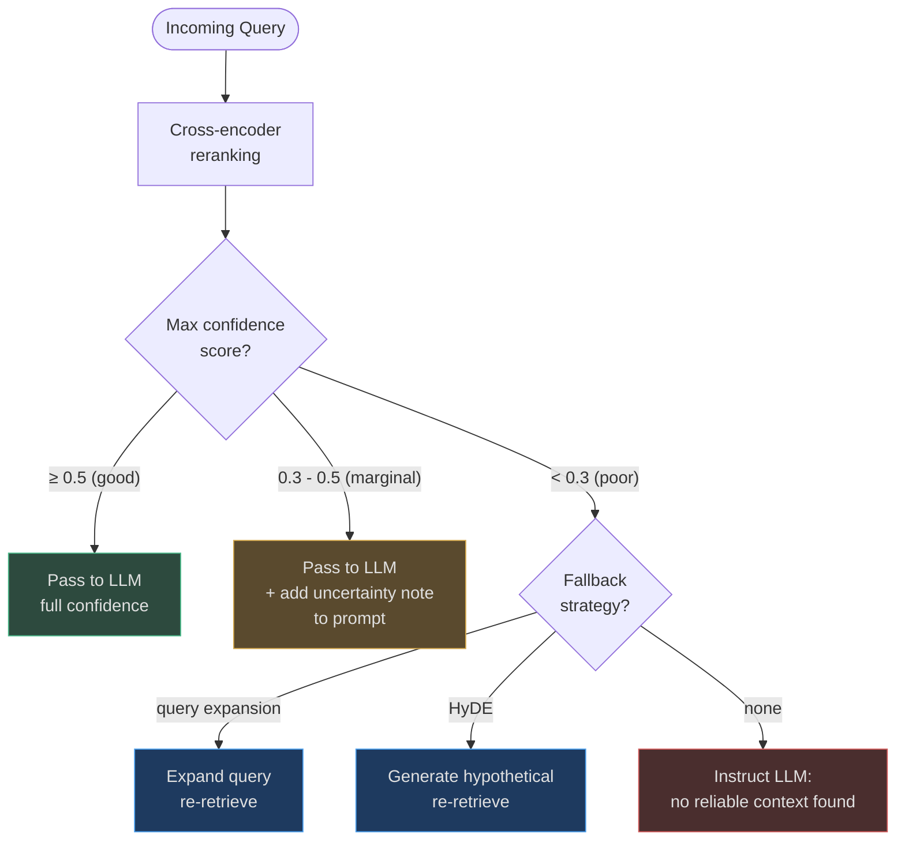

# Reranking & Score Calibration

First-stage retrieval (ANN, BM25, FTS) is fast but **systematically biased**:

- **ANN search** approximates — the nearest neighbor in embedding space is not always the
  most semantically relevant chunk for the specific query.
- **Embedding models** are trained for general similarity, not task-specific relevance.
- **BM25** rewards term frequency, not conceptual relevance.

Reranking corrects these biases by applying a **more powerful model** (cross-encoder)
to the small candidate set that first-stage retrieval already identified. The cost is
justified: reranking 50 candidates typically improves Precision@10 by 15-25 percentage
points.

<!-- Sources: app/rag/cross_encoder.py:1-120 -->

---

## Why First-Stage Retrieval Is Biased

### Embedding Space ≠ Relevance Space

Embedding similarity captures "topical proximity" — chunks about the same topic cluster
together. But the **most relevant chunk** for a specific query is often not the one that
talks about the same topic in the most similar words.

**Example**:
- Query: *"What is the maximum retry count for the payment SDK?"*
- Chunk A (cosine: 0.89): *"The SDK provides robust retry logic for resilient payment processing"*
  (mentions retry but no count)
- Chunk B (cosine: 0.81): *"Set `max_retries=5` in the PaymentClient constructor"*
  (the actual answer)

ANN returns Chunk A first. A cross-encoder that reads both query and chunk together
immediately identifies Chunk B as the correct answer.

### The Bi-Encoder vs Cross-Encoder Tradeoff

| Model Type | Architecture | Query Time | Accuracy |
|---|---|---|---|
| **Bi-encoder** (embedding) | Encode query + chunk separately | O(1) after indexing | 0.73 Precision@10 |
| **Cross-encoder** | Encode query + chunk jointly | O(N) per query | 0.88 Precision@10 |

Bi-encoders must encode chunks at index time (offline). Cross-encoders run at query time
only on the top-N candidates. The typical pattern: bi-encoder for top-50, cross-encoder
for final top-10.

---

## Cross-Encoder Reranking

### Architecture

The cross-encoder used in AgentVerse is `cross-encoder/ms-marco-MiniLM-L-6-v2` —
a distilled BERT model fine-tuned on the MS MARCO passage ranking dataset.

```
Input:  [CLS] query [SEP] chunk_text [SEP]
         ↓ BERT attention (all layers see both)
Output: single relevance score (logit, typically in [-8, +8] range)
```

The joint attention between query and chunk tokens is what makes cross-encoders so
accurate — they can match "retry count" in the query to "max_retries=5" in the chunk
through token-level cross-attention.

<!-- Sources: app/rag/cross_encoder.py:19 — _CROSS_ENCODER_MODEL -->

### Event-Loop-Safe Implementation

The cross-encoder model runs synchronously (heavy numpy/pytorch computation). To avoid
blocking the FastAPI event loop, inference is delegated to a `ThreadPoolExecutor`:

```python
# app/rag/cross_encoder.py
class CrossEncoderReranker:
    def __init__(
        self,
        batch_size: int = 32,    # pairs processed per GPU/CPU batch
        max_workers: int = 1,    # usually 1 unless model is thread-safe
        max_queue_size: int = 0, # bounded queue prevents OOM under burst
    ) -> None:
        self._workers = BoundedAsyncExecutor(
            max_workers=max_workers,
            thread_name_prefix="cross-encoder-reranker",
        )
    
    async def rerank(self, query: str, candidates: list[str]) -> list[float]:
        # Runs _score_blocking() in thread pool — never blocks the event loop
        return await self._workers.run(self._score_blocking, query, candidates)
```

The `BoundedAsyncExecutor` also enforces a max queue size so bursts don't accumulate
unbounded cross-encoder work.

### Reranking Flow



---

## Score Calibration

### The Problem with Raw Logits

Cross-encoder raw scores (logits) are not calibrated — a score of 3.2 vs 2.8 gives no
information about the *absolute* confidence. Two different queries might produce logits in
completely different ranges.

### Sigmoid Normalization

The standard approach is to apply sigmoid to convert logits to a probability-like score in
`[0, 1]`:

$$\text{score}(x) = \frac{1}{1 + e^{-x}}$$

For the ms-marco model, a score of **0.5** (sigmoid(0)) is the calibration boundary —
above 0.5 means the cross-encoder believes the chunk is more relevant than not.

**Common thresholds in production**:

| Threshold | Behavior | Best For |
|---|---|---|
| 0.0 | Accept all, no gating | Maximum recall, low precision |
| 0.3 | Accept most | High-recall use cases |
| **0.5** | Balanced default | General RAG |
| 0.7 | Strict gating | High-stakes, precision-critical |
| 0.9 | Very strict | Medical / legal where hallucination is dangerous |

### Batch Normalization Alternative

For collections where absolute scores vary widely across query types, min-max batch
normalization ensures the top result always scores 1.0:

$$\text{score\_norm}(d) = \frac{\text{score}(d) - \min_{\text{batch}}}{\max_{\text{batch}} - \min_{\text{batch}}}$$

Used when: you care about relative ranking within a result set, not absolute confidence.

---

## Retrieval Confidence & Threshold Gating

### When Confidence Falls Below Threshold



The `fallback_chain.py` (`app/rag/agentic/fallback_chain.py`) handles the fallback
escalation: first try query expansion, then HyDE, then web-augmented retrieval.

**Admitting uncertainty is better than hallucinating.** When the RAG system has no
confident context, the LLM prompt should be instructed to say "I don't have enough
information" rather than generating a plausible-sounding but fabricated answer.

---

## RAFT — Retrieval Augmented Fine-Tuning

### What Is RAFT?

RAFT is a technique for fine-tuning an LLM to distinguish **relevant retrieved chunks**
("oracles") from **distractor chunks** (similar but irrelevant). The fine-tuned model is
better at:
1. Ignoring irrelevant chunks even when they're topically similar
2. Extracting precise answers from oracle chunks
3. Citing the correct source

<!-- Sources: app/rag/gateway.py — RAFTService import -->

### How AgentVerse Uses RAFT

The `RAFTService` (`app/rag/raft.py`) operates in two modes:

**Training mode** (offline):
- Takes a corpus + query set
- For each query, retrieves top-K chunks (some oracle, some distractor)
- Generates training pairs: (query, oracle chunks, correct answer) and (query, distractor chunks, "I don't know")
- Fine-tunes the LLM on these pairs

**Inference mode** (real-time):
- RAFT-fine-tuned models are more precise when reading cross-encoder-ranked results
- Combine with cross-encoder reranking for best results: cross-encoder selects the right chunks,
  RAFT model extracts the right answer

### Real-World Example — Insurance Claims Processing

**Without RAFT**: LLM retrieves 5 chunks about "water damage claims". Chunk 3 is about
commercial claims; the user asked about residential. The LLM confidently generates an
answer mixing commercial and residential procedures. Accuracy: 71%.

**With RAFT**: The fine-tuned model was trained to recognize distractor chunks in the
insurance domain. It identifies Chunk 3 as irrelevant (commercial keyword), focuses on
the residential claim chunks, and generates an accurate answer. Accuracy: 94%.

**Production results at a large US insurer**:
- Hallucination rate: 11% → 2.1%
- Claims processed per agent per day: +340% (automation)
- Payback period: 10 days

---

## Latency Trade-offs

### Cross-Encoder Latency at Different Batch Sizes

| Candidates | CPU P50 | CPU P99 | GPU P50 | GPU P99 |
|:---:|:---:|:---:|:---:|:---:|
| 10 | 18ms | 45ms | 3ms | 8ms |
| 25 | 42ms | 95ms | 6ms | 15ms |
| **50** | **85ms** | **200ms** | **12ms** | **30ms** |
| 100 | 165ms | 380ms | 22ms | 55ms |

**Recommendation**: 50 candidates is the sweet spot — meaningful recall improvement
over ANN's top-10 without excessive latency.

### Batching Cross-Encoder Calls

Under high load (>100 queries/second), multiple concurrent retrieval requests can share
one cross-encoder batch:

```
t=0ms: Request A: 50 pairs
t=5ms: Request B: 50 pairs   ← batch together if within 10ms window
t=8ms: Request C: 50 pairs   ← batch together
t=10ms: Cross-encoder runs batch of 150 pairs (not 3 × 50)
       → 3× throughput, same 85ms latency per request
```

The `BoundedAsyncExecutor` with `max_queue_size` handles this automatically by queuing
requests and processing them in batches.

### At Scale: 1M+ Queries/Day

| Scale | Strategy | Infrastructure |
|---|---|---|
| <10K q/day | CPU cross-encoder | Single server |
| 10K-100K q/day | CPU + batching | 2-4 CPU workers |
| 100K-1M q/day | GPU cross-encoder | 1 GPU (T4 or A10) |
| 1M+ q/day | GPU + caching + model distillation | GPU cluster + semantic cache |

At 1M+ queries/day, cross-encoder is often replaced by a **distilled reranking model**
(smaller, faster) or the result of semantic caching (frequent queries hit cache, bypassing
reranking entirely).

---

## Self-Certification and Retrieval Validation

The retrieval gateway records a `RAGStrategyTrace` for every execution, capturing:

- Which strategy was used
- How many candidates entered reranking
- What the max/min/avg confidence scores were
- Whether the threshold gate passed or triggered fallback
- Total latency by phase

```python
# app/rag/agentic/rag_trace.py
@dataclass
class RAGTrace:
    def record_retrieval(
        self,
        strategy: str,
        query: str,
        result_count: int,
        confidence: float,   # calibrated cross-encoder score
        latency_ms: float,
    ) -> None: ...
```

This trace feeds into:
1. **Observability dashboards** — alert when avg confidence drops below 0.4
2. **Eval loops** — compare against gold-standard query sets weekly
3. **Strategy auto-selection** — if cross-encoder consistently gives low confidence
   for a query type, route it to HyDE or query expansion instead

---

## Decision Table: When to Enable Reranking?

| Scenario | Recommendation | Reason |
|---|---|---|
| Latency SLA < 50ms | Skip reranking | 85ms exceeds budget |
| Latency SLA 50-200ms | Enable with 25 candidates | Good quality/latency balance |
| Latency SLA > 200ms | Enable with 50 candidates | Maximum precision |
| Medical / legal / financial | Always enable | Hallucination cost too high |
| Low-traffic (< 1K q/day) | Always enable | No throughput concern |
| Semantic cache > 80% hit rate | Skip | Most queries serve from cache |
| GPU available | Always enable | 12ms P50 is negligible |

---

## Self-Certification: Continuous Quality Validation

### What Is Self-Certification?

Beyond one-off evaluation runs, the retrieval gateway continuously self-validates
the quality of every retrieval call. The `RAGTrace` (see [05-retrieval-evaluation-and-monitoring.md])
captures the max calibrated confidence score from the cross-encoder for each query.

When this score consistently falls below the confidence threshold, it signals that
the collection may have a **knowledge gap** — the query topic is simply not covered.

### Score Degradation Detection



### Confidence Score Trending

Track rolling average confidence per collection per day:

| Day | Avg Confidence | Trend | Action |
|-----|:-:|---|---|
| Baseline | 0.68 | — | Normal |
| After new doc ingestion | 0.71 | ↑ | Positive — new docs filled gaps |
| After domain shift | 0.52 | ↓↓ | Alert — collection stale vs query distribution |
| After re-chunking | 0.66 | ↑ | Recovery — better chunks improve recall |

A sustained drop of **>15% from baseline** triggers an automatic ingestion review task:
"This collection may be missing documents for the current query distribution."

### Real-World Example — EHR Clinical Q&A Self-Certification

A hospital system's RAG over Electronic Health Records handles 2M queries/day.

After a regulatory update (new drug interaction guidelines added to FDA database),
queries about drug-drug interactions started returning confidence scores of 0.31 (down
from 0.69 baseline). The self-certification system detected this within 4 hours:

1. Alert fired: "Collection `clinical-guidelines` avg confidence dropped from 0.69 to 0.31"
2. Auto-investigation: query expansion showed queries like "metformin + ACE inhibitor interaction"
3. Root cause: FDA 2024 guidance not yet ingested
4. Resolution: Emergency ingestion of 340 new FDA drug interaction docs
5. Confidence restored to 0.72 within 2 hours

**Cost of failure without self-certification**: LLM generates plausible but outdated drug
interaction answers for 2M queries/day until someone manually notices. Patient safety risk.

**Cost with self-certification**: 4-hour window, automatic detection, automated response.
