# Multi-Hop & Graph Retrieval

Standard single-shot retrieval answers questions whose answers exist in a single chunk.
Multi-hop retrieval answers questions that require **combining facts from multiple chunks**
through a chain of reasoning steps.

Example: *"Which engineering team builds the product that uses Log4j 2.14.1?"*
- Hop 1: Find Log4j 2.14.1 → identifies affected services
- Hop 2: Find services → identifies owning teams
- Answer: "Platform Infrastructure Team (Identity Service)"

No single chunk contains this answer. It requires graph traversal.

<!-- Sources: app/knowledge_graph/multi_hop.py, app/rag/agentic/patterns/graph.py, app/rag/engine.py:45 -->

---

## The Multi-Hop Concept

### Why Single-Shot Retrieval Fails

Consider a knowledge base with three fact types:
1. "Log4j 2.14.1 has CVE-2021-44228" (vulnerability)
2. "Identity Service uses Log4j 2.14.1" (dependency)
3. "Identity Service is owned by Platform Team" (ownership)

A single-shot query "Who owns the CVE-vulnerable service?" would need to:
- Match the abstract concept of "ownership of a service vulnerable to a CVE"
- Against chunks that don't individually contain all those concepts together

The embedding similarity score would be low because no chunk has all three facts.
Multi-hop traversal chains them explicitly.

### Multi-Hop vs Agentic Retrieval

| Approach | Mechanism | Control | Latency | Best For |
|---|---|---|---|---|
| **Multi-hop graph** | Pre-defined BFS over KG edges | Graph structure | 200-1200ms | Structured relational facts |
| **Agentic iterative** | Agent decides next query | LLM reasoning | 800ms-5s | Open-ended reasoning chains |
| **Hybrid (both)** | Graph seeds + agentic refinement | Combined | 1-3s | Complex enterprise queries |

---

## Knowledge Graph Structure

AgentVerse's KG stores entity nodes and typed relationship edges across tenant-scoped tables:

```sql
-- knowledge_nodes: entities, concepts
-- knowledge_edges: typed relationships

-- Entity: Log4j 2.14.1
-- Entity: Identity Service
-- Entity: Platform Team
-- Edge: (Log4j 2.14.1) -[AFFECTED_BY]→ (CVE-2021-44228)
-- Edge: (Identity Service) -[DEPENDS_ON]→ (Log4j 2.14.1)
-- Edge: (Platform Team) -[OWNS]→ (Identity Service)
```

The `knowledge_nodes` table is linked to `knowledge_chunks` via `source_id` — each entity
was extracted from specific document chunks, providing the bridge between graph traversal
and text retrieval.

---

## BFS Multi-Hop Path Finding

### Implementation

`MultiHopReasoner` in `app/knowledge_graph/multi_hop.py` implements **Breadth-First Search**
from a start entity to a target entity (or ego-network expansion from a seed node).

<!-- Sources: app/knowledge_graph/multi_hop.py:1-120 -->

```python
# app/knowledge_graph/multi_hop.py
class MultiHopReasoner:
    """BFS multi-hop path finding and ego-network extraction."""
    
    def find_paths(
        self,
        start: str,
        end: str,
        max_hops: int = 3,
    ) -> list[HopPath]:
        """BFS from start to end, returning all paths up to max_hops."""
        # Queue: (current_node, path_nodes, path_edges)
        queue = deque([(start, [start], [])])
        found: list[HopPath] = []
        ...

    def ego_network(
        self,
        center: str,
        radius: int = 2,
    ) -> Subgraph:
        """Extract a subgraph around 'center' up to 'radius' hops."""
```

Each `HopPath` renders as a human-readable fact chain:

```python
# HopPath.as_text() output:
"Log4j-2.14.1 --[AFFECTED_BY]--> CVE-2021-44228 | \
 Identity-Service --[DEPENDS_ON]--> Log4j-2.14.1 | \
 Platform-Team --[OWNS]--> Identity-Service"
```

This chain is passed to the LLM as structured evidence alongside retrieved text chunks.

### BFS vs DFS Trade-offs

| Algorithm | Path Found | Memory | Best For |
|---|---|---|---|
| **BFS** (implemented) | Shortest path first | O(branching^hops) | Finding minimum-hop connection |
| DFS | Any path (depth-first) | O(max_hops) | Complete path enumeration |
| Dijkstra | Lowest-weight path | O(N log N) | Weighted KG edges |

BFS is correct for most enterprise KG queries where the **shortest reasoning path**
is the most trustworthy (longer paths introduce more inference steps, more error surface).

The engine caps at `_MAX_HOPS = 5` to prevent infinite traversal on cyclic graphs.

<!-- Sources: app/rag/engine.py:47 -->

---

## Graph-Guided Retrieval

### Combining Graph Paths with Vector Search

Graph traversal produces entity labels and relationship chains. Vector search produces
text chunks. The combined approach uses graph paths to identify **seed chunk IDs**, then
retrieves neighboring chunks from the vector index.

```mermaid
flowchart TD
    Q([Query:\n"Who owns services\nvulnerable to Log4Shell?"]) --> EE[Entity Extraction\nextract entities from query]
    EE --> SEED[Seed Entities:\nLog4Shell, CVE-2021-44228\nLog4j]
    SEED --> VEC1[Vector retrieval\nfor each entity → top-5 chunks]
    VEC1 --> CHUNK_IDS[Seed chunk IDs\nfrom vector search]
    CHUNK_IDS --> GRAPH[(KG Query:\nfind nodes linked to\nseed chunk IDs)]
    GRAPH --> ENT[Entity evidence:\nCVE nodes, affected services]
    GRAPH --> PATH[Path evidence:\nservice → dependency → CVE]
    GRAPH --> COMM[Community evidence:\nrelated entities cluster]

    ENT --> MERGE[Merge Graph Evidence\n+ Vector Chunks]
    PATH --> MERGE
    COMM --> MERGE
    MERGE --> RERANK[Cross-encoder\nreranking]
    RERANK --> LLM([LLM Context:\nstructured paths +\ntext evidence])

    style EE fill:#1e3a5f,stroke:#4a9eed,color:#e0e0e0
    style GRAPH fill:#5a4a2e,stroke:#d4a84b,color:#e0e0e0
    style MERGE fill:#5a4a2e,stroke:#d4a84b,color:#e0e0e0
    style LLM fill:#2d4a3e,stroke:#4aba8a,color:#e0e0e0
```

### Three Types of Graph Evidence

From `app/rag/agentic/patterns/graph.py`:

```python
# Three SQL queries run in parallel:
# 1. Entity evidence — nodes matching seed chunks or query text
# 2. Path evidence — edges connecting seed nodes
# 3. Community evidence — nodes related to seed nodes by 1-hop traversal
```

**Entity evidence**: direct facts — "Log4j 2.14.1 has confidence=0.98, source=NIST NVD"

**Path evidence**: relational triples — "(Identity Service) DEPENDS_ON (Log4j 2.14.1)"

**Community evidence**: ego-network — all entities within 1-2 hops of the seed,
useful for discovering indirect connections the query didn't anticipate

---

## Full Multi-Hop Retrieval Flow

```mermaid
flowchart LR
    Q([Query]) --> HOP0[Hop 0:\nVector retrieval\nfor query]
    HOP0 --> NODES0[Seed nodes\nfrom matching chunks]
    NODES0 --> HOP1[Hop 1:\nExpand via KG edges\nfind neighbors]
    HOP1 --> CHUNKS1[Retrieve chunks\nfor hop-1 nodes]
    CHUNKS1 --> HOP2[Hop 2:\nExpand hop-1 nodes\nfind their neighbors]
    HOP2 --> CHUNKS2[Retrieve chunks\nfor hop-2 nodes]
    CHUNKS2 --> FILTER{Score filter:\ndrop low-relevance\nhop-2 chunks}
    FILTER --> MERGE[Merge all evidence:\nhop-0 + hop-1 + hop-2]
    MERGE --> RRF[RRF across hops\nweight closer hops higher]
    RRF --> RERANK[Cross-encoder\nfinal reranking]
    RERANK --> CONTEXT([Structured context:\npaths + text])

    style HOP0 fill:#1e3a5f,stroke:#4a9eed,color:#e0e0e0
    style HOP1 fill:#1e3a5f,stroke:#4a9eed,color:#e0e0e0
    style HOP2 fill:#1e3a5f,stroke:#4a9eed,color:#e0e0e0
    style MERGE fill:#5a4a2e,stroke:#d4a84b,color:#e0e0e0
    style CONTEXT fill:#2d4a3e,stroke:#4aba8a,color:#e0e0e0
```



---

## Real-World Example 1 — Engineering Team CVE Ownership

**Query**: *"Who leads the team that builds the product that uses the library that has CVE-2024-3400?"*

This is a **4-hop chain**:
1. CVE-2024-3400 → affected library (PAN-OS GlobalProtect)
2. PAN-OS GlobalProtect → products using it (Palo Alto firewalls)
3. Palo Alto firewalls → engineering team (Network Security Platform Team)
4. Team → team lead (via organizational chart)

**Without multi-hop**: No single chunk contains this entire chain. Query fails (no relevant context).

**With multi-hop BFS (max_hops=4)**:
```
CVE-2024-3400 --[AFFECTS]--> PAN-OS GlobalProtect
PAN-OS GlobalProtect --[COMPONENT_OF]--> PA-Series Firewalls
PA-Series Firewalls --[BUILT_BY]--> Network Security Platform Team
Network Security Platform Team --[MANAGED_BY]--> Sarah Chen, VP Engineering
```

Answer generated: *"Sarah Chen (VP Engineering) leads the Network Security Platform Team
that builds PA-Series firewalls. CVE-2024-3400 affects PAN-OS GlobalProtect, a component
of those firewalls. Estimated exposure: 12 internal deployments."*

**Answer quality**: Single-shot: 0% (no relevant context found). Multi-hop: 94% accuracy.

---

## Real-World Example 2 — Regulatory Cross-Jurisdiction Query

**Query**: *"What compliance requirements apply to financial services companies in the EU
that handle crypto assets and have revenue above €50M?"*

**Entities extracted**: financial services, EU, crypto assets, revenue threshold

**Hop 1** (direct): 
- EU MiCA regulation (Markets in Crypto-Assets)
- GDPR (data protection)
- PSD2 (payment services)

**Hop 2** (linked):
- MiCA → threshold applicability: >€50M revenue, "significant CASP" classification
- "Significant CASP" → additional requirements: capital buffers, supervisory regime

**Hop 3** (community):
- EBA guidelines on crypto risk assessment
- National competent authority (NCA) registration requirements per member state

**Single-shot answer**: Lists MiCA, GDPR, PSD2 generically.

**Multi-hop answer**: "Under MiCA Article 43, entities with >€50M revenue are classified
as 'significant CASPs' and face additional requirements: 2% own funds, EBA direct supervision
(bypassing NCAs), and mandatory quarterly stress testing. GDPR applies to personal data
in transaction records. PSD2 applies if providing payment services alongside crypto custody."

The multi-hop answer is 400% more specific and actionable.

---

## Agentic Retrieval: When the Agent Controls the Loop

### How It Differs from Graph Multi-Hop

Graph multi-hop uses **pre-defined BFS** — it explores the KG systematically. Agentic
retrieval lets the **LLM decide** what to retrieve next based on what it found so far.

```mermaid
flowchart TD
    Q([Query]) --> AGR[Initial retrieval\ntop-10 chunks]
    AGR --> LLM1[LLM: Is this enough\nto answer? What's missing?]
    LLM1 -->|"Missing: ownership info"| QR1[Query 2:\n"engineering team ownership"]
    LLM1 -->|"Missing: timeline"| QR2[Query 3:\n"incident timeline 2024"]
    QR1 --> AGR2[Retrieve for query 2]
    QR2 --> AGR3[Retrieve for query 3]
    AGR2 --> LLM2[LLM: Now enough?]
    AGR3 --> LLM2
    LLM2 -->|"Yes, confident"| ANS([Generate final answer])
    LLM2 -->|"Still missing"| QR_N[Query N...]
    QR_N --> LIM{Max iterations\nreached?}
    LIM -->|yes| ANS_PARTIAL([Answer with\nuncertainty admission])
    LIM -->|no| AGR_N[Retrieve...]

    style LLM1 fill:#5a4a2e,stroke:#d4a84b,color:#e0e0e0
    style LLM2 fill:#5a4a2e,stroke:#d4a84b,color:#e0e0e0
    style ANS fill:#2d4a3e,stroke:#4aba8a,color:#e0e0e0
    style ANS_PARTIAL fill:#4a2e2e,stroke:#d45b5b,color:#e0e0e0
```

The `context_gap_detector.py` (`app/rag/agentic/context_gap_detector.py`) analyzes
current context to identify what information is still missing, guiding the next retrieval.

### `_MAX_HOPS` and Loop Prevention

The engine enforces `_MAX_HOPS = 5` to prevent infinite agentic loops. In practice,
most queries converge in 2-3 iterations:

| Query Complexity | Typical Iterations | Latency |
|---|:-:|---|
| Simple factual | 1 | 200ms |
| Two-part question | 2 | 600ms |
| Multi-entity relational | 3 | 1.2s |
| Complex regulatory / legal | 4-5 | 2.5s |

---

## Latency Budget: Per-Hop Costs

| Phase | Latency (P50) | Latency (P99) | Can Be Cached? |
|---|---|---|---|
| Entity extraction (LLM) | 200ms | 500ms | Yes (per-query hash) |
| KG traversal (1 hop) | 15ms | 45ms | Yes (per-entity) |
| Vector retrieval (per hop) | 8ms | 30ms | Yes (semantic cache) |
| Graph SQL query (entity) | 12ms | 35ms | Per-tenant materialization |
| Cross-encoder reranking | 85ms | 200ms | No (query-specific) |

**Total budget for 3-hop graph retrieval** (uncached):
- P50: 200 + (3×15) + (3×8) + 85 = **354ms**
- P99: 500 + (3×45) + (3×30) + 200 = **1025ms**

**Caching hop-1 results** for popular entities (e.g., "CVE-2021-44228") reduces repeat
query cost to near-zero. At scale, pre-compute ego-networks for top-1000 entities nightly.

---

## When to Use Multi-Hop & Graph Retrieval

### Prerequisites

1. **Knowledge graph is populated** — requires entity extraction during ingestion
2. **Entity extraction model** is available (typically a NER model or LLM-based extractor)
3. **Relationship types** are defined for the domain

### Decision Guide

| Situation | Multi-hop Graph | Agentic Iterative |
|---|---|---|
| Structured domain with clear entity types (tech, biomedical, legal) | ✅ | ❌ |
| Open-ended research with unknown connection types | ❌ | ✅ |
| Query mentions two or more named entities | ✅ | ✅ |
| Latency SLA < 500ms | ❌ Use single-hop | ❌ Too slow |
| Latency SLA 500ms-2s | ✅ Up to 3 hops | ✅ Up to 2 iterations |
| Domain KG does not exist | ❌ Cannot use | ✅ Falls back to text |

### Setting Up the KG

Multi-hop retrieval requires:
1. Running entity extraction during document ingestion
2. Linking extracted entities to chunk IDs (`source_id` in `knowledge_nodes`)
3. Running relationship extraction to populate `knowledge_edges`

Without these steps, `query_graph_evidence()` returns empty results (degrading gracefully
to standard vector retrieval, not failing).

---

## Integration with Standard Retrieval

Graph retrieval does not replace vector retrieval — it **supplements** it. The merge
strategy:

```python
# engine.py pseudo-code (graph-augmented path)
vector_results = await hybrid_retrieve(query, collection_id)           # top-50 chunks
graph_evidence = await query_graph_evidence(session, GraphEvidenceQuery(
    seed_chunk_ids=tuple(r.chunk_id for r in vector_results[:10]),     # seed from vector
    query=query,
))
merged = merge_grounding_results(
    [vector_results, graph_results_as_retrieval_results],               # RRF merge
    top_k=20,
)
final = await cross_encoder_rerank(query, merged)                       # top-10
```

The result contains both text evidence (from chunks) and structured evidence (from graph
paths), giving the LLM both raw facts and their relationships.
