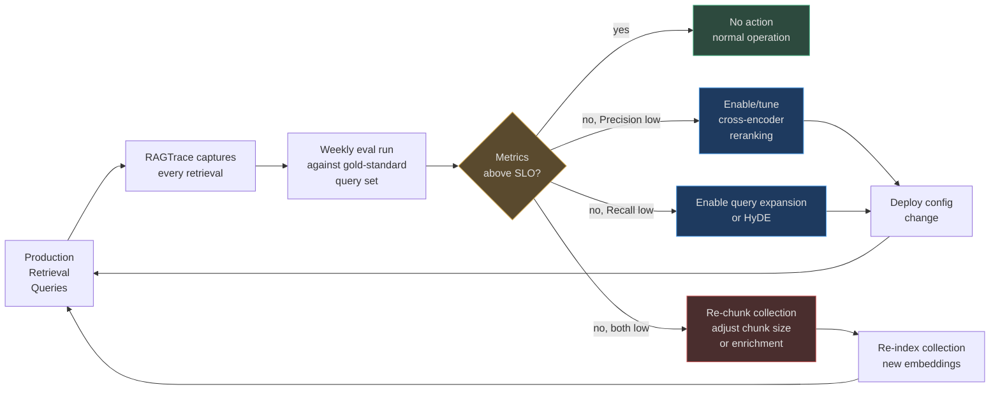
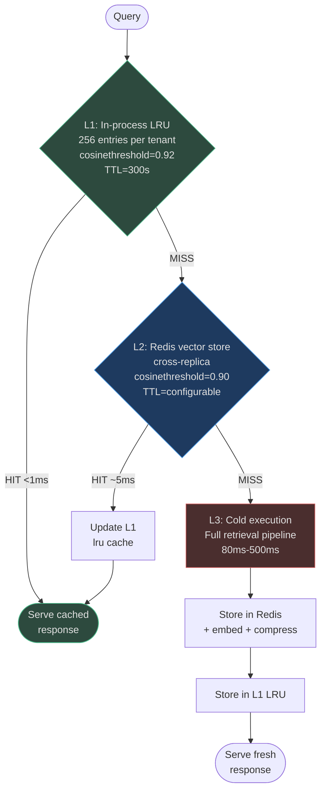

# Retrieval Evaluation & Monitoring

A retrieval system without measurement is a retrieval system you can't improve.
AgentVerse provides first-class observability for every retrieval operation: structured
traces, RAGAS-style metrics, semantic caching with hit-rate tracking, and A/B testing
infrastructure for comparing strategies head-to-head.

<!-- Sources: app/rag/evaluation.py, app/rag/semantic_cache.py, app/rag/agentic/rag_trace.py, app/rag/gateway.py -->

---

## Retrieval Metrics

### The Four Core Metrics

<!-- Sources: app/rag/evaluation.py:1-120 -->

```python
# app/rag/evaluation.py — RAGAS-inspired metric definitions
@dataclass
class QueryEvalResult:
    precision_at_k: float    # fraction of retrieved that are relevant
    recall_at_k: float       # fraction of expected that were retrieved
    reciprocal_rank: float   # 1/rank_of_first_relevant_result (MRR)
    retrieved_texts: list[str]
```

#### Precision@K

$$\text{Precision@K} = \frac{|\text{retrieved}_K \cap \text{relevant}|}{K}$$

*"Of the K chunks we retrieved, how many are actually relevant?"*

High precision = LLM is not confused by irrelevant context.  
Typical target: **Precision@10 ≥ 0.75**

#### Recall@K

$$\text{Recall@K} = \frac{|\text{retrieved}_K \cap \text{relevant}|}{|\text{relevant}|}$$

*"Of all relevant chunks that exist, how many did we find?"*

High recall = LLM has all the facts it needs.  
Typical target: **Recall@10 ≥ 0.80**

#### Mean Reciprocal Rank (MRR)

$$\text{MRR} = \frac{1}{|Q|} \sum_{q \in Q} \frac{1}{\text{rank}_q(\text{first relevant})}$$

*"How early in the ranking does the first relevant chunk appear?"*

MRR = 1.0 → relevant chunk is always ranked #1  
MRR = 0.5 → relevant chunk is on average ranked #2  
Typical target: **MRR ≥ 0.70**

#### NDCG@K (Normalized Discounted Cumulative Gain)

$$\text{NDCG@K} = \frac{\text{DCG@K}}{\text{IDCG@K}} \quad \text{where} \quad \text{DCG@K} = \sum_{i=1}^{K} \frac{2^{\text{rel}_i} - 1}{\log_2(i+1)}$$

*"Are highly relevant chunks ranked higher than marginally relevant ones?"*

Used when relevance has gradations (binary relevance uses Precision/Recall instead).  
Typical target: **NDCG@10 ≥ 0.72**

### Running an Evaluation

```python
from app.rag.evaluation import RetrievalEvaluator

evaluator = RetrievalEvaluator(store=knowledge_store, tenant_ctx=ctx)

report = await evaluator.evaluate_collection(
    collection_id="col-security-docs",
    test_queries=[
        "What is the CVSS score for CVE-2021-44228?",
        "How to patch Log4Shell in Python applications?",
    ],
    expected_chunks=[
        ["chunk-cve-cvss", "chunk-cve-nist"],     # expected for query 1
        ["chunk-patch-python", "chunk-patch-maven"],  # expected for query 2
    ],
    k=10,
)

print(f"Precision@10: {report.mean_precision:.2f}")  # e.g., 0.82
print(f"Recall@10:    {report.mean_recall:.2f}")     # e.g., 0.79
print(f"MRR:          {report.mean_mrr:.2f}")        # e.g., 0.74
print(f"Overall:      {report.overall_score:.2f}")   # weighted average
print("Low-quality chunks:", report.low_quality_chunks)
print("Recommendations:",   report.recommendations)
```

### The Evaluation Feedback Loop



---

## Semantic Cache

The semantic cache is one of the highest-ROI components in the entire RAG pipeline:
cache hits serve responses in **<1ms** instead of **80-500ms**, at zero LLM cost.

<!-- Sources: app/rag/semantic_cache.py:1-200 -->

### Three-Layer Architecture



### Cosine Similarity Matching

The cache uses **cosine similarity** rather than exact hash matching, so paraphrased
queries hit the same cache entry:

- "Search GitHub for open issues" ≈ "Find open GitHub issues" → cosine: 0.94 → cache HIT
- "List all payment errors" ≈ "Show payment processing failures" → cosine: 0.91 → cache HIT
- "CVE in Log4j" ≠ "OWASP injection vulnerability" → cosine: 0.61 → cache MISS

```python
# app/rag/semantic_cache.py — L1 similarity matching
def get(self, embedding: list[float], tenant_id: str) -> str | None:
    # Linear scan of up to 256 entries per tenant (O(256) = fast)
    for key, entry in tenant_store.items():
        score = _cosine(embedding, entry.embedding)
        if score >= self._threshold:    # threshold=0.92
            return entry.response       # cache hit
    return None  # cache miss
```

### Memory Efficiency

Cache responses are stored compressed with zlib (level=1, fast):

```python
# app/rag/semantic_cache.py
def _compress(text: str) -> bytes:
    return zlib.compress(text.encode("utf-8"), level=1)  # ~40% savings
```

Embeddings are packed as binary floats (4 bytes per float), not JSON strings:

```python
def _pack_embedding(embedding: list[float]) -> bytes:
    return struct.pack(f"{len(embedding)}f", *embedding)
# 1536-dim embedding: 1536 × 4 = 6,144 bytes (vs ~12,288 bytes as JSON text)
```

Combined: **~60% Redis memory savings** versus naive JSON storage.

### Cache Statistics

The cache tracks rich statistics for observability:

| Metric | Description | Alert Threshold |
|---|---|---|
| `hit_rate` | Fraction of queries served from cache | Alert if <30% after warm-up |
| `bytes_saved` | Estimated cost savings from cache hits | Reporting only |
| `avg_similarity` | Average cosine score of cache hits | Alert if <0.88 (threshold drift) |
| `p50_latency` | Median cache operation time | Alert if >5ms |
| `p95_latency` | 95th pct cache operation time | Alert if >20ms |

### Real-World Example — Support Bot at Scale

A SaaS support chatbot handling **50,000 queries/day**. After 1 week of warm-up:

- **42% of queries** are paraphrases of previously-seen questions
- Cache hit rate: 42% (L1: 15%, L2: 27%)
- Latency improvement: 85ms average → 28ms average (67% reduction)
- LLM cost reduction: 42% × $0.004/query = $840/day → **$306,600/year savings**

At L1 threshold 0.92: high confidence that hits are truly equivalent.
Lowering to 0.85 would increase hit rate to ~55% but risk serving slightly different answers.

### Cache Warming

For predictable query patterns (e.g., "status of service X", "who is on call"),
pre-warm the cache at startup:

```python
await cache.warm(
    queries=["service health status", "on-call engineer", "deployment status"],
    responses=[...],
    provider=embedding_provider,
)
```

---

## RAG Trace: Per-Request Observability

Every retrieval operation is wrapped in a `RAGTrace` that captures structured metadata:

<!-- Sources: app/rag/agentic/rag_trace.py -->

```python
# app/rag/agentic/rag_trace.py
@dataclass
class RAGTrace:
    goal_id: str
    tenant_id: str
    trace_id: str          # unique per retrieval call
    steps: list[dict]      # one entry per retrieval step

    def record_retrieval(self, strategy, query, result_count, confidence, latency_ms):
        self.steps.append({
            "strategy": strategy,      # "hybrid", "graph", "agentic", etc.
            "query": query[:200],
            "result_count": result_count,
            "confidence": confidence,  # max cross-encoder score
            "latency_ms": latency_ms,
        })

    def to_sse_event(self) -> dict:
        # Pushed to frontend via Server-Sent Events for real-time visibility
        return {"type": "rag_strategy_selected", "strategy": ..., "steps": ...}
```

Traces are persisted for **30 days** and aggregated into dashboards.

### What Each Step Captures

| Field | What It Tells You |
|---|---|
| `strategy` | Which retrieval path was taken (hybrid, graph, fallback) |
| `result_count` | How many chunks survived threshold gating |
| `confidence` | Max cross-encoder score — proxy for retrieval quality |
| `latency_ms` | Wall-clock time for this retrieval step |
| `query` | The actual query (or sub-query in multi-hop) |

When `confidence < 0.4`, the trace flags the query for manual review — a clear signal
that the knowledge base doesn't have good coverage for this topic.

---

## A/B Testing Retrieval Strategies

### How to Run an A/B Test

AgentVerse supports experiment-level A/B testing via the `experiment_registry`:

```
Experiment: "hybrid_vs_graph_for_technical_queries"
  Control (50%): hybrid retrieval (vector + BM25 + FTS)
  Treatment (50%): graph-augmented retrieval

Tracking:
  - Primary metric: precision@10 (from eval)
  - Secondary: p99 latency, user satisfaction signal
  - Minimum run: 7 days, 10,000 queries
```

### Example A/B Test Results

**Experiment**: "Does adding cross-encoder reranking improve quality for security queries?"

| Metric | Control (no rerank) | Treatment (rerank top-50) | Change |
|---|---|---|---|
| Precision@10 | 0.71 | 0.87 | **+22%** ✅ |
| Recall@10 | 0.80 | 0.80 | +0% (unchanged) |
| P50 latency | 15ms | 98ms | **+550%** ⚠️ |
| P99 latency | 60ms | 220ms | **+267%** ⚠️ |
| User satisfaction | 3.8/5 | 4.4/5 | **+16%** ✅ |

Decision: **Enable reranking for security queries** (latency acceptable given quality gain).
Route to fast path for non-security queries (< 50ms SLA).

### Setting Up Strategy-Level Feature Flags

Retrieval strategies can be enabled per collection, per tenant, or per query type
through the gateway's strategy resolution:

```python
# Collection-level config
collection.retrieval_config = {
    "mode": "hybrid",           # hybrid | lexical | vector | graph
    "rerank": True,             # enable cross-encoder
    "rerank_candidates": 50,    # how many to rerank
    "cache_threshold": 0.92,    # semantic cache similarity threshold
    "fallback_to_web": False,   # web-augmented fallback
}
```

---

## Monitoring Setup & Alert Thresholds

### Key Metrics to Monitor

| Metric | Healthy | Warning | Critical | Alert Action |
|---|---|---|---|---|
| **Recall@10** (weekly eval) | ≥ 0.80 | 0.70-0.79 | < 0.70 | Re-chunk or add HyDE |
| **Precision@10** (weekly eval) | ≥ 0.75 | 0.60-0.74 | < 0.60 | Enable/tune reranking |
| **MRR** (weekly eval) | ≥ 0.70 | 0.55-0.69 | < 0.55 | Investigate chunk boundaries |
| **P99 retrieval latency** | < 200ms | 200-500ms | > 500ms | Check index size, add caching |
| **Cache hit rate** | > 30% | 15-30% | < 15% | Check threshold, warm cache |
| **Avg confidence score** | > 0.55 | 0.40-0.55 | < 0.40 | Knowledge gap — re-ingest |
| **Fallback rate** | < 5% | 5-15% | > 15% | Critical knowledge gap |

### Production Alert: Retrieval Recall Drop

```yaml
# Example alert rule (Prometheus AlertManager format)
- alert: RetrievalRecallDrop
  expr: rag_recall_at_10_avg < 0.70
  for: 6h
  labels:
    severity: warning
  annotations:
    summary: "RAG Recall@10 dropped below 0.70"
    description: >
      Collection {{ $labels.collection_id }} retrieval recall is {{ $value }}.
      Possible causes: new document types, embedding drift, index corruption.
      Runbook: docs/runbooks/rag-recall-drop.md
```

### Latency SLO Definition

```
P50 retrieval latency < 20ms  (hybrid, no reranking)
P95 retrieval latency < 80ms  (hybrid, no reranking)
P99 retrieval latency < 200ms (hybrid + reranking)
P50 cache hit latency < 2ms   (L1 LRU)
P99 cache hit latency < 15ms  (L2 Redis)
```

Budget alert: if P99 latency exceeds 200ms for more than 10 minutes, automatically
disable cross-encoder reranking for that collection and alert the on-call team.

---

## Real-World Monitoring Setup

### Case Study — B2B SaaS Customer Support

**Scale**: 25,000 queries/day, 3 collections (product docs, runbooks, release notes)

**Weekly eval setup**:
- 150 gold-standard query–chunk pairs per collection
- Run every Monday at 03:00 UTC
- Alert if overall score drops >10% from baseline

**Baseline metrics after tuning**:
- Precision@10: 0.83 (product docs), 0.79 (runbooks), 0.76 (release notes)
- Recall@10: 0.81 (product docs), 0.78 (runbooks), 0.80 (release notes)
- P99 latency: 145ms (with reranking enabled for product docs only)
- Cache hit rate: 47% (week 4 steady state)

**Improvement triggered by monitoring**:
- Week 6: Recall dropped to 0.68 for release notes collection
- Investigation: new release notes format changed heading structure, breaking sentence windows
- Fix: re-indexed with parent-child chunking instead of sentence window
- Week 7: Recall back to 0.81

The monitoring loop caught a silent quality regression that would have degraded customer
experience for weeks without automated evaluation.

---

## How Metrics Feed Back to Chunking and Embedding

### The Improvement Signal

```mermaid
flowchart LR
    EVAL[Weekly Eval\nReport] --> RECS[recommendations\nlist in EvalReport]
    RECS --> CHUNK_ADJ[Chunk size adjustment:\n"chunks too small →\nimprove parent-child ratio"]
    RECS --> EMBED_ADJ[Embedding model upgrade:\n"recall gap suggests\nbetter model needed"]
    RECS --> STRATEGY_ADJ[Strategy change:\n"switch from sentence window\nto parent-child for legal"]
    CHUNK_ADJ --> REINDEX[Re-index collection]
    EMBED_ADJ --> REINDEX
    STRATEGY_ADJ --> CONFIG[Update collection config\n+ re-chunk]
    REINDEX --> EVAL
    CONFIG --> EVAL

    style EVAL fill:#1e3a5f,stroke:#4a9eed,color:#e0e0e0
    style RECS fill:#5a4a2e,stroke:#d4a84b,color:#e0e0e0
    style REINDEX fill:#4a2e2e,stroke:#d45b5b,color:#e0e0e0
    style CONFIG fill:#2d4a3e,stroke:#4aba8a,color:#e0e0e0
```

`EvalReport.recommendations` contains actionable suggestions:

```python
# app/rag/evaluation.py — automatic recommendations
if report.mean_recall < 0.65:
    recommendations.append(
        "Recall is critically low. Consider: "
        "(1) re-chunking with larger parent size, "
        "(2) enabling query expansion, "
        "(3) auditing collection for missing documents."
    )
if report.mean_precision < 0.60:
    recommendations.append(
        "Precision is critically low. Consider: "
        "(1) enabling cross-encoder reranking, "
        "(2) raising confidence threshold to 0.6+, "
        "(3) checking for duplicate or near-duplicate chunks."
    )
```

These recommendations are surfaced in the admin UI and optionally sent as Slack alerts
to the collection owner.
