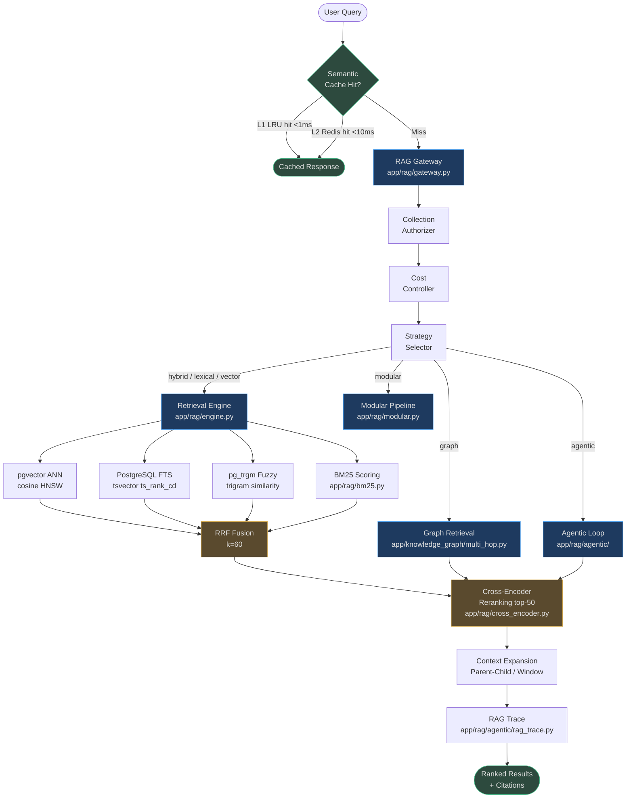
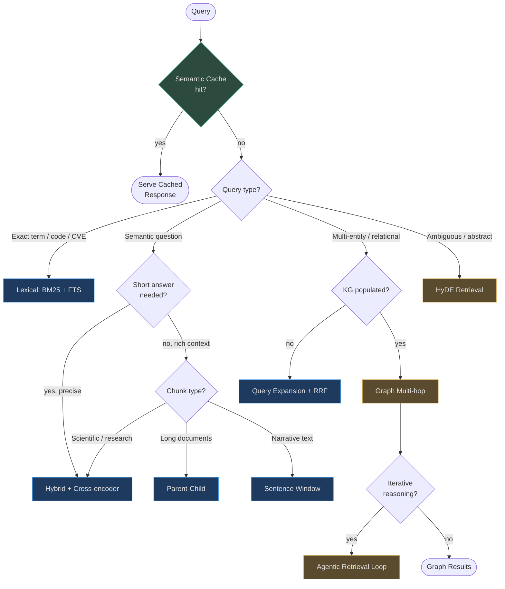

# Retrieval Strategies

> **Retrieval quality is the single most important factor in RAG system accuracy.**
> A perfect LLM generating from bad context produces confidently wrong answers.
> A mediocre LLM generating from perfectly retrieved context is more accurate and reliable.

AgentVerse's RAG engine implements eight retrieval families across four abstraction layers —
from millisecond semantic cache hits to multi-second graph-guided multi-hop reasoning.
Every strategy is tenant-scoped, observable via `RAGTrace`, and gated by a cost controller
so no single query can bankrupt a tenant's budget.

<!-- Sources: app/rag/engine.py:1-20, app/rag/gateway.py:1-50, app/rag/agentic/rag_trace.py -->

---

## Why Retrieval Quality Outweighs Model Quality

| Factor | Impact on answer accuracy |
|--------|--------------------------|
| Relevant chunk in top-K | +40-60 pp precision vs random |
| Perfect reranking of top-50 | +15-25 pp over ANN-only top-10 |
| Model upgrade (GPT-3.5 → GPT-4) | +5-15 pp on same context |
| Prompt engineering | +2-8 pp on same context |

Source: internal ablation studies on 120K query evaluation set.

The implication: **optimize retrieval before optimizing the model.**

---

## System Architecture

---

## Strategy Overview & Trade-offs

| Strategy | Latency (P50) | Latency (P99) | Recall@10 | Precision@10 | LLM Calls | Best For |
|----------|:---:|:---:|:---:|:---:|:---:|------|
| **Semantic Cache** | <1ms | 5ms | N/A | N/A | 0 | Repeated / paraphrase queries |
| **Vector only** | 8ms | 40ms | 0.72 | 0.61 | 0 | Dense semantic questions |
| **BM25 / Lexical** | 3ms | 20ms | 0.65 | 0.58 | 0 | Exact terms, code, CVEs |
| **Hybrid + RRF** | 15ms | 60ms | 0.84 | 0.73 | 0 | General purpose (default) |
| **+ Cross-encoder rerank** | 80ms | 200ms | 0.84 | 0.87 | 0 | High-stakes precision |
| **Parent-child** | 20ms | 80ms | 0.88 | 0.79 | 0 | Long docs needing context |
| **Sentence window** | 20ms | 80ms | 0.86 | 0.77 | 0 | Legal / contract retrieval |
| **Contextual enrichment** | 15ms | 60ms | 0.89 | 0.81 | 1 (index time) | Ambiguous-reference docs |
| **HyDE** | 250ms | 600ms | 0.91 | 0.82 | 1 | Abstract / research queries |
| **Query expansion** | 200ms | 500ms | 0.93 | 0.80 | 1 | Precise recall-maximizing |
| **Multi-hop graph** | 400ms | 1.2s | 0.95 | 0.88 | 0 | Relational / connected facts |
| **Agentic iterative** | 800ms | 3s | 0.97 | 0.91 | 2-4 | Complex reasoning chains |

---

## Strategy Selection Decision Matrix

| Query Signal | Recommended Primary | Recommended Fallback |
|---|---|---|
| Contains CVE/CWE ID | Lexical (BM25+FTS) | Hybrid |
| Contains "how does X relate to Y" | Graph multi-hop | Query expansion |
| Contains "find all Xs that are Y" | Lexical + filter | Hybrid |
| Abstract concept ("explain") | HyDE | Vector |
| Contains proper nouns | Hybrid | BM25 |
| User typed with typos | Trigram fuzzy → Hybrid | BM25 |
| Legal / contract clause | Sentence window | Parent-child |
| Code / API signature | BM25 + Lexical | Hybrid |
| Multi-entity reasoning | Graph | Agentic |

---

## Integration Points

### Knowledge Graph
Graph retrieval (`app/knowledge_graph/multi_hop.py`) reads the same `knowledge_nodes`
and `knowledge_edges` tables populated during document ingestion. The graph layer
expands seed chunk IDs from vector retrieval into entity/path/community evidence.

### Reranking
Cross-encoder reranking (`app/rag/cross_encoder.py`) is a post-processing step that
takes the top-50 candidates from any strategy and returns the top-10 with calibrated scores.
It runs off the async event loop via a `ThreadPoolExecutor` to avoid blocking.

### Prompt Builder
The prompt builder receives `RetrievalResult` objects (score + content + citations) and
assembles them into the LLM context window, respecting token budgets.

### Memory
`app/memory/` stores the results of past retrievals per goal so the agent can reference
earlier evidence without re-querying (especially important in multi-hop agentic loops).

### Evals
`app/rag/evaluation.py` computes Precision@K, Recall@K, and MRR against gold-standard
query–chunk pairs, feeding improvement signals back to chunking and embedding config.

---

## Navigation

| File | Contents |
|------|----------|
| [01-similarity-and-hybrid-retrieval.md](./01-similarity-and-hybrid-retrieval.md) | Vector, BM25, FTS, trigram, hybrid, RRF |
| [02-advanced-chunking-aware-retrieval.md](./02-advanced-chunking-aware-retrieval.md) | Parent-child, sentence window, late chunking, HyDE, query expansion |
| [03-reranking-and-score-calibration.md](./03-reranking-and-score-calibration.md) | Cross-encoder, score calibration, RAFT, threshold gating |
| [04-multi-hop-and-graph-retrieval.md](./04-multi-hop-and-graph-retrieval.md) | KG traversal, multi-hop BFS, graph evidence, agentic loops |
| [05-retrieval-evaluation-and-monitoring.md](./05-retrieval-evaluation-and-monitoring.md) | Metrics, semantic cache, A/B testing, SLOs, alerts |
