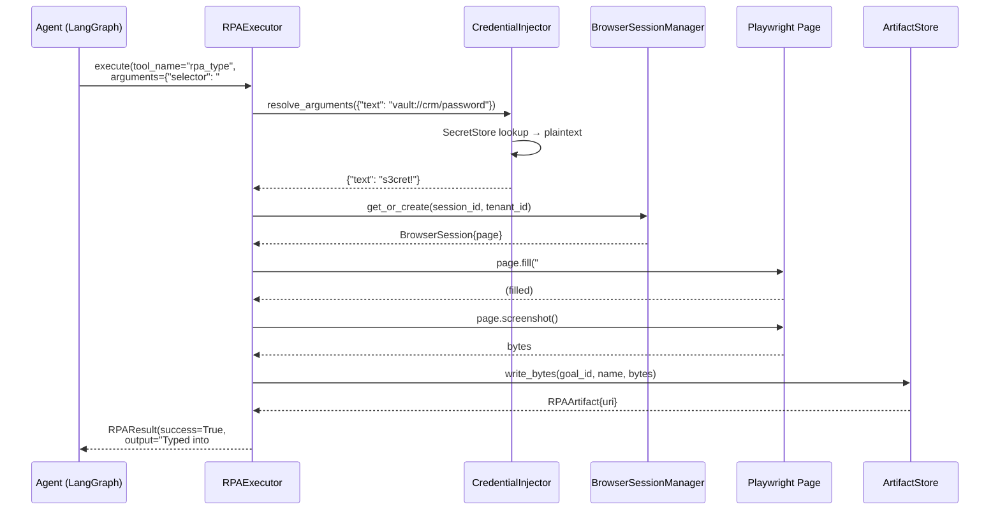
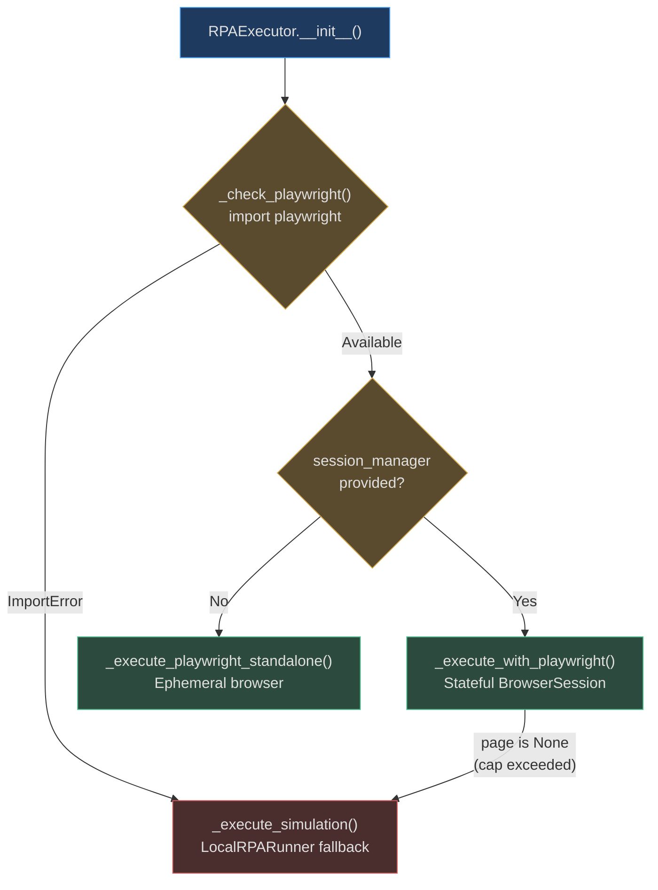

# RPA Architecture

AgentVerse RPA is built around a **Protocol + Adapter** pattern. A thin `RPARunner` Protocol
defines the contract; two concrete adapters (`LocalRPARunner` and Playwright-backed execution
in `RPAExecutor`) fulfill it. This split enables deterministic CI testing without a browser
while maintaining full fidelity in production.

---

## RPARunner Protocol

```python
# app/rpa/runner.py
class RPARunner(Protocol):
    def open_url(self, url: str) -> str: ...
    def type(self, selector: str, text: str) -> str: ...
    def click(self, *, selector: str | None, text: str | None) -> str: ...
    def extract_text(self, selector: str | None = None) -> str: ...
    def screenshot(self, *, artifact_store: RPAArtifactStore, name: str) -> str: ...
```

The Protocol defines five operations:

| Method | Purpose | Returns |
|---|---|---|
| `open_url(url)` | Navigate to a URL | Human-readable result string |
| `type(selector, text)` | Fill a form field | Human-readable result string |
| `click(selector?, text?)` | Click an element | Human-readable result string |
| `extract_text(selector?)` | Read text from page/element | Extracted text content |
| `screenshot(artifact_store, name)` | Capture and store screenshot | Artifact URI string |

**Why a `Protocol` (structural typing) instead of an abstract base class?**
Python Protocols use structural subtyping — any class that implements these five methods
satisfies `RPARunner` without inheriting from it. This allows `RPAExecutor` (which is
fundamentally a different abstraction, taking async session parameters) to co-exist with
`LocalRPARunner` without forcing a common inheritance hierarchy.

---

## LocalRPARunner (CI-Safe Adapter)

`LocalRPARunner` runs automation logic in-process without a real browser. It provides a
fully functional implementation of `RPARunner` that is deterministic, stateless between
calls, and safe to run in any CI environment.

```python
# app/rpa/runner.py
class LocalRPARunner:
    def __init__(self, session: RPASession) -> None:
        self.session = session
        self.typed_values: dict[str, str] = {}   # selector → typed text
        self.clicked_targets: list[str] = []      # history of clicks
```

### Internal State

| Attribute | Type | Purpose |
|---|---|---|
| `session` | `RPASession` | Shared state container (URL, status, screenshot list) |
| `typed_values` | `dict[str, str]` | Records what was typed into each selector |
| `clicked_targets` | `list[str]` | Ordered history of click targets |

### Behaviour Per Method

- **`open_url`**: sets `session.current_url` and `session.status = "running"`, returns `"Opened {url}"`
- **`type`**: records `selector → text` in `typed_values`, sets status to `"running"`
- **`click`**: appends `selector` or `"text:{text}"` to `clicked_targets`
- **`extract_text`**: returns a formatted string including current URL, all typed values, and click history — this is the "page state" the agent sees
- **`screenshot`**: writes a synthetic PNG (`b"agentverse-local-rpa-screenshot\n..."`) to `artifact_store`, appends URI to `session.screenshots`

### Real-World Usage: CI Pipeline

```bash
# CI runs 500 RPA-enabled agent tests in ~30 seconds
uv run pytest tests/e2e/ -m "not slow" -q --no-cov
# All RPA calls go through LocalRPARunner — no browser, no display
```

The `extract_text` return format — `"LocalRPARunner text selector=<page> url=https://... values=email=test@co.com clicks=text:Submit"` — lets agents reason about what happened even without real DOM parsing.

---

## RPAExecutor (Production Adapter)

`RPAExecutor` is the production-grade implementation. It orchestrates Playwright sessions,
credential injection, artifact storage, and vision analysis:

```python
# app/rpa/executor.py
class RPAExecutor:
    def __init__(
        self,
        artifact_store: Any = None,        # RPAArtifactStore or MinIOArtifactStore
        session_manager: Any = None,        # BrowserSessionManager
        headless: bool = True,              # False for visual debugging
        vision_provider: Any = None,        # Optional LLM for screenshot analysis
    ) -> None:
        self._playwright_available = self._check_playwright()
        self._credential_injector: Any = None  # Set externally (P1.2)
```

### RPAResult Dataclass

Every tool call through `RPAExecutor.execute()` returns an `RPAResult`:

```python
@dataclass
class RPAResult:
    success: bool
    output: str = ""                   # Human-readable result for the agent
    artifact_url: str | None = None    # base64 data URI or storage URI
    artifact_name: str | None = None   # Filename (e.g. "confirmation.png")
    duration_ms: float = 0.0           # Execution time in milliseconds
    error: str | None = None           # Full error message if success=False
```

`duration_ms` is measured from the moment `execute()` is called to the moment the result is
returned — covering credential injection + DOM interaction + artifact storage.

### Vision Provider Integration

When `vision_provider` is set, `RPAExecutor` automatically passes screenshots to a vision
LLM after `rpa_screenshot` calls:

```python
# executor.py — screenshot tool path
vision_analysis = await browser_agent.analyze_screenshot(
    b64,
    "Describe the main content and purpose of this page.",
)
# Appended to RPAResult.output so agent sees: "Screenshot captured: confirm\nVision analysis: ..."
```

This allows agents to verify page state from screenshots without needing to parse DOM text.

---

## Tool Execution Pipeline



> Note: plaintext credentials resolved by `CredentialInjector` are **never** included in
> `RPAResult.output`, `RPAResult.error`, or any log statement.

---

## Playwright vs LocalRPARunner Decision



| Feature | Playwright (`_execute_with_playwright`) | LocalRPARunner (simulation) |
|---|---|---|
| Real DOM navigation | ✅ | ❌ (URL tracked, no DOM) |
| JavaScript execution | ✅ (full JS engine) | ❌ |
| File download | ✅ | ❌ |
| File upload | ✅ | ❌ |
| Accurate screenshots | ✅ | ✅ (synthetic PNG) |
| CI / unit tests | ❌ (needs browser) | ✅ |
| Memory per session | ~200MB | ~1KB |
| Startup time | 1–3 seconds | < 1ms |

**Practical rule**: production goals use `_execute_with_playwright`; CI and sandbox
environments use simulation. The same agent goal, the same tool names, the same result shape.

---

## Ephemeral vs Stateful Sessions

`RPAExecutor.execute()` detects whether to use an ephemeral session (creates and closes a
browser per call) or a stateful session (reuses an existing `BrowserSession`):

```python
sid = session_id or uuid.uuid4().hex
ephemeral = session_id is None          # True → create + close around this call
# ... execute ...
if ephemeral and self._session_manager:
    await self._session_manager.close(sid, tenant_id)
```

- **Ephemeral** (`session_id=None`): one-shot calls like "check if this URL is reachable"
- **Stateful** (caller provides `session_id`): multi-step workflows that need to share
  cookies, form state, and navigation history across tool calls

Multi-step workflows like expense submission — open → screenshot → click → type → submit
→ screenshot — **must** use a stateful session or each step starts on a blank browser.

---

## Session Browser Context Configuration

When `BrowserSessionManager._create_session()` launches Playwright, the browser context is
configured for a realistic, server-safe UA:

```python
browser = await pw.chromium.launch(headless=self._headless)
context = await browser.new_context(
    viewport={"width": 1280, "height": 720},
    user_agent="AgentVerse-RPA/1.0",
)
page = await context.new_page()
```

The 1280×720 viewport ensures modern responsive sites render in "desktop" mode. The custom
User-Agent string `AgentVerse-RPA/1.0` allows server administrators to identify and audit
agent traffic in their access logs.

---

## Real-World Examples

**Real-World Example 2 — E-Commerce CI Pipeline**

> An e-commerce company runs 300 RPA-enabled regression tests per day verifying their checkout-flow automation agents. All 300 tests use `LocalRPARunner` in CI — each test executes in under 2ms (no browser launch, no network, pure in-memory state tracking) versus 3–8 seconds with real Playwright against live staging servers. The complete 300-test suite finishes in under 10 minutes on a standard GitHub Actions runner, with zero flakiness from network timeouts or browser rendering variability. The same test code — identical goal definitions, identical tool call sequences, identical assertion logic — runs nightly against real Playwright with a staging browser farm, where tests complete in 45 minutes and catch integration regressions invisible to the in-memory adapter. The `extract_text` return format (`"LocalRPARunner text selector=<page> url=... values=email=test@co.com clicks=text:Submit"`) is stable enough that all test assertions (`assert "text:Submit" in result.clicked_targets`) pass identically in both modes without any adapter layer or conditional logic in the test code.

<!-- Sources: app/rpa/runner.py, app/rpa/executor.py -->
