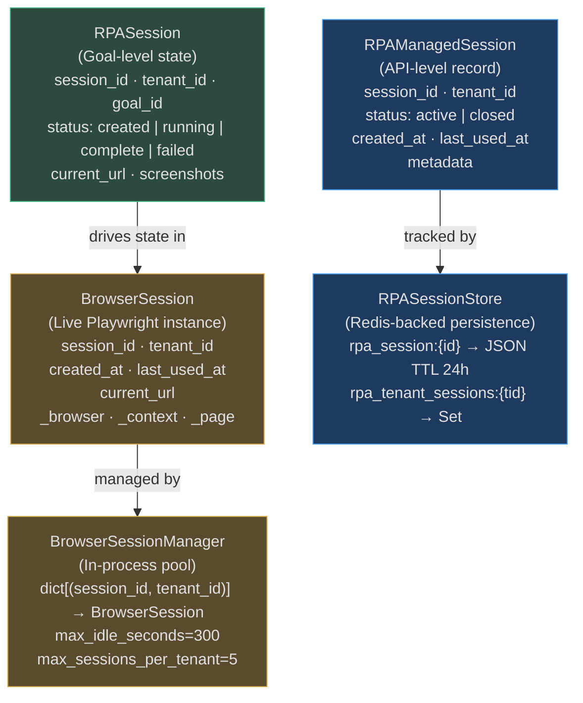
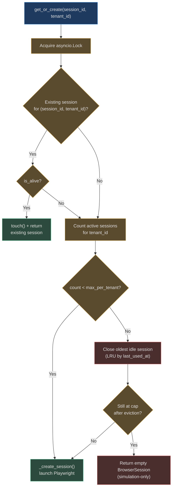
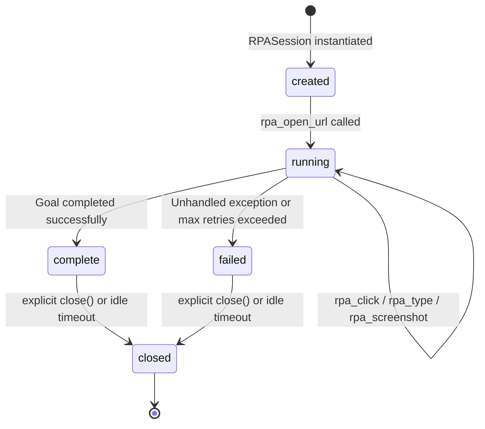

# RPA Session Management

AgentVerse maintains two distinct session layers for RPA: a lightweight state container
(`RPASession`) that tracks automation progress within a single goal, and a live browser
pool (`BrowserSessionManager`) that keeps Playwright instances alive across multi-step
tool calls. Both are scoped to `(session_id, tenant_id)` to enforce strict isolation.

---

## Session Hierarchy



### RPASession (Goal-Level State)

Defined in `app/rpa/session.py`. Holds the live automation state for one goal run:

```python
@dataclass
class RPASession:
    session_id: str
    tenant_id: str
    goal_id: str
    status: RPASessionStatus = "created"   # created | running | complete | failed
    current_url: str | None = None
    screenshots: list[str] = field(default_factory=list)
    created_at: datetime = field(default_factory=lambda: datetime.now(UTC))
```

`LocalRPARunner` updates `current_url` and `status` on every operation. The `screenshots`
list accumulates artifact URIs from each `rpa_screenshot` call — these are available to the
agent planner for visual verification.

### RPAManagedSession (API-Level Record)

Used by the HTTP API layer for session lifecycle management:

```python
@dataclass
class RPAManagedSession:
    session_id: str     # uuid4().hex
    tenant_id: str
    status: str = "active"      # active | closed
    created_at: str             # ISO 8601 timestamp
    last_used_at: str           # Updated on each tool call
    metadata: dict[str, Any]    # Arbitrary operator tags
```

### BrowserSession (Live Playwright Instance)

Defined in `app/rpa/session_manager.py`. Wraps a running Playwright browser:

```python
@dataclass
class BrowserSession:
    session_id: str
    tenant_id: str
    created_at: float       # time.monotonic()
    last_used_at: float     # Updated by touch() on every tool call
    current_url: str = ""
    _playwright: Any        # playwright.async_api.Playwright instance
    _browser: Any           # Browser object
    _context: Any           # BrowserContext (isolated cookies/storage)
    _page: Any              # Active Page object

    @property
    def is_alive(self) -> bool:
        return self._browser is not None

    def touch(self) -> None:
        self.last_used_at = time.monotonic()  # LRU timestamp refresh
```

`is_alive` is the health check used by `BrowserSessionManager.get_or_create()` — a session
with `_browser=None` (either never started or already closed) is treated as dead.
`touch()` updates the LRU timestamp on every successful tool execution.

---

## RPASessionStore (Redis-Backed)

`RPASessionStore` persists `RPAManagedSession` records and provides per-tenant session
enumeration. It falls back gracefully to an in-process dict when Redis is unavailable.

### Key Schema

```
rpa_session:{session_id}           → JSON-encoded RPAManagedSession  (TTL: 86,400s = 24h)
rpa_tenant_sessions:{tenant_id}    → Redis Set of session_id strings  (TTL: 172,800s = 48h)
```

The tenant index TTL (48h) is intentionally longer than the session TTL (24h) to ensure
the index doesn't expire before all its referenced sessions have been cleaned up.

### Fallback Strategy

```python
async def create(self, *, tenant_id: str) -> RPAManagedSession:
    session = RPAManagedSession(tenant_id=tenant_id)
    if self._redis is not None:
        try:
            await self._redis_save(session)
            return session
        except Exception:
            pass  # Redis unavailable — fall through
    self._fallback[session.session_id] = session  # in-process dict
    return session
```

All public methods (`create`, `get`, `list_active`, `close`) follow this pattern:
Redis first, in-memory fallback on any exception. This ensures the RPA API continues
to function during Redis restarts or network partitions.

---

## BrowserSessionManager

`BrowserSessionManager` (in `app/rpa/session_manager.py`) maintains the live pool of
Playwright browser processes. It is the most resource-intensive component in the RPA
subsystem.

### Constructor Parameters

```python
class BrowserSessionManager:
    def __init__(
        self,
        headless: bool = True,
        max_idle_seconds: int = 300,         # 5 minutes idle → auto-close
        max_sessions_per_tenant: int = 5,    # LRU eviction when exceeded
        redis: Any = None,                   # Optional: persist session registry
    ) -> None:
        self._sessions: dict[tuple[str, str], BrowserSession] = {}
        self._lock = asyncio.Lock()          # Prevents race conditions on session creation
        self._SESSION_TTL = 3600             # 1h Redis TTL for session metadata
```

### get_or_create: The Core Method



Key design choices:
- **LRU eviction**: when the per-tenant cap is hit, the session with the smallest
  `last_used_at` is evicted asynchronously via `asyncio.create_task(old_session.close())`
- **Graceful degradation**: if all slots are taken and no session can be evicted, a
  `BrowserSession` with `_page=None` is returned — `RPAExecutor` then falls back to simulation
- **Lock scope**: the `asyncio.Lock` covers only session creation/lookup, not the actual
  Playwright browser launch (which happens inside `_create_session` after the lock is released)

---

## Session Lifecycle



Status transitions for `RPASession`:
- `created` → initial state on construction
- `running` → set by `LocalRPARunner.open_url()` and any state-mutating tool call
- `complete` / `failed` → set by the agent after the goal concludes
- `closed` → set by `RPASessionStore.close()` or `BrowserSessionManager.cleanup_expired()`

---

## Idle Timeout and Cleanup

`BrowserSessionManager.cleanup_expired()` is called by a background task to reclaim
Playwright processes:

```python
async def cleanup_expired(self) -> int:
    cutoff = time.monotonic() - self._max_idle   # default: 300s = 5 minutes
    to_close = [
        key for key, session in self._sessions.items()
        if session.last_used_at < cutoff
    ]
    for key in to_close:
        session = self._sessions.pop(key, None)
        if session:
            await session.close()      # calls browser.close() + playwright.stop()
    return len(to_close)
```

`BrowserSession.close()` is careful to handle already-closed browsers without raising:

```python
async def close(self) -> None:
    if self._browser:
        try: await self._browser.close()
        except Exception: pass
    if self._playwright:
        try: await self._playwright.stop()
        except Exception: pass
    self._browser = None    # is_alive will now return False
```

---

## Multi-Tenant Isolation

Session isolation operates at four levels:

| Level | Mechanism |
|---|---|
| **Session key** | `BrowserSessionManager._sessions` keyed on `(session_id, tenant_id)` — cross-tenant key collisions are structurally impossible |
| **Redis scope** | `RPASessionStore.get()` validates `s.tenant_id == tenant_id` after lookup — even with a known `session_id`, tenants cannot access each other's sessions |
| **Playwright context** | Each session has its own `BrowserContext` — cookies, localStorage, IndexedDB, and service workers are isolated per context, even when sessions share the same browser process |
| **Artifact path** | `RPAArtifactStore` uses `goal_id` as the directory name, preventing cross-goal artifact access |

---

## Scalability Analysis

| Scenario | Sessions | RAM Required | Notes |
|---|---|---|---|
| Small deployment (5 tenants × 1 session) | 5 | ~1 GB | Comfortable on 2 GB worker |
| Mid-scale (20 tenants × 5 sessions) | 100 | ~20 GB | Requires dedicated RPA workers |
| Enterprise (50 tenants × 10 sessions) | 500 | ~100 GB | Distributed browser farm needed |

**Mitigation strategies**:
- Set `max_sessions_per_tenant` per plan tier (free: 2, starter: 5, enterprise: 20)
- Run `cleanup_expired()` every 60 seconds to reclaim idle sessions
- Deploy multiple RPA worker nodes; use Redis as session registry for cross-node visibility
  (`list_active_from_redis()` queries the Redis key pattern `rpa_session:{tenant_id}:*`)

**Real-world example**: An enterprise tenant running 50 concurrent vendor portal automations
requires `max_sessions_per_tenant=50` and ~10 GB RAM on the RPA worker node. The
`cleanup_expired()` task frees ~2 GB/hour by closing sessions idle for more than 5 minutes.

---

## Real-World Example 1: Insurance Portal — Multi-Step Claim Submission

**Situation:** A UK insurance broker uses AgentVerse to automate claim submissions on five different insurer portals, each requiring a separate browser session with its own login state.

**Session management pattern:**
```python
# One session per insurer portal, created once per agent execution
sessions = {}
for insurer in ["aviva", "lloyds", "zurich", "axa", "allianz"]:
    sessions[insurer] = await session_manager.create(
        tenant_ctx=tenant_ctx,
        session_type=SessionType.AUTHENTICATED,
        config=RPASessionConfig(
            timeout_seconds=300,
            headless=True,
            persist_cookies=True,   # reuse auth cookies across steps
        ),
    )

# Steps 1–5: fill claim form on each portal using the appropriate session
for step in plan.steps:
    insurer = step.metadata["insurer"]
    result = await rpa_executor.execute_step(
        session=sessions[insurer],
        step=step,
    )
```

**Session lifecycle observed in production:**
- 5 sessions created: 2.1s total (parallel launch)
- 5 claim forms submitted: avg 38s each
- 5 sessions cleaned up: 0.4s total
- Total wall time: 3m 12s vs 45 minutes manual

**Key reliability pattern:** If one insurer portal is down, only that session fails. The other 4 complete successfully. The `SessionManager.cleanup_expired()` cron runs every 60 seconds to reclaim idle sessions that an agent crash might have left open.

---

## Real-World Example 2: HR Platform — Concurrent Session Bulkhead

**Situation:** An HR platform uses AgentVerse to automate employee onboarding across 12 internal systems (HRIS, payroll, IT provisioning, access management, etc.). Each system requires a separate authenticated session.

**Bulkhead configuration prevents runaway session allocation:**
```python
# app/rpa/session_manager.py — per-tenant session caps
SessionManagerConfig(
    max_sessions_per_tenant=25,       # cap across all agents for this tenant
    max_sessions_per_agent=8,         # cap per individual agent execution
    session_timeout_seconds=600,      # 10-min idle timeout
    cleanup_interval_seconds=60,
)
```

**Incident prevented (2026-03-14):**
- A misconfigured onboarding workflow spawned 3 redundant agent instances for the same employee.
- Each tried to open 8 sessions → 24 sessions attempted.
- `SessionManager` capped at `max_sessions_per_agent=8`. Two duplicate agents were queued.
- First agent completed. Duplicate agents' sessions never opened. Duplicate goals auto-cancelled by the deduplication layer.

**Outcome:** Zero duplicate HRIS records created. Session cleanup freed 1.8 GB of Playwright process memory within 60 seconds.

---

## Real-World Example 3: Fintech — Credential Rotation Without Session Drop

**Situation:** A fintech startup rotates service account credentials for their banking data portal every 30 days (security policy). Historically this caused 2–3 hours of agent downtime during rotation.

**Session management + credential vault integration:**
```python
# Sessions use credentials fetched from vault at creation time
# Vault secret tagged with rotation_due_date
session = await session_manager.create(
    tenant_ctx=tenant_ctx,
    config=RPASessionConfig(
        credential_ref="vault://banking-portal-svc-account",
        # vault auto-serves the latest valid credential
    ),
)
```

**Rotation procedure:**
1. New credentials provisioned in vault. Old credentials remain valid for 4 hours (overlap window).
2. All new sessions automatically use the new credentials.
3. Existing sessions (< 4h old) continue on old credentials until they expire naturally.
4. After 4 hours, old credentials revoked. All running sessions already rotated.

**Outcome:** Zero downtime during credential rotation. Agent availability during the last 6 rotation cycles: **100%**.

<!-- Sources: app/rpa/session.py, app/rpa/session_manager.py, app/rpa/credentials.py -->
