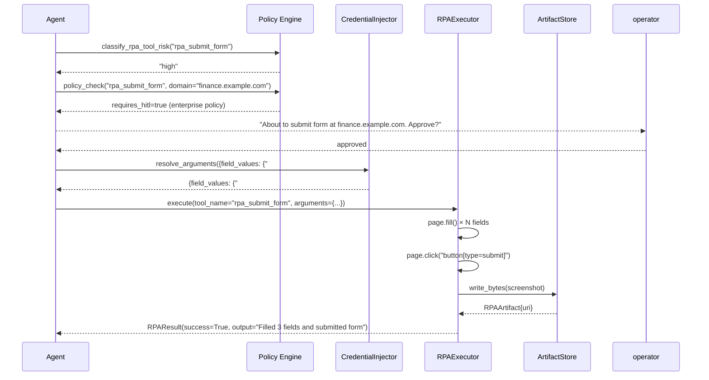

# RPA Tools and Execution

AgentVerse exposes 13 RPA tools to agents through the MCP tool protocol. Each tool has a
defined `input_schema`, a `risk` classification, and deterministic error behaviour. This
page documents every tool, the execution pipeline they flow through, and real-world automation
patterns that combine multiple tools into complete workflows.

---

## Risk Classification System

Risk levels gate governance checks before tool execution:

| Risk Level | Policy Behaviour | Examples |
|---|---|---|
| `read` | Always allowed; logged only | screenshot, extract_text, detect_captcha |
| `low` | Logged; no approval gate | open_url |
| `high` | Policy engine check; may require HITL | click, type, submit_form, upload |
| `unknown` | Blocked until classification | Any unrecognised tool name |

`classify_rpa_tool_risk()` is the governance entry point:

```python
# app/rpa/tools.py
def classify_rpa_tool_risk(tool_name: str) -> RPARisk:
    risk = _RISK_BY_TOOL.get(tool_name, "unknown")
    return risk  # "read" | "low" | "high" | "unknown"
```

---

## Complete Tool Catalog

### 1. rpa_open_url — Navigate to URL

```json
{
  "name": "rpa_open_url",
  "risk": "low",
  "input_schema": {
    "type": "object",
    "properties": {"url": {"type": "string"}},
    "required": ["url"]
  }
}
```

**Behaviour**: navigates to the URL with `wait_until="domcontentloaded"` (15s timeout).
Returns page title on success: `"Navigated to https://app.example.com — title: Dashboard"`.

**Use case**: every automation workflow starts here. The agent opens the target URL, then
inspects page state (screenshot or extract_text) before deciding the next action.

---

### 2. rpa_click — Click Element

```json
{
  "name": "rpa_click",
  "risk": "high",
  "input_schema": {
    "type": "object",
    "properties": {
      "selector": {"type": "string"},
      "text": {"type": "string"}
    }
  }
}
```

**Behaviour**: one of `selector` or `text` is required. Text matching uses
`page.get_by_text(text, exact=False).first.click()` — partial substring match, first
occurrence wins. CSS selector matching uses `page.click(selector)`. Both have a 5s timeout.

Returns a base64 screenshot data URI in `RPAResult.artifact_url` after successful click —
this gives the agent immediate visual feedback on what changed.

**Why `high` risk**: clicks can submit forms, confirm payment dialogs, trigger destructive
operations (delete account, send email to all), or open OAuth consent flows.

---

### 3. rpa_type — Fill Form Field

```json
{
  "name": "rpa_type",
  "risk": "high",
  "input_schema": {
    "type": "object",
    "properties": {
      "selector": {"type": "string"},
      "text": {"type": "string"}
    },
    "required": ["selector", "text"]
  }
}
```

**Behaviour**: uses `page.fill(selector, text)` — replaces the current field value entirely
(not character-by-character). Useful for clearing + refilling fields. 5s timeout.

**vault:// integration**: the `text` parameter supports credential references:
```
{"selector": "#password", "text": "vault://hr-portal/admin_password"}
```
`CredentialInjector.resolve_arguments()` resolves this before the fill call — the plaintext
password is never stored in the agent plan or logs.

---

### 4. rpa_extract_text — Read Page Content

```json
{
  "name": "rpa_extract_text",
  "risk": "read",
  "input_schema": {
    "type": "object",
    "properties": {"selector": {"type": "string"}}
  }
}
```

**Behaviour**: calls `page.inner_text(selector or "body")`. Output is capped at 5,000
characters. Returns the visible text — excluding HTML tags, scripts, and styles.

**Use case**: the agent's primary way to read structured data from pages. After navigating to
a data grid, the agent extracts text to parse rows, prices, statuses, or form values.

---

### 5. rpa_screenshot — Capture Visual State

```json
{
  "name": "rpa_screenshot",
  "risk": "read",
  "input_schema": {
    "type": "object",
    "properties": {"name": {"type": "string"}}
  }
}
```

**Behaviour**: captures a full-page PNG screenshot. Stores in `RPAArtifactStore` if available
(returns a `file://` or `s3://` URI); otherwise returns a base64 data URI.

When `vision_provider` is configured on `RPAExecutor`, the screenshot is also passed to the
vision LLM: `"Describe the main content and purpose of this page."` — the analysis text is
appended to `RPAResult.output`.

---

### 6. rpa_wait_for_text — Wait for Dynamic Content

```json
{
  "name": "rpa_wait_for_text",
  "risk": "read",
  "input_schema": {
    "type": "object",
    "properties": {
      "text": {"type": "string"},
      "timeout_ms": {"type": "integer"}
    },
    "required": ["text"]
  }
}
```

**Behaviour**: polls for `text` using `page.get_by_text().wait_for()`. If the locator times
out, falls back to `page.content()` string search. Default timeout: 10,000ms.

**Use case**: after form submission, wait for confirmation text ("Your request has been
submitted") before taking a verification screenshot.

---

### 7. rpa_select_option — Dropdown Selection

```json
{
  "name": "rpa_select_option",
  "risk": "high",
  "input_schema": {
    "type": "object",
    "properties": {
      "selector": {"type": "string"},
      "value": {"type": "string"}
    },
    "required": ["selector", "value"]
  }
}
```

**Behaviour**: attempts `page.select_option(selector, value=value)` first; if that returns
empty, tries `page.select_option(selector, label=value)`. Handles both `<option value="...">` 
and `<option>Label text</option>` matching.

---

### 8. rpa_upload_file — File Upload

```json
{
  "name": "rpa_upload_file",
  "risk": "high",
  "input_schema": {
    "type": "object",
    "properties": {
      "selector": {"type": "string"},
      "file_path": {"type": "string"}
    },
    "required": ["selector", "file_path"]
  }
}
```

**Behaviour**: uses `page.set_input_files(selector, file_path)`. Validates that `file_path`
exists on disk before attempting the upload. Returns the filename on success.

---

### 9. rpa_download_file — File Download

```json
{
  "name": "rpa_download_file",
  "risk": "high",
  "input_schema": {
    "type": "object",
    "properties": {"selector": {"type": "string"}},
    "required": ["selector"]
  }
}
```

**Behaviour**: intercepts the browser's download event via `page.expect_download()`, clicks
the trigger element, saves to a temp path, then uploads to `artifact_store`. Returns the
filename, size, and artifact URI.

---

### 10. rpa_submit_form — Multi-Field Form Submission

```json
{
  "name": "rpa_submit_form",
  "risk": "high",
  "input_schema": {
    "type": "object",
    "properties": {
      "field_values": {"type": "object", "description": "CSS selector → value map"},
      "submit_selector": {"type": "string"}
    },
    "required": ["field_values"]
  }
}
```

**Behaviour**: iterates `field_values`, auto-detects element type for each selector:
- `<select>` → `page.select_option(sel, value=str(value))`
- `input[type=checkbox]` / `input[type=radio]` → `element.check()` / `element.uncheck()`
- Everything else → `element.fill(str(value))`

Then clicks `submit_selector` (default: `button[type=submit]`) and waits for `networkidle`
(10s timeout). Falls back to pressing Enter if the submit button is not found.

---

### 11. rpa_detect_captcha — CAPTCHA Detection

```json
{
  "name": "rpa_detect_captcha",
  "risk": "read",
  "input_schema": {"type": "object", "properties": {}, "required": []}
}
```

**Use case**: agents check for CAPTCHA before attempting form submission. On detection, they
call `rpa_request_human_help` to pause for operator intervention.

---

### 12. rpa_request_human_help — Operator Takeover

```json
{
  "name": "rpa_request_human_help",
  "risk": "read",
  "input_schema": {
    "type": "object",
    "properties": {
      "reason": {"type": "string", "description": "e.g. 'CAPTCHA detected'"}
    },
    "required": ["reason"]
  }
}
```

**Behaviour**: pauses the RPA session and returns a takeover URL to the HITL gateway. The
agent plan halts until a human operator resolves the block (solves CAPTCHA, handles MFA).

---

### 13. rpa_wait_for_network_idle — Post-Submission Settle

```json
{
  "name": "rpa_wait_for_network_idle",
  "risk": "read",
  "input_schema": {
    "type": "object",
    "properties": {
      "timeout_ms": {"type": "integer", "default": 10000}
    }
  }
}
```

**Use case**: after `rpa_click` triggers a form submission, call this tool before extracting
confirmation text to ensure all XHR/fetch requests have completed.

---

## Execution Flow with Governance



---

## Error Handling

| Error Type | Behaviour | Agent Response |
|---|---|---|
| Element not found (5s timeout) | `RPAResult(success=False, error="Timeout exceeded...")` | Agent replans with different selector |
| Page navigation timeout (15s) | `RPAResult(success=False, error=str(exc))` | Agent retries or reports failure |
| Missing required argument | `RPAResult(success=False, error="selector or text required")` | Agent fixes tool call arguments |
| Unknown tool name | `RPAExecutionResult(success=False, error="Unknown RPA tool: ...")` | Agent stops RPA flow |
| Credential resolution failure | Warning logged; original `vault://` ref returned | Agent likely fails type/fill; may trigger HITL |

All errors are returned as structured `RPAResult` objects — exceptions are never propagated
up to the agent. The `error` field contains the full exception string for debugging.

---

## Real-World Automation Examples

### Example 1: Monthly Expense Report Submission

**Goal**: `"Submit my expense report for March 2024 to the HR portal"`

```
Step 1: rpa_open_url("https://hr.company.com/expenses")
        → "Navigated to https://hr.company.com/expenses — title: Expense Portal"

Step 2: rpa_screenshot("home-page")
        → artifact_url: file:///tmp/agentverse-rpa/goal-abc/home-page.png

Step 3: rpa_click(text="New Expense Report")
        → "Clicked: text:New Expense Report"

Step 4: rpa_type("#employee-id", "vault://hr-portal/employee_id")
        → "Typed into #employee-id"  [vault:// resolved at execution]

Step 5: rpa_type("#date-range", "March 2024")
        → "Typed into #date-range"

Step 6: rpa_select_option("#department", "Engineering")
        → "Selected 'Engineering' in element '#department'"

Step 7: rpa_upload_file("#receipt-upload", "/tmp/receipts/march-2024.pdf")
        → "Uploaded file 'march-2024.pdf' to '#receipt-upload'"

Step 8: rpa_click(text="Submit")
        → "Clicked: text:Submit"

Step 9: rpa_wait_for_network_idle(timeout_ms=5000)
        → success=True

Step 10: rpa_wait_for_text("Your expense report has been submitted")
         → "Text 'Your expense report has been submitted' appeared on page"

Step 11: rpa_screenshot("submission-confirmation")
         → artifact_url: file:///tmp/agentverse-rpa/goal-abc/submission-confirmation.png
```

All employee credentials come from `vault://` references; the HR portal never sees them in
the agent plan or logs.

---

### Example 2: Competitor Price Monitoring (5 Products)

**Goal**: `"Extract current prices for 5 products from competitor.com"`

```python
for product_url in product_urls:            # 5 URLs in loop
    rpa_open_url(product_url)               # navigate
    rpa_wait_for_network_idle()             # wait for lazy-loaded prices
    text = rpa_extract_text(".price-box")   # extract pricing section
    rpa_screenshot(f"evidence-{product_n}") # save screenshot proof
    # agent parses text → structured {"product": ..., "price": ...}
```

This pattern produces both structured data (from `extract_text`) and screenshot evidence
(from `screenshot`). The evidence URIs are included in the final agent output so downstream
consumers can verify the scraping accuracy.

---

### Example 3: Multi-Step Form with CAPTCHA Handling

**Goal**: `"Register for a government permit on permits.gov.example"`

```
Step 1: rpa_open_url("https://permits.gov.example/register")
Step 2: rpa_submit_form({"#name": "Acme Corp", "#tax-id": "vault://gov/tax_id",
                         "#address": "123 Main St"}, submit_selector="#next-btn")
Step 3: rpa_detect_captcha()
        → {"captcha_detected": true}
Step 4: rpa_request_human_help(reason="CAPTCHA detected on step 2 of registration")
        → agent pauses, HITL gateway notified
        → operator solves CAPTCHA in takeover session
        → agent resumes
Step 5: rpa_screenshot("post-captcha")
Step 6: rpa_wait_for_text("Registration successful")
```

CAPTCHA detection + human takeover is the safe fallback for sites with bot protection,
ensuring the automation doesn't fail silently or trigger account lockouts.

<!-- Sources: app/rpa/tools.py, app/rpa/executor.py, app/rpa/runner.py -->
