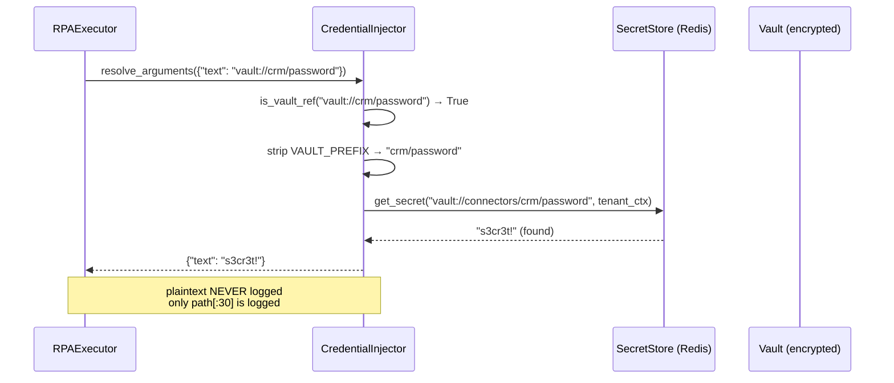
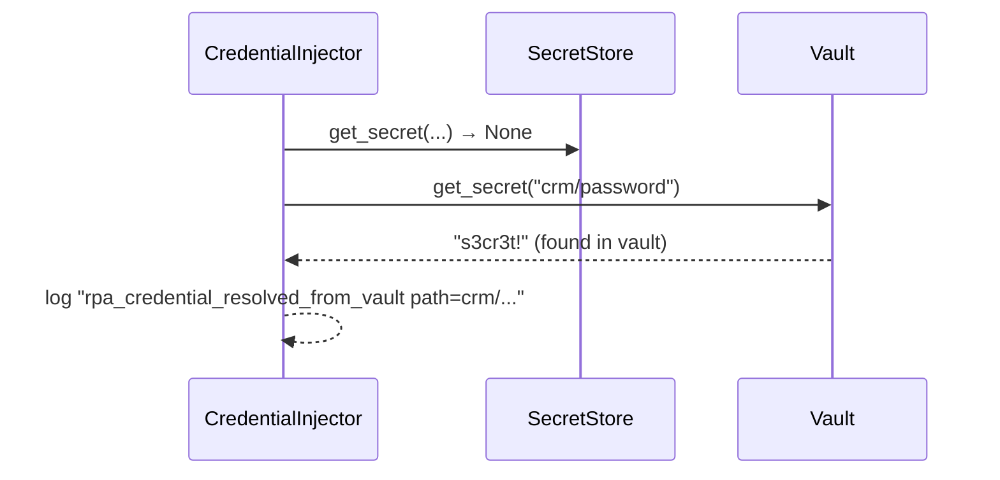
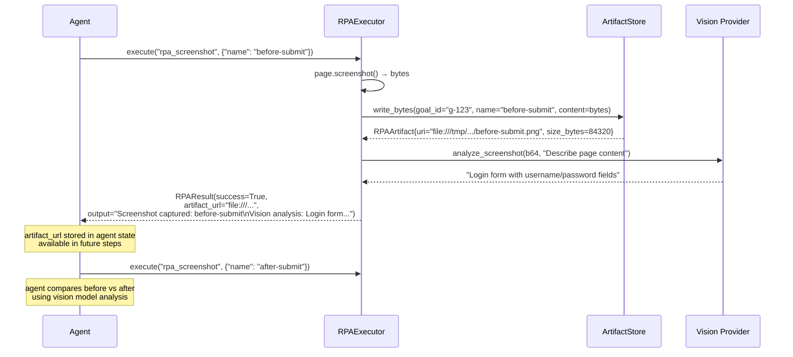

# RPA Credentials and Artifacts

Two subsystems protect sensitive data in RPA workflows: `CredentialInjector` ensures
passwords and API keys never appear in agent plans or logs, and `RPAArtifactStore` /
`MinIOArtifactStore` persist screenshots and downloaded files safely with path-traversal
protection.

---

## Credential Injection

### The vault:// Protocol

RPA tool arguments that contain credentials use a reference format instead of plaintext:

```
vault://<server_id>/<key>

# Examples:
vault://salesforce/admin_password
vault://hr-portal/employee_id
vault://finance-app/api_token
```

When `RPAExecutor.execute()` runs, it calls `CredentialInjector.resolve_arguments()`
**before** dispatching to Playwright. The vault reference is replaced with the real secret
in-memory, used for the DOM operation, and then discarded — it never touches the agent plan,
the audit trail, or any log line.

### CredentialInjector Class

```python
# app/rpa/credential_injector.py
VAULT_PREFIX = "vault://"

class CredentialInjector:
    def __init__(
        self,
        secret_store: Any = None,   # Tenant-scoped Redis-encrypted store
        vault: Any = None,          # Encrypted credential vault
        tenant_id: str = "",
    ) -> None: ...

    def is_vault_ref(self, value: Any) -> bool:
        return isinstance(value, str) and value.startswith(VAULT_PREFIX)

    async def resolve(self, credential_ref: str) -> str: ...
    async def resolve_arguments(self, arguments: dict) -> dict: ...
```

### Resolution Fallback Chain



If `SecretStore` returns `None`:



If both lookups fail, the original `vault://crm/password` string is returned unchanged.
The tool call then fails (Playwright fills the literal string), and the agent can respond
by triggering the HITL gate or reporting the credential as unavailable.

### Recursive Argument Resolution

`resolve_arguments()` handles nested dicts — the `rpa_submit_form` `field_values` structure:

```python
async def resolve_arguments(self, arguments: dict) -> dict:
    resolved = {}
    for k, v in arguments.items():
        if self.is_vault_ref(v):
            resolved[k] = await self.resolve(v)          # direct string reference
        elif isinstance(v, dict):
            resolved[k] = await self.resolve_arguments(v) # recurse into nested dict
        else:
            resolved[k] = v                              # pass through unchanged
    return resolved
```

This handles:
```json
{
  "field_values": {
    "#username": "vault://hr/username",
    "#password": "vault://hr/password",
    "#department": "Engineering"
  }
}
```
All three `field_values` entries are resolved correctly — two vault lookups, one passthrough.

### Log Masking

The credential injector logs only the vault path (truncated to 30 chars), never the
resolved value:

```python
logger.info("rpa_credential_resolved_from_store", path=secret_path[:30])
# → {"path": "salesforce/admin_pas..."}  ← no plaintext
```

---

## RPAArtifactStore (Filesystem)

### Overview

`RPAArtifactStore` is the default CI-safe artifact backend. It writes files to a local
directory (default: `/tmp/agentverse-rpa`) with no external dependencies.

```python
class RPAArtifactStore:
    def __init__(self, base_dir: Path | str = "/tmp/agentverse-rpa") -> None:
        self.base_dir = Path(base_dir)

    def write_bytes(self, *, goal_id: str, name: str, content: bytes) -> RPAArtifact:
        safe_goal_id = _safe_path_component(goal_id, default="goal")
        safe_name = _safe_path_component(name, default="artifact.bin")
        path = self.base_dir / safe_goal_id / safe_name
        # path traversal check:
        if not path.resolve().is_relative_to(self.base_dir.resolve()):
            raise ValueError("RPA artifact path escapes base directory")
        path.write_bytes(content)
        return RPAArtifact(uri=path.as_uri(), path=str(path), name=safe_name, size_bytes=len(content))
```

### RPAArtifact Dataclass

```python
@dataclass
class RPAArtifact:
    artifact_id: str    # uuid4().hex — globally unique
    uri: str            # file:///tmp/agentverse-rpa/goal-abc/screenshot.png
    path: str           # /tmp/agentverse-rpa/goal-abc/screenshot.png
    name: str           # screenshot.png (sanitized)
    size_bytes: int     # Content length in bytes
```

The `uri` field is what agents receive in `RPAResult.artifact_url`. Agents can reference
this URI in subsequent steps — for example, passing it to a vision model for page analysis.

### Path Traversal Prevention

`_safe_path_component()` sanitizes both `goal_id` and `name` before using them as path
segments:

```python
def _safe_path_component(value: str, *, default: str) -> str:
    component = Path(value.replace("\\", "/")).name  # .name strips leading path components
    if component in {"", ".", ".."}:
        return default
    return component
```

Attack vectors blocked by this function:

| Malicious Input | `Path().name` Result | Sanitized Output |
|---|---|---|
| `../../etc/passwd` | `passwd` | `passwd` |
| `../../../root/.ssh/id_rsa` | `id_rsa` | `id_rsa` |
| `goal\x00inject` | `goal\x00inject` | (still blocked by resolve check) |
| `..` | `..` | → default fallback |
| `/absolute/path` | `path` | `path` |

After `_safe_path_component`, a final `path.resolve().is_relative_to(base_dir.resolve())`
check catches any remaining traversal attempts.

---

## MinIOArtifactStore (S3-Compatible)

For production deployments, `MinIOArtifactStore` stores artifacts in MinIO (included in
`infra/docker-compose.yml`) or any S3-compatible service (AWS S3, GCS with S3 compat,
Cloudflare R2).

```python
class MinIOArtifactStore:
    def __init__(
        self,
        bucket: str = "agentverse-artifacts",
        endpoint_url: str | None = None,   # Reads MINIO_ENDPOINT env var
        access_key: str | None = None,     # Reads MINIO_ACCESS_KEY env var
        secret_key: str | None = None,     # Reads MINIO_SECRET_KEY env var
        prefix: str = "",
    ) -> None: ...
```

### Key Structure in MinIO

```
{prefix}/{artifact_id}/{name}

# Example:
rpa/a1b2c3d4e5f6/confirmation-screenshot.png
```

### Security Warning for Default Credentials

The constructor detects default MinIO credentials in production and logs an error:

```python
if self._access_key == "minioadmin" and self._secret_key == "minioadmin":
    if env == "production":
        logger.error("SECURITY: MinIO is using default credentials 'minioadmin'.")
```

Always set `MINIO_ACCESS_KEY` and `MINIO_SECRET_KEY` in production environments.

### Fallback to Filesystem

If a MinIO write fails (network error, misconfiguration), `MinIOArtifactStore` falls back
to `RPAArtifactStore` (`/tmp`) instead of raising:

```python
except Exception as exc:
    logger.warning("minio_write_failed", error=str(exc))
    fallback = _RPAArtifactStoreFallback()
    return await fallback.write_bytes(goal_id=goal_id, name=name, content=content)
```

This ensures automation workflows continue even during transient storage outages.

### Pre-Signed URLs

`MinIOArtifactStore.presign_url()` generates time-limited download links for artifacts:

```python
url = await artifact_store.presign_url(
    artifact_id="a1b2c3",
    name="report.pdf",
    expires_seconds=3600    # link valid for 1 hour
)
```

Pre-signed URLs allow agents to share artifact links with users or downstream systems without
granting permanent access to the MinIO bucket.

---

## Artifact Lifecycle



---

## Real-World Pattern: Screenshot-Verify-Act Loop

The safest multi-step RPA pattern combines screenshot, vision analysis, and conditional
execution:

```python
# Step 1: capture pre-action state
rpa_screenshot(name="pre-action")
# Step 2: verify we're on the right page before acting
# (agent's vision model analyzes artifact URI from step 1)
# Step 3: act only if verification passed
rpa_click(text="Confirm Transfer")
# Step 4: capture post-action state
rpa_screenshot(name="post-action")
# Step 5: verify action succeeded
rpa_wait_for_text("Transfer successful")
```

This pattern gives agents full visual grounding for every significant action — before AND
after. When the post-action screenshot doesn't match expectations (e.g., an error banner
appears), the agent can detect the failure, capture evidence, and trigger HITL.

**Real-world application**: An agent automating bank wire transfers on a legacy portal takes
a screenshot before every confirm click. The screenshots are stored as evidence artifacts and
linked to the goal audit trail. If a transfer is challenged, operators can replay the exact
screen sequence the agent followed.

---

**Real-World Example 2 — Healthcare Portal Automation**

> A health insurance company automates prior-authorisation form submission across 12 different insurer portals. Each portal requires unique credentials stored as `vault://portals/{insurer_id}/username` and `vault://portals/{insurer_id}/password`. The `CredentialInjector` resolves all 24 credentials (12 usernames + 12 passwords) from the tenant secret store without any plaintext ever appearing in the agent plan, logs, or audit trail. When a portal credential rotates, the team updates only the vault entry — zero agent code changes. Screenshot artifacts from each submission are stored in MinIO with `goal_id`-scoped paths, providing a complete visual audit trail for regulatory review.

<!-- Sources: app/rpa/artifacts.py, app/rpa/credential_injector.py -->
