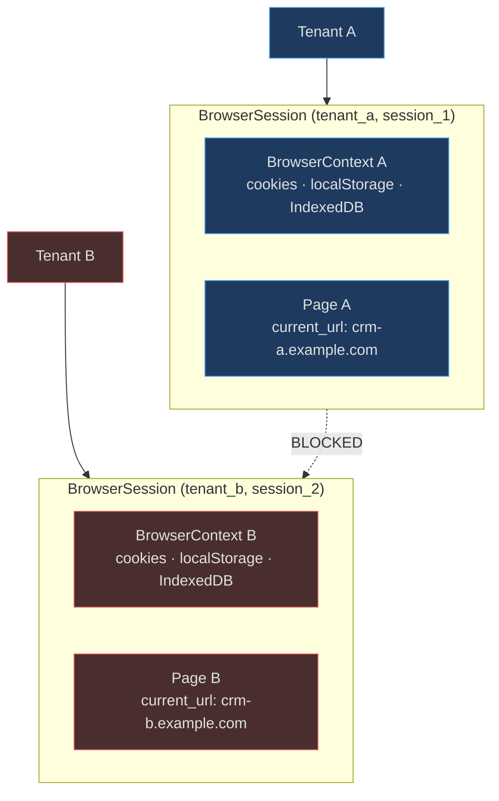
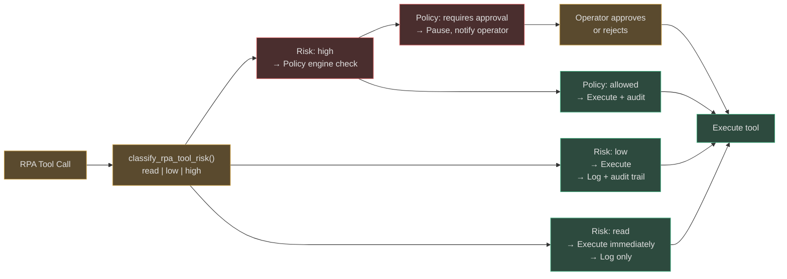
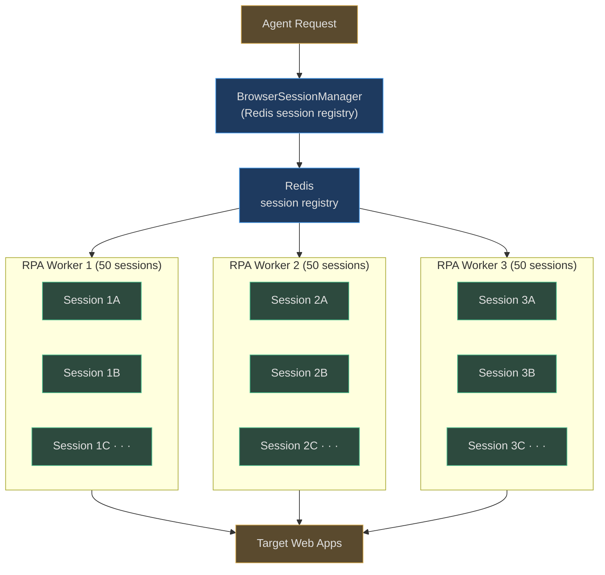
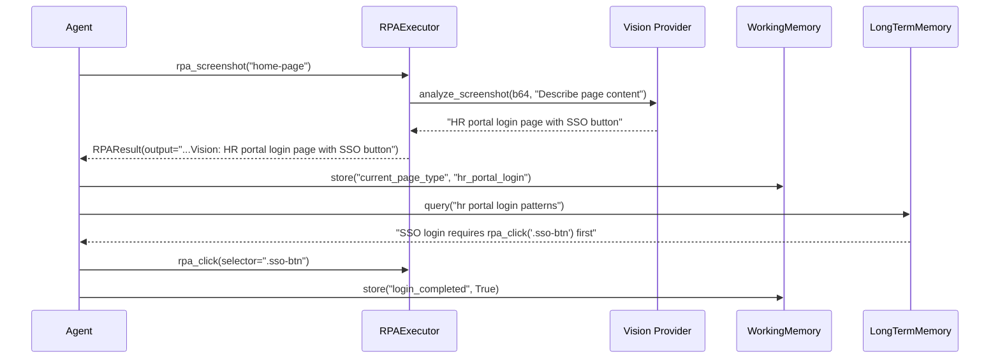
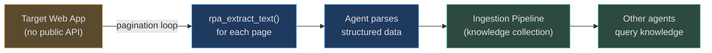

# RPA Security, Scalability, and Integration Patterns

This page covers security hardening of the RPA subsystem, capacity planning for concurrent
browser sessions, and integration patterns that combine RPA with AgentVerse's vision,
memory, and knowledge systems.

---

## Security Controls

### 1. vault:// Credential References (No Plaintext in Plans)

The most important RPA security control: **credentials never appear in agent plans**.

| Without vault:// | With vault:// |
|---|---|
| `{"text": "MyP@ssw0rd!"}` in plan | `{"text": "vault://crm/password"}` in plan |
| Password visible in audit logs | Only vault path logged |
| Password in LLM context window | LLM never sees real password |
| Rotation requires re-planning | Rotate secret → all plans auto-update |

The `CredentialInjector` resolves references at execution time. The plaintext lives only
in memory during the Playwright `page.fill()` call — it is never written to disk, logged,
or included in any response to the agent.

### 2. Per-Session Tenant Isolation



Session isolation is enforced at three levels:
1. **In-memory key**: `BrowserSessionManager._sessions` is keyed on `(session_id, tenant_id)` — tenants cannot guess another tenant's session key
2. **Redis validation**: `RPASessionStore.get()` verifies `session.tenant_id == tenant_id` after every lookup
3. **Playwright context**: each session has its own `BrowserContext`; cookies and storage are never shared between sessions, even on the same browser process

### 3. Risk Classification and HITL Approval



Enterprise policy configuration example:
```python
# All high-risk RPA actions on financial domains require HITL
PolicyRule(
    tool_pattern="rpa_*",
    risk_level="high",
    domain_pattern="*.banking.internal",
    action="require_approval",
    approver_role="finance-ops",
)
```

### 4. Path Traversal Prevention in Artifact Storage

`RPAArtifactStore._safe_path_component()` defends against directory traversal attacks
where malicious goal IDs or artifact names could escape the base directory:

```
Malicious: goal_id = "../../etc/passwd"
After Path().name: "passwd"
Combined:  /tmp/agentverse-rpa/passwd/artifact.bin  ← stays inside base_dir
```

The secondary check `path.resolve().is_relative_to(base_dir.resolve())` catches any
traversal that survives the `.name` extraction.

### 5. Headless Enforcement and Browser Sandboxing

Production RPA always runs headless:
- No X11/Wayland display server required
- No screen content leakage
- Chromium `--headless=new` mode is default (`headless=True`)

For containerised environments, Playwright's sandbox mode may need adjustment:
```python
browser = await pw.chromium.launch(
    headless=True,
    args=["--no-sandbox", "--disable-dev-shm-usage"],  # Required in Docker
)
```

### 6. User-Agent Identification

All browser sessions use `user_agent="AgentVerse-RPA/1.0"`, allowing target server
administrators to:
- Identify agent traffic in access logs
- Apply rate limits to the UA string
- Block RPA access if terms of service prohibit automated access

---

## Scalability at Scale

### Resource Model per Session

| Resource | Per Playwright Session | Notes |
|---|---|---|
| RAM | ~200 MB | Chromium + V8 + context |
| CPU (idle) | ~2% | Timer ticks, GC |
| CPU (active) | ~30–50% | During page navigation |
| Startup time | 1–3 seconds | Browser launch + new_context |
| Teardown time | < 0.5 seconds | browser.close() |

### Session Capacity Planning

| Tier | `max_sessions_per_tenant` | Concurrent Sessions | RAM Requirement |
|---|---|---|---|
| Free | 2 | Up to 2 per tenant | ~400 MB per tenant |
| Starter | 5 | Up to 5 per tenant | ~1 GB per tenant |
| Professional | 10 | Up to 10 per tenant | ~2 GB per tenant |
| Enterprise | 50 | Up to 50 per tenant | ~10 GB per tenant |

### Distributed Browser Farm

When a single node cannot support the required session count, RPA workers scale
horizontally:



Key mechanisms for distributed operation:
- `BrowserSessionManager._register_in_redis()` writes session metadata to Redis with a 1-hour TTL
- `list_active_from_redis(tenant_id)` queries `rpa_session:{tenant_id}:*` — visible across all workers
- New requests are routed to workers with available capacity via queue depth metrics

### Session Queueing Under Load

When all tenant slots are full, `BrowserSessionManager.get_or_create()` either:
1. **Evicts the oldest LRU session** (if any session has been idle longest)
2. **Returns a simulation-only BrowserSession** (no `_page`) — `RPAExecutor` transparently falls back to in-memory simulation

Production deployment should alert when session eviction rate exceeds 10% of new session
requests — this indicates under-provisioning.

### Idle Cleanup Cadence

The background cleanup task should run every 60 seconds:

```python
# Background task (Celery beat or asyncio task)
async def cleanup_rpa_sessions():
    while True:
        closed = await session_manager.cleanup_expired()
        if closed > 0:
            logger.info("rpa_idle_sessions_cleaned", count=closed)
        await asyncio.sleep(60)
```

At `max_idle_seconds=300`, this means no session idles for more than 6 minutes (5 min
timeout + up to 1 min before the next cleanup cycle).

---

## Integration Patterns

### RPA + Vision + Memory



The vision → working memory → long-term memory loop builds institutional knowledge:
- Working memory holds the current session's navigation state
- Long-term memory preserves patterns across sessions ("this site has a CAPTCHA on the 3rd login attempt")

### RPA + Knowledge Ingestion



**Pattern**: RPA agent scrapes competitor pricing pages → structures the extracted text →
ingests into a knowledge collection → pricing comparison agents answer questions from the
stored knowledge without needing to re-scrape.

### RPA + Guardrails

Guardrails intercept RPA outputs before storage:

| Guardrail | Trigger | Action |
|---|---|---|
| PII detector | `rpa_extract_text` returns SSN/email/phone | Strip PII before storing in memory |
| URL blocklist | `rpa_open_url` with internal IP range | Block navigation, return error |
| Content classifier | Extracted text contains financial data | Apply data classification label |
| Output grounding | Any extracted text | Attribute source URL as citation |

```python
# Guardrail integration in agent executor
extracted_text = await rpa_executor.execute(tool_name="rpa_extract_text", ...)
clean_text = await guardrails.scan_output(extracted_text.output, source_url=current_url)
await working_memory.store("page_content", clean_text, citation=current_url)
```

### PageAnalyzer Integration (Perception Layer)

`PageAnalyzer` (in `app/perception/page_analyzer.py`) wraps `BrowserAgent` for URL-level
analysis outside of the direct RPA tool flow:

```python
analyzer = PageAnalyzer(browser_agent=BrowserAgent(vision_provider=vision_llm))
analysis = await analyzer.analyze_url(
    "https://competitor.example.com/pricing",
    question="What pricing tiers are available?",
    extract_text=True,
    take_screenshot=True,
)
# analysis.llm_analysis: "Three tiers: Starter ($49/mo), Pro ($149/mo), Enterprise (contact)"
# analysis.to_context_block() → formatted for injection into planner prompt
```

`PageAnalysis.to_context_block()` formats the result for direct injection into the agent
planner prompt, giving the planner rich context about a web page without running the full
RPA tool sequence.

---

## Monitoring and Observability

### Key Metrics

| Metric | Type | Alert Threshold |
|---|---|---|
| `rpa_session_active_count` | Gauge (per tenant) | > 90% of `max_sessions_per_tenant` |
| `rpa_tool_execution_latency_ms` | Histogram | P99 > 10,000ms |
| `rpa_tool_error_rate` | Counter (per tool) | Error rate > 5% over 5 min |
| `rpa_session_eviction_count` | Counter | > 10/min (under-provisioning) |
| `rpa_credential_unresolved_count` | Counter | Any > 0 (secret missing) |

Structured log events to monitor:

| Event | When | Action |
|---|---|---|
| `browser_session_created` | New session started | Track session churn |
| `browser_session_evicted reason=cap_exceeded` | Session killed by cap | Increase `max_sessions_per_tenant` |
| `browser_session_closed` | Session closed normally | Normal lifecycle |
| `rpa_credential_unresolved` | Vault lookup failed | Check secret store configuration |
| `browser_session_cap_reached` | All slots full, simulation fallback | Scale RPA workers |

### Debugging Non-Headless Mode

For local debugging, set `headless=False` to watch the browser in real time:

```python
executor = RPAExecutor(
    headless=False,        # Browser window visible
    session_manager=session_manager,
)
```

Every tool call will be visible in the Chromium window. Screenshots captured with
`rpa_screenshot` will match exactly what you see on screen.

### Screenshot Trail for Post-Hoc Debugging

Every automation session produces timestamped screenshots stored in `RPASession.screenshots`.
At the end of a goal, the full screenshot trail is available for review:

```python
# After goal completion
session = goal_state.rpa_session
print(f"Automation trail: {len(session.screenshots)} screenshots")
for uri in session.screenshots:
    print(f"  {uri}")
# file:///tmp/agentverse-rpa/goal-abc123/home-page.png
# file:///tmp/agentverse-rpa/goal-abc123/after-login.png
# file:///tmp/agentverse-rpa/goal-abc123/form-filled.png
# file:///tmp/agentverse-rpa/goal-abc123/confirmation.png
```

This trail is automatically included in the goal audit record, providing a pixel-level
audit log for any human reviewer to verify that the agent behaved as expected.

---

## Real-World Examples

**Real-World Example 1 — Insurance Claims Processor**

> An insurance company runs 200 concurrent RPA sessions validating claims across 15 different carrier portal domains. A URL allowlist policy enforces that `rpa_open_url` can only navigate to the 15 pre-approved domains — any navigation to an unapproved URL, including competitor portals or internal admin tools, returns an immediate error before a browser tab is opened. Per-session Playwright context isolation ensures that when the agent processes Farmer A's crop damage claim on `carrier-portal-1.insurance.com`, the authenticated cookies and form state are strictly confined to that `BrowserContext`; Farmer B's concurrent session on the same domain uses a completely separate `BrowserContext` with its own cookie jar. At peak load (200 concurrent sessions at end of storm season), the distributed farm runs 4 RPA workers × 50 sessions each. `BrowserSessionManager` tracks all 200 sessions in Redis with 1-hour TTLs; idle sessions are reaped by the 60-second cleanup cadence, freeing approximately 40 GB of Chromium RAM across the farm during overnight quiet periods when claim volume drops to near zero.

**Real-World Example 2 — Procurement Automation**

> A procurement department automates purchase order submission through a legacy ERP portal with no API, using a 5-step stateful RPA workflow under a single `session_id`: ① `rpa_screenshot("order-form")` — the vision provider confirms "PO entry form, vendor field visible, amount field visible"; ② `rpa_type(selector="#vendor", text="vault://erp/vendor_name")` and `rpa_type(selector="#amount", text="47500.00")` inject values via `CredentialInjector` (plaintext never appears in logs or agent context); ③ `rpa_screenshot("form-filled")` triggers another vision analysis — "Form filled: vendor=Acme Supplies, amount=47,500.00, PO#=PO-2026-08814" — and the agent stores this state in `WorkingMemory`; ④ the goal reaches a HITL gate because the order value exceeds the $25,000 auto-approve threshold — a finance approver reviews the screenshot artifact and confirms within 8 minutes; ⑤ `rpa_click(text="Submit PO")` plus a final `rpa_screenshot("confirmation")` complete the workflow. The 5-screenshot artifact trail is stored in the goal audit record as pixel-level proof of the approved submission.

<!-- Sources: app/rpa/executor.py, app/rpa/session_manager.py, app/rpa/tools.py, app/rpa/credential_injector.py, app/rpa/artifacts.py, app/perception/page_analyzer.py -->
