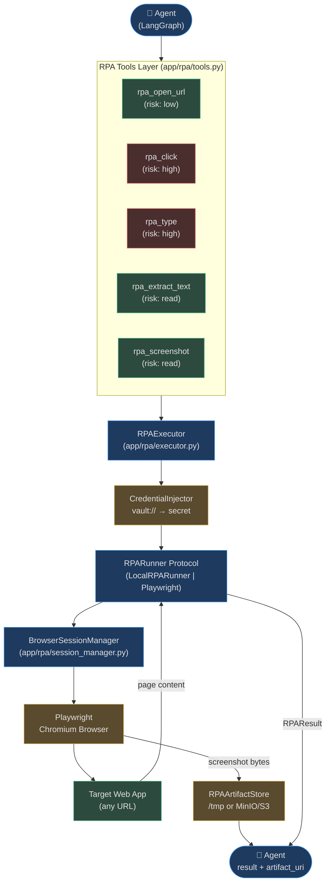

# RPA Automation

Robotic Process Automation (RPA) in AgentVerse means giving autonomous agents direct control
over real web browsers. An agent can open URLs, click buttons, fill forms, extract page text,
upload files, and capture screenshots — all through a set of structured tools backed by
Playwright or a lightweight CI-safe simulator.

---

## Why Agents Need Browser Automation

Most business data and workflows exist behind web UIs with no API. Legacy HR portals, CRM
dashboards, government sites, and internal tools were built for humans — not for programmatic
access. RPA bridges that gap:

| Use Case | Without RPA | With RPA |
|---|---|---|
| Submit expense reports | Manual login + form fill | Agent navigates, fills, submits |
| Monitor competitor prices | Human checks daily | Agent scrapes every hour |
| Extract legacy app data | Copy-paste by hand | Agent reads DOM, parses structure |
| Bulk data entry | Repetitive human work | Agent loops over dataset rows |
| Multi-factor login + action | Human required | Agent handles MFA via HITL gate |

RPA lets agents operate anywhere a human can operate — without requiring the target system to
expose an API, webhook, or SDK.

---

## Two Adapter Tiers

AgentVerse uses a **Protocol + Adapter** pattern so the same agent goal runs identically in
CI and production:

### LocalRPARunner (CI-Safe Adapter)
- Runs entirely in-memory; no browser process, no display server
- Records typed values and clicked targets in `typed_values` / `clicked_targets` dicts
- Returns deterministic strings so tests are stable and fast
- Used in: unit tests, CI pipelines, sandbox execution environments
- **500 RPA-enabled agent tests run in ~30 seconds** — no browser installation needed

### RPAExecutor (Production Adapter)
- Uses Playwright (Chromium headless) when installed; falls back to simulation when not
- Manages stateful `BrowserSession` objects via `BrowserSessionManager`
- Integrates `CredentialInjector` for `vault://` secret resolution before any tool call
- Captures screenshots as base64 data URIs or stores them in `RPAArtifactStore`/MinIO

---

## Architecture Overview

---

## RPA Tool Catalog

All 13 tools are exposed to agents via the MCP tool protocol. Risk levels gate governance and
HITL approval flows:

| Tool | Description | Risk | Requires Playwright |
|---|---|---|---|
| `rpa_open_url` | Navigate to a URL | low | No (simulated OK) |
| `rpa_click` | Click element by selector or text | **high** | Yes (full click) |
| `rpa_type` | Fill a form field | **high** | Yes (DOM fill) |
| `rpa_extract_text` | Extract text from page or selector | read | No (simulated) |
| `rpa_screenshot` | Capture screenshot artifact | read | Yes (pixel-perfect) |
| `rpa_wait_for_text` | Poll until text appears (timeout-based) | read | Yes |
| `rpa_select_option` | Select `<select>` dropdown by value/label | **high** | Yes |
| `rpa_upload_file` | Upload file to `input[type=file]` | **high** | Yes |
| `rpa_download_file` | Click download link, save as artifact | **high** | Yes |
| `rpa_submit_form` | Fill multiple fields + submit | **high** | Yes |
| `rpa_detect_captcha` | Detect CAPTCHA presence on page | read | Yes |
| `rpa_request_human_help` | Pause and request operator takeover | read | No |
| `rpa_wait_for_network_idle` | Wait for all network requests to settle | read | Yes |

> **Risk classification** flows directly into the governance policy engine.
> `high`-risk tools on sensitive domains may require HITL approval before execution.

---

## Security-First Design

Three security mechanisms protect against misuse:

1. **`vault://` Credential References** — agent plans never contain plaintext passwords.
   The string `vault://salesforce/api_password` is resolved to the real secret at execution
   time by `CredentialInjector`, and the plaintext value is never logged or stored in the plan.

2. **Per-Session Tenant Isolation** — each `BrowserSession` is scoped to exactly one
   `(session_id, tenant_id)` pair. Playwright browser contexts isolate cookies, localStorage,
   and IndexedDB per session. Tenant A's sessions cannot access Tenant B's browser state.

3. **Risk Classification + HITL Gate** — `high`-risk tools (click, type, submit) on new or
   sensitive domains are evaluated by the policy engine before execution. Enterprise policies
   can require human approval for any high-risk action on financial applications.

---

## Integration Points

| System | Integration |
|---|---|
| **Perception / Vision** | `RPAExecutor` passes screenshots to `vision_provider` for page analysis; `PageAnalyzer` wraps `BrowserAgent` for URL-level analysis |
| **Working Memory** | Page content extracted via `rpa_extract_text` is stored in agent's `ExecutionMemory` for the session |
| **Long-Term Memory** | Navigation patterns (login flows, CAPTCHA sites) written to `LongTermMemoryStore` |
| **Governance / HITL** | `classify_rpa_tool_risk()` feeds the policy engine; high-risk actions on sensitive domains pause for approval |
| **Artifact Storage** | Screenshots and downloads stored in `RPAArtifactStore` (filesystem) or `MinIOArtifactStore` (S3/MinIO) |
| **Guardrails** | Extracted text scanned for PII before storage; dangerous URLs blocked before `rpa_open_url` executes |

---

## In This Section

| File | Topic |
|---|---|
| [01-rpa-architecture.md](./01-rpa-architecture.md) | RPARunner Protocol, LocalRPARunner, RPAExecutor, Playwright integration |
| [02-session-management.md](./02-session-management.md) | Session lifecycle, Redis-backed store, BrowserSessionManager, idle timeout |
| [03-rpa-tools-and-execution.md](./03-rpa-tools-and-execution.md) | Full tool catalog, execution flow, error handling, real-world examples |
| [04-credentials-and-artifacts.md](./04-credentials-and-artifacts.md) | vault:// credential injection, RPAArtifactStore, MinIO backend, path safety |
| [05-security-scalability-patterns.md](./05-security-scalability-patterns.md) | Security controls, distributed browser farm, session pooling, integration patterns |

<!-- Sources: app/rpa/runner.py, app/rpa/executor.py, app/rpa/tools.py, app/rpa/session.py, app/rpa/session_manager.py, app/rpa/artifacts.py, app/rpa/credential_injector.py -->
