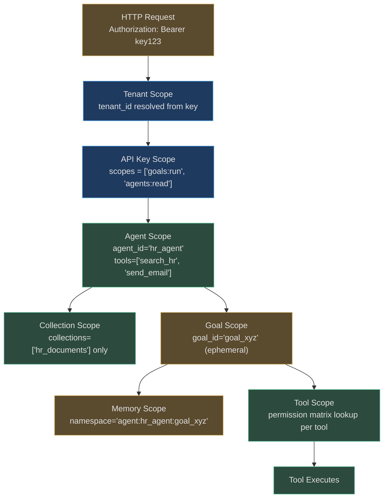

# Scope Types

Every scope controls a specific dimension of access. This reference documents each scope
type with its purpose, what it controls, how it is enforced, and concrete examples.

---

## Scope Journey: One Request



---

## 1. Tenant Scope

**Purpose:** The top-level isolation boundary. Everything in AgentVerse belongs to exactly
one tenant. No cross-tenant visibility is possible by design.

**What it controls:**
- All data: agents, goals, audit logs, memories, knowledge collections
- All API operations: create, read, update, delete
- All billing: cost tracking, budget limits, plan entitlements
- All configuration: policies, compliance bundles, SIEM settings

**How it's enforced:**
- `TenantMiddleware` resolves the API key to a `TenantContext` containing `tenant_id`
- Postgres RLS sets `app.tenant_id` per-transaction via `SET LOCAL`
- Every DB table has a `tenant_id` column and an RLS policy filtering by it
- Redis keys are namespaced: `cost:{tenant_id}:daily`, `legal_hold:{tenant_id}`, etc.

**Example:**
```
Tenant "hospital_a" and Tenant "hospital_b" share a Postgres instance.
hospital_a's API key resolves to tenant_id="hospital_a".
Every query runs with SET LOCAL app.tenant_id = 'hospital_a'.
All 12 RLS policies filter automatically.
hospital_b's 3 million patient records: completely invisible to hospital_a.
No WHERE clause required — RLS enforces it.
```

---

## 2. API Key Scope

**Purpose:** A subset of tenant capabilities granted to a specific API key. One tenant can
have multiple keys, each with different scopes.

**What it controls:**
- Which resources can be read (agents, goals, audit, knowledge)
- Which operations can be performed (read-only vs write vs admin)
- Which RBAC roles are assigned to this key
- Rate limits (per-plan, can be further restricted per-key)

**How it's enforced:**
- Key resolver maps key → `TenantContext` including `roles`
- Roles are set at key creation and stored in the DB
- RBAC middleware checks roles on every request
- Entitlement checks use `TenantContext.plan`

**Key scope examples:**

| Key Name | Roles | Use Case |
|----------|-------|----------|
| `admin_key` | `["admin"]` | Full access, platform management |
| `cicd_key` | `["operator"]` | Deploy agents from CI/CD pipeline |
| `hitl_key` | `["approver"]` | Dedicated key for approval workflows |
| `monitoring_key` | `["viewer"]` | Read-only for dashboards |
| `agent_runtime_key` | `["operator"]` | Runtime-only, scoped to goal execution |

**Example:**
```python
# Key: "agv_sk_cicd_xyz" → TenantContext:
TenantContext(
    tenant_id="acme_corp",
    plan=PlanTier.PROFESSIONAL,
    api_key_id="key_cicd_xyz",
    roles=("operator",),         # operator role — can run goals, not manage keys
)
```

---

## 3. Agent Scope

**Purpose:** Defines the operational boundary for a specific agent: which tools it can use,
which knowledge it can access, and what budget it operates within.

**What it controls:**
- Tool whitelist: explicit list of permitted tool names (glob patterns supported)
- Knowledge collection access: which collections the agent can retrieve from
- Connector access: which external systems the agent can interact with
- Memory namespaces: which memory keys the agent can read/write
- Budget allocation: per-agent cost limit (subset of tenant budget)

**How it's enforced:**
- Agent configuration stored in DB, loaded at goal start
- `PermissionMatrix.check()` validates each tool call against `(tenant_id, tool_name)`
- RAG retrieval filters enforce `collection_id` restrictions
- `CostController` tracks per-agent budgets separately from tenant budget

**Example:**
```python
# HR Agent configuration
agent = AgentConfig(
    agent_id="hr_assistant",
    tenant_id="acme_corp",
    allowed_tools=["search_hr_documents", "query_hr_database", "send_email_internal"],
    knowledge_collections=["hr_policy", "employee_handbook"],  # not "finance", not "legal"
    connectors=["workday", "gsuite"],                          # not "stripe", not "salesforce"
    budget_per_goal_usd=2.00,
    budget_daily_usd=20.00,
)
```

A goal run by this agent cannot call `query_finance_db` (not in `allowed_tools`), cannot
retrieve from `legal_contracts` collection, and cannot connect to Salesforce.

---

## 4. Knowledge Collection Scope

**Purpose:** Controls which document chunks are visible during RAG retrieval. Prevents an
agent from accessing knowledge it hasn't been explicitly granted.

**What it controls:**
- Which collections are indexed for retrieval
- Which chunks within a collection are visible (chunk-level metadata filtering)
- Access classification: PUBLIC / INTERNAL / SENSITIVE / RESTRICTED

**How it's enforced:**
- RAG retriever takes `collection_id` parameter
- Only chunks where `collection_id IN agent.knowledge_collections` are returned
- Metadata filters apply data classification tags at retrieval time
- Postgres vector search includes `WHERE collection_id = ANY(...)` condition

**Example:**
```
Request: HR agent retrieves context for query "What is the parental leave policy?"

RAG retrieval scope:
  tenant_id: "acme_corp"                            ← tenant scope
  allowed_collections: ["hr_policy", "employee_handbook"]  ← agent scope
  
Vector search:
  SELECT ... FROM knowledge_chunks
  WHERE tenant_id = 'acme_corp'                    ← RLS (tenant)
  AND collection_id IN ('hr_policy', 'employee_handbook')  ← collection scope
  ORDER BY embedding <=> $query_embedding
  LIMIT 10

Result: only chunks from the two permitted collections
"legal_contracts" collection: never queried, never returned
```

---

## 5. Connector Scope

**Purpose:** Controls which external systems (databases, APIs, SaaS tools) an agent can
interact with via MCP connectors.

**What it controls:**
- Connector whitelist per agent (Workday, Salesforce, Stripe, GitHub, etc.)
- Read-only vs read-write permissions per connector
- Which specific operations within a connector are permitted

**How it's enforced:**
- `MCPRegistry` resolves connectors per tenant
- Agent configuration specifies `connectors: list[str]`
- Tool calls to `mcp_<connector>_*` tools are validated against the connector whitelist
- Policy engine applies connector-level policies

**Example:**
```
DevOps agent: connectors = ["github", "kubernetes_dev", "kubernetes_prod_readonly"]
→ Can: push to GitHub, apply to dev cluster, read prod cluster status
→ Cannot: apply to prod cluster (kubernetes_prod only, no write)

Finance agent: connectors = ["stripe", "quickbooks", "postgres_finance"]
→ Can: read Stripe transactions, query QuickBooks, read/write finance DB
→ Cannot: touch GitHub, Kubernetes, or HR systems
```

The connector scope is the first line of defense against lateral movement: a compromised
agent prompt cannot instruct the agent to "now access the production database" if that
connector isn't in the agent's connector scope.

---

## 6. Tool Scope

**Purpose:** Fine-grained control over which MCP tools are callable within a session,
beyond connector-level restrictions.

**What it controls:**
- Per-tool action levels: ALLOW / ALLOW_LOG / APPROVAL / DENY
- Daily and per-goal call counts per tool
- Argument-level scope patterns (e.g., only read from table `hr_*`)

**How it's enforced:**
- `PermissionMatrix.check(tool_name, tenant_ctx=..., scope_value=...)` called per tool
- `scope_pattern` in `PermissionRule` enables argument-level matching via `fnmatch`
- Daily and per-goal limits tracked in `CostController`'s call-count tracker

**Example with scope_pattern:**
```python
# Only allow reading from tables matching "hr_*"
PermissionRule(
    tool_name="query_database",
    level=ActionLevel.ALLOW_LOG,
    scope_pattern="hr_*",   # scope_value is checked against this pattern
    daily_limit=100,
    per_goal_limit=10,
)

# Tool call: query_database(table="hr_employees") → ALLOW_LOG (matches "hr_*")
# Tool call: query_database(table="finance_ledger") → DENY (doesn't match "hr_*")
```

---

## 7. Memory Scope

**Purpose:** Controls which memory namespaces can be read or written during a goal
execution. Prevents cross-agent memory contamination.

**What it controls:**
- `ExecutionMemory`: per-goal, ephemeral (goal_id-namespaced)
- `LongTermMemoryStore`: per-agent, persistent (agent_id-namespaced)
- Cross-goal memory sharing: opt-in only, explicit namespace grant

**How it's enforced:**
- Memory store keys always prefixed with `{tenant_id}:{agent_id}:` or `{tenant_id}:goal:{goal_id}:`
- Read/write operations validate the namespace prefix matches the caller's agent scope
- Tenant scope enforced at Redis key level (separate key namespace per tenant)

**Example:**
```
Agent "hr_assistant" can write:
  key: "acme_corp:agent:hr_assistant:*"  ← agent namespace
  key: "acme_corp:goal:goal_xyz:*"       ← goal-scoped (ephemeral)

Cannot write:
  key: "acme_corp:agent:finance_agent:*" ← different agent namespace → DENIED
  key: "acme_corp:agent:*"               ← wildcard not permitted
  key: "hospital_b:*"                    ← different tenant → blocked by RLS
```

---

## 8. Policy Scope

**Purpose:** Controls which policies apply to which agents and operations. Policies can be
scoped globally (all tenants), per-tenant, or per-agent-type.

**What it controls:**
- Which `Policy` objects are evaluated for a given tool call
- Whether regulated domain fail-closed semantics apply
- Time window restrictions (business hours, weekdays)

**How it's enforced:**
- `Policy.tenant_id` filters which tenants a policy applies to
- `Policy.scope = "global"` applies to all tenants
- `REGULATED_DOMAINS` frozenset triggers fail-closed behavior
- `PolicyEngine.evaluate()` filters policy list before evaluation

**Example:**
```
Global policy: no_destructive_overnight (blocked_hours_utc=(22, 6))
  → applies to ALL tenants

Tenant policy: payment_approval_required
  → tenant_id="acme_corp" → only evaluates for ACME Corp requests

Agent-type policy: read_only_for_chatbots
  → scope="chatbot" → only applies when agent_type="chatbot"
```

---

## 9. Runtime Context Scope (Goal Scope)

**Purpose:** Ephemeral, per-request scope created at goal start. Composes all active scopes
into a single runtime context that guides the agent loop.

**What it controls:**
- Combines tenant_ctx + agent_config + goal metadata into `AgentState`
- Passes scope context to every tool call, policy check, and audit event
- Cleaned up when the goal completes (ephemeral by design)

**How it's enforced:**
- `AgentState` carries `tenant_ctx`, `agent_id`, `goal_id`, `collection_ids`
- Every tool execution, policy check, and audit write receives this state
- LangGraph checkpointing preserves scope across replicas

**Example (composite scope at runtime):**
```python
# At goal start, all scopes compose:
runtime_scope = RuntimeScope(
    tenant_id="acme_corp",              # tenant scope
    api_key_id="key_cicd_xyz",          # key scope
    roles=("operator",),                # RBAC scope
    agent_id="hr_assistant",            # agent scope
    allowed_tools=["search_hr", ...],   # tool scope
    collections=["hr_policy"],          # collection scope
    connectors=["workday"],             # connector scope
    memory_namespace="acme_corp:agent:hr_assistant",  # memory scope
    goal_id="goal_xyz",                 # goal scope (ephemeral)
    budget_remaining_usd=9.57,          # cost scope
    policies=[...],                     # policy scope
)
```

This composite object is passed to every layer of the agent loop. No layer needs to
re-derive context — it's computed once at goal start and flows through.

---

## Real-World Examples

**Real-World Example 1 — Healthcare SaaS**

> A healthcare SaaS deploys AgentVerse for two hospital customers, Hospital A and Hospital B, on a shared Postgres instance. Tenant scope enforced via RLS ensures Hospital A's 2.3 million patient records are completely invisible to Hospital B's API keys — no application-level WHERE clause required. Within Hospital A, the triage bot agent is configured with `allowed_tools=["symptom_lookup", "appointment_check", "escalate_to_human"]` out of the 50 tools available on the full platform, while a clinician research agent uses a broader set including lab-results APIs. Collection scope limits the triage bot to `collections=["ha_triage_protocols", "ha_appointment_system"]`, preventing retrieval from the shared drug reference database (`pharma_db_global`) that it has no clinical mandate to access. A prompt injection attack instructing the triage bot to "access patient records from Hospital B" fails at three independent layers — tenant RLS, agent tool scope, and collection scope — before any data is touched.

**Real-World Example 2 — DevOps Platform**

> A DevOps automation platform issues two API keys to different automation workflows. The CI pipeline integration key carries `roles=("viewer",)` — it can read goal results and agent status but cannot create Jira tickets, trigger deployments, or modify agent configurations. A separate deployment agent key carries `roles=("operator",)` with connector scope `connectors=["kubernetes_prod", "github_releases"]`. At runtime, the deployment agent's goal composes both the key's operator role and the agent's connector whitelist into a single `RuntimeScope` object. The policy engine then applies the most restrictive union: the operator role permits write operations, but the global `no_destructive_overnight` policy (`blocked_hours_utc=(22, 6)`) blocks any `kubectl delete` call between 22:00–06:00 UTC regardless of role. A misconfigured agent prompt attempting `kubectl delete namespace production` at 02:00 UTC fails at the policy scope layer before the connector scope or RBAC check is even evaluated.

<!-- Sources: app/tenancy/context.py, app/tenancy/rbac.py, app/tenancy/entitlements.py,
     app/governance/permissions.py, app/governance/policies.py, app/governance/cost.py,
     app/db/rls.py, app/mcp/registry.py, app/knowledge/store.py, app/memory/ -->
