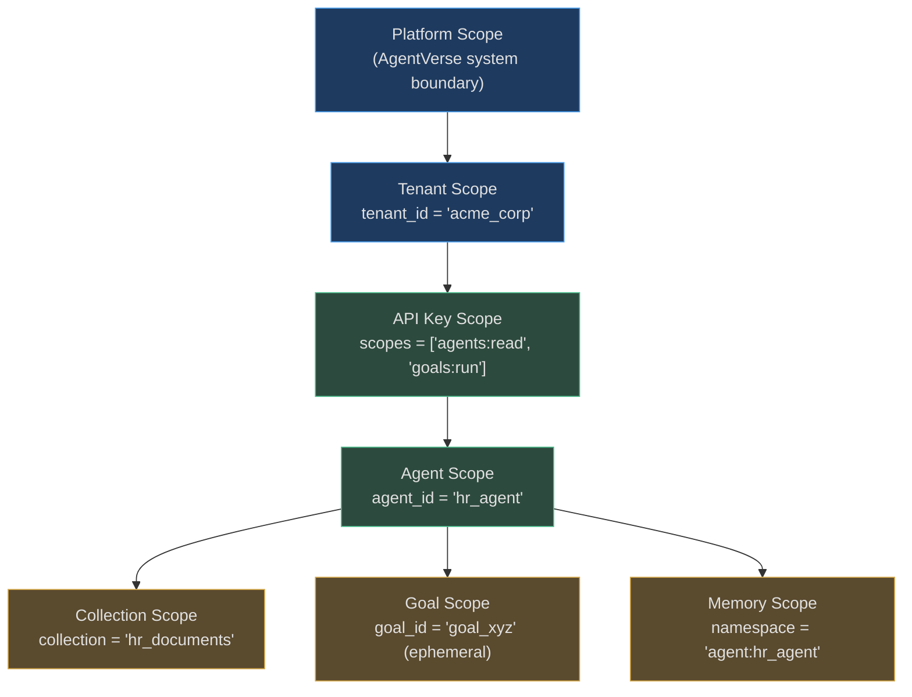

# Scopes

> Without scopes, Agent A can read Agent B's memory. Agent X can query Customer Y's data.
> A free-tier key can call enterprise-only tools. Scopes prevent all of this.

A scope is a **boundary of access and visibility**. Every resource, operation, and data
collection in AgentVerse exists within one or more scope contexts. When a request arrives,
it carries a composite scope derived from the API key, tenant, agent configuration, and
goal runtime — and operations are permitted only within the intersection of all active scopes.

---

## Why Scopes Exist

### The Problem Without Scopes

Consider a multi-agent deployment without scopes:

```
Tenant "ACME Corp" has 3 agents:
  Agent A — HR agent, accesses employee records
  Agent B — Finance agent, accesses payroll data
  Agent C — Public-facing chatbot, accesses product docs

Without scopes:
  Agent A can query payroll data (Finance DB)
  Agent B can read employee records (HR system)
  Agent C can access internal employee info (catastrophic!)
```

### The Solution: Layered Scopes



Each scope is a subset of its parent. An agent scope cannot grant more than its API key
scope. A key scope cannot grant more than its tenant scope. **Child scopes can only
restrict, never expand.**

---

## The Core Rule: Intersection

When evaluating whether an operation is permitted, AgentVerse computes the **intersection**
of all active scopes. An operation requires permission from **all** active scopes
simultaneously:

```
Operation allowed = (
    tenant_scope.permits(operation)
    AND api_key_scope.permits(operation)
    AND agent_scope.permits(operation)
    AND collection_scope.permits(operation)
    AND goal_scope.permits(operation)
)
```

A Finance agent with full tenant permissions that tries to access HR collections: **denied**
at the agent scope level (agent is not authorized for HR collections), regardless of tenant
permissions.

---

## Scope Hierarchy at a Glance

| Scope | Controls | Enforced By |
|-------|----------|-------------|
| **Tenant** | All data, all operations | Postgres RLS + middleware |
| **API Key** | Subset of tenant capabilities | Key resolver + `TenantContext.roles` |
| **Agent** | Tools, collections, budget | Agent config + policy engine |
| **Knowledge Collection** | Which chunks are visible | RAG retrieval filter |
| **Connector** | Which external systems are accessible | MCP registry |
| **Tool** | Which MCP tools are callable | Tool permission matrix |
| **Memory** | Which namespaces can be read/written | Memory store namespace |
| **Policy** | Which policy sets apply | Policy engine tenant scoping |
| **Runtime (Goal)** | Ephemeral per-request context | Agent loop state |

---

## How Scopes Prevent Data Leakage

### Scenario: Customer-Facing Chatbot

```
Setup: Agent "support_bot" handles public customer queries
Scopes configured:
  - Knowledge collection: "public_docs" ONLY (not "internal_hr", not "financial_data")
  - Tool scope: ["search_knowledge", "send_email_customer"] (not "query_database")
  - Memory scope: "agent:support_bot:session" (not other agents' namespaces)

Attack attempt: User asks "What are employee salaries?"
→ Agent tries to retrieve from knowledge
→ RAG retriever applies collection scope: only "public_docs" searched
→ No salary data in "public_docs"
→ Agent answers: "I don't have access to that information"
→ No data leakage, no tool misuse
```

The scope boundary — not a prompt instruction — prevented the leak. Prompt manipulation
cannot bypass a scope that excludes the collection entirely.

---

## Navigation

| Document | What It Covers |
|----------|----------------|
| [01-scope-types.md](./01-scope-types.md) | Each scope in detail: purpose, enforcement, examples |
| [02-scope-enforcement-and-design.md](./02-scope-enforcement-and-design.md) | Enforcement layers, inheritance rules, design patterns, pitfalls |

<!-- Sources: app/tenancy/context.py, app/tenancy/rbac.py, app/tenancy/entitlements.py,
     app/governance/permissions.py, app/governance/policies.py, app/db/rls.py -->
