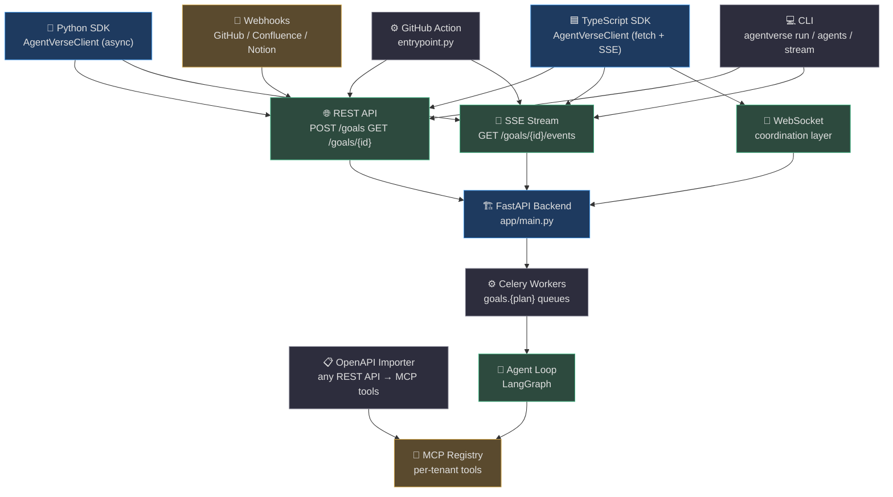
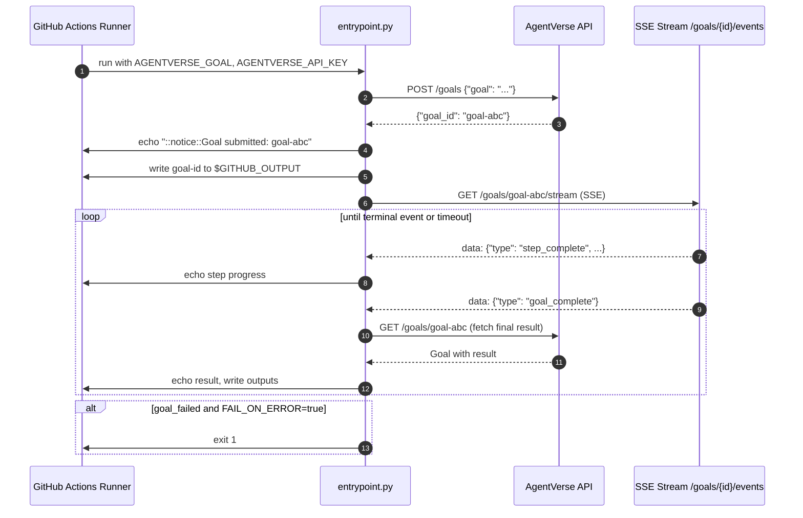
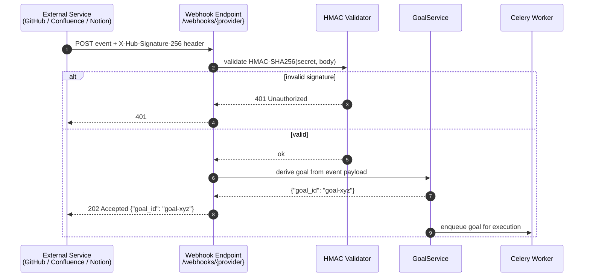
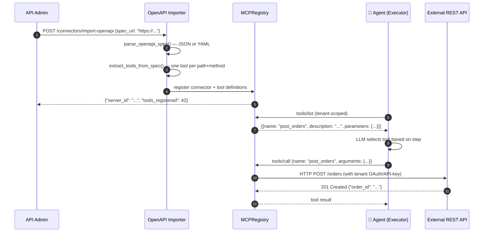

# SDKs & Integrations

AgentVerse exposes three first-party client surfaces — a **Python SDK**, a **TypeScript/JavaScript SDK**, and a **GitHub Action** — all sitting on top of the same REST + SSE backend. This page covers every integration point from quick-start snippets to the full API reference.

## Integration Surface Map



<!-- Sources:
  agent-verse-sdk-python/agentverse/client.py
  agent-verse-sdk-typescript/src/client.ts
  agent-verse-github-action/entrypoint.py
  agent-verse-backend/app/api/goals.py
-->

## Python SDK

### Installation

```bash
pip install agentverse-sdk
# or with uv:
uv add agentverse-sdk
```

### Quick Start

<!-- Source: agent-verse-sdk-python/agentverse/client.py:40-65 -->
```python
import asyncio
from agentverse import AgentVerseClient

async def main():
    async with AgentVerseClient(
        api_key="av-your-key",
        base_url="https://api.youragentverse.com",
    ) as client:
        # Submit a goal
        goal = await client.submit_goal(
            goal="Summarise all open GitHub issues in the PLATFORM project",
            agent_id="agent-abc123",    # optional — auto-routes if omitted
            dry_run=False,
        )
        print(f"Goal submitted: {goal.goal_id} (status={goal.status})")

        # Wait for completion with timeout
        result = await client.wait_for_goal(goal.goal_id, timeout=120)
        print(f"Result: {result.result}")

        # Or stream events in real-time
        async for event in client.stream_goal(goal.goal_id):
            if event.type == "step_complete":
                print(f"  → {event.data.get('description')}")
            elif event.type in ("goal_complete", "goal_finished"):
                print("Done!")
                break

asyncio.run(main())
```

### Client API Reference

| Method | Signature | Description |
|---|---|---|
| `submit_goal()` | `(goal, agent_id?, dry_run?, priority?) → Goal` | Submit a new goal |
| `get_goal()` | `(goal_id) → Goal` | Fetch goal status and result |
| `wait_for_goal()` | `(goal_id, timeout=120) → Goal` | Poll until terminal status |
| `stream_goal()` | `(goal_id) → AsyncIterator[GoalEvent]` | SSE real-time event stream |
| `list_goals()` | `(limit=20, status?) → list[Goal]` | Paginated goal list |
| `cancel_goal()` | `(goal_id)` | Signal cancellation |
| `list_agents()` | `() → list[Agent]` | List tenant agents |
| `create_agent()` | `(name, autonomy_mode, ...) → Agent` | Create new agent |
| `list_connectors()` | `() → list[Connector]` | List MCP connectors |

Source: [agentverse/client.py](https://github.com/harsh786/agent-verse/blob/main/agent-verse-sdk-python/agentverse/client.py)

### Models

<!-- Source: agent-verse-sdk-python/agentverse/models.py:1-60 -->

| Model | Key Fields |
|---|---|
| `Goal` | `goal_id`, `status: GoalStatus`, `result`, `cost_usd`, `steps_total`, `steps_completed` |
| `GoalEvent` | `type`, `goal_id`, `ts: datetime`, `data: dict` |
| `GoalStatus` | `PENDING`, `PLANNING`, `RUNNING`, `WAITING_APPROVAL`, `COMPLETED`, `FAILED`, `CANCELLED` |
| `Agent` | `agent_id`, `name`, `autonomy_mode`, `model`, `created_at` |
| `Connector` | `server_id`, `name`, `url`, `status` |
| `GoalSubmitRequest` | `goal`, `priority`, `dry_run`, `agent_id`, `strategy_override` |

### CLI

The `agentverse` CLI is installed with the Python SDK and reads `AGENTVERSE_API_KEY` and `AGENTVERSE_URL` from the environment.

<!-- Source: agent-verse-sdk-python/agentverse/cli.py:1-80 -->
```bash
# Submit a goal and wait for completion (default: --wait)
agentverse run "Triage all open Jira tickets tagged P1"

# Submit without waiting, get goal ID
agentverse run "Run nightly report" --no-wait --output json

# Submit to a specific agent
agentverse run "Analyze logs for the last 24h" --agent agent-abc123

# Dry run (plan only, no execution)
agentverse run "Deploy to production" --dry-run

# List all agents
agentverse agents

# Stream events from an existing goal
agentverse stream goal-xyz789
```

## TypeScript SDK

### Installation

```bash
npm install @agentverse/sdk
# or with pnpm
pnpm add @agentverse/sdk
```

### Quick Start

<!-- Source: agent-verse-sdk-typescript/src/client.ts:35-80 -->
```typescript
import { AgentVerseClient } from '@agentverse/sdk';

const client = new AgentVerseClient('av-your-key', 'https://api.youragentverse.com');

// Submit a goal
const goal = await client.submitGoal(
  'Summarise all open GitHub issues in PLATFORM project',
  { priority: 'normal', agent_id: 'agent-abc123' }
);
console.log(`Goal: ${goal.goal_id} (${goal.status})`);

// Wait for completion
const result = await client.waitForGoal(goal.goal_id, { timeout: 120 });
console.log(`Result: ${result.result}`);

// Stream events
for await (const event of client.streamGoal(goal.goal_id)) {
  if (event.type === 'step_complete') {
    console.log(`  → ${event.step}`);
  } else if (event.type === 'goal_complete') {
    console.log('Done!');
    break;
  }
}
```

### TypeScript Types

<!-- Source: agent-verse-sdk-typescript/src/types.ts:1-60 -->
```typescript
interface Goal {
  goal_id: string;
  goal: string;
  status: 'planning' | 'executing' | 'verifying' | 'complete' | 'failed' | 'cancelled' | 'waiting_human';
  priority: string;
  patterns_used?: string[];
}

interface SubmitGoalOptions {
  priority?: string;
  dry_run?: boolean;
  agent_id?: string;
  strategy_override?: string;      // e.g. "chain_of_thought"
  auxiliary_strategies?: string[]; // additional coordination patterns
  pattern_limits?: Record<string, number>;
}

interface GoalEvent {
  type: string;
  step?: string;
  output?: string;
  success?: boolean;
  [key: string]: unknown;
}
```

## GitHub Action

The GitHub Action submits a goal from a CI workflow and blocks until completion (or timeout). It writes the `goal-id` to `$GITHUB_OUTPUT` for downstream steps.

<!-- Source: agent-verse-github-action/action.yml + entrypoint.py -->

### action.yml Usage

```yaml
# .github/workflows/release.yml
jobs:
  agentverse-triage:
    runs-on: ubuntu-latest
    steps:
      - uses: harsh786/agent-verse/agent-verse-github-action@main
        id: triage
        with:
          api-key: ${{ secrets.AGENTVERSE_API_KEY }}
          base-url: https://api.youragentverse.com
          goal: "Triage all open GitHub issues created in the last 24h and post summaries as comments"
          timeout: "300"
          fail-on-error: "true"

      - name: Use goal result
        run: echo "Goal ID was: ${{ steps.triage.outputs.goal-id }}"
```

### Entrypoint Logic



<!-- Sources:
  agent-verse-github-action/entrypoint.py:1-80
  agent-verse-github-action/action.yml
-->

## REST API Reference

All endpoints require `X-API-Key: {key}` header. Base: `POST https://{host}/`.

| Method | Path | Auth | Description |
|---|---|---|---|
| `POST` | `/goals` | ✅ | Submit a new goal |
| `GET` | `/goals/{goal_id}` | ✅ | Get goal status + result |
| `GET` | `/goals/{goal_id}/events` | ✅ | SSE stream of real-time events |
| `GET` | `/goals` | ✅ | List goals (paginated) |
| `DELETE` | `/goals/{goal_id}` | ✅ | Cancel a running goal |
| `POST` | `/agents` | ✅ | Create new agent |
| `GET` | `/agents` | ✅ | List agents |
| `GET` | `/agents/{agent_id}` | ✅ | Get agent details |
| `DELETE` | `/agents/{agent_id}` | ✅ | Delete agent |
| `POST` | `/connectors` | ✅ | Register MCP connector |
| `GET` | `/connectors` | ✅ | List connectors |
| `DELETE` | `/connectors/{server_id}` | ✅ | Remove connector |
| `POST` | `/knowledge/ingest` | ✅ | Ingest documents |
| `POST` | `/knowledge/query` | ✅ | Query knowledge base |
| `GET` | `/knowledge/collections` | ✅ | List knowledge collections |
| `POST` | `/webhooks/github` | HMAC | GitHub push / PR event |
| `POST` | `/webhooks/confluence` | HMAC | Confluence page-updated event |
| `POST` | `/webhooks/notion` | HMAC | Notion page-updated event |
| `GET` | `/health` | — | Liveness check |
| `GET` | `/ready` | — | Readiness check (DB + Redis) |
| `GET` | `/metrics` | — | Prometheus metrics scrape endpoint |

### Goal Submission Request

```json
// POST /goals
{
  "goal": "Summarise all open GitHub issues in the PLATFORM project",
  "priority": "normal",
  "dry_run": false,
  "agent_id": "agent-abc123",
  "strategy_override": "chain_of_thought",
  "auxiliary_strategies": ["peer_review"],
  "pattern_limits": {"moa_proposers": 3}
}
```

### SSE Event Types

Events arrive on `GET /goals/{goal_id}/events` as `text/event-stream`:

| Event Type | Payload Fields | Description |
|---|---|---|
| `goal_started` | `goal_id`, `ts` | Goal moved to RUNNING |
| `planning_complete` | `steps`, `plan_text` | Planner produced execution plan |
| `step_started` | `step`, `description` | Agent beginning step N |
| `tool_call` | `tool_name`, `arguments` | Tool invocation |
| `tool_result` | `tool_name`, `output`, `success` | Tool returned |
| `step_complete` | `step`, `description`, `success` | Step N finished |
| `waiting_approval` | `approval_id`, `risk_level` | HITL gate triggered |
| `approval_received` | `approval_id`, `decision` | HITL decision recorded |
| `goal_complete` | `result`, `cost_usd`, `duration_ms` | Terminal: success |
| `goal_failed` | `reason`, `step_failed` | Terminal: failure |
| `goal_cancelled` | `cancelled_by` | Terminal: cancellation |

## Webhook Integration

External services can trigger goal submissions via HMAC-validated webhook endpoints.



<!-- Sources:
  agent-verse-backend/app/api/integrations.py
-->

### Webhook Registration

Register webhooks via the API or in the platform dashboard. Each webhook is scoped to a tenant and maps events to goal templates:

```bash
# Register GitHub push webhook
curl -X POST https://{host}/webhooks/register \
  -H "X-API-Key: av-..." \
  -d '{
    "provider": "github",
    "event": "push",
    "goal_template": "Review the new commits in {repo} and post a summary to Slack",
    "secret": "webhook-signing-secret"
  }'
```

## MCP Tool Discovery

The OpenAPI importer ([`app/mcp/openapi_importer.py`](https://github.com/harsh786/agent-verse/blob/main/agent-verse-backend/app/mcp/openapi_importer.py)) converts any OpenAPI 3.x spec into MCP tool registrations. This is how third-party APIs (Stripe, Salesforce, any REST API) become available to agents with zero custom code.



<!-- Sources:
  agent-verse-backend/app/mcp/openapi_importer.py:1-80
  agent-verse-backend/app/mcp/client.py
  agent-verse-backend/app/mcp/registry.py
-->

### Tool Name Generation

OpenAPI operations are mapped to snake_case tool names: `POST /orders/{id}/items` → `post_orders_id_items`. Path parameters are stripped of braces, slashes become underscores.

### Built-in MCP Servers

The `app/mcp/servers/` directory contains pre-built connectors for:

| Server | Triggers | Key Tools |
|---|---|---|
| `github` | push, PR, issue events | `create_issue`, `comment_pr`, `search_code` |
| `jira` | issue created/updated | `create_ticket`, `update_status`, `search_issues` |
| `slack` | message events | `send_message`, `list_channels`, `search_messages` |
| `confluence` | page events | `get_page`, `update_page`, `create_page` |
| `notion` | page events | `get_block`, `update_page`, `create_database_entry` |

## Related Pages

| Page | Description |
|---|---|
| [Configuration & Deployment](configuration-and-deployment.md) | How to run the API that backs these SDKs |
| [Agent Loop & LangGraph](agent-loop.md) | What happens inside the backend when a goal is submitted |
| [MCP & Tool System](mcp-and-tools.md) | Deep dive on tool execution, OAuth, and connector management |
| [Reliability & Infrastructure](reliability-and-infrastructure.md) | SSE delivery, Redis pub/sub, Celery queues |
