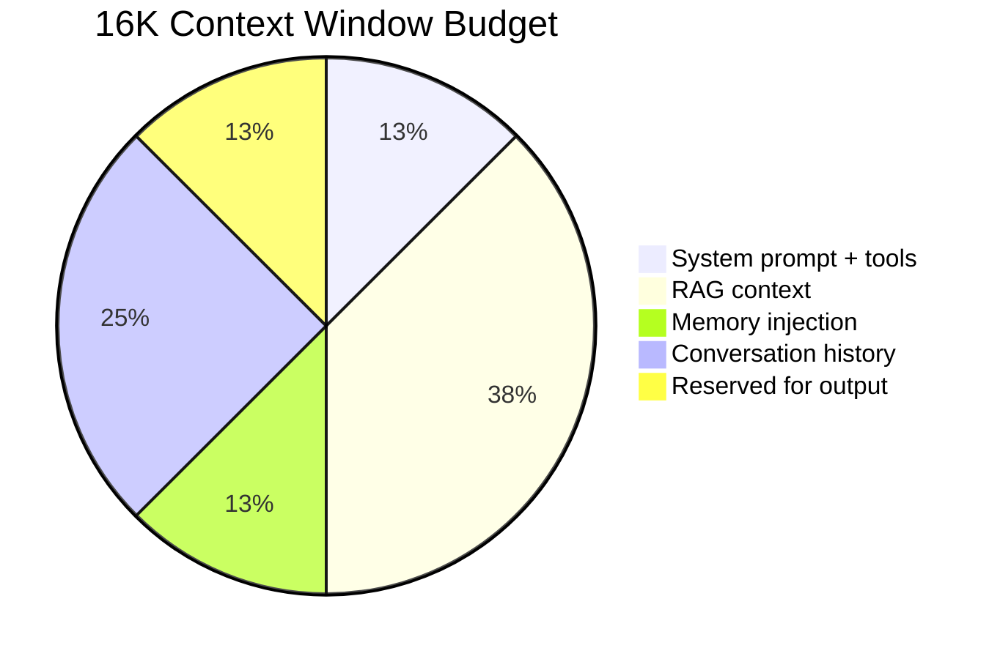
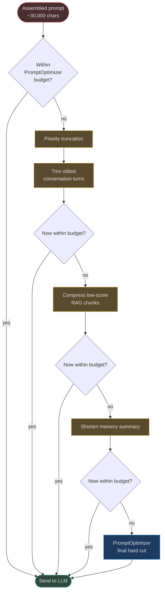

# Token and Prompt Optimization

## The Token Problem

LLMs have fixed context windows — ranging from 4K tokens for older models to 200K+ for modern
frontier models. Every token in that window costs money (billed by the provider) and adds
latency (proportional to context length). In AgentVerse, a single goal execution assembles a
prompt from multiple components:

- System prompt + agent instructions
- Retrieved RAG context (top-K chunks × chunk size)
- Injected working memory and long-term memory
- Tool schemas for all available MCP tools
- Conversation history (prior turns)
- The current goal / step description

A naive assembly of all these components for a non-trivial agent can easily reach 20,000–40,000
tokens. Without optimization, this causes three failure modes:
1. **Context window overflow** — the assembled prompt exceeds the model's hard limit → API error
2. **Expensive large-context routing** — overflow triggers an upgrade to a 128K+ context model → 3–10× cost increase
3. **Unnecessary latency** — sending 20K tokens when 6K would suffice adds 500–1,500 ms

## TokenOptimizer (`app/optimization/token_optimizer.py`)

`TokenOptimizer` is the per-block guard. Before any individual text section is injected into
the prompt, it is passed through `compress()` to enforce a token ceiling on that block.

### Implementation

```python
_CHARS_PER_TOKEN = 4  # universal approximation for most LLMs

class TokenOptimizer:
    def __init__(self, max_tokens: int = 4000) -> None:
        self._max_chars = max_tokens * _CHARS_PER_TOKEN  # = 16,000 chars for default

    def compress(self, text: str) -> str:
        if len(text) <= self._max_chars:
            return text
        # Truncate to budget minus 20 chars for the suffix
        return text[: self._max_chars - 20] + "\n...[truncated for token budget]"
```

**Key design choices:**

- `_CHARS_PER_TOKEN = 4`: the widely-used rule-of-thumb approximation. Accurate to ±15% for
  English prose; less accurate for code (closer to 3 chars/token) and non-Latin scripts
  (closer to 2 chars/token for CJK). The approximation is intentionally conservative —
  slightly over-truncates rather than under-truncates.
- Truncation is **hard** — the text is simply cut at `max_chars - 20` characters. The 20-char
  buffer accommodates the `"\n...[truncated for token budget]"` suffix (30 chars), ensuring
  the resulting string never slightly exceeds budget.
- The suffix `"\n...[truncated for token budget]"` signals to the LLM that the block was cut;
  without this, the model might not realise the content is incomplete.

### When It Is Called

`TokenOptimizer` is designed to be called **before injecting any variable-length block** into
the prompt builder. Typical call sites:
- Injecting a RAG chunk: `optimizer.compress(chunk_text)`
- Injecting memory context: `optimizer.compress(memory_summary)`
- Injecting conversation history: `optimizer.compress(history_text)`

### Real-World Example 1: Legal Document Review Agent

A contract review agent retrieves a 50-page legal document as a RAG chunk (≈ 48,000 chars,
≈ 12,000 tokens). Without `TokenOptimizer`, this single chunk fills the entire context window
of a 16K model. With `TokenOptimizer(max_tokens=6000)`:

```
Input:  "MASTER SERVICE AGREEMENT\n\nThis agreement is entered into as of..."  [48,000 chars]
Output: "MASTER SERVICE AGREEMENT\n\nThis agreement..." [23,980 chars]
        + "\n...[truncated for token budget]"
→ Stays within 6,000-token budget; 4 other blocks can still fit
```

---

## PromptOptimizer (`app/optimization/prompt_optimizer.py`)

`PromptOptimizer` is the **final-assembly guard**. After all blocks have been combined into the
complete prompt string, `PromptOptimizer.optimize()` applies a final ceiling before the string
is sent to the provider.

### Implementation

```python
_CHARS = 4  # same approximation

class PromptOptimizer:
    def __init__(self, max_tokens: int = 4000) -> None:
        self._max_chars = max_tokens * _CHARS

    def optimize(self, prompt: str) -> str:
        if len(prompt) <= self._max_chars:
            return prompt
        return prompt[: self._max_chars - 20] + "\n...[truncated]"
```

### Difference from TokenOptimizer

| Aspect | TokenOptimizer | PromptOptimizer |
|---|---|---|
| **When applied** | Per individual block (before assembly) | On the fully assembled prompt |
| **Suffix text** | `\n...[truncated for token budget]` | `\n...[truncated]` |
| **Default max_tokens** | 4,000 | 4,000 |
| **Use case** | Limit individual RAG / memory blocks | Final safety net on total prompt |

Think of `TokenOptimizer` as per-ingredient portion control, and `PromptOptimizer` as a final
plate-size check before serving. Both are needed: even if each block is within budget, their
combination may still overflow.

---

## Smarter Compression Strategies (Beyond Simple Truncation)

The current implementation uses simple character-based truncation, which is fast and
allocation-free. For production deployments that need smarter compression, consider these
strategies on top of the existing classes:

### 1. Priority-Based Truncation

Rather than truncating the assembled prompt at the end (which cuts off the tail of whatever
block happens to be last), truncate **least-important blocks first**:

```
Priority order (truncate lowest priority first):
  1. Oldest conversation turns  (low value, high token cost)
  2. Low-similarity RAG chunks  (scored below threshold)
  3. Long-term memory summaries (already compressed)
  4. Tool schemas               (prune tools not relevant to this step)
  5. System prompt              (never truncate — it is the agent's identity)
```

### 2. Semantic Compression of RAG Chunks

Instead of hard-truncating a long document chunk, summarize it:
- Send the chunk to a cheap model (e.g., `claude-haiku-3-5`) with "Summarize in 3 sentences"
- Cost: ~200 tokens (summary call) vs 12,000 tokens (full chunk)
- Net saving: 11,800 tokens per chunk; break-even at ~3 full document injections

### 3. Sliding Window for Conversation History

Keep the most recent N conversation turns instead of the full history:
- For a 16K context window with 8 turns of 500 tokens each = 4,000 tokens
- At turn 20, oldest 12 turns are dropped (or summarized) — sliding window
- Implementation: `history[-N:]` before passing to `TokenOptimizer`

### 4. tiktoken-Based Exact Counting

The `_CHARS_PER_TOKEN = 4` approximation has meaningful error for code-heavy prompts and
non-English text. For precise budgeting, use `tiktoken`:

```python
import tiktoken
enc = tiktoken.encoding_for_model("gpt-4o")
exact_count = len(enc.encode(text))
```

This is more expensive (pure Python tokenization) but eliminates the ±15% approximation
error. Worth it for high-value goals where over-truncation is costly.

---

## Token Budget Allocation

Best practice for distributing a 16K context window across prompt blocks:



| Budget Layer | Tokens | % | Notes |
|---|---|---|---|
| System prompt + tools | 2,000 | 12.5% | Fixed; pre-computed at agent start |
| RAG context (retrieved chunks) | 6,000 | 37.5% | Top-K chunks, each capped via `TokenOptimizer` |
| Memory injection | 2,000 | 12.5% | Working memory + long-term summaries |
| Conversation history | 4,000 | 25% | Sliding window of recent turns |
| Reserved for output | 2,000 | 12.5% | Not sent; reserved by setting `max_tokens=2000` in API call |

---

## Compression Pipeline Flow



---

## Real-World Examples

### Example 1: Support Agent with 200-Turn History

A customer support agent has accumulated 200 conversation turns (≈ 100,000 tokens of history).

- Without optimization: 100,000 token prompt → exceeds 16K window → fails / routes to 128K model at 8× cost
- With sliding window (last 20 turns) + `TokenOptimizer(max_tokens=4000)` on history block:
  - 20 turns × ≈ 200 tokens = 4,000 tokens history
  - Prompt total: 2,000 (system) + 4,000 (RAG) + 2,000 (memory) + 4,000 (history) = 12,000 tokens → fits in 16K model
  - **Result: 88% token reduction from 100K to 12K**

### Example 2: Code Review Agent

An agent reviewing a 2,000-line Python file (≈ 80,000 chars ≈ 20,000 tokens with code at ~4 chars/token):

- `TokenOptimizer(max_tokens=5000)` applied to the file block
- `_max_chars = 20,000` → file truncated to `19,980 chars` + suffix (≈ 5,000 tokens)
- The agent sees the beginning of the file — adequate for most review tasks
- **For full-file review**: use chunked processing with multiple smaller goals instead

---

## Cost Impact of Token Optimization

The financial case for token optimization:

| Scenario | Without | With 20% Reduction | Savings/Month |
|---|---|---|---|
| 1M goals/month at GPT-4o ($5/1M input tokens) | $40,000 | $32,000 | $8,000 |
| 10M goals/month at GPT-4o-mini ($0.15/1M input tokens) | $6,000 | $4,800 | $1,200 |
| 1M goals/month at Claude Sonnet ($3/1M input tokens) | $24,000 | $19,200 | $4,800 |

At scale, a 20% token reduction (easily achievable with `TokenOptimizer` + sliding window) is a
meaningful budget line item — comparable to hiring an engineer to work full-time on cost reduction.

<!-- Sources: app/optimization/token_optimizer.py, app/optimization/prompt_optimizer.py -->
