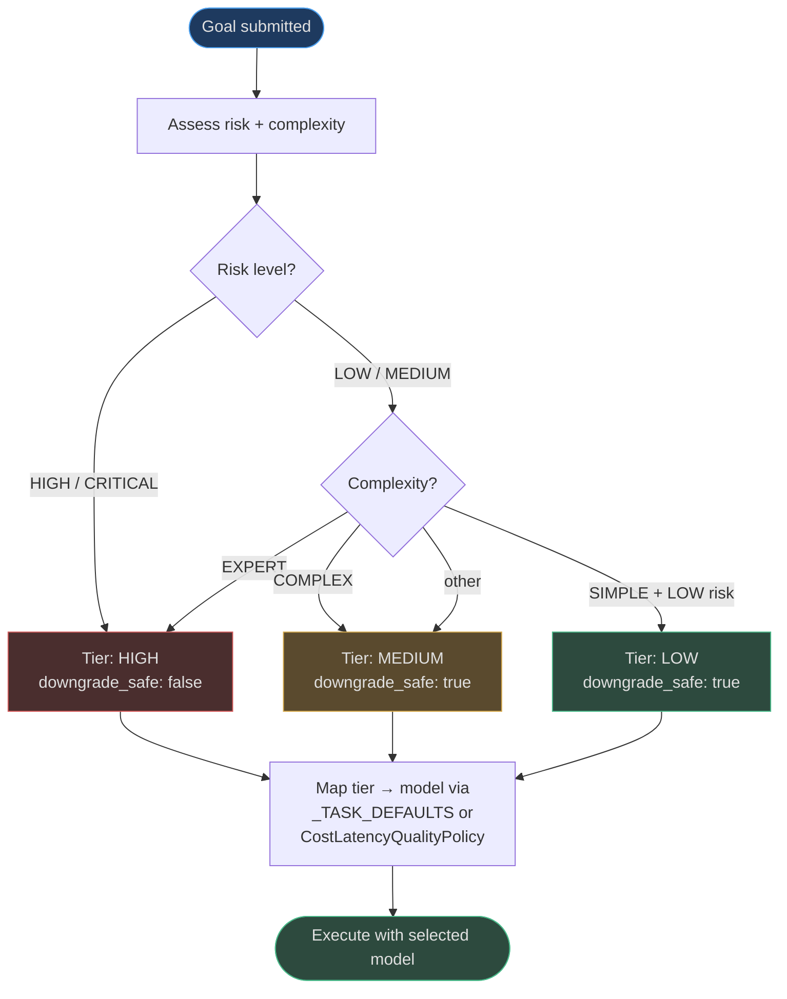

# Model and Cost Optimization

## The Model Selection Opportunity

Not every task requires GPT-4o or Claude Opus. The planning step of a customer support goal,
the verification step of a simple classification task, and the summarization of a short
document can all be handled effectively by models that cost 10–100× less. Using the most
capable model for every step is the equivalent of hiring a senior engineer to fill out every
expense report.

AgentVerse's model selection stack has two layers:
1. **Routing layer** (`CostLatencyQualityPolicy`): fast heuristic selection by complexity + risk
2. **Optimization layer** (`ModelOptimizer` + `intelligence.CostOptimizer`): data-driven
   refinement based on historical outcomes

---

## CostLatencyQualityPolicy (`app/ai_router/cost_latency_quality_policy.py`)

The routing entry point. Maps goal properties to a model **tier** (`"low"`, `"medium"`,
`"high"`) before any LLM call is made.

```python
class CostLatencyQualityPolicy:
    def select_tier(
        self,
        complexity: Complexity,
        risk: RiskLevel,
        latency_requirement: str = "interactive",
    ) -> str:
        if risk in (RiskLevel.HIGH, RiskLevel.CRITICAL):
            return "high"           # never cut corners on risky operations
        if latency_requirement == "realtime":
            return "low"            # fast response over quality
        if complexity == Complexity.EXPERT:
            return "high"
        elif complexity == Complexity.COMPLEX:
            return "medium"
        elif complexity == Complexity.SIMPLE and risk == RiskLevel.LOW:
            return "low"
        return "medium"             # safe default
```

**Priority order**: Risk → Latency requirement → Complexity. Risk gates are evaluated first —
a high-risk goal is always routed to the high tier, regardless of its apparent simplicity.

---

## ModelOptimizer (`app/optimization/model_optimizer.py`)

`ModelOptimizer` provides two interfaces: a legacy risk-profile interface and a newer
task-type-based recommendation interface.

### Legacy Interface: `optimize(profile)`

Takes a `RuntimeProfile` (which carries `risk` and `complexity` attributes) and returns a
`ModelOptimizationDecision`:

```python
@dataclass
class ModelOptimizationDecision:
    recommended_cost_class: str  # "low" | "medium" | "high"
    downgrade_safe: bool
    reason: str
```

Decision logic:
- `HIGH` or `CRITICAL` risk, or `EXPERT` complexity → `"high"`, `downgrade_safe=False`
- `SIMPLE` complexity + `LOW` risk → `"low"`, `downgrade_safe=True`
- Everything else → `"medium"`, `downgrade_safe=True`

### Task-Type Interface: `recommend(task_type, …)`

Returns a concrete model recommendation for a specific LLM role:

```python
@dataclass
class ModelRecommendation:
    model_id: str
    provider: str
    reason: str
    estimated_cost_usd: float
    estimated_latency_ms: float
```

Default recommendations by task type (`_TASK_DEFAULTS`):

| Task Type | Model | Provider | Cost/call (est.) | Latency (est.) |
|---|---|---|---|---|
| `planning` | `gpt-5.2` | openai | $0.003 | 2,000 ms |
| `execution` | `gpt-4o-mini` | openai | $0.0003 | 500 ms |
| `verification` | `gpt-4o-mini` | openai | $0.0003 | 500 ms |
| `summarization` | `claude-haiku-3-5` | anthropic | $0.0002 | 400 ms |
| `classification` | `gpt-4o-mini` | openai | $0.0003 | 300 ms |

The defaults reflect that planning is the most demanding cognitive task (uses the most
capable model), while execution, verification, and classification are handled by lighter
models. The `quality_requirement` and `max_latency_ms` parameters are present for future
dynamic adjustment.

### Decision Flow



---

## CostOptimizer — Optimization Layer (`app/optimization/cost_optimizer.py`)

This is the **lightweight savings estimator**. Given a current model tier, a proposed
downgrade tier, and an estimated token count, it calculates how much money the downgrade saves.

```python
_COST_PER_1K: dict[str, float] = {
    "low":    0.0003,   # ~gpt-4o-mini / gemini-flash
    "medium": 0.003,    # ~gpt-4o / claude-sonnet
    "high":   0.015,    # ~gpt-4-turbo / claude-opus
    "free":   0.0,      # local / cached
}

class CostOptimizer:
    def estimate_savings(
        self,
        current_cost_class: str,
        proposed_cost_class: str,
        estimated_tokens: int,
    ) -> float:
        c = _COST_PER_1K.get(current_cost_class, 0.003) * (estimated_tokens / 1000)
        p = _COST_PER_1K.get(proposed_cost_class, 0.003) * (estimated_tokens / 1000)
        return max(0.0, c - p)
```

**Example**: Downgrading a 100K-token workload from `"high"` to `"medium"`:
```
c = $0.015 × 100 = $1.50
p = $0.003 × 100 = $0.30
savings = $1.20  (80% reduction)
```

---

## Intelligence-Layer CostOptimizer (`app/intelligence/cost_optimizer.py`)

This is the richer, data-driven optimizer used by the self-improvement engine. It tracks actual
run history across goal categories and proposes concrete model swaps backed by real performance
data.

### Key Data Structures

```python
MODEL_COSTS_PER_1M = {
    "claude-opus-4-5":   15.0,   # most expensive
    "claude-sonnet-4-5":  3.0,
    "claude-haiku-3-5":   0.25,
    "gpt-4o":             5.0,
    "gpt-4o-mini":        0.15,  # cheapest GPT
    "gemini-1.5-flash":   0.075, # cheapest overall
    "fake":               0.0,   # test/dev
}

MODEL_DOWNGRADE_PATH = {
    "claude-opus-4-5":   "claude-sonnet-4-5",  # -80% cost
    "claude-sonnet-4-5": "claude-haiku-3-5",   # -92% cost
    "gpt-4o":            "gpt-4o-mini",         # -97% cost
    "gemini-1.5-pro":    "gemini-1.5-flash",    # -98% cost
}
```

`MODEL_DOWNGRADE_PATH` defines the safe downgrade chain: each model maps to the next cheaper
model in the same provider family.

### How Suggestions Are Generated

1. `record_run(goal, model, cost, eval_score)` is called after each goal execution
2. Goals are **categorised** via `_categorise()`: "first 3 significant words of the goal text"
   → e.g., `"summarize legal document"` → category = `"summarize legal document"`
3. Per-category `ModelStats` tracks `goal_count`, `total_cost_usd`, and `eval_scores`
4. `get_suggestions(min_goals=50)` compares stats between the current model and its
   downgrade candidate:
   - If `avg_eval_score(cheaper_model) ≥ avg_eval_score(expensive_model) - quality_drop_threshold`
     → generate `DowngradeSuggestion`
   - If `confidence > auto_apply_confidence` → set `auto_applied=True`

### DowngradeSuggestion

```python
@dataclass
class DowngradeSuggestion:
    goal_category: str
    current_model: str
    suggested_model: str
    estimated_savings_usd_per_100: float  # savings per 100 goals
    quality_drop_pct: float               # how much quality would drop
    confidence: float                     # 0.0–1.0
    auto_applied: bool                    # True if confidence > threshold
```

---

## Cost Tracking (`app/intelligence/cost_tracker.py`)

`CostTracker` is the **single source of truth** for real-money cost accounting. Every LLM
call results in a `record_llm_usage()` call that attributes the cost to a tenant + goal.

### Canonical Pricing Table

The `MODEL_PRICING` table (in `cost_tracker.py`) is the authoritative pricing source —
updated to 2026-06 rates with separate input/output pricing:

| Model | Input ($/1M tokens) | Output ($/1M tokens) |
|---|---|---|
| `gpt-5.2` | $10.00 | $40.00 |
| `gpt-4o` | $2.50 | $10.00 |
| `gpt-4o-mini` | $0.15 | $0.60 |
| `claude-opus-4` | $15.00 | $75.00 |
| `claude-sonnet-4-5` | $3.00 | $15.00 |
| `claude-haiku-3-5` | $0.80 | $4.00 |
| `gemini-2.0-flash` | $0.075 | $0.30 |

`calculate_cost(model, prompt_tokens, completion_tokens)` performs an exact match first, then
a prefix match (handles versioned model names like `"claude-sonnet-4-5-20241022"`), then falls
back to `_FALLBACK_PRICING` with a warning log.

> **Note**: `governance/pricing.py` contains a legacy `estimate_cost()` function marked as
> **deprecated**. It uses a per-1K-token table that is no longer maintained. All new code
> should use `calculate_cost()` from `cost_tracker`.

---

## Real-World Cost Optimization Examples

### Example 1: SaaS Platform with 10M Goals/Month

An AI startup runs a mix of goal types:
- 60%: simple classification + routing tasks (complexity=SIMPLE, risk=LOW)
- 30%: medium complexity execution workflows
- 10%: complex planning + verification for high-value operations

Before ModelOptimizer: all goals use GPT-4o → $50,000/month

After ModelOptimizer routing:
- 60% on `gpt-4o-mini` ($0.15/1M) → $900/month for this tier
- 30% on `gpt-4o` ($2.50/1M) → $7,500/month for this tier
- 10% on `gpt-5.2` ($10.00/1M) → $10,000/month for this tier
- **Total: $18,400/month → 63% cost reduction**

### Example 2: Intelligence CostOptimizer Discovering a Downgrade

After 200 goals categorised as `"analyse customer feedback"`:
- GPT-4o avg eval score: 0.91 (goal_count: 200)
- GPT-4o-mini (tested on 50 goals via A/B): avg eval score: 0.88
- `quality_drop_threshold = 0.05` → drop is 0.03, within threshold
- `DowngradeSuggestion(current="gpt-4o", suggested="gpt-4o-mini", quality_drop_pct=3.3%, confidence=0.82)` generated
- At confidence=0.82 < auto_apply_confidence=0.90: suggestion surfaces to admin dashboard rather than auto-applying

### Example 3: Model Downgrade Cost Impact Over 6 Months

```
Month 1  baseline (all GPT-4o):              $42,000
Month 2  ModelOptimizer deployed:            $25,000   (40% reduction)
Month 3  intelligence.CostOptimizer tunes:   $18,500   (26% additional)
Month 4  auto-apply 3 high-confidence downgrades: $14,000  (24% additional)
Month 6  stable optimized state:             $12,500   (70% below baseline)
```

---

## Budget + Optimizer Integration

`CostController` (in `app/governance/cost.py`) enforces hard budget limits:
- `per_goal_usd = 10.0` (default) — single goal cannot exceed $10
- `per_tenant_daily_usd = 500.0` (default) — tenant capped at $500/day

The optimizers are the *upstream prevention layer*. If ModelOptimizer routes 70% of goals to
cheap models, `CostController` rarely needs to block calls. The defense-in-depth pattern:

```
[Prevention]  ModelOptimizer selects cheap model → most goals cost <$0.01
[Guard]       CostController.check_and_record() → blocks if per_goal_usd exceeded
[Accounting]  CostTracker.record_llm_usage() → attributes every cent to a tenant/goal
[Analysis]    intelligence.CostOptimizer → finds further downgrade opportunities
```

<!-- Sources: app/optimization/model_optimizer.py, app/optimization/cost_optimizer.py, app/intelligence/cost_optimizer.py, app/intelligence/cost_tracker.py, app/governance/cost.py, app/ai_router/cost_latency_quality_policy.py -->
