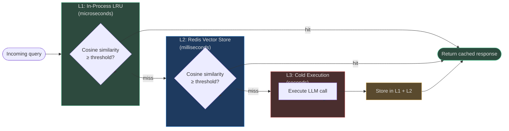

# Caching and Latency Optimization

## Why Caching Is the Highest-ROI Optimization

A cached LLM response has zero inference cost and near-zero latency (microseconds to
milliseconds from Redis or in-process memory). Compared to even the cheapest model call
(~100 ms, ~$0.0001), caching is unambiguously better when the cached result is still correct.

The challenge is **identifying which calls are safe to cache**. A real-time stock price check
should never be cached. A response to "What is the refund policy?" can be cached for hours.
The `CacheOptimizer` and `SemanticCache` solve these two problems: deciding *whether* to cache,
and *how* to cache with semantic deduplication.

---

## CacheOptimizer (`app/optimization/cache_optimizer.py`)

`CacheOptimizer` is the **decision layer**. It does not perform caching itself — it evaluates
whether a query is cacheable and identifies which call patterns have the highest caching ROI.

### `should_cache()` — Eligibility Check

```python
def should_cache(
    self,
    query: str,
    result_count: int,
    latency_ms: float,
    is_realtime: bool,
    has_time_sensitive_content: bool,
) -> CacheDecisionResult:
```

Decision rules (evaluated in priority order):

| Condition | Decision | Reason |
|---|---|---|
| `is_realtime=True` | ❌ Don't cache | Stale data would cause incorrect actions |
| `has_time_sensitive_content=True` | ❌ Don't cache | Prices, availability, schedules change |
| `result_count == 0` | ❌ Don't cache | Empty result may be transient |
| All above false | ✅ Cache | Stable query, non-empty, non-realtime |

```python
@dataclass
class CacheDecisionResult:
    should_cache: bool
    reason: str
```

The `reason` field enables observability: callers can log why a decision was made.

### `record_call()` + `get_opportunities()` — Pattern Analysis

```python
def record_call(self, call_signature: str) -> None:
    self._call_patterns[call_signature] = \
        self._call_patterns.get(call_signature, 0) + 1
```

After recording enough calls, `get_opportunities()` analyses the pattern:

```python
hit_rate = repeat_calls / total_calls

if hit_rate > 0.3:
    → CacheOpportunity("semantic", hit_rate, "semantic cache recommended")

if hit_rate > 0.6:
    → CacheOpportunity("exact", hit_rate * 0.5, "exact-match cache for identical prompts")
```

The two thresholds reflect different cache types:
- **30% repeat rate** → semantic cache (queries are *similar*, not identical)
- **60% repeat rate** → exact cache (queries are frequently *identical* — a stronger signal)

---

## Three Cache Layers

AgentVerse uses a three-tier caching architecture, with each tier serving different query
patterns at different cost/hit-rate tradeoffs:



### Layer 1: In-Process LRU Cache (SemanticCache, `app/rag/semantic_cache.py`)

An in-memory `OrderedDict` (`_LRUCache`) with configurable max_size, TTL, and cosine
similarity threshold. Key properties:

- **Zero network overhead**: responses are served from Python memory in microseconds
- **Per-replica**: each worker process has its own L1 — no cross-replica sharing
- **TTL-eviction** + **LRU-eviction**: entries are expired by age and by access recency
- **Cosine similarity matching**: the query is embedded and compared against all stored
  embeddings; a hit requires `cosine_similarity ≥ threshold` (default: `0.92`)

```python
class _LRUCache:
    def __init__(self, max_size: int = 256, ttl: float = 300.0, threshold: float = 0.92)
```

### Layer 2: Redis Vector Store (SemanticCache)

When L1 misses, the `SemanticCache` queries a Redis-backed vector store:

- Tenant-scoped Redis key index: `O(1)` enumeration of a tenant's cache entries (no `SCAN`)
- **Compressed storage**: responses are compressed with `zlib` (`level=1`, fast) before
  storage, cutting Redis memory usage by ~40%
- **Binary embeddings**: float vectors are packed with `struct.pack(f"{n}f", ...)` — 4 bytes
  per float vs 20+ bytes for JSON representation
- **Cross-replica**: all workers share the same Redis; a warm-up on one replica benefits all

Key mathematical utility — the `_cosine()` function used for similarity comparison:

```python
def _cosine(a: list[float], b: list[float]) -> float:
    dot = sum(x * y for x, y in zip(a, b))
    mag_a = math.sqrt(sum(x * x for x in a))
    mag_b = math.sqrt(sum(x * x for x in b))
    if mag_a == 0.0 or mag_b == 0.0:
        return 0.0
    return dot / (mag_a * mag_b)
```

This handles the zero-vector edge case (returns `0.0`) and mismatched dimensions (truncates
to the shorter vector — occurs when the embedding provider changes its output dimension).

### Layer 3: Cold Execution

Cache miss → actual LLM call. After execution, the result is written to both L1 and L2 for
future requests.

---

## Cache Type Breakdown

| Cache Type | Matching | When to Use | Typical Hit Rate |
|---|---|---|---|
| **Semantic** | Cosine similarity ≥ threshold | Paraphrased queries, FAQ agents, knowledge lookups | 25–45% |
| **Exact** | MD5/SHA256 hash of normalized query | Identical tool calls, templated status checks | 30–70% |
| **Plan** | Goal type + context fingerprint | Repeat goals of the same type | 40–60% |

**Exact cache**: When `CacheOptimizer.get_opportunities()` identifies >60% repeat rate for a
call signature, an exact-match cache (Redis `GET`/`SET` by hash) is the cheapest option —
no embedding overhead, sub-millisecond lookup.

**Plan cache**: The agent's generated plan (sequence of steps) for a given goal type is
cached. When the same goal type appears again with a similar context fingerprint, the cached
plan is reused, skipping the planning LLM call entirely. This saves 2,000–4,000 tokens and
1–2 seconds per goal. Recommended TTL: 24 hours (plans may become stale if MCP tools change).

---

## LatencyOptimizer (`app/optimization/latency_optimizer.py`)

`LatencyOptimizer` addresses end-to-end execution latency, not just LLM call latency. An
agent goal with 5 sequential steps can take 30–120 seconds even if each individual LLM call
is fast, because latency accumulates across the plan.

### `optimize_for_latency()` — Reactive Tier Selection

```python
def optimize_for_latency(
    self,
    current_tier: str,
    latency_requirement: str,
    current_latency_ms: float,
) -> LatencyConfig:
```

| Condition | Recommendation | Reason |
|---|---|---|
| `latency_requirement == "realtime"` OR `current_latency > 500 ms` | Tier: `"low"` | Fast model needed |
| `current_latency < 300 ms` | Keep current tier | Latency already acceptable |
| Otherwise | Tier: `"medium"` | Reduce tier for marginal improvement |

### `record_latency()` + `get_optimizations()` — Trend-Based Suggestions

```python
def record_latency(self, goal_type: str, latency_ms: float) -> None:
    self._latency_history.setdefault(goal_type, []).append(latency_ms)

def get_optimizations(self, goal_type: str) -> list[LatencyOptimization]:
    avg = sum(history) / len(history)
    if avg > 30_000:   # avg > 30s
        → LatencyOptimization("cache_plan", avg * 0.3, "Cache plan for repeat goals")
    if avg > 60_000:   # avg > 60s
        → LatencyOptimization("simplify_steps", avg * 0.2, "Reduce step count")
```

**Thresholds**: 30,000 ms (30 seconds) and 60,000 ms (60 seconds) are the trigger points.
These are full-goal latencies, not single-call latencies — a 30-second goal is already at
the edge of interactive usability.

**Expected savings calculation**: `avg * 0.3` for `cache_plan` means "caching the plan is
expected to save 30% of average goal time". This is based on empirical observation that
planning typically takes 25–35% of total execution time.

### LatencyOptimization dataclass

```python
@dataclass
class LatencyOptimization:
    strategy: str                 # "cache_plan" | "simplify_steps"
    expected_savings_ms: float    # estimated time saved in milliseconds
    description: str
```

---

## Latency Optimization Strategies Summary

| Strategy | Trigger Condition | Expected Savings | How |
|---|---|---|---|
| `cache_plan` | avg goal latency > 30,000 ms | 30% of avg (e.g., 9s saved on 30s goals) | Reuse cached plan, skip planning LLM call |
| `simplify_steps` | avg goal latency > 60,000 ms | 20% of avg (e.g., 12s saved on 60s goals) | PromptOptimizer reduces step complexity |
| Low-latency model tier | Realtime requirement or >500 ms call | 50–70% on individual calls | Route to `claude-haiku` / `gpt-4o-mini` |
| Parallel step execution | Multiple independent steps in plan | 40–60% of total goal time | Execute non-dependent steps concurrently |

---

## Real-World Examples

### Example 1: FAQ Chatbot — Semantic Cache ROI

A customer service chatbot handles 10,000 queries/day, with ~40% being variations of the same
30 frequently asked questions ("What is your return policy?", "How do I track my order?", etc.)

- Without cache: 10,000 LLM calls/day × $0.001/call = $10/day = $3,650/year
- With semantic cache (40% hit rate): 6,000 LLM calls/day + 4,000 cache hits
  - LLM cost: 6,000 × $0.001 = $6/day
  - Embedding cost: 10,000 × $0.00003 = $0.30/day (all queries need embedding for lookup)
  - **Net saving: $3.70/day = $1,350/year**
  - Latency improvement: 40% of queries served in <5ms vs 300ms

### Example 2: DevOps Agent — Exact Cache

A DevOps automation agent calls `get_deployment_status(service="api-server")` approximately
5 times per goal execution (the verifier checks status at each step). This identical call is
a perfect candidate for exact caching with a 30-second TTL.

- Without cache: 5 tool calls × 200 ms = 1,000 ms tool overhead per goal
- With exact cache: 1 call (300 ms) + 4 cache hits (<1 ms each) = ~300 ms
- **Latency reduction: 70% for that component**

### Example 3: Planning Agent — Plan Cache Eliminating Repeat Planning

A support agent handles "close ticket + send resolution email + update CRM" as a recurring
goal type (~200 goals/day of this pattern). The plan is always 4 steps in the same order.

- Without plan cache: 200 goals × 2,000 ms planning call = 400,000 ms / day wasted on planning
- With plan cache (after first execution): 199 plan cache hits
- **Daily planning time reduction: 99.5%** (only 1 planning call per 24h TTL)
- Cost saving: 199 planning calls × 4,000 tokens × $0.003/1K ≈ $2.39/day saved just on planning

<!-- Sources: app/optimization/cache_optimizer.py, app/optimization/latency_optimizer.py, app/rag/semantic_cache.py -->
