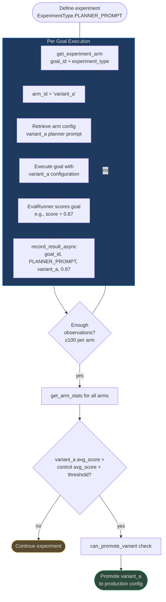

# A/B Testing and Optimization Experiments

## Why A/B Testing in AI Systems

Intuition is unreliable for AI optimization decisions. "This prompt variant seems clearer"
does not tell you whether it produces better goal outcomes. "gpt-4o-mini seems fast enough
for verification" does not tell you how often it produces incorrect verifications that cause
replanning loops. Without controlled experiments:

- Optimization decisions are based on small anecdotal samples
- The interaction between changes is invisible (did the prompt help or did the model change help?)
- Regressions in quality are discovered late, after they have already cost trust

`ABTestingEngine` provides a lightweight, built-in experiment framework that integrates
directly into the goal execution pipeline. Every goal can be part of one or more experiments,
with deterministic arm assignment and persistent result recording.

---

## ABTestingEngine (`app/optimization/ab_testing.py`)

### ExperimentType Enum

Five experiment types are defined, covering all major optimization dimensions:

```python
class ExperimentType(str, enum.Enum):
    PLANNER_PROMPT   = "planner_prompt"    # Test system prompt variants for the planner LLM
    EXECUTOR_PROMPT  = "executor_prompt"   # Test system prompt variants for the executor LLM
    VERIFIER_PROMPT  = "verifier_prompt"   # Test system prompt variants for the verifier LLM
    MODEL_ROUTING    = "model_routing"     # Test different model tier routing policies
    RAG_STRATEGY     = "rag_strategy"      # Test different retrieval strategies
```

This covers the complete optimization surface: all three LLM roles (planner, executor,
verifier), the model selection policy, and the retrieval strategy feeding context into the
prompts.

### Arm Definition

```python
_ARMS = ["control", "variant_a", "variant_b"]

@dataclass
class ExperimentArm:
    arm_id: str          # "control" | "variant_a" | "variant_b"
    config: dict         # experiment-specific configuration
```

Three arms provide enough statistical power to test one control vs two variants simultaneously,
at ~33% traffic split each. All experiments are three-arm by default; two-arm (control +
one variant) is achieved by ignoring `variant_b` results in analysis.

### Deterministic Arm Assignment

```python
def get_experiment_arm(
    self, goal_id: str, experiment_type: ExperimentType
) -> ExperimentArm:
    h = int(
        hashlib.md5(
            f"{goal_id}:{experiment_type.value}".encode()
        ).hexdigest(),
        16,
    )
    arm_id = _ARMS[h % len(_ARMS)]
    return ExperimentArm(arm_id=arm_id, config={"arm": arm_id})
```

Key properties of this design:

**Deterministic**: The same `goal_id` + `experiment_type` pair always produces the same
`arm_id`. This is critical because agent goals may be retried, replanned, or referenced
multiple times across a session. Without determinism, a goal could flip arms between
attempts, corrupting the experiment results.

**Sticky**: Because the assignment is hash-based (not random at call time), the assignment
persists across process restarts, replica failovers, and retries — without any database lookup.

**Uniform distribution**: MD5 produces well-distributed outputs; `h % 3` gives approximately
equal traffic to each arm (33.3% each) over any large sample.

**Tenant isolation**: The `goal_id` is tenant-scoped in AgentVerse, so experiments are
automatically isolated: Tenant A's goals never interfere with Tenant B's experiment results.

---

## Result Recording

### Sync Recording

```python
def record_result(
    self,
    goal_id: str,
    experiment_type: ExperimentType,
    arm_id: str,
    score: float,
) -> None:
    key = experiment_type.value
    self._results.setdefault(key, []).append(
        {"goal_id": goal_id, "arm_id": arm_id, "score": score}
    )
```

Results are stored in-memory, keyed by experiment type. The `score` is the eval score
produced by the `EvalRunner` after goal completion — a 0.0–1.0 float representing the
quality of the goal's execution.

### Async Recording with DB Persistence

```python
async def record_result_async(
    self,
    goal_id: str,
    experiment_type: ExperimentType,
    arm_id: str,
    score: float,
    tenant_id: str = "unknown",
) -> None:
```

The async version writes both in-memory (synchronously, before any network) and to the
`ab_test_results` database table (best-effort). The `INSERT` is inside a transaction so
failures in DB persistence do not lose the in-memory record. This enables:
- Cross-replica experiment aggregation (in-memory alone is per-process)
- Durable historical analysis after restarts
- Admin dashboard queries across all tenants

### Statistics Retrieval

```python
def get_arm_stats(
    self, experiment_type: ExperimentType, arm_id: str
) -> dict:
    # Returns: {"call_count": int, "avg_score": float}
```

### Promotion Decision

```python
def can_promote_variant(
    self,
    experiment_type: ExperimentType,
    arm_id: str,
    min_score_threshold: float,
    current_score: float,
) -> bool:
    stats = self.get_arm_stats(experiment_type, arm_id)
    if stats["call_count"] < 5:
        return current_score >= min_score_threshold
    return stats["avg_score"] >= min_score_threshold
```

The `can_promote_variant()` method uses a data-driven threshold: if fewer than 5 observations
exist, it falls back to the single-run `current_score`; otherwise it uses the historical
average. This prevents premature promotion on a lucky single run.

---

## Experiment Workflow



---

## Statistical Significance

The `ABTestingEngine` records raw data; significance analysis is a separate step performed
by the analytics layer or offline. Recommended practice:

| Requirement | Value | Reason |
|---|---|---|
| Minimum observations per arm | 30 | Central limit theorem minimum for t-test validity |
| Preferred observations per arm | 100+ | Robust against score distribution skew |
| Statistical test | t-test (normal) or Mann-Whitney U (non-normal) | Eval scores are often non-normal |
| p-value threshold | 0.05 | Standard significance level |
| Minimum practical effect size | +5% improvement | Below this, real-world noise may explain the difference |
| Experiment duration | 7–14 days minimum | Accounts for day-of-week and time-of-day variation |

---

## Real-World Experiment Examples

### Experiment 1: Planner Prompt Optimization

**Setup:**
- Control: Original planner system prompt (450 tokens)
- Variant A: Added `"Think step by step"` instruction to control
- Variant B: Added 3 few-shot examples of successful plans to control

**Results after 300 goals (100 per arm):**

| Arm | Avg Goal Success Rate | Avg Plan Quality Score | Avg Tokens Used |
|---|---|---|---|
| control | 0.76 | 0.81 | 4,200 |
| variant_a | 0.79 | 0.83 | 4,350 |
| variant_b | 0.85 | 0.89 | 5,100 |

- Variant B: +12% goal success, p=0.003 → statistically significant
- Variant B costs 21% more tokens (larger prompt) — acceptable trade-off for +12% success
- **Decision: Promote variant_b (few-shot examples) to production**

### Experiment 2: Model Routing Policy

**Setup:**
- Control: `gpt-4o` for all execution steps
- Variant A: `gpt-4o-mini` for execution; fall back to `gpt-4o` only on verification failure

**Results after 500 goals (250 per arm):**

| Arm | Goal Success Rate | Avg Cost/Goal | Avg Latency |
|---|---|---|---|
| control | 0.91 | $0.042 | 18,200 ms |
| variant_a | 0.88 | $0.015 | 12,400 ms |

- Variant A: -3% success rate, -64% cost, -32% latency
- **Decision**: Adopt variant_a for cost-sensitive `"starter"` plan tenants; keep control for
  enterprise tenants where 3% quality delta is unacceptable

### Experiment 3: RAG Strategy

**Setup:**
- Control: Vector similarity retrieval, top-10 chunks
- Variant A: Hybrid BM25 + vector (RRF score fusion), top-10 chunks

**Results after 200 goals (100 per arm):**

| Arm | Grounding Score | Hallucination Rate | Avg Retrieval Latency |
|---|---|---|---|
| control | 0.71 | 8.3% | 45 ms |
| variant_a | 0.84 | 4.1% | 53 ms |

- Variant A: +18% grounding, -51% hallucinations, +8ms latency (acceptable)
- **Decision: Promote variant_a (hybrid retrieval) to all tenants**

---

## Governance of Experiments

### Tenant Isolation
Experiment arm assignments are deterministic on `goal_id`, which is tenant-scoped. Two
tenants running the same experiment type will have different arm distributions — their
results are fully independent. Tenant B's experiment results cannot be contaminated by
Tenant A's volume or workload characteristics.

### Sensitive Experiments
Model routing changes and RAG strategy changes affect all goals in a tenant. These require:
1. Admin review of the proposed experiment configuration
2. Traffic-split staging: start with 10% variant traffic, ramp to 33% after initial sanity check
3. Rollback plan documented before deployment

### Audit Trail
`record_result_async()` writes to the `ab_test_results` table with `tenant_id`, `experiment_type`,
`arm_id`, and `score` — providing a complete audit trail of which configuration was used for
each goal. This is important for debugging: if a goal produced an unexpected result, you can
trace exactly which experimental configuration was in effect.

---

**Real-World Example 2 — Conversational AI Company**

> A conversational AI company runs a `PLANNER_PROMPT` experiment for 2 weeks across
> 300 goals/day (4,200 total observations). Control prompt averages 72% `goal_success`;
> variant_a (adding "Be conservative, verify each assumption") reaches 76%; variant_b
> (adding 3 few-shot planning examples) reaches 81%. Mann-Whitney U test: variant_b vs
> control p=0.0009, Cohen's d=0.43 (medium effect). `can_promote_variant()` returns
> `True` after 300+ observations per arm and p < 0.05. variant_b is promoted to
> production via `promote_variant(experiment_type=PLANNER_PROMPT, arm="variant_b")`,
> improving goal success rate by 12.5% with identical token cost — worth approximately
> $31,200/year in avoided re-planning LLM calls at their usage volume.

<!-- Sources: app/optimization/ab_testing.py -->
