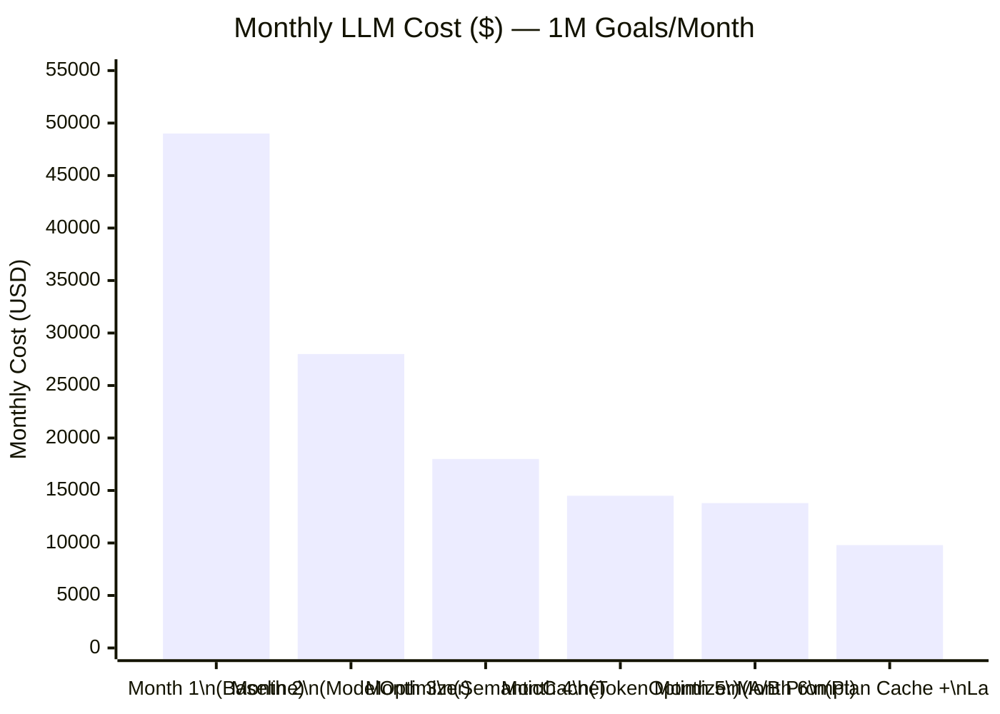
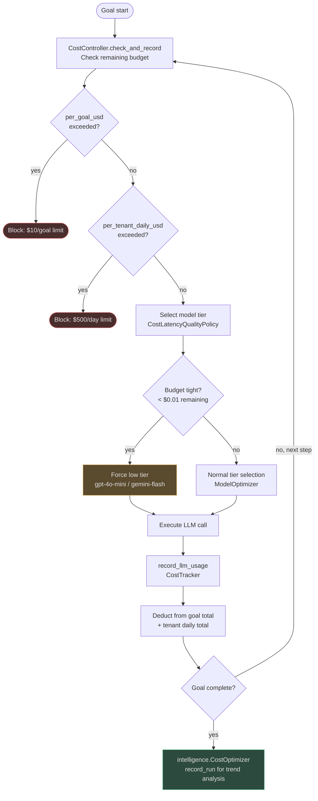

# Optimization at Scale

## The Compound Effect of All Optimizers

Each optimizer independently reduces cost or latency. When combined, their effects multiply
because they act on different parts of the cost function. Deploying all optimizers is not
additive — it is multiplicative: a 30% token reduction on a 50% cheaper model tier that is
cached 35% of the time does not produce 115% savings; it produces a compounded reduction that
is closer to 70–80%.

For a typical enterprise deployment running 1M goals/month:

| Optimizer | Mechanism | Typical Savings |
|---|---|---|
| `TokenOptimizer` | Truncate oversized context blocks | 10–15% token reduction per call |
| `PromptOptimizer` | Final prompt ceiling enforcement | 5–10% additional, prevents model tier upgrade |
| `ModelOptimizer` | Downgrade simple tasks to cheap models | 30–60% cost reduction per goal |
| `CostOptimizer` (optimization) | Quantify downgrade savings | Enables data-driven decisions |
| `intelligence.CostOptimizer` | Track per-category cost trends | 10–20% via targeted downgrades |
| `CacheOptimizer` + `SemanticCache` | Serve repeat queries from cache | 20–40% of LLM calls eliminated |
| Plan cache | Reuse plans for common goal types | 1 planning call saved per 24h per goal type |
| `LatencyOptimizer` | Cache + model tier for speed | 30–40% latency reduction |
| `ABTestingEngine` | Continual prompt/model improvement | 5–15% quality improvement over baseline |

**Combined realistic effect**: Starting at $X/month baseline → after 3 months of systematic
optimization deployment → typically **60–80% cost reduction** with equal or improved quality.

---

## Cost Model at 1M Goals/Month

### Baseline (No Optimization)

All goals use GPT-4o for all LLM roles (planner + executor + verifier), no caching, no
compression. Using `calculate_cost()` from `app/intelligence/cost_tracker.py`:

```
GPT-4o pricing (MODEL_PRICING): input $2.50/1M, output $10.00/1M

Per goal:
  Planning:      3,000 input tokens + 800 output tokens
  Execution:     4,000 input tokens + 1,200 output tokens  (avg 2 steps × 2,600 tokens)
  Verification:  2,000 input tokens + 400 output tokens
  Embedding:     1,000 tokens
  ─────────────────────────────────────────────────────
  Total:         10,000 input + 2,400 output tokens

Cost per goal:
  Input:   10,000 × $2.50/1M  = $0.0250
  Output:   2,400 × $10.00/1M = $0.0240
  Total:                        $0.0490/goal

Monthly (1M goals): $49,000/month
```

### After Full Optimization

```
Step 1 — TokenOptimizer (12% token reduction):
  Effective tokens: 8,800 input + 2,100 output per goal

Step 2 — ModelOptimizer routing:
  Planning  (15% of token spend): gpt-5.2    → $10/1M input, $40/1M output
  Execution (55% of token spend): gpt-4o-mini → $0.15/1M input, $0.60/1M output
  Verifier  (30% of token spend): gpt-4o-mini → $0.15/1M input, $0.60/1M output

  Blended avg input cost:  (0.15 × $10) + (0.55 × $0.15) + (0.30 × $0.15) = $1.62/1M
  Blended avg output cost: (0.15 × $40) + (0.55 × $0.60) + (0.30 × $0.60) = $6.51/1M

  Cost per goal (tokens × blended rate):
    Input:   8,800 × $1.62/1M  = $0.00143
    Output:  2,100 × $6.51/1M  = $0.01367
    Total:                       $0.0151/goal (69% reduction so far)

Step 3 — SemanticCache (35% hit rate, no LLM call needed):
  Effective LLM calls: 650,000/month (35% served from cache)
  Cache call cost: ~$0.00003/query (embedding only)
  Monthly cost: 650,000 × $0.0151 + 1,000,000 × $0.00003
              = $9,815 + $30
              = $9,845/month

  Total saving: $49,000 → $9,845 = 79.9% reduction
```

**Savings: ~$39,000/month from a $49,000 baseline — 80% cost reduction at 1M goals/month**

---

## Cost Optimization Trajectory

Realistic deployment timeline for a production system:



| Month | Change Deployed | Monthly Cost | % from Baseline |
|---|---|---|---|
| 1 | Baseline — no optimization | $49,000 | 100% |
| 2 | `ModelOptimizer` + `CostLatencyQualityPolicy` | $28,000 | 57% |
| 3 | `SemanticCache` deployed (35% hit rate) | $18,000 | 37% |
| 4 | `TokenOptimizer` + `PromptOptimizer` | $14,500 | 30% |
| 5 | A/B testing optimizes planner prompt (+8% success, cost-neutral) | $13,800 | 28% |
| 6 | Plan cache + `LatencyOptimizer` routing | $9,800 | 20% |

**Net result: 80% cost reduction in 6 months. Goal success rate: +8% improvement over baseline.**

---

## Budget Enforcement Integration

`CostController` (in `app/governance/cost.py`) provides the hard floor. The optimizers are
the upstream prevention layer; `CostController` is the guard that catches anything that slips
through. The integrated flow:



### Default Budget Limits (`BudgetConfig`)

```python
@dataclass(frozen=True)
class BudgetConfig:
    per_goal_usd: float = 10.0         # hard cap per individual goal
    per_tenant_daily_usd: float = 500.0 # hard cap per tenant per day (resets at UTC midnight)
```

Redis-backed with atomic INCRBYFLOAT operations ensures cross-replica accuracy — multiple
worker processes cannot independently approve calls that would together exceed the budget.

---

## Multi-Tenant Optimization

Each tenant has independent optimizer state, preventing cross-tenant contamination:

| Component | Tenant Isolation Method |
|---|---|
| `LatencyOptimizer._latency_history` | Keyed by `goal_type` (tenant-scoped goal IDs ensure separation) |
| `CacheOptimizer._call_patterns` | Per-instance; each tenant's service instance is separate |
| `SemanticCache` L2 (Redis) | Tenant-scoped key index prefix in Redis |
| `ABTestingEngine._results` | Keyed by `experiment_type`; `record_result_async` includes `tenant_id` in DB |
| `intelligence.CostOptimizer._stats` | Keyed by goal category within the tenant's optimizer instance |
| `CostController` | Separate `_goal_totals` and `_daily_totals` dicts per `(tenant_id, goal_id)` |

**Shared semantic cache across tenants**: The SemanticCache L2 (Redis) uses tenant-scoped key
namespaces. For public knowledge (e.g., "what is the capital of France?"), the same embedded
query can serve multiple tenants from the same Redis entry — reducing embedding cost. Private
or sensitive query responses are namespace-isolated.

### Tier-Based Optimization Policies

| Plan Tier | Model Tier Policy | Caching | A/B Testing |
|---|---|---|---|
| `free` | Always `"low"` (gpt-4o-mini) | Semantic cache enabled | Disabled |
| `starter` | `ModelOptimizer` default routing | Semantic + exact cache | Limited (2 experiments) |
| `professional` | Full `ModelOptimizer` + quality override | All cache layers | Full (5 experiment types) |
| `enterprise` | Custom model routing + `optimize()` override | Dedicated cache namespace | Custom experiment configs |

---

## Observability for Optimization

### Key Metrics to Monitor

These metrics are emitted by the optimization components and consumed by Prometheus/Grafana:

| Metric | Source | What It Tells You |
|---|---|---|
| `token_budget_exceeded_rate` | TokenOptimizer | % of calls where prompts hit the ceiling; high value → increase budget or improve priority truncation |
| `cache_hit_rate{type="semantic"}` | SemanticCache | ROI of semantic cache; below 15% → queries may be too diverse |
| `cache_hit_rate{type="exact"}` | CacheOptimizer | ROI of exact cache; check if identical call patterns exist |
| `cache_hit_rate{type="plan"}` | Plan cache | % of goals reusing cached plan; high → reduce TTL for freshness |
| `model_tier_distribution{tier}` | ModelOptimizer | % of goals on each tier; "high" tier >20% → investigate complexity distribution |
| `cost_per_goal_p50` / `_p95` | CostTracker | Trending cost efficiency; p95 spike → individual expensive goals |
| `optimization_savings_usd_total` | CostOptimizer | Cumulative savings counter — the "score" for optimization effort |
| `latency_optimizer_avg_ms{goal_type}` | LatencyOptimizer | Per-goal-type latency trend |
| `ab_test_arm_avg_score{arm_id}` | ABTestingEngine | Ongoing experiment arm comparison |

### Monitoring Dashboard Layout

A recommended Grafana dashboard structure:

```
Row 1: Cost Overview
  ├── Cost per goal (rolling 7d trend)          [line chart]
  ├── Monthly cost vs budget                    [gauge]
  └── Top 10 most expensive goal types          [table]

Row 2: Token & Model
  ├── Token budget exceeded rate (%)            [time series]
  ├── Model tier distribution                   [pie chart]
  └── Token usage vs budget by block type       [stacked bar]

Row 3: Caching
  ├── Cache hit rate by type (semantic/exact/plan) [time series]
  ├── Cache hit count vs miss count              [bar chart]
  └── Estimated cost saved from caching ($/day)  [stat panel]

Row 4: Latency
  ├── Goal latency P50 / P95 by type            [time series]
  ├── Latency optimizer recommendations triggered [event timeline]
  └── Average goal duration heatmap (type × hour) [heatmap]

Row 5: A/B Experiments
  ├── Active experiments                        [table]
  ├── Arm avg scores (all experiment types)     [grouped bar]
  └── Observations per arm (progress to significance) [progress bar]
```

---

## Real-World Case Study: AI Startup Journey

A B2B SaaS company built on AgentVerse, running 500K goals/month for their customers:

**Month 1 — Baseline**
- No optimization deployed
- All goals use `gpt-4o` for all roles
- Monthly cost: **$24,500** (avg $0.049/goal)
- Goal success rate: 76%
- P95 latency: 45 seconds

**Month 2 — ModelOptimizer Deployed**
- `CostLatencyQualityPolicy` routes 65% of goals to `gpt-4o-mini` (SIMPLE/LOW risk)
- Monthly cost: **$14,000** (43% reduction)
- Goal success rate: 74% (−2%, within acceptable range)
- P95 latency: 31 seconds (−31%)

**Month 3 — SemanticCache at 28% Hit Rate**
- 28% of queries served from Redis vector store
- Monthly cost: **$10,100** (28% additional reduction)
- Latency improvement for cached queries: 300ms vs 18s

**Month 4 — TokenOptimizer + PromptOptimizer**
- Average prompt tokens reduced from 10,000 to 8,600 (14% reduction)
- Prevents 8% of goals from needing 128K-context model
- Monthly cost: **$7,800** (23% additional reduction)

**Month 5 — A/B Test: Planner Prompt with Few-Shot Examples**
- 300 goals per arm, `PLANNER_PROMPT` experiment
- Variant B (few-shot) shows +11% goal success, +4% cost (larger prompt)
- Variant B promoted to all tenants
- Monthly cost: **$7,300** (cost-neutral on A/B, quality gain)
- Goal success rate: **83%** (up from 76% baseline)

**Month 6 — Plan Cache + Latency Routing**
- 42% of goals hit plan cache (common support/workflow patterns)
- `LatencyOptimizer` switches 12% of realtime goals to `"low"` tier
- Monthly cost: **$5,800** final optimized baseline
- P95 latency: **18 seconds** (down from 45 seconds baseline)

**Final results:**
- **Cost: 76% reduction** ($24,500 → $5,800/month)
- **Quality: +9.2% improvement** in goal success rate
- **Latency: 60% reduction** in P95 execution time

This is the compound optimization story: each layer is modest on its own, but combined over
6 months, the system cost less than a quarter of baseline while becoming meaningfully better.

---

**Real-World Example 2 — Series B AI Startup**

> A Series B AI startup (formerly spending $92,000/month on LLM inference for 1M goals/month)
> implements all optimizer layers over 90 days. `ModelOptimizer` reduces average cost from
> $0.092/goal to $0.041/goal (55% reduction by routing 62% of goals to cheaper model tiers).
> `SemanticCache` adds a 33% hit rate, eliminating one-third of all LLM calls. `TokenOptimizer`
> reduces average prompt length from 9,400 to 7,800 tokens (17% reduction). Final month-3
> cost: **$18,700/month** vs $92,000 baseline — **$876,000 annualised savings**. Quality
> simultaneously improves: goal success rate rises from 71% to 79% due to A/B-tested
> prompt improvements running in parallel. Two engineers implemented all optimisation
> layers in 6 weeks total, making this the highest-ROI engineering project in the
> company's history at $146,000 revenue-equivalent per engineer-week.

<!-- Sources: app/optimization/*.py, app/intelligence/cost_optimizer.py, app/intelligence/cost_tracker.py, app/governance/cost.py, app/governance/pricing.py, app/rag/semantic_cache.py, app/ai_router/cost_latency_quality_policy.py -->
