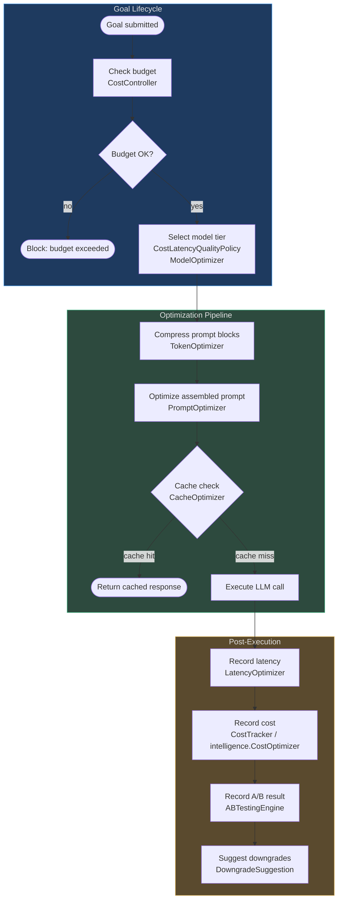

# Token and Cost Optimization

## Why Optimization Matters

LLM tokens are the primary cost driver in any autonomous agent system. Every message sent to
an LLM model has both a **monetary cost** (priced per token) and a **latency cost** (more
tokens → slower responses). In AgentVerse, agent prompts are composite: they combine system
instructions, retrieved RAG chunks, injected memory, tool schemas, and conversation history.
Without active optimization, a single goal execution can consume 12,000–40,000 tokens —
equivalent to 10–50 API calls to a cheaper model.

The optimization subsystem targets five dimensions simultaneously:

| Dimension | Problem | Solution |
|---|---|---|
| **Token usage** | Prompts exceed context window or are wastefully large | TokenOptimizer, PromptOptimizer |
| **Inference cost** | High-tier models used for tasks that don't need them | ModelOptimizer, CostOptimizer |
| **Caching** | Identical/similar LLM calls executed repeatedly | CacheOptimizer, SemanticCache |
| **Latency** | Agent execution takes too long for interactive use | LatencyOptimizer |
| **Continuous improvement** | Optimization decisions are static guesses | ABTestingEngine |

## Architecture Overview

All optimizer components live in `app/optimization/` and `app/intelligence/`. They interact
with governance (budget enforcement), the AI router (model selection), and the RAG layer
(semantic caching).



## Optimizer Classes at a Glance

| Class | Location | Purpose | Key Method |
|---|---|---|---|
| `TokenOptimizer` | `app/optimization/token_optimizer.py` | Truncate individual text blocks to token budget | `compress(text)` |
| `PromptOptimizer` | `app/optimization/prompt_optimizer.py` | Truncate the assembled final prompt | `optimize(prompt)` |
| `ModelOptimizer` | `app/optimization/model_optimizer.py` | Select model tier by risk/complexity/task type | `optimize(profile)`, `recommend(task_type)` |
| `CostOptimizer` (optimization) | `app/optimization/cost_optimizer.py` | Estimate savings from model tier downgrade | `estimate_savings(current, proposed, tokens)` |
| `CostOptimizer` (intelligence) | `app/intelligence/cost_optimizer.py` | Track per-category cost and propose downgrades | `record_run()`, `get_suggestions()` |
| `CostTracker` | `app/intelligence/cost_tracker.py` | Per-goal cost attribution with anomaly detection | `record_llm_usage()`, `calculate_cost()` |
| `CacheOptimizer` | `app/optimization/cache_optimizer.py` | Identify which calls are worth caching | `should_cache()`, `get_opportunities()` |
| `SemanticCache` | `app/rag/semantic_cache.py` | 3-layer LRU + Redis vector cache for LLM responses | `get()`, `set()` |
| `LatencyOptimizer` | `app/optimization/latency_optimizer.py` | Track latency trends and recommend strategies | `record_latency()`, `get_optimizations()` |
| `ABTestingEngine` | `app/optimization/ab_testing.py` | Controlled prompt/model/RAG experiments | `get_experiment_arm()`, `record_result()` |
| `CostController` | `app/governance/cost.py` | Hard budget enforcement (blocks over-budget calls) | `check_and_record()` |
| `CostLatencyQualityPolicy` | `app/ai_router/cost_latency_quality_policy.py` | Route to tier based on complexity + risk + latency | `select_tier()` |

## How the Optimization Layers Work Together

The layers are designed to compose. Each layer can independently save cost or latency; together
they compound:

```
[1] Token budget check (TokenOptimizer per block)
      ↓
[2] Model tier selection (CostLatencyQualityPolicy + ModelOptimizer)
      ↓
[3] Prompt assembly + compression (PromptOptimizer)
      ↓
[4] Cache check (CacheOptimizer decision → SemanticCache lookup)
      ↓  cache miss only
[5] LLM execution
      ↓
[6] Record latency (LatencyOptimizer)
[7] Record cost (CostTracker → intelligence.CostOptimizer trends)
[8] Record A/B result (ABTestingEngine)
      ↓
[9] Periodic: get_suggestions() → downgrade proposals → SelfOptimizer applies
```

## Integration Points

**Governance/Budget Enforcement:**
`CostController` (in `app/governance/cost.py`) holds **hard limits** — `per_goal_usd` and
`per_tenant_daily_usd`. Before any LLM call, `check_and_record()` atomically checks the
budget. The optimizers are the *upstream* layer that keeps costs low enough to stay within
those budgets; `CostController` is the *floor* that blocks any call that would exceed them.

**AI Model Router:**
`CostLatencyQualityPolicy.select_tier()` (in `app/ai_router/`) is the routing entry point.
It consults complexity and risk properties from the goal profile, and the `ModelOptimizer`
provides per-task-type model recommendations. Together they ensure each LLM role (planner,
executor, verifier) uses the appropriate model — not always the most expensive one.

**Evaluations:**
`ABTestingEngine` ties into the eval runner: after each goal completes, the eval score is
passed to `record_result()`, building per-arm statistics that drive statistically grounded
decisions about which prompt or model configuration to promote to production.

**Observability:**
`CostTracker.record_llm_usage()` feeds metrics into the observability layer, enabling
dashboards for `cost_per_goal`, `token_budget_exceeded_rate`, and `cache_hit_rate` per
tenant and per goal type.

## Pricing Tables in the Codebase

Two pricing tables exist (both accurate as of 2026-06):

- **`app/intelligence/cost_tracker.py` → `MODEL_PRICING`**: canonical per-1M-token table
  (separate input/output rates). This is the authoritative source for cost accounting.
- **`app/governance/pricing.py` → `_PRICING`**: legacy per-1K-token table.
  `estimate_cost()` is **deprecated** — callers should use `calculate_cost()` from
  `cost_tracker` instead.

## In This Section

| File | What It Covers |
|---|---|
| [01-token-and-prompt-optimization.md](./01-token-and-prompt-optimization.md) | TokenOptimizer and PromptOptimizer: char-based truncation, budget allocation, smarter strategies |
| [02-model-and-cost-optimization.md](./02-model-and-cost-optimization.md) | ModelOptimizer, CostOptimizer (both), CostTracker — tier selection and cost attribution |
| [03-caching-and-latency-optimization.md](./03-caching-and-latency-optimization.md) | CacheOptimizer, SemanticCache (3-layer), LatencyOptimizer — caching strategies and latency tuning |
| [04-ab-testing-and-experiments.md](./04-ab-testing-and-experiments.md) | ABTestingEngine — sticky arm assignment, experiment workflow, statistical significance |
| [05-optimization-at-scale.md](./05-optimization-at-scale.md) | Combined optimizer effects, cost model at 1M goals/month, multi-tenant patterns, monitoring |

<!-- Sources: app/optimization/*.py, app/intelligence/cost_optimizer.py, app/intelligence/cost_tracker.py, app/governance/cost.py, app/rag/semantic_cache.py, app/ai_router/cost_latency_quality_policy.py -->
